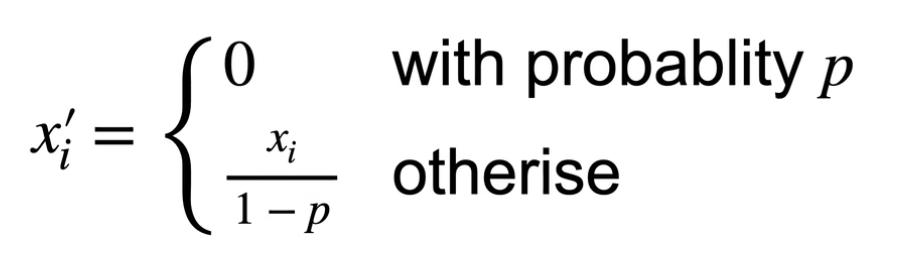
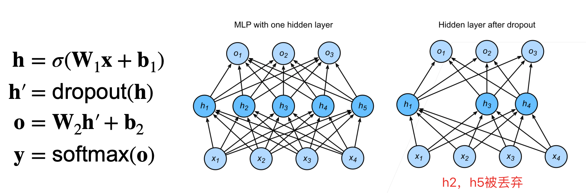
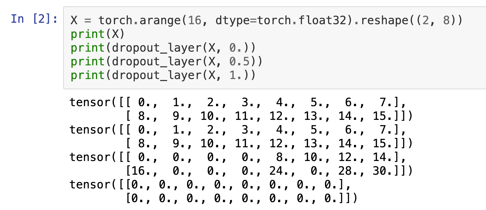
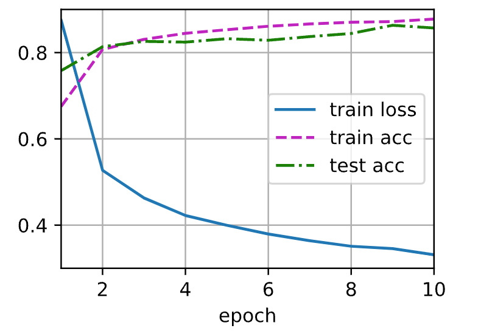
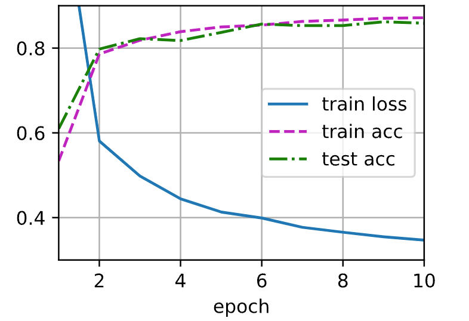

# dropout丢弃法


dropout效果可能比weight decay更好。

## 动机

* 一个好的模型需要对输入数据的扰动 鲁棒
  * 使用有噪音的数据等价于Tikhonov正则
  * 丢弃法：在层之间加入噪音

正则的作用：使得权重不要变的太大，让model不容易过拟合。

不同于之前的weight decay中的L2正则在输入中加入噪音，dropout在层之间加入噪音。（dropout是一种正则）

之前的噪音是固定噪音，这里是不断的加随机噪音。

## 无偏差的加入噪音

对$\bold x$加入噪音得到$\bold x'$，我们希望：$\bold{E[x']=x}$. 

丢弃法对每个元素进行如下扰动：



我们可以计算$x_i'$的期望：$\bold{E}x_i' = 0 \times p + \frac{x_i}{1-p} \times (1-p) = x_i$。

上述式子要不 将$x_i$ 置零，要不将其放大。

## 使用dropout

通常将丢弃法作用在隐藏全连接的输出上

下面是一个单隐藏层MLP使用drop out前后的对比：



$dropout(\bold h)$即对其中所有的元素都作用dropout。

## 推理中的丢弃法

正则项只在训练中使用：他们影响模型参数的更新（对权重产生影响）。

在推理过程中，丢弃法直接返回输入
$$
\bold{h = dropout(h)}
$$
这样也能保证确定性的输出。

## 总结

* 丢弃法将一些输入项随机置零来控制模型复杂度
* 常作用在多层感知机的隐藏层的输出上（CNN等没有用dropout）
* 丢弃概率是控制模型复杂度的超参数

丢弃概率常取的值：0.5，0.9或0.1。

dropout的效果很有可能要比weight decay的效果好一点点。

# dropout实现

我们实现 `dropout_layer` 函数，该函数以`dropout`的概率丢弃张量输入`X`中的元素

```python
import torch
from torch import nn
from d2l import torch as d2l

# 这里的参数dropout是 丢弃率
def dropout_layer(X, dropout):
    assert 0 <= dropout <= 1
    if dropout == 1: # 全丢弃即W=0，直接返回和X相同形状的全0张量即可。
        return torch.zeros_like(X)
    if dropout == 0: # 全不丢弃，返回X
        return X
    # mask的值即那些值需要保留则为1.0，否则为0.0
    mask = (torch.rand(X.shape) > dropout).float() 
    # 对留下的值还需要放大
    return mask * X / (1.0 - dropout)
```

这里使用了mask而不是直接从X中选择一些值设置为0的原因是，对于CPU或GPU而言，乘法比选择要快很多。

测试`dropout_layer`函数：



定义具有两个隐藏层的多层感知机，每个隐藏层包含256个单元

```python
num_inputs, num_outputs, num_hiddens1, num_hiddens2 = 784, 10, 256, 256

dropout1, dropout2 = 0.2, 0.5

class Net(nn.Module):
    def __init__(self, num_inputs, num_outputs, num_hiddens1, num_hiddens2,
                 is_training=True): # 添加is_training参数
        super(Net, self).__init__()
        self.num_inputs = num_inputs
        self.training = is_training
        self.lin1 = nn.Linear(num_inputs, num_hiddens1)
        self.lin2 = nn.Linear(num_hiddens1, num_hiddens2)
        self.lin3 = nn.Linear(num_hiddens2, num_outputs)
        self.relu = nn.ReLU()

    def forward(self, X):
        H1 = self.relu(self.lin1(X.reshape((-1, self.num_inputs))))
        if self.training == True: # 如果是在训练，则需要应用dropout，否则不用
            H1 = dropout_layer(H1, dropout1)
        H2 = self.relu(self.lin2(H1))
        if self.training == True: # 如果是在训练，则需要应用dropout，否则不用
            H2 = dropout_layer(H2, dropout2)
        out = self.lin3(H2)
        return out

net = Net(num_inputs, num_outputs, num_hiddens1, num_hiddens2)

# 训练和测试
num_epochs, lr, batch_size = 10, 0.5, 256
loss = nn.CrossEntropyLoss()
train_iter, test_iter = d2l.load_data_fashion_mnist(batch_size)
trainer = torch.optim.SGD(net.parameters(), lr=lr)
d2l.train_ch3(net, train_iter, test_iter, loss, num_epochs, trainer)
```




## 简洁实现


```python
net = nn.Sequential(nn.Flatten(), nn.Linear(784, 256), nn.ReLU(),
                    nn.Dropout(dropout1), nn.Linear(256, 256), nn.ReLU(),
                    nn.Dropout(dropout2), nn.Linear(256, 10))

def init_weights(m):
    if type(m) == nn.Linear:
        nn.init.normal_(m.weight, std=0.01)

net.apply(init_weights);

# 对模型进行训练和测试
trainer = torch.optim.SGD(net.parameters(), lr=lr)
d2l.train_ch3(net, train_iter, test_iter, loss, num_epochs, trainer)
```




