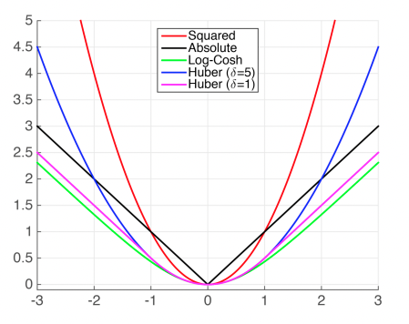
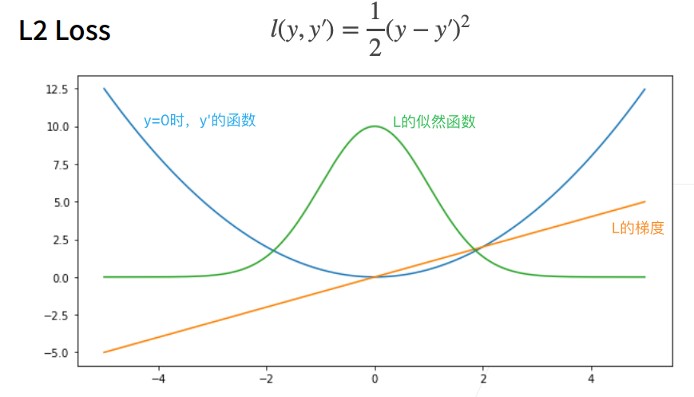
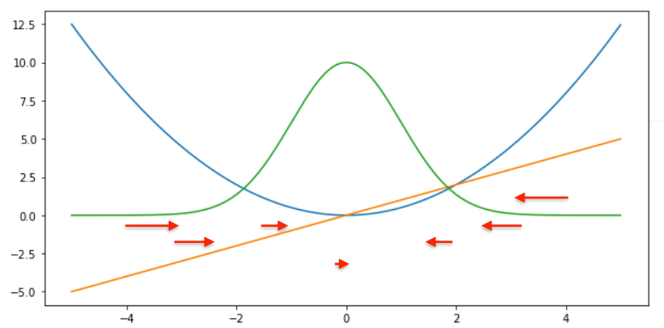
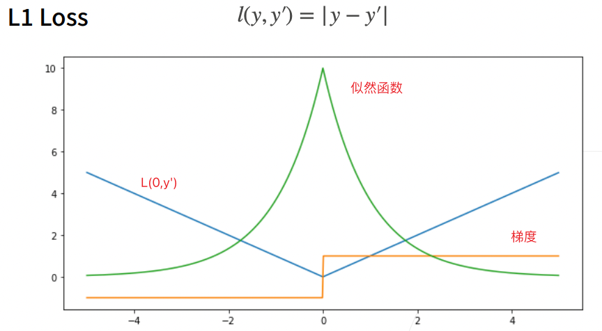
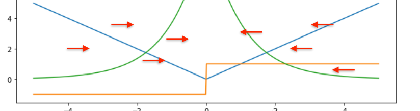
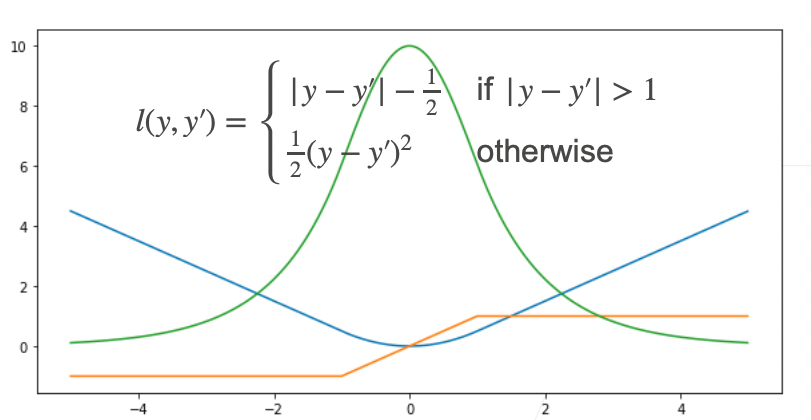
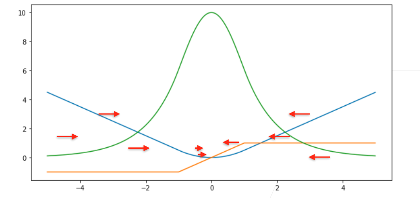

# 损失函数

## 均方损失/L2 Loss

均方损失，即L2 Loss是很常用的一种损失函数。

似然函数：$e^{-l}$。

注意这是y设置为0时画出的图像。

红色箭头表示梯度，包含其方向和大小。注意y=0.可见，当预测与y差距大时，梯度大；差距小时，梯度小。

## L1 Loss

 

L1 Loss和L2 Loss的不同之处在于，即使预测值与y的距离很大，梯度没有变化的幅度。稳定性较好。

但也存在问题，当预测值靠近y的时候，此时因为其不可导的性质，开始变得不稳定。

## Huber's Robust Loss

将L1和L2 loss融合在一起。

预测值与y距离较远时，用一样大小的梯度优化；当距离近时（优化的后期），梯度逐渐减小。

整个过程都比较平滑。