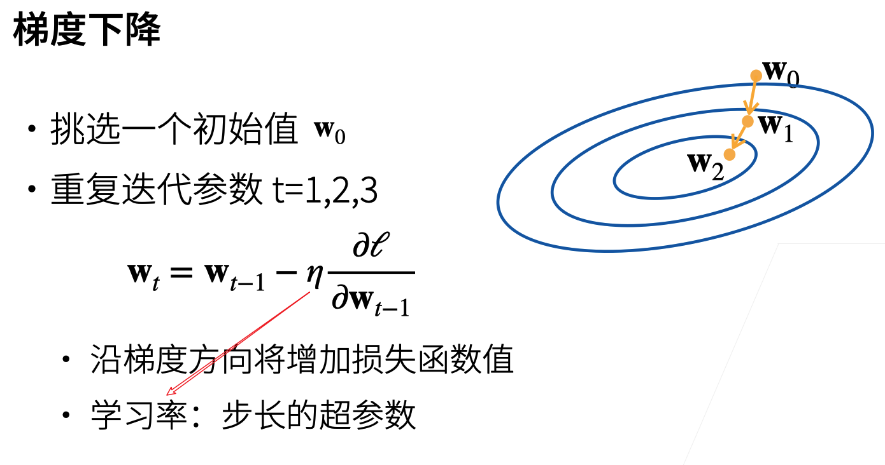
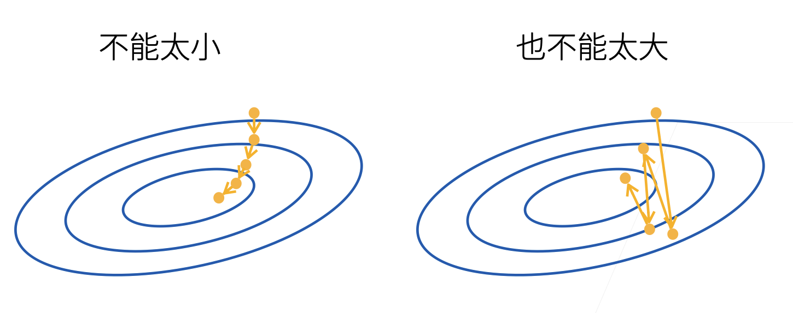
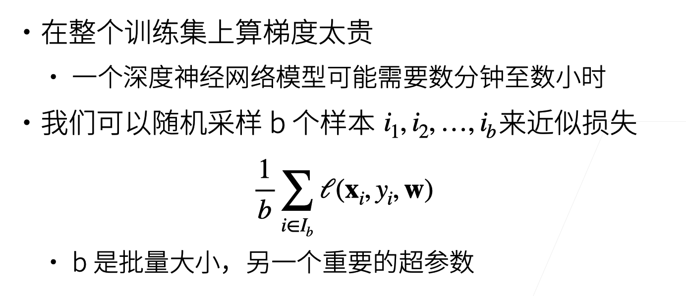
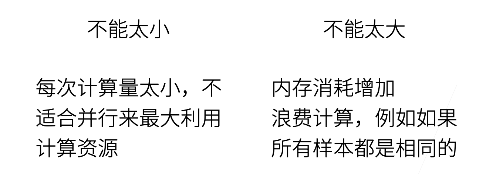
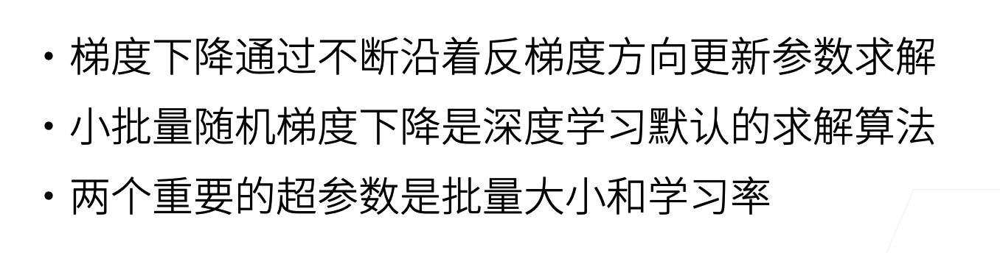

# 优化算法

## 基础优化算法

### 梯度下降

Gradient descending.

梯度是指向函数增加最快的方向，负梯度就是指向函数减少最快的方向。学习率(learning rate)即步长。负梯度指明了方向，学习率指明了步长。

学习率的选择既不能太小，也不能太大。

学习率太小可能要花费很长的时间才能收敛；

学习率太大可能会出现震荡，总体损失没有一直下降。

### 小批量随机梯度下降

b如果选取的足够大，则它能代表整个训练集的情况。

类似的，批量大小的选取也不能太小或事太大。

### 总结

