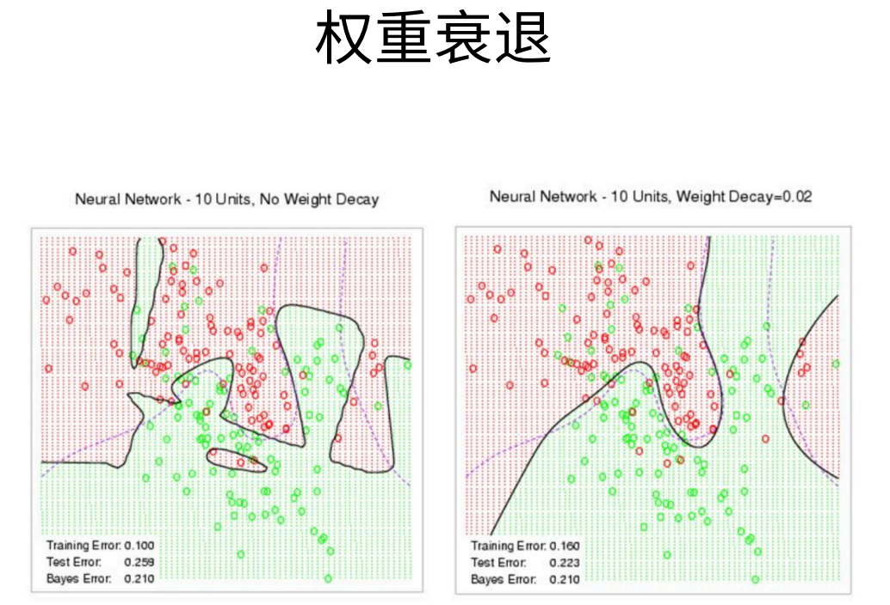
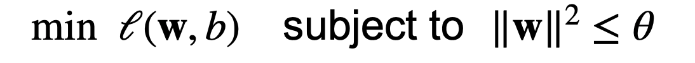
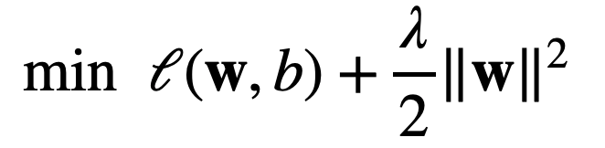
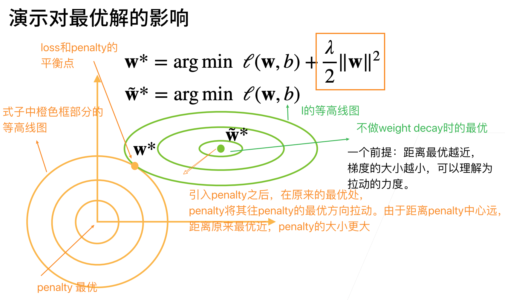

# 权重衰退

## 使用均方范数作为硬性限制

衡量模型容量有两个重要指标，分别是模型参数量和参数值的范围。

可以使用均方范数限制参数值的选择范围来控制模型的容量。

上述公式中使用的是L2范数，即$||\bold{W}||^2 = \sum w_i^2 \le \theta$

但我们通常不限制偏移b。（限不限制b都差不多）

小的$\theta$意味着更强的正则项，即对参数值的限制更强。$\theta$ =0时，限制最强，此时所有w都等于0，只能通过偏移来拟合。

我们不会直接用这个算法来做优化。因为它比较麻烦。常用的是下面这个方法。

## 使用均方范数作为柔性限制

对于每个$\theta$，都可以找到$\lambda$使得之前的目标函数等价于下面：

等价性可以通过拉格朗日乘子来证明。

上述式子中就没有了限制项，只是加入了另一个式子 $\frac{\lambda}{2} ||\bold w||^2$，这个式子即罚，penalty。

* 超参数$\lambda$控制了正则项的重要程度。
  * $\lambda=0$：无作用
  * $\lambda \rarr \infin, 那么之前那个\theta \rarr 0（限制变强），则\bold w^* \rarr \vec 0$

即通过增加$\lambda$的值来降低模型的复杂度。

在平衡点外的其他点，如果靠近loss的最优，则往loss最优的拉力小于往penalty最优的拉力，最后也会达到平衡点。其他的同理。

## 参数更新法则

计算梯度：
$$
\frac{\partial}{\partial \bold w}(l(\bold w,b) + \frac{\lambda}{2} ||\bold w||^2) = \frac{\partial l(\bold w,b)}{\partial \bold w} + \lambda \bold w
$$
时间t更新参数：
$$
\bold w_{t+1} = (1-\eta \lambda)\bold w_t - \eta\frac{\partial l(\bold w_t,b_t)}{\partial \bold w_t}
$$
其中$\eta$是学习率。

和原来没有使用weight decay时做比较：
$$
origin: \bold w_{t+1} = \bold w_t - \eta\frac{\partial l(\bold w_t,b_t)}{\partial \bold w_t} \\
now:\bold w_{t+1} = (1-\eta \lambda)\bold w_t - \eta\frac{\partial l(\bold w_t,b_t)}{\partial \bold w_t}
$$
即只在前面$\bold w_t$的系数部分不同，现在多了一个$-\eta \lambda$的系数。

通常$\eta \lambda \lt 1$，故这在深度学习中通常叫做权重衰退。

理解就是每次更新参数时，$\bold w$即权重都是减小了的。

## 总结

# 权重衰退的实现

