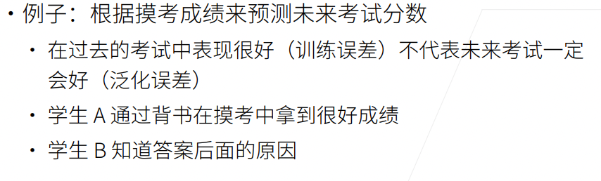
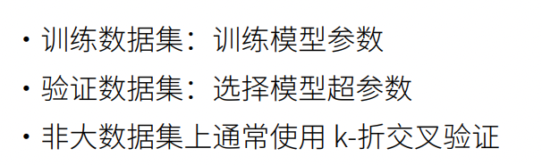
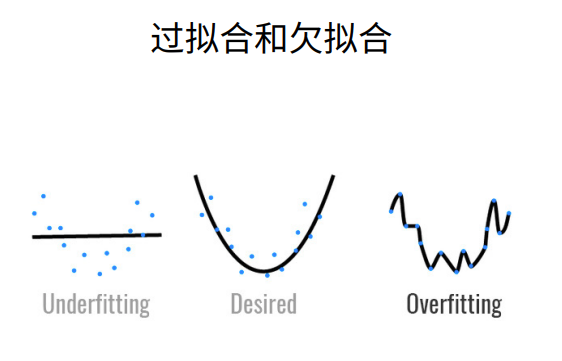
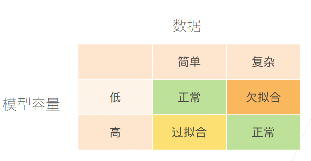
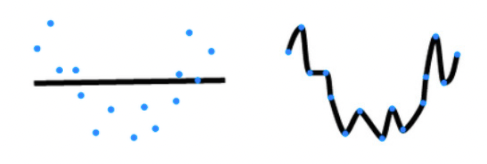
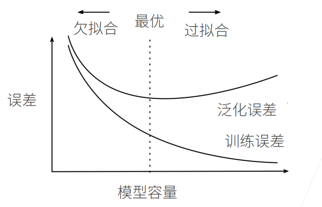
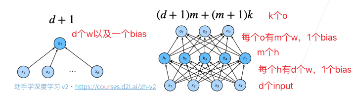
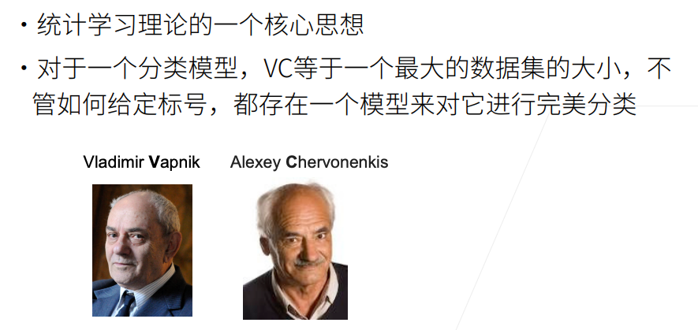
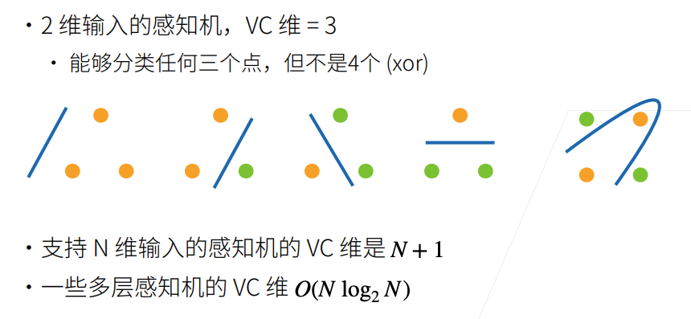
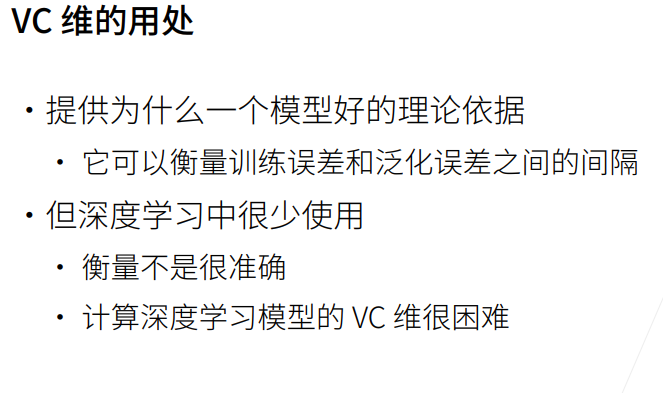

# 模型选择

一个具体的例子：

蓝色衬衫可能说明一些问题（比如蓝领阶级），但他反应的问题实际上不是特别重要。

但模型无法判断这个强信号是否和我们预测的结果是否有很强的相关性。

这可能就会导致模型往我们未知的方向优化。

## 训练误差和泛化误差

训练误差：模型在训练数据上的误差

泛化误差：模型在新数据上的误差

学生A和学生B在未来考试中表现就可能完全不同。

## 验证数据集和测试数据集

**验证数据集**：一个用来评估模型好坏的数据集

* 例如拿出50%的训练数据作为验证数据集
* 不要和训练数据混在一起（一个常犯的错误）

将验证数据和训练数据放在一起（让模型进行学习），就像照着答案去回答问题，正确率高了，但遇到没见过的问题就抓瞎。

测试数据集：只用一次的数据集。例如

* 未来的考试
* 出价房子的实际成交价格
* 用在Kaggle私有排行榜中的数据集

但注意我们在模型训练代码中对上述两个术语的滥用。

我们在训练代码中，将数据集分为训练数据集和测试数据集，但实际上这里的测试数据集是验证数据集，即用来评估模型好坏的数据集。

## K-则交叉验证

* 在没有足够多的数据时使用（这是常态0
* 算法
  * 将训练数据分割为K块
  * For i = 1,..., k
    * 使用第i块作为验证数据集，其余的作为训练数据集
  * 报告K个验证集误差的平均值
* 常用的K=5或10

训练数据分割为K块，总共训练了K次。

## 总结

# 过拟合和欠拟合

数据复杂程度和模型容量的一张表：

通常模型容量越高，其拟合能力越强。

## 模型容量

模型容量通常影响了模型拟合各种函数的能力。

低容量的模型难以拟合训练数据；高容量的模型可以记住所有的训练数据。

### 模型容量的影响

在泛化误差和训练误差中，我们更关心的是泛化误差。

深度学习的目的就是获得最优的泛化误差，并且其尽可能低。

故深度学习的核心为：首先有一个容量足够大的模型（容量大，拟合各种函数的能力才强），然后通过一些手段来控制模型的容量，使得泛化误差能下降。

### 估计模型容量

* 难以在不同的种类算法之间比较
  * 例如树模型和神经网络
* 给定一个模型种类，将有两个主要因素
  * 参数的个数
  * 参数值的选择范围

### VC维

## 数据复杂度

数据复杂度的衡量有多个重要因素。

* 样本个数
* 每个样本的元素个数
* 时间、空间结构
* 多样性

例如图像数据集MNIST以及ImageNet，他们的区别就很大。

MNIST具有60000张图片作为训练数据，10000张图片作为测试数据。每个训练元素都是28*28像素的图片。

ImageNet具有120万张图片。每个训练元素都是256*256像素的图片。

## 总结

* 模型容量需要匹配数据复杂度，否则可能导致欠拟合和过拟合
* 统计机器学习提供数学工具来衡量模型复杂度
* 实际中一般靠观察训练误差和验证误差

