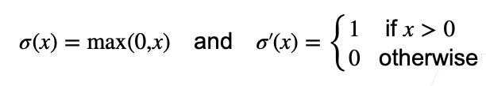
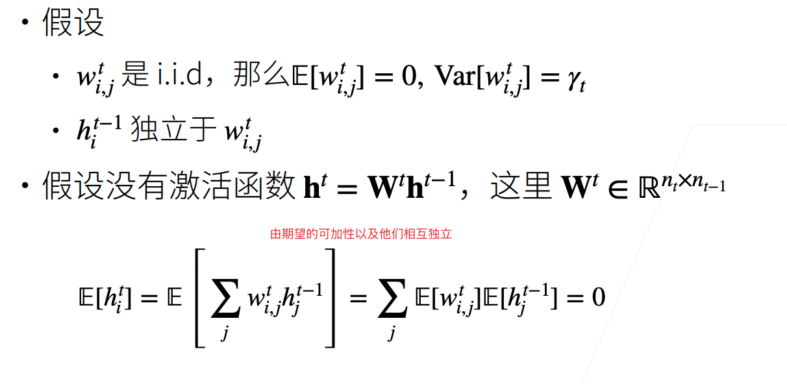

# 数值稳定性

网络变得很深的时候，数值非常容易变得不稳定。

## 神经网络的梯度

考虑如下有d层的神经网络：

计算损失l关于参数$\bold W_t$的梯度：

$\bold h^d$即最后一层输出，$\bold h^t$为第t层。注意到使用chain rule之后，中间的那些量即矩阵乘法。如果网络越深，则矩阵乘法次数越多。这可能导致梯度爆炸或是梯度消失。

## 数值稳定性的常见两个问题

梯度爆炸的例子中，输入只是一个比1大一些的数，但他本身乘100次之后，变成一个非常大的数；梯度消失的例子中，输入只是一个比1小一些的数，他本身乘100次之后，变成一个非常小的数。

### 例子：MLP

加入如下MLP，为了简单我们省略了偏移b。

注意$h^t$表示第t层的输出，它的输入即第t-1层的输出。

#### 梯度爆炸

若使用ReLU作为激活函数：

那么loss的梯度中：

由于$\sigma'(x)=1 \ \ \ or \ \ \ 0$，即他在$\prod \limits_{i=t}^{d-1}(W^i)^T$这个矩阵中选择一些元素出来。如果d-t很大，即这个矩阵是很多次乘法的结果，如果权重的值比较大，则会梯度爆炸。

#### 梯度爆炸的问题

在Nvidia的显卡上16位浮点数的计算速度要比32位浮点数的计算速度快两倍。所以常使用16位的浮点数。

当梯度爆炸导致值超出值域之后，就会导致infinity（或者说Nan吧）。

假设没有超过值域，也是比较大的值，那么对学习率就很敏感。如果学习率太大，那么更新后可能跑到最优的另一边更远的地方，然后梯度因此变得更大，如此反复形成了死循环。

如果学习率太小，则训练无进展。这就要求我们需要在训练的过程中不断调整学习率。

#### 梯度消失

使用sigmoid作为激活函数

$\sigma'(W^ih^{i-1})$中的$W^ih^{i-1}$比较大时，导数的值就很小。

#### 梯度消失的问题

## 总结

# 如何让训练更加稳定

让训练稳定就是指 梯度不要太大，也不要太小。

目标：让梯度值在合理的范围内。例如$[10^{-6},103]$。

有几种方法可以控制梯度值，让它在合理的范围内。

* 将乘法变加法
  * CNN中ResNet，RNN中LSTM就是例子
* 归一化
  * 梯度归一化（将梯度归一到一个范围内），梯度裁剪（clip，例如超过5的梯度，全部设置为5）
* 合理的权重初始化和合理的激活函数

接下来我们要讨论的就是合理的权重初始化和合理的激活函数。

## 让每层的方差是一个常数

将每层的输出和梯度都看作随机变量。如果是n层，则输出为n个随机变量， 梯度也同理。

让它们的均值和方差都保持一致。

## 权重初始化

我们之前初始化权重时，常用均值为0，方差为0.01的正态分布来随机初始化。这对小网络没问题，但不能保证对更深的神经网络有效。

## 例子：MLP

### 正向均值

### 正向方差

### 反向均值和方差

同时满足$n_{t-1}\gamma_t=1$以及$n_t\gamma_t=1$（第一个条件满足使得前向输出的期望方差相同，第二个条件使得后向的梯度的期望方差相同）就能满足我们的要求。

但这两个条件很难同时满足。这是因为$n_{t-1}$和$n_t$这两个项不是我们能控制的。前者是第t层输入的维度，后者是第t层输出的维度。除非输入维度刚好等于输出的维度，不然的话无法同时满足这两个条件。

可以做权衡。

### Xavier初始

注意上面式子中$\gamma_t$表示第t层的方差。可见，第t层的方差由其输入维度和输出维度来决定。

### 假设线性的激活函数

在之前的例子中，我们是假设没有激活函数的。这里我们假设有激活函数，且它是线性的。

#### 正向

#### 反向

有了上述结论，意味着激活函数只能是$\sigma(x) = x$。

### 检查常用激活函数

### 总结

合理的权重初始值和激活函数的选取可以提升数值稳定性
