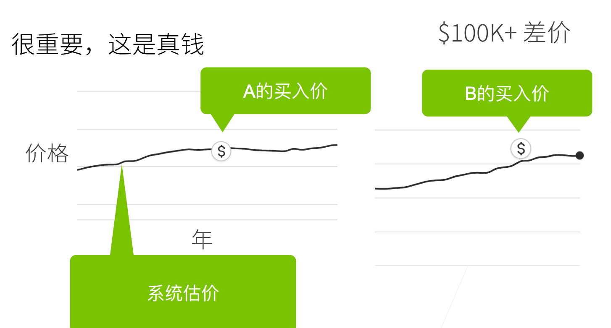
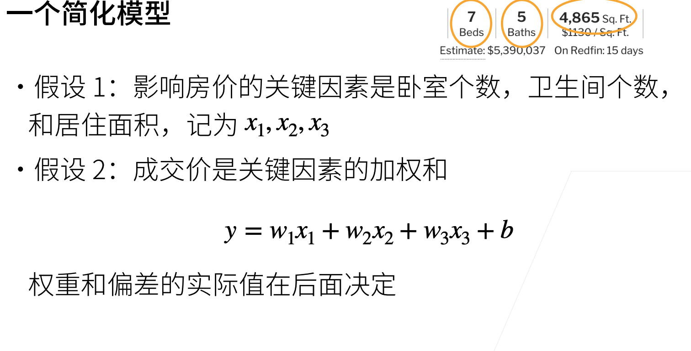
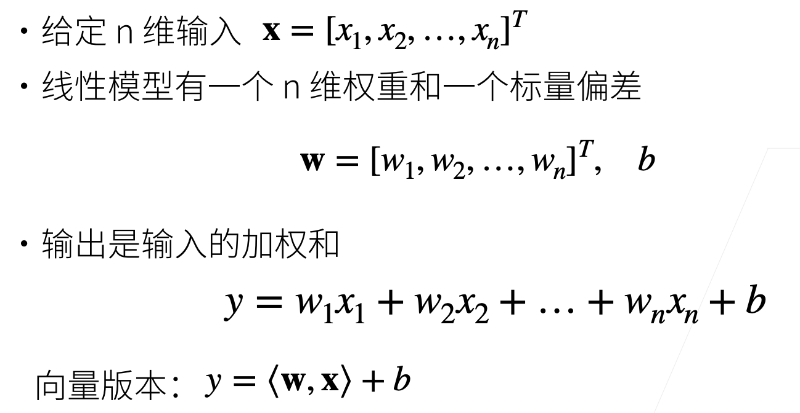
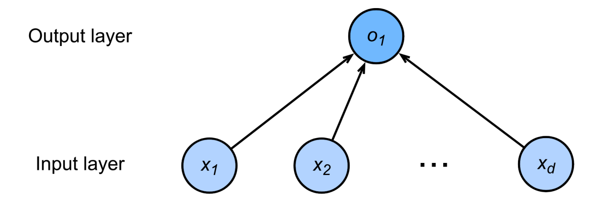
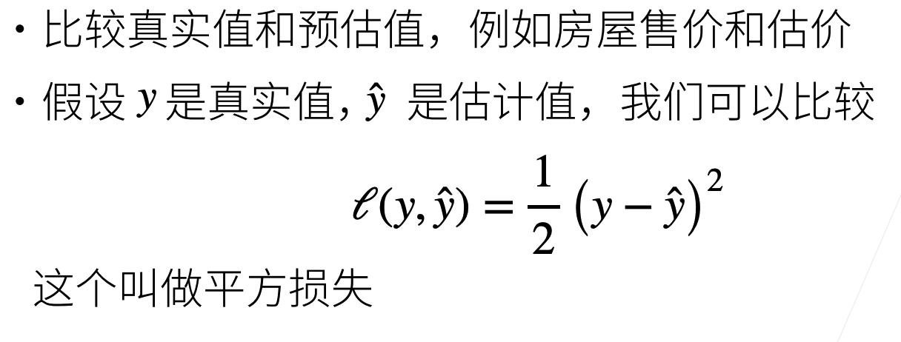
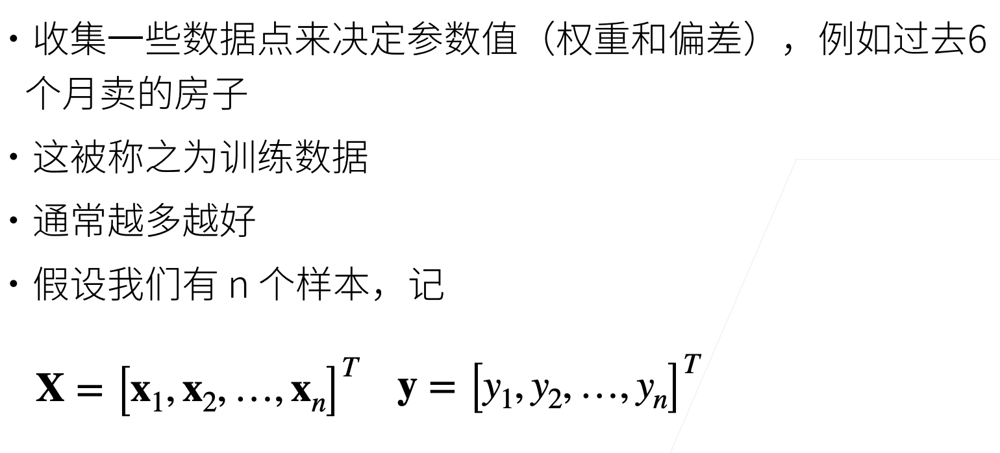
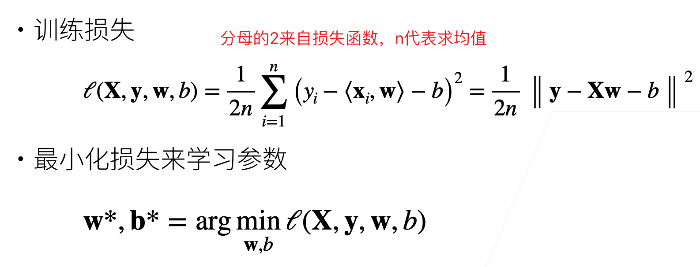
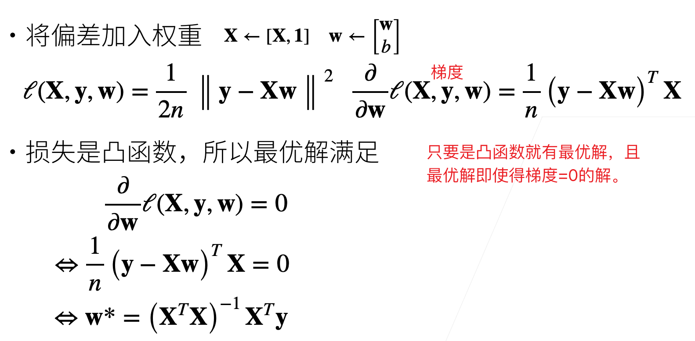
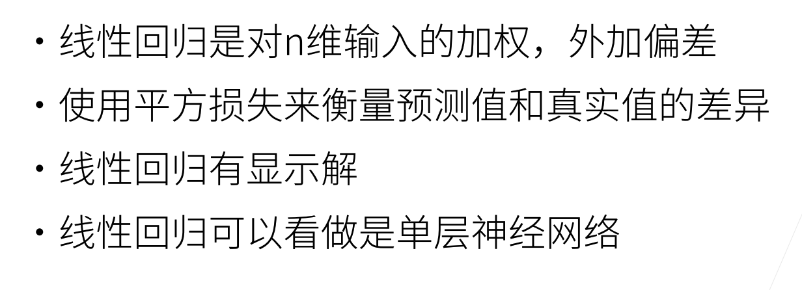

# 线性回归

线性回归一个经典的例子就是买房。

## 买房


## 房价预测



如果能在系统估价附近买到房，就是不错的。




## 线性模型



线性模型可被看作为单层神经网络。



## 衡量预估质量



这里取1/2是为了计算导数时能够简单的将其约掉。

## 训练数据



注意X是一个矩阵，y是一个向量。

$\bold{x_1}$是一个向量，是一个样本。

## 参数学习



求得使w，b最小的那个损失函数。

## 显示解

线性模型是能直接求得最优解的。




## 总结




注意：只有线性模型才有显示解。其余模型都是没有显示解的。

## 从0开始实现线性回归

```python
%matplotlib inline
import random
import torch
from d2l import torch as d2l

# 1. 获取数据

# 人工生成数据集。
def synthetic_data(w,b,num_examples):
    '''生成y = Xw + b + 随机噪声'''
    # 随机生成X，但X实际上符合均值为0，标准差为1的高斯分布
    X = torch.normal(0,1,(num_examples,len(w)))
    y = torch.matmul(X,w) + b # 通过矩阵乘法得到y
    y += torch.normal(0,0.01,y.shape) # y 加上随机噪音
    return X,y.reshape((-1,1)) # y形状变成一个列向量

true_w = torch.tensor([2, -3.4]) 
true_b = 4.2
# 设置生成1000笔数据
features, labels = synthetic_data(true_w, true_b, 1000)

# 2. 数据预处理

# data_iter 将生成的数据分割成多个batch_size大小的数据对
def data_iter(batch_size, features,labels):
    """data_iter返回一个迭代器，迭代器每次返回一batch_size大小的数据，
    包含features以及对应的labels"""
    num_examples = len(features)
    indices = list(range(num_examples))
    random.shuffle(indices) # 打乱顺序，随机取样
    for i in range(0,num_examples,batch_size): # 步长为batch_size
        batch_indices = torch.tensor(indices[i:min(i+
                                                   batch_size,num_examples)])
        # 取indices中从i开始，i+batch_size（不包含）结束，所以一个batch中元素个数
        # 为batch_size. 而用min的原因是，如果最后一个batch不足batch_size的话，该batch实际只有剩下元素的个数
        yield features[batch_indices],labels[batch_indices] # 返回迭代器
batch_size = 10

# 简单查看生成数据
for X,y in data_iter(batch_size,features,labels):
    print(X,'\n',y)
    break

# 3. 训练初始化
# 初始化模型参数 注意加上requires_grad
w = torch.normal(0,0.01,(2,1),requires_grad=True)
b = torch.zeros(1,requires_grad=True) # b初始化为0，b是个标量。

# 定义模型
def linreg(X,w,b):
    return torch.matmul(X,w) + b 
  
# 定义损失函数
def squared_loss(y_hat,y):
    return (y_hat - y.reshape(y_hat.shape))**2 / 2 # 这里没有求均值
# 注意y_hat和y按道理来说应该是相同形状，但考虑到可能他们一个是列向量
#，另一个是行向量，可以将其中一个reshape

# 定义优化算法
def sgd(params,lr,batch_size):
    """小批量随机梯度下降"""
    with torch.no_grad(): # 更新参数时不需要梯度。
        for param in params:
            param -= lr * param.grad / batch_size # 将求均值放到这里了
            param.grad.zero_() # 清空此次的梯度

# 定义一些超参数
lr = 0.03
num_epochs = 3
net = linreg
loss = squared_loss

# 4. 训练
for epoch in range(num_epochs):
    for X,y in data_iter(batch_size,features,labels):
        l = loss(net(X,w,b),y)
        l.sum().backward() # 计算梯度
        # 更新参数
        sgd([w,b],lr,batch_size) # 这里写batch_size可能出问题。
        # 因为最后一个batch的数据可能不足batch个。这里数据总量为1000，batch_size为10可以除尽
    with torch.no_grad():
        train_l = loss(net(features,w,b),labels)
        print(f'epoch {epoch + 1}, loss {float(train_l.mean()):f}')
        
# 5. 比较真实参数和通过训练学到的参数来评估训练的成功程度
print(f'w的估计误差: {true_w - w.reshape(true_w.shape)}')
print(f'b的估计误差: {true_b - b}')
```

## 线性回归的简易实现

即使用pytorch中的一些模型来构建线性回归。

```python
import numpy as np
import torch
from torch.utils import data
from d2l import torch as d2l

# 数据生成
true_w = torch.tensor([2,-3.4])
true_b = 4.2
features, labels = d2l.synthetic_data(true_w,true_b,1000) 
#同样生成1000笔资料

# 类似从0实现，这里将生成的数据分为多个batch_size大小的数据对
def load_array(data_arrays, batch_size, is_train=True):
    """构造一个Pytorch数据迭代器"""
    dataset = data.TensorDataset(*data_arrays) # 将tuple解构为各个元素
    return data.DataLoader(dataset,batch_size,shuffle=is_train)

batch_size = 10
data_iter = load_array((features,labels),batch_size)
# 这里用next来检查一下生成的数据是否可行
next(iter(data_iter)) # 用iter()将data_iter转换为迭代器，然后使用next()访问第一个元素


# 使用框架预定义好的层  来定义模型
from torch import nn
net = nn.Sequential(nn.Linear(2,1)) 
# 输入的feature是2维的，输出的label是1维的，注意这里是单个feature

# 初始化模型参数 
# net是由nn.Sequential定义的，net[0]即第一层，即nn.Linear(2,1)
net[0].weight.data.normal_(0,0.01) 
net[0].bias.data.fill_(0)
# pytorch中方法最后是下划线的对数据原值进行修改。

# 定义损失函数
loss = nn.MSELoss()

# 定义优化函数
trainer = torch.optim.SGD(net.parameters(),lr=0.03)
# 类似的，设置优化函数为小批量随机梯度下降，传入参数包含需要更新的参数以及学习率

num_epochs = 3
# 训练代码
for epoch in range(num_epochs):
    for X,y in data_iter:
        l = loss(net(X),y)
        trainer.zero_grad() # 注意每次计算梯度之前将上一次计算的梯度清空
        l.backward() # pytorch通过反向传播计算梯度
        trainer.step() # 更新参数
    l = loss(net(features),labels)
    print(f'epoch {epoch + 1}, loss {l:f}')

# 比较生成数据集的真实参数和通过有限数据训练获得的模型参数
w = net[0].weight.data
print('w的估计误差：', true_w - w.reshape(true_w.shape))
b = net[0].bias.data
print('b的估计误差：', true_b - b)

```


