# Softmax回归

Softmax回归虽然名字中带有回归，但实际上他是一种分类问题。

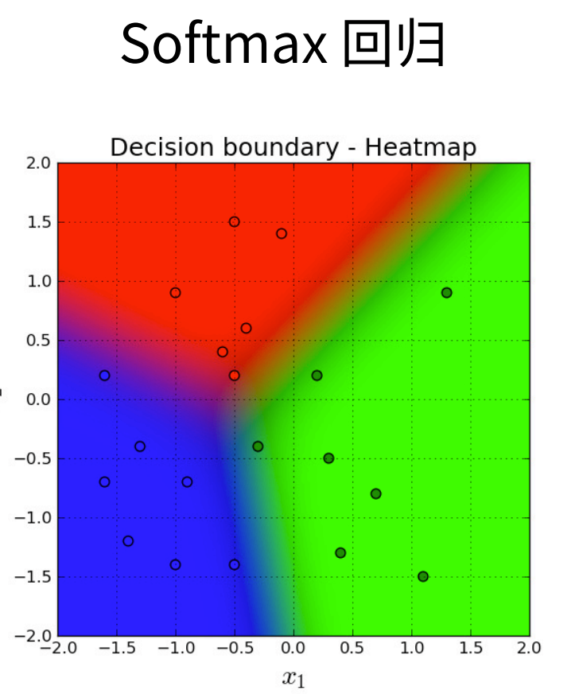

## 回归 vs 分类

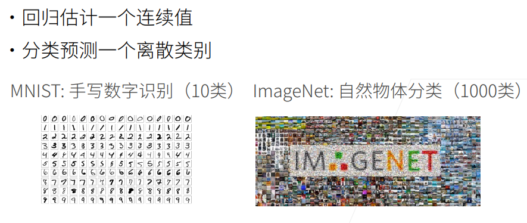

MNIST和ImageNet是两个很出名的分类的数据集。

### Kaggle上的分类问题

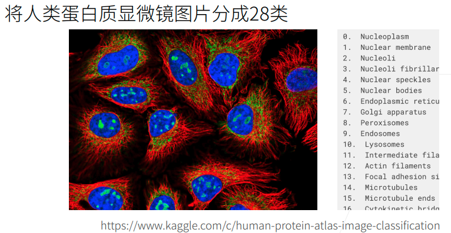


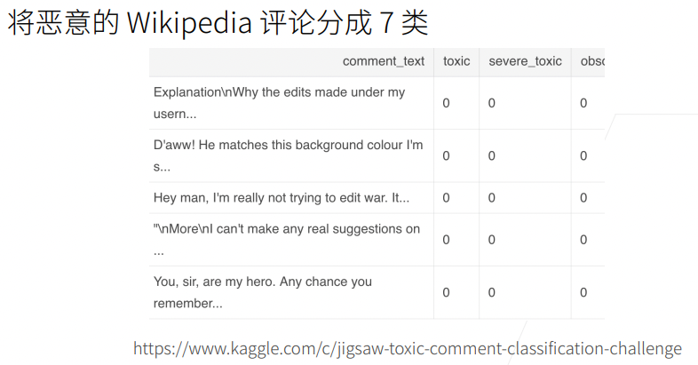


## 从回归到多类分类

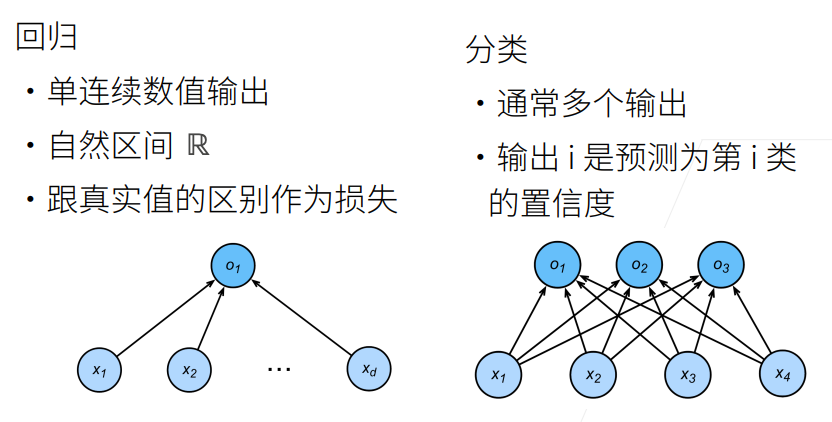

上图中右半部分，即一个三分类问题。共有三个输出，分别是 结果是三个分类的置信度。

### 均方损失

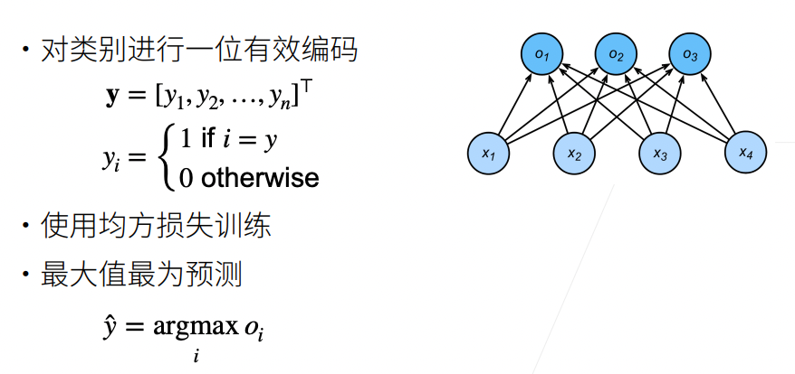

直接使用回归的均方损失训练也是可以的。

### 无校验比例

事实上，我们也对分类问题感兴趣：不是问“多少”，而是问“哪一个”：

• 某个电子邮件是否属于垃圾邮件文件夹？

• 某个用户可能注册或不注册订阅服务？

• 某个图像描绘的是驴、狗、猫、还是鸡？

• 某人接下来最有可能看哪部电影？

通常，机器学习实践者用分类这个词来描述两个有微妙差别的问题：1. 我们只对样本的“硬性”类别感兴趣， 即属于哪个类别；2. 我们希望得到“软性”类别，即得到属于每个类别的概率。这两者的界限往往很模糊。 其中的一个原因是：即使我们只关心硬类别，我们仍然使用软类别的模型。

但实际上分类问题不关心 实际的值，我们关心的是我们能不能对正确类别的置信度特别的大。

$O_y$表示正确类的置信度，$O_i$表示其他类的置信度。

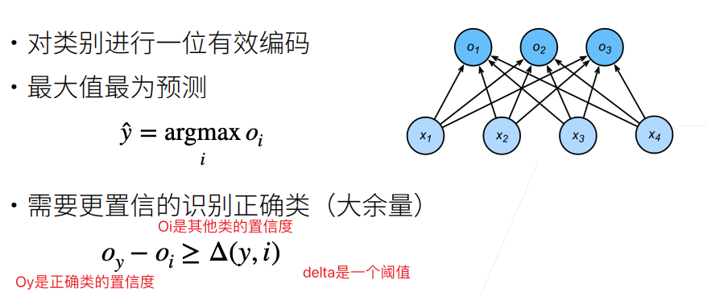


这样可以使得模型让真正的类和其他的类拉开距离。

### 校验比例

我们希望输出是一个概率。

社会科学家邓肯·卢斯于1959年在选择模型（choice model）的理论基础上发明的softmax函数正是这样做的：

softmax函数能够将未规范化的预测变换为非负数并且总和为1，同时让模型保持可导的性质。

softmax运算不会改变未规范化 的预测o之间的大小次序，只会确定分配给每个类别的概率。

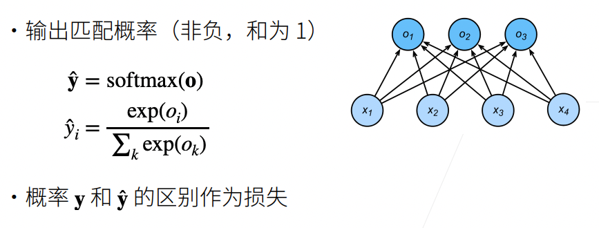

引入一个操作子：softmax。使用指数的好处是它可以使得其值非负。


## Softmax和交叉熵损失

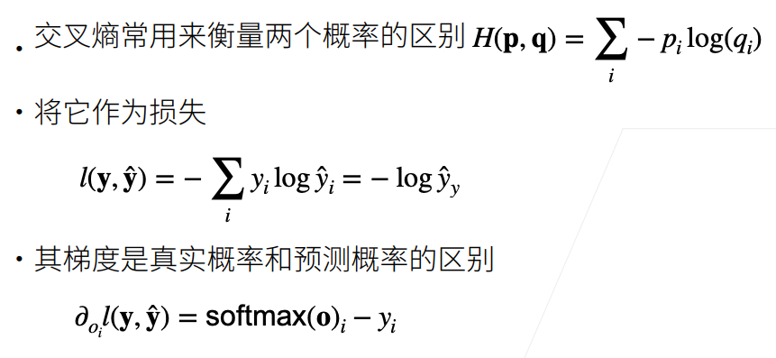
$$
l(y,\hat y) = - \sum_iy_ilog\hat y_i, 注意y_i中只有一个是1，其他是0 \\
则原式 = -log\hat y_y , \hat y _y 表示真实类的预测值
$$

* Softmax回归是一个多类分类问题
* 使用Softmax操作子得到每个类的预测置信度
* 使用交叉熵来衡量预测和标号之间的区别

## 图像分类数据集

在介绍Softmax回归的实现之前，我们先来介绍了如何读取多类分类任务的数据集。

MNIST数据集是图像分类中广泛使用的数据集之一，但作为基准数据集过于简单。我们将使用类似但更复杂的Fashion-MNIST数据集。

```python
%matplotlib inline
import torch
import torchvision
from torch.utils import data
from torchvision import transforms
from d2l import torch as d2l

d2l.use_svg_display() # 使用svg的方式来画图 更加清晰
```

通过框架中的内置函数将 Fashion-MNIST 数据集下载并读取到内存中

```python
# 需要将图片（应该是PIL格式的类型）转换为tensor
trans = transforms.ToTensor()

# 训练数据集
mnist_train = torchvision.datasets.FashionMNIST(root="../data", train=True,
                                                transform=trans,
                                                download=True)
# 测试数据集
mnist_test = torchvision.datasets.FashionMNIST(root="../data", train=False,
                                               transform=trans, download=True)

len(mnist_train), len(mnist_test) # (60000, 10000)
```

可以查看数据集中单个图片的尺寸；

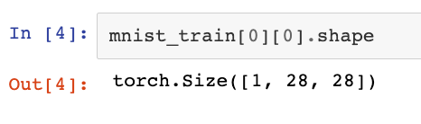

`Mnist_train[0][0]`即该批数据的第一张图片，`Mnist_train[0][1]`即其标签

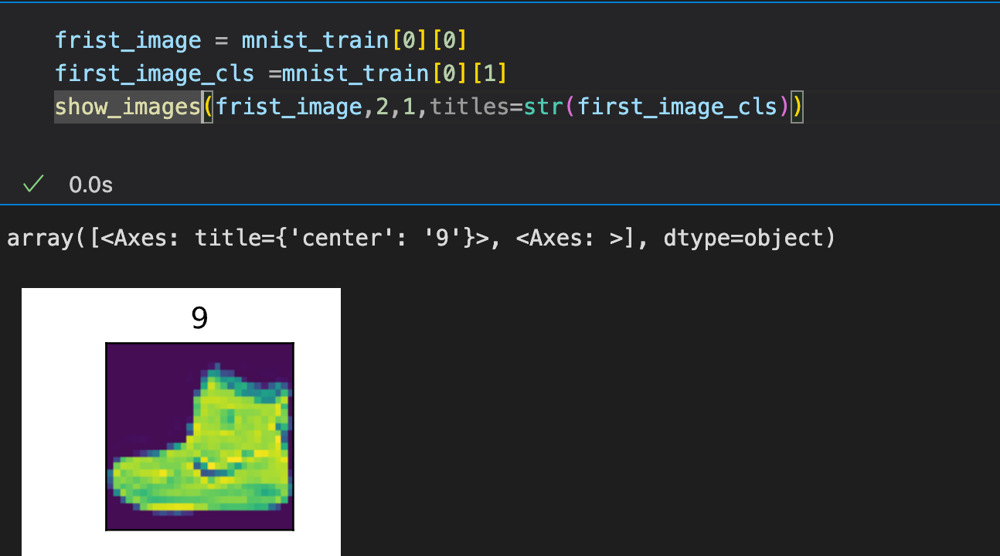

两个可视化数据集的函数：

```python
# 返回每个样本的标签 label
def get_fashion_mnist_labels(labels):  
    """返回Fashion-MNIST数据集的文本标签。"""
    text_labels = [
        't-shirt', 'trouser', 'pullover', 'dress', 'coat', 'sandal', 'shirt',
        'sneaker', 'bag', 'ankle boot']
    return [text_labels[int(i)] for i in labels]

# 画图函数
def show_images(imgs, num_rows, num_cols, titles=None, scale=1.5):  
    """Plot a list of images."""
    figsize = (num_cols * scale, num_rows * scale)
    _, axes = d2l.plt.subplots(num_rows, num_cols, figsize=figsize)
    axes = axes.flatten()
    for i, (ax, img) in enumerate(zip(axes, imgs)):
        if torch.is_tensor(img):
            ax.imshow(img.numpy())
        else:
            ax.imshow(img)
        ax.axes.get_xaxis().set_visible(False)
        ax.axes.get_yaxis().set_visible(False)
        if titles:
            ax.set_title(titles[i])
    return axes
  
  
# 几个样本的图像及其相应的标签
X, y = next(iter(data.DataLoader(mnist_train, batch_size=18)))
show_images(X.reshape(18, 28, 28), 2, 9, titles=get_fashion_mnist_labels(y));
```

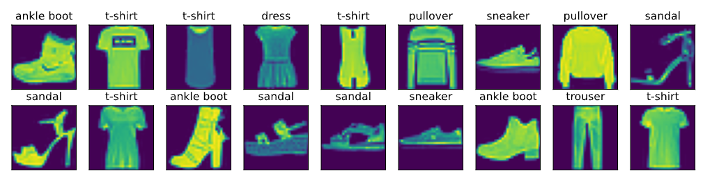

完整的一个示例：

```python
batch_size = 256

def get_dataloader_workers():  
    """使用4个进程来读取数据。"""
    return 4

train_iter = data.DataLoader(mnist_train, batch_size, shuffle=True,
                             num_workers=get_dataloader_workers())

# 这里使用timer来计时，看完整的读入一次数据花费的时间
timer = d2l.Timer()
for X, y in train_iter:
    continue
f'{timer.stop():.2f} sec'
```

将之前数据的下载和处理都写在一起：

```python
def load_data_fashion_mnist(batch_size, resize=None):  
    """下载Fashion-MNIST数据集，然后将其加载到内存中。"""
    trans = [transforms.ToTensor()]
    if resize:
        trans.insert(0, transforms.Resize(resize))
    trans = transforms.Compose(trans)
    mnist_train = torchvision.datasets.FashionMNIST(root="../data",
                                                    train=True,
                                                    transform=trans,
                                                    download=True)
    mnist_test = torchvision.datasets.FashionMNIST(root="../data",
                                                   train=False,
                                                   transform=trans,
                                                   download=True)
    # 将数据集传入dataloader
    return (data.DataLoader(mnist_train, batch_size, shuffle=True,
                            num_workers=get_dataloader_workers()),
            data.DataLoader(mnist_test, batch_size, shuffle=False,
                            num_workers=get_dataloader_workers()))

train_iter, test_iter = load_data_fashion_mnist(32, resize=64)
for X, y in train_iter:
    print(X.shape, X.dtype, y.shape, y.dtype)
    break
```

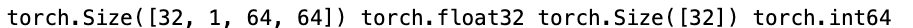

## softmax回归从零开始实现

```python
import torch
from IPython import display
from d2l import torch as d2l

batch_size = 256
# 导入训练数据集以及测试数据集
train_iter, test_iter = d2l.load_data_fashion_mnist(batch_size)
# 每个

# softmax的输入是一个向量，而数据集中的图片是3维矩阵(1,28,28)。
# 将展平每个图像，把它们看作长度为784（28*28）的向量。 
num_inputs = 784
# 因为我们的数据集有10个类别，所以网络输出维度为 10
num_outputs = 10
# 初始化权值。初始化为均值为0，方差为0.01的随机高斯分布
# 注意权值矩阵尺寸
W = torch.normal(0, 0.01, size=(num_inputs, num_outputs), requires_grad=True)
b = torch.zeros(num_outputs, requires_grad=True)

```

注意pytorch中sum等函数中指定维度计算，实际计算维度的问题：

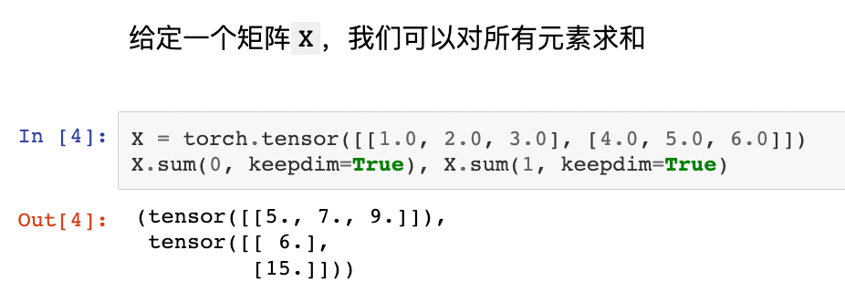

X是一个矩阵，那么计算softmax的方式为：

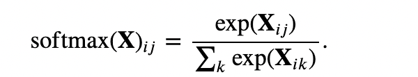

```python
def softmax(X):
    X_exp = torch.exp(X) # 该函数将X中每个值计算exp后返回
    partition = X_exp.sum(1, keepdim=True) # 按行求和，即分子
    return X_exp / partition # 用到了广播机制
```

Softmax将每个元素变成一个非负数。此外，依据概率原理，每行总和为1。

测试softmax函数：

```python
X = torch.normal(0, 1, (2, 5)) # 生成一个size为(2,5)的随机高斯分布
X_prob = softmax(X)	# X均值为0，所以X中有负数元素，softmax将每个元素变为非负数
X_prob, X_prob.sum(1)
```

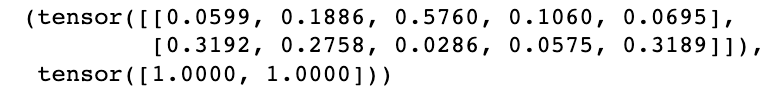

可见，X_prob中每个元素非负，且每行元素之和为1.

实现softmax回归模型：

```python
def net(X):
    return softmax(torch.matmul(X.reshape((-1, W.shape[0])), W) + b)
# matmul计算矩阵乘法
# W的尺寸为num_inputs x num_outputs，即784x10，shape[0]为784.
# X是fashion mnist中取出的数据，batch size为256，每张图片尺寸为(1,28,28)，
# 将其reshape((-1, W.shape[0]))，实际上-1处计算出应为256.
```


实现交叉熵损失函数之前，我们来看看如何从预测中提取出真实类的概率。

```python
y = torch.tensor([0, 2]) # y表示真实类，即第一个数据为第0类；第二个数据为第2类
y_hat = torch.tensor([[0.1, 0.3, 0.6], [0.3, 0.2, 0.5]]) # 预测值
# 从y_hat[0]以及y_hat[1]提取 真实类的概率
y_hat[[0, 1], y] # 即从y_hat[0][0]，以及y_hat[1][2]
```

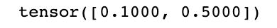

交叉熵计算公式：

$loss= -log\hat{y}_y$，其中$\hat{y}_y$表示 是真实类的预测

实现交叉熵损失函数：

```python
# 通常y_hat、y都是向量，因此最后结果也是向量。
def cross_entropy(y_hat, y):
    return -torch.log(y_hat[range(len(y_hat)), y])

cross_entropy(y_hat, y)
```

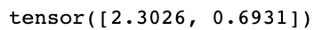

将预测类别与真实 `y` 元素进行比较：

```python
def accuracy(y_hat, y):  
    """计算预测正确的数量。"""
    if len(y_hat.shape) > 1 and y_hat.shape[1] > 1:
      	# axis=1 即找每行的最大值，argmax返回一个tensor，内容是最大值在y_hat中的索引
        y_hat = y_hat.argmax(axis=1) # axis参数和dim一样
    # y中是真实类
    cmp = y_hat.type(y.dtype) == y # tensor之间==操作是element-wise的
    # cmp是一个由布尔值组成的tensor
    # cmp.type(y.dtype)将cmp转换为y类型的tensor，即布尔值变为0.0或1.0
    return float(cmp.type(y.dtype).sum()) # 和的值就是预测对了的次数

# 预测对的个数除以总个数，就是正确率了。
accuracy(y_hat, y) / len(y)  # 0.5
```

我们可以评估在任意模型 `net` 的准确率。

```python
def evaluate_accuracy(net, data_iter):  
    """计算在指定数据集上模型的精度。"""
    if isinstance(net, torch.nn.Module): # 考虑使用torch中类定义模型的情况
        net.eval()
    # Accumulator是一个累加器
    metric = Accumulator(2)
    for X, y in data_iter:
        metric.add(accuracy(net(X), y), y.numel())
    return metric[0] / metric[1]
# metric[0]即正确预测的数量，metric[1]即预测的总数量
```

`Accumulator` 实例中创建了 2 个变量，用于分别存储正确预测的数量和预测的总数量

Accumulator的实现：

```python
class Accumulator:  
    """在`n`个变量上累加。"""
    def __init__(self, n):
        self.data = [0.0] * n

    def add(self, *args):
        self.data = [a + float(b) for a, b in zip(self.data, args)]

    def reset(self):
        self.data = [0.0] * len(self.data)

    def __getitem__(self, idx):
        return self.data[idx]

evaluate_accuracy(net, test_iter)
```

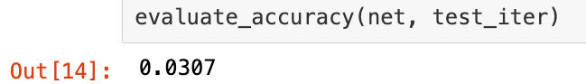

Softmax回归的训练:

```python
def train_epoch_ch3(net, train_iter, loss, updater):  
    """训练模型一个迭代周期（定义见第3章）。"""
    if isinstance(net, torch.nn.Module):
        net.train()
    metric = Accumulator(3)
    for X, y in train_iter:
        y_hat = net(X)
        l = loss(y_hat, y)
        if isinstance(updater, torch.optim.Optimizer):
            updater.zero_grad()
            l.backward()
            updater.step()
            metric.add(
                float(l) * len(y), accuracy(y_hat, y),
                y.size().numel())
        else:
            l.sum().backward()
            updater(X.shape[0])
            metric.add(float(l.sum()), accuracy(y_hat, y), y.numel())
    return metric[0] / metric[2], metric[1] / metric[2]
  # metric[0]	是总损失
  # metirc[1] 是预测正确的次数
  # metric[2] 是预测的总数
```

定义一个在动画中绘制数据的实用程序类

```python
class Animator:  
    """在动画中绘制数据。"""
    def __init__(self, xlabel=None, ylabel=None, legend=None, xlim=None,
                 ylim=None, xscale='linear', yscale='linear',
                 fmts=('-', 'm--', 'g-.', 'r:'), nrows=1, ncols=1,
                 figsize=(3.5, 2.5)):
        if legend is None:
            legend = []
        d2l.use_svg_display()
        self.fig, self.axes = d2l.plt.subplots(nrows, ncols, figsize=figsize)
        if nrows * ncols == 1:
            self.axes = [self.axes,]
        self.config_axes = lambda: d2l.set_axes(self.axes[
            0], xlabel, ylabel, xlim, ylim, xscale, yscale, legend)
        self.X, self.Y, self.fmts = None, None, fmts

    def add(self, x, y):
        if not hasattr(y, "__len__"):
            y = [y]
        n = len(y)
        if not hasattr(x, "__len__"):
            x = [x] * n
        if not self.X:
            self.X = [[] for _ in range(n)]
        if not self.Y:
            self.Y = [[] for _ in range(n)]
        for i, (a, b) in enumerate(zip(x, y)):
            if a is not None and b is not None:
                self.X[i].append(a)
                self.Y[i].append(b)
        self.axes[0].cla()
        for x, y, fmt in zip(self.X, self.Y, self.fmts):
            self.axes[0].plot(x, y, fmt)
        self.config_axes()
        display.display(self.fig)
        display.clear_output(wait=True)
```

训练函数

```python
def train_ch3(net, train_iter, test_iter, loss, num_epochs, updater):  
    """训练模型（定义见第3章）。"""
    animator = Animator(xlabel='epoch', xlim=[1, num_epochs], ylim=[0.3, 0.9],
                        legend=['train loss', 'train acc', 'test acc'])
    for epoch in range(num_epochs):
        train_metrics = train_epoch_ch3(net, train_iter, loss, updater)
        test_acc = evaluate_accuracy(net, test_iter)
        animator.add(epoch + 1, train_metrics + (test_acc,))
    train_loss, train_acc = train_metrics
    assert train_loss < 0.5, train_loss
    assert train_acc <= 1 and train_acc > 0.7, train_acc
    assert test_acc <= 1 and test_acc > 0.7, test_acc
```

小批量随机梯度下降来优化模型的损失函数

```python
lr = 0.1

def updater(batch_size):
    return d2l.sgd([W, b], lr, batch_size)
```

训练模型10个迭代周期

```python
num_epochs = 10
train_ch3(net, train_iter, test_iter, cross_entropy, num_epochs, updater)
```

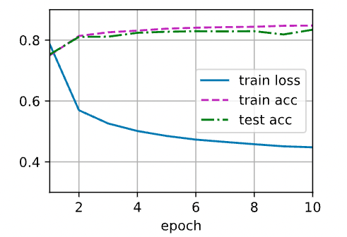

对图像进行分类预测

```python
def predict_ch3(net, test_iter, n=6):  
    """预测标签（定义见第3章）。"""
    for X, y in test_iter:
        break
    trues = d2l.get_fashion_mnist_labels(y)
    preds = d2l.get_fashion_mnist_labels(net(X).argmax(axis=1))
    titles = [true + '\n' + pred for true, pred in zip(trues, preds)]
    d2l.show_images(X[0:n].reshape((n, 28, 28)), 1, n, titles=titles[0:n])

predict_ch3(net, test_iter)
```

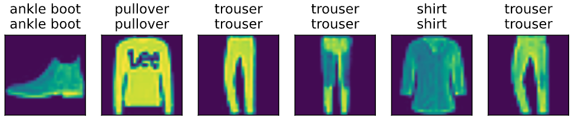

## softmax回归的简洁实现

通过深度学习框架的高级API能够使实现 softmax 回归变得更加容易

```python
import torch
from torch import nn
from d2l import torch as d2l

# 还是用之前的方法读入数据
batch_size = 256
train_iter, test_iter = d2l.load_data_fashion_mnist(batch_size)

# nn.Flatten()将输入reshape，第一维不变，后续维度拉成向量，对应我们的数据，即
# 数据尺寸由(256,1,28,28)变为(256,784)
net = nn.Sequential(nn.Flatten(), nn.Linear(784, 10))

# 对权重的初始化
def init_weights(m):
    if type(m) == nn.Linear: 
        nn.init.normal_(m.weight, std=0.01)

net.apply(init_weights); # 将这个init_weights函数在每一层都执行一次

# 在交叉熵损失函数中传递未归一化的预测，并同时计算softmax及其对数
loss = nn.CrossEntropyLoss()
# 使用学习率为0.1的小批量随机梯度下降作为优化算法
trainer = torch.optim.SGD(net.parameters(), lr=0.1)

# 调用 之前 定义的训练函数来训练模型
num_epochs = 10
d2l.train_ch3(net, train_iter, test_iter, loss, num_epochs, trainer)


```

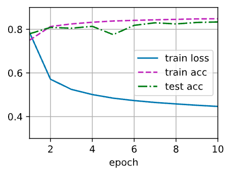
