# 感知机 perceptron

感知机是很简单的一个模型。

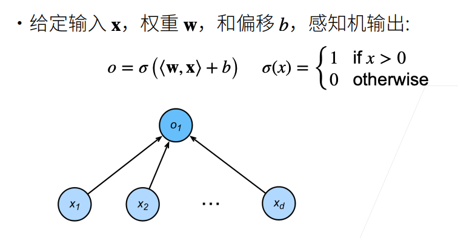

$\bold{w,x}$是两个向量，b是一个标量，$\sigma$函数包含两个输出。

除了上图中的$\sigma$函数，还可以选择其他类型。如：

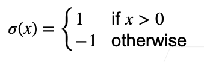

$\sigma$函数的值是离散的，且只有两种输出。即，感知机是一个二分类的问题。

* 和线性回归对比：线性回归输出一个实数
* 和softmax回归对比：softmax回归输出概率（多分类问题）

## 训练感知机

训练感知机（注意这里的感知机输出是1或-1）的算法很简单：

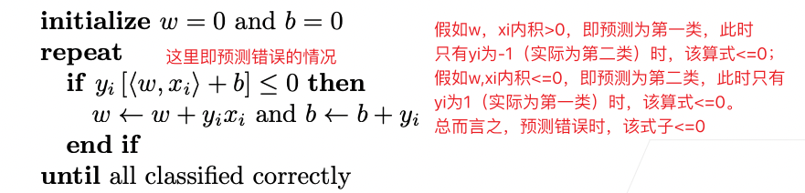

该算法等价于使用批量为1的梯度下降（注意不是随机的），并使用如下的损失函数：
$$
l(y,\bold{x,w}) = max(0,-y\langle \bold{w,x} \rangle)
$$
这里的max等价于上面算法中的if。如果$y\langle \bold{w,x} \rangle \le 0$, 即预测错误，加上-号之后变为正数，大于0，则此时loss就为这个值。如果$y\langle \bold{w,x} \rangle \gt 0$，即预测正确，加上-号后变为负数，小于0，loss就为0，不更新。

感知机算法有一个特点就是，一直运行，直到所有情况都预测正确。

例如：

分类猫以及狗：

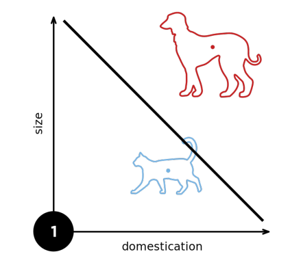

加入一只狗/猫：

感知机再次进行预测，使所有情况都正确

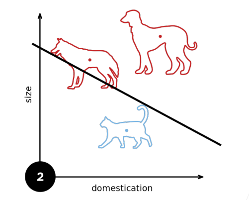

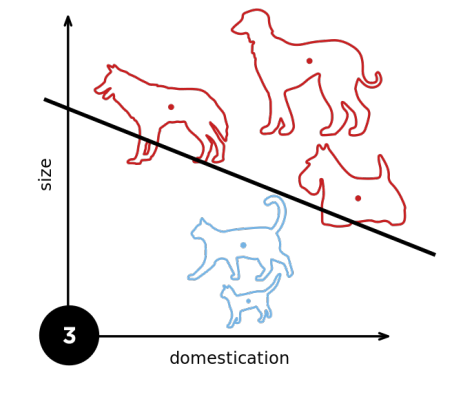

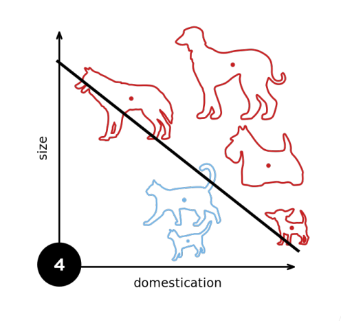

曲线不断变化，它要使得所有样本都预测正确。

## 收敛定理

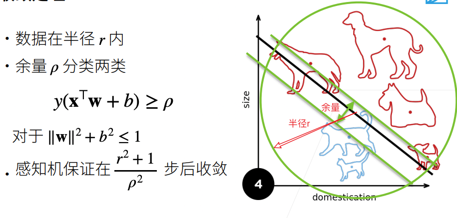

具体证明我们不做，但可以从理解的角度来看这个公式：

* 数据半径越大，数据量越多，收敛难度变大
* 余量小则能找到划分曲线的难度变大，收敛难度变大

## XOR问题

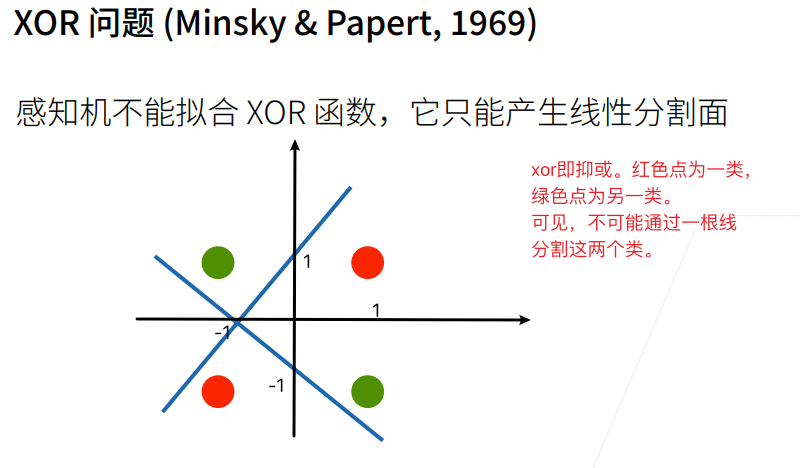

即感知机不能拟合XOR函数。

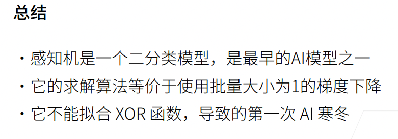

## 多层感知机

### 学习XOR

既然单个直线无法拟合XOR，则可以选择多个直线。

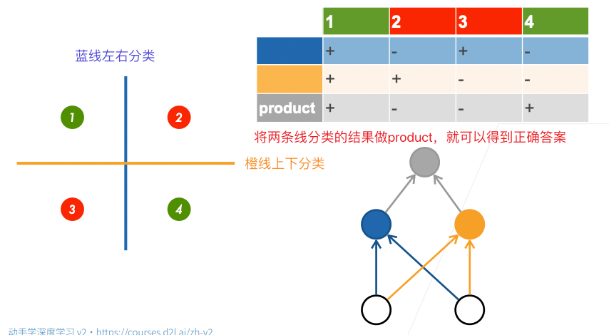

一个函数解决不了，则先学习一个简单的函数，再学习另一个函数，将两个函数组合在一起。由一层变成了多层。

这就是多层感知机的思想。

### 单隐藏层

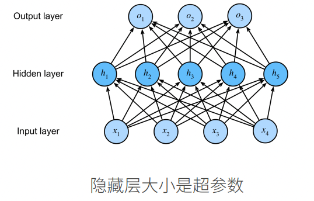

#### 单分类

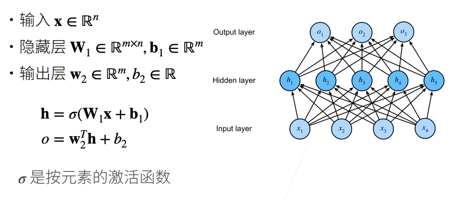

### 为什么需要***非线性激活函数***？

假设使用的激活函数为$\sigma(x)=x$，还是以单隐藏层为例子，则
$$
\bold{h} = \sigma(W_1\bold{x+b1}) = W_1\bold{x+b1} \\
o = W_2^TW_1\bold{x} + b'，令 W_3 = W_2^TW_1，即仍然是线性的，则\\
o = W_3\bold x + b'，即退化为单层感知机。无法拟合XOR。
$$

### 激活函数

#### sigmoid

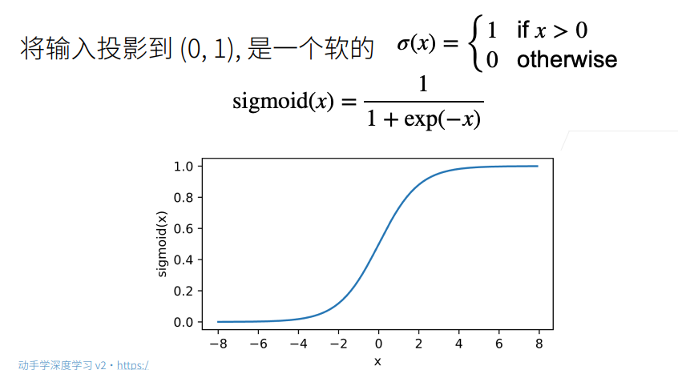

#### tanh

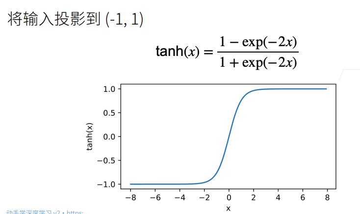

#### ReLU

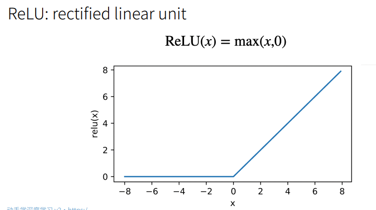

最常用的激活函数就是ReLU了。ReLU足够简单，计算快。sigmoid和tanh两个函数因为要做指数运算，他们的代价是比较大的。通常在cpu上做一次指数运算差不多相当于做100次乘法。

### 多类分类

多类分类问题与softmax回归没有本质区别。

如果将不设置隐藏层，其实就是softmax回归。

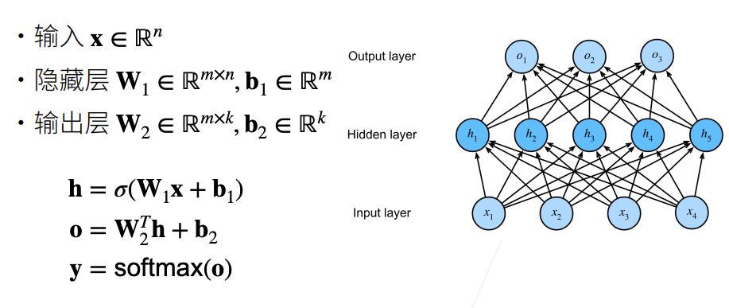

多类分类将最后的output layer作为输入，计算出置信度。

### 多隐藏层

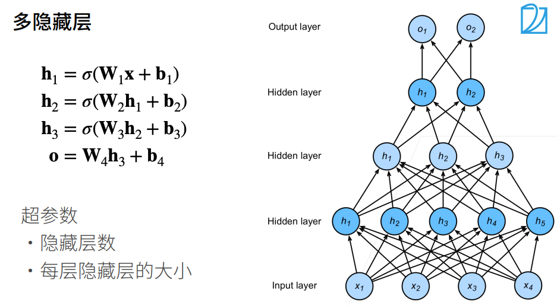

多隐藏层的设置中有一些经验的方法：

* 通常随着深度变大，隐藏层规模逐渐变小
* 注意规模是逐渐变小，不要突然变小的特别多
* 本质上就是做压缩，压缩过快可能导致信息一下子损失过多

第一个隐藏层的规模可以设置为和input layer相同，或者小于input layer，还可以设置成大于input layer。但最后一种做法通常只会在第一个隐藏层上这么做，后续的隐藏层的规模应该逐渐变小。

但实际上CNN是先压缩再扩张的，这种方式做的好的话可以避免模型过拟合。

### 总结

* 多层感知机使用隐藏层和激活函数来得到非线性模型
* 常用激活函数是Sigmoid，Tanh以及ReLU
* 使用Softmax来处理多类分类
* 超参数为隐藏层数，和各个隐藏层大小


## 多层感知机的从零开始实现

导入一些包，以及导入数据。

```python
import torch
from torch import nn
from d2l import torch as d2l

batch_size = 256
train_iter, test_iter = d2l.load_data_fashion_mnist(batch_size)
# train_iter中单个元素X的尺寸为 (256,1,28,28)
```

实现一个具有单隐藏层的多层感知机，它包含256个隐藏单元

```python
num_inputs, num_outputs, num_hiddens = 784, 10, 256

# 初始化W和bias
W1 = nn.Parameter(
    torch.randn(num_inputs, num_hiddens, requires_grad=True) * 0.01)
b1 = nn.Parameter(torch.zeros(num_hiddens, requires_grad=True))
W2 = nn.Parameter(
    torch.randn(num_hiddens, num_outputs, requires_grad=True) * 0.01)
b2 = nn.Parameter(torch.zeros(num_outputs, requires_grad=True))

params = [W1, b1, W2, b2]
```

实现激活函数和模型。

```python
# 实现ReLU
def relu(X):
  a = torch.zeros_like(X) # 产生一个和X shape相同的全0的tensor
  return torch.max(X,a) # 将X中负值 去掉，使用0替代

# 模型定义
def net(X):
    X = X.reshape((-1, num_inputs)) # 将Xreshape为 (256,784)
    # 需要注意各个矩阵的size，需要匹配起来。
    H = relu(X @ W1 + b1)
    return (H @ W2 + b2)

loss = nn.CrossEntropyLoss()
```

多层感知机的训练过程与softmax回归的训练过程完全相同

```python
num_epochs, lr = 10, 0.1
updater = torch.optim.SGD(params, lr=lr)

d2l.train_ch3(net, train_iter, test_iter, loss, num_epochs, updater)
```

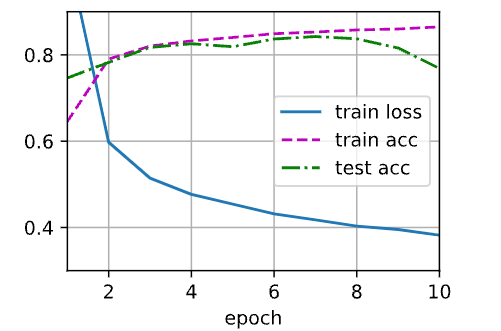

在一些测试数据上应用这个模型:

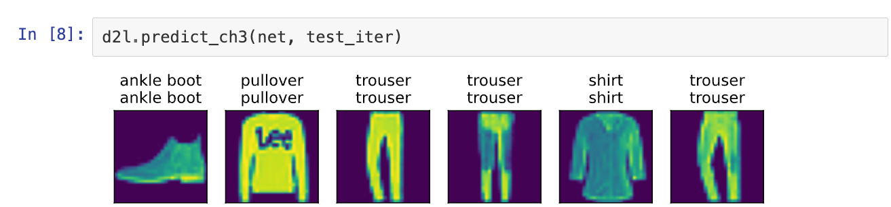

## 多层感知机的简洁实现

```python
import torch
from torch import nn
from d2l import torch as d2l

# 隐藏层 包含256个隐藏单元，并使用了ReLU激活函数
# 将拉平放到Sequential中
net = nn.Sequential(nn.Flatten(), nn.Linear(784, 256), nn.ReLU(),
                    nn.Linear(256, 10))

def init_weights(m):
    if type(m) == nn.Linear:
        nn.init.normal_(m.weight, std=0.01)

net.apply(init_weights);

# 训练过程
batch_size, lr, num_epochs = 256, 0.1, 10
loss = nn.CrossEntropyLoss()
trainer = torch.optim.SGD(net.parameters(), lr=lr)

train_iter, test_iter = d2l.load_data_fashion_mnist(batch_size)
d2l.train_ch3(net, train_iter, test_iter, loss, num_epochs, trainer)
```

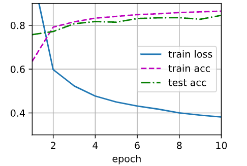
