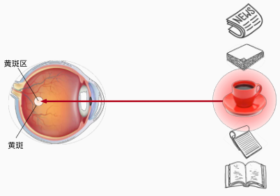
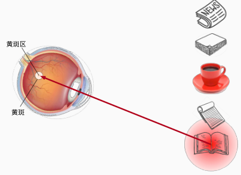
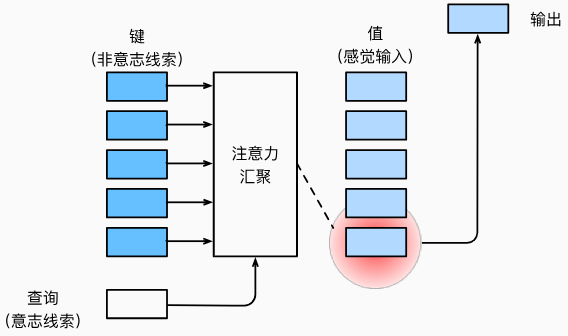
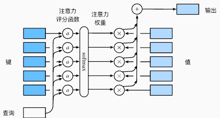

# 注意力机制

## 生物学中的注意力提示

注意力是如何应用于视觉世界中的呢？ 这要从当今十分普及的*双组件*（two-component）的框架开始讲起，在这个框架中，受试者基于***非自主性提示*和*自主性提示*** 有选择地引导注意力的焦点。

非自主性提示是基于环境中物体的突出性和易见性。 想象一下，假如我们面前有五个物品： 一份报纸、一篇研究论文、一杯咖啡、一本笔记本和一本书。 所有纸制品都是黑白印刷的，但咖啡杯是红色的。 换句话说，这个咖啡杯在这种视觉环境中是突出和显眼的， 不由自主地引起人们的注意。 所以我们会把视力最敏锐的地方放到咖啡上， 如下图所示。



喝咖啡后，我们会变得兴奋并**想读书**， 所以转过头，重新聚焦眼睛，然后看看书， 就像下面图片中描述那样。 与上图中由于突出性导致的选择不同， 此时选择书是受到了认知和意识的控制， 因此注意力在基于自主性提示去辅助选择时将更为谨慎。 受试者的主观意愿推动，选择的力量也就更强大。



## 查询、键和值

自主性的与非自主性的注意力提示解释了人类的注意力的方式， 下面来看看如何通过这两种注意力提示， 用神经网络来设计注意力机制的框架，

首先，考虑一个相对简单的状况， 即**只使用非自主性提示**。 要想将选择偏向于感官输入， 则可以简单地使用参数化的全连接层， 甚至是非参数化的最大汇聚层或平均汇聚层。

>  ⚠️：我们之前学习的那些模型，基本上都是使用非自主性提示的情况。

因此，“是否包含自主性提示”将注意力机制与全连接层或汇聚层区别开来。 在注意力机制的背景下，**自主性提示被称为*查询*（query）。** 给定任何查询，注意力机制通过*注意力汇聚*（attention pooling） 将选择引导至*感官输入*（sensory inputs，例如中间特征表示）。 在注意力机制中，这些感官输入被称为*值*（value）。 更通俗的解释，每个值都与一个*键*（key）配对， 这可以想象为感官输入的非自主提示。 如下图所示，可以通过设计注意力汇聚的方式， 便于给定的查询（自主性提示）与键（非自主性提示）进行匹配， 这将引导得出最匹配的值（感官输入）。




## 注意力汇聚：Nadaraya-Watson 核回归

$\epsilon$

高斯核（Gaussian Kernel），其定义为：
$$
K(u)=\frac1{\sqrt{2\pi}}\mathrm{exp}(-\frac{u^2}2)
$$
其实就是期望为0，方差为1的标准高斯分布的概率密度函数。


## 注意力评分函数

高斯核指数部分可以视为*注意力评分函数*（attention scoring function）， 简称*评分函数*（scoring function）， 然后把这个函数的输出结果输入到softmax函数中进行运算。 通过上述步骤，将得到与键对应的值的概率分布（即注意力权重）。 最后，注意力汇聚的输出就是基于这些注意力权重的值的加权和。

下图说明了 如何将注意力汇聚的输出计算成为值的加权和， 其中$a$表示注意力评分函数。 由于注意力权重是概率分布， 因此加权和其本质上是加权平均值。



用数学语言描述，假设有一个查询$\mathbf{q}\in\mathbb{R}^q$和 m个“键－值”对$(\mathbf{k}_{1},\mathbf{v}_{1}),\ldots,(\mathbf{k}_{m},\mathbf{v}_{m})$， 其中$\mathbf{k}_i\in\mathbb{R}^k,\mathbf{v}_i\in\mathbb{R}^v$。 注意力汇聚函数$f$就被表示成值的加权和：
$$
f(\mathbf{q},(\mathbf{k}_1,\mathbf{v}_1),\ldots,(\mathbf{k}_m,\mathbf{v}_m))=\sum_{i=1}^m\alpha(\mathbf{q},\mathbf{k}_i)\mathbf{v}_i\in\mathbb{R}^v
$$
其中查询$\mathbf q$和键$\mathbf k_i$的注意力权重（标量） 是通过注意力评分函数$a$将两个向量映射成标量， 再经过softmax运算得到的：
$$
\alpha(\mathbf{q},\mathbf{k}_i)=\text{softmax}(a(\mathbf{q},\mathbf{k}_i))=\frac{\exp(a(\mathbf{q},\mathbf{k}_i))}{\sum_{j=1}^m\exp(a(\mathbf{q},\mathbf{k}_j))}\in\mathbb{R}
$$
即$\alpha$函数的结果是一个概率值，f函数最后的结果就是$\mathbf v_i$的加权和。

正如上图所示，选择不同的注意力评分函数$a$会导致不同的注意力汇聚操作。 本节将介绍两个流行的评分函数，稍后将用他们来实现更复杂的注意力机制。

### 点积注意力 Dot Product Attention


### 掩蔽softmax操作

正如上面提到的，softmax操作用于输出一个概率分布作为注意力权重。 在某些情况下，**并非所有**的值都应该被纳入到注意力汇聚中。

 为了仅将有意义的词元作为值来获取注意力汇聚， 可以指定一个有效序列长度（即词元的个数）， 以便在计算softmax时过滤掉超出指定范围的位置。 下面的`masked_softmax`函数 实现了这样的*掩蔽softmax操作*（masked softmax operation）， 其中任何超出有效长度的位置都被掩蔽并置为0。

```python
def masked_softmax(X, valid_lens):
    """通过在最后一个轴上掩蔽元素来执行softmax操作"""
    # X:3D张量，valid_lens:1D或2D张量
    if valid_lens is None:
        return nn.functional.softmax(X, dim=-1)
    else:
        shape = X.shape
        if valid_lens.dim() == 1:
            valid_lens = torch.repeat_interleave(valid_lens, shape[1])
        else:
            valid_lens = valid_lens.reshape(-1)
        # 最后一轴上被掩蔽的元素使用一个非常大的负值替换，从而其softmax输出为0
        X = d2l.sequence_mask(X.reshape(-1, shape[-1]), valid_lens,
                              value=-1e6)
        return nn.functional.softmax(X.reshape(shape), dim=-1)
```

考虑由两个2×4矩阵表示的样本， 这两个样本的有效长度分别为2和3。 经过掩蔽softmax操作，超出有效长度的值都被掩蔽为0：

```python
masked_softmax(torch.rand(2, 2, 4), torch.tensor([2, 3]))
```

```
tensor([[[0.5980, 0.4020, 0.0000, 0.0000],
         [0.5548, 0.4452, 0.0000, 0.0000]],

        [[0.3716, 0.3926, 0.2358, 0.0000],
         [0.3455, 0.3337, 0.3208, 0.0000]]])
```

同样，也可以使用二维张量，为矩阵样本中的每一行指定有效长度。

```python
masked_softmax(torch.rand(2, 2, 4), torch.tensor([[1, 3], [2, 4]]))
```

```
tensor([[[1.0000, 0.0000, 0.0000, 0.0000],
         [0.4125, 0.3273, 0.2602, 0.0000]],

        [[0.5254, 0.4746, 0.0000, 0.0000],
         [0.3117, 0.2130, 0.1801, 0.2952]]])
```

### 加性注意力

一般来说，当查询和键是不同长度的矢量时，可以使用加性注意力作为评分函数。 给定查询$\mathbf{q}\in\mathbb{R}^{q}$和 键$\mathbf{k}\in\mathbb{R}^{k}$， *加性注意力*（additive attention）的评分函数为：
$$
a(\mathbf{q},\mathbf{k})=\mathbf{w}_v^\top\tanh(\mathbf{W}_q\mathbf{q}+\mathbf{W}_k\mathbf{k})\in\mathbb{R}
$$
其中可学习的参数是$\mathbf{W}_{q}\in\mathbb{R}^{h\times q}$、 $\mathbf{W}_k\in\mathbb{R}^{h\times k}$和 $\mathbf{w}_v\in\mathbb{R}^h$。

将查询和键连结起来后输入到一个多层感知机（MLP）中（$\mathbf{W}_{q}\mathbf{q}+\mathbf{W}_{k}\mathbf{k}$即多层感知机）， 感知机包含一个隐藏层，其隐藏单元数是一个超参数h。 通过使用tanh作为激活函数，并且禁用偏置项。

#### 实现

```python
class AdditiveAttention(nn.Module):
    """加性注意力"""
    def __init__(self, key_size, query_size, num_hiddens, dropout, **kwargs):
        super(AdditiveAttention, self).__init__(**kwargs)
        self.W_k = nn.Linear(key_size, num_hiddens, bias=False)
        self.W_q = nn.Linear(query_size, num_hiddens, bias=False)
        self.w_v = nn.Linear(num_hiddens, 1, bias=False)
        self.dropout = nn.Dropout(dropout)

    def forward(self, queries, keys, values, valid_lens):
        queries, keys = self.W_q(queries), self.W_k(keys)
        # 在维度扩展后，
        # queries的形状：(batch_size，查询的个数，1，num_hidden)
        # key的形状：(batch_size，1，“键－值”对的个数，num_hiddens)
        # 使用广播方式进行求和
        features = queries.unsqueeze(2) + keys.unsqueeze(1)
        features = torch.tanh(features)
        # self.w_v仅有一个输出，因此从形状中移除最后那个维度。
        # scores的形状：(batch_size，查询的个数，“键-值”对的个数)
        scores = self.w_v(features).squeeze(-1)
        self.attention_weights = masked_softmax(scores, valid_lens)
        # values的形状：(batch_size，“键－值”对的个数，值的维度)
        return torch.bmm(self.dropout(self.attention_weights), values)
```


