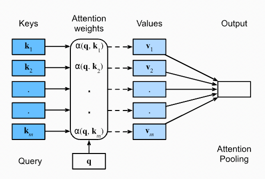
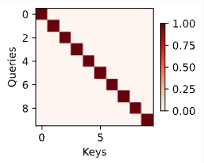
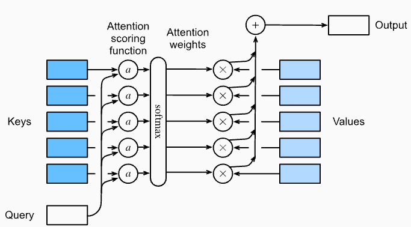
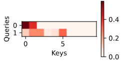
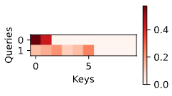

# 注意力机制

## 1. 查询、键和值

将注意力机制与数据库进行比较。数据库最简单的形式是键 (𝑘) 和值 (𝑣) 的集合。例如，我们的数据库𝐷可能由元组组成`{(“Zhang”,“Aston”),(“Lipton”,“Zachary”),(“Li”,“Mu”),(“Smola”,“Alex”) , (“Hu”, “Rachel”), (“Werness”, “Brent”)}`，姓氏是键，名字是值。

我们可以对 𝐷 进行操作，例如使用“Li”的精确查询（𝑞），它将返回值“Mu”。如果(“Li”,“Mu”)不是𝐷中的记录，则不会有有效答案。如果我们还允许近似匹配，我们将检索 (“Lipton”, “Zachary”)。尽管如此，这个非常简单和微不足道的例子却教会了我们许多有用的东西：

* 我们可以设计对 (𝑘,𝑣) 对进行操作的查询𝑞，使其无论数据库大小如何都有效。
* 根据数据库的内容，相同的查询可以收到不同的答案。
* “代码”在大型状态空间（数据库）上执行操作可以非常简单（例如，精确匹配、近似匹配、top-𝑘）
* 无需压缩或简化数据库以使操作有效。

上述这个例子可以帮助我们更好的引入注意力机制（attention mechanism）。

我们使用$\mathcal{D}\stackrel{\mathrm{def}}{=}\{(\mathbf{k}_{1},\mathbf{v}_{1}),\ldots(\mathbf{k}_{m},\mathbf{v}_{m})\}$来表示一个包含m个`(key,value)`形式的元组对的数据库。

然后，使用$\mathbf q$表示查询（query）。有了这些表示之后，我们可以定义在数据库D上的attention：
$$
\text{Attention}(\mathbf{q},\mathcal{D})\stackrel{\text{def}}{=}\sum_{i=1}^m\alpha(\mathbf{q},\mathbf{k}_i)\mathbf{v}_i
$$
其中，$\alpha(\mathbf{q},\mathbf{k}_{i})\in\mathbb{R}\left(i=1,\ldots,m\right)$是标量attention权重（scalar attention weights）。

该操作本身通常称为**注意力汇聚（attention pooling）**。

注意力这个名称源于这样一个事实：该操作**特别关注权重 𝛼 显着（即大）的项**。因此，对 𝐷 的关注会生成数据库中包含的值的线性组合。事实上，这包含上述示例作为一种特殊情况，其中除了一个权重之外的所有权重都为零。我们有很多特殊情况：

* 权重$\alpha(\mathbf{q},\mathbf{k}_{i})$非负。在这种情况下，注意力机制的输出包含在由值 𝑣𝑖 跨越的凸锥体中。
* 权重形成凸组合（convex combination），即 $\sum_i\alpha(\mathbf{q},\mathbf{k}_i)=1\text{ and }\alpha(\mathbf{q},\mathbf{k}_i)\geq0\text{ for all }i$（此时可以将权重作为概率）。这种设置是深度学习中最常用的一种。
* 恰好权重中有一个为 1，而所有其他权重均为 0。这类似于传统的数据库查询。
* 所有权重都相等，即$\alpha(\mathbf{q},\mathbf{k}_{i})=\frac{1}{m}\mathrm{for~all} \ i$。这相当于对整个数据库进行平均，在深度学习中也称为平均池化（average pooling）。

确保权重总和为 1 的常见策略是通过以下方式对它们进行标准化：
$$
\alpha(\mathbf{q},\mathbf{k}_i)=\frac{\alpha(\mathbf{q},\mathbf{k}_i)}{\sum_j\alpha(\mathbf{q},\mathbf{k}_j)}
$$
特别是，为了确保权重也是非负的，可以使用指数函数。这意味着我们现在可以选择任何函数 𝑎(𝑞,𝑘)，然后通过以下方式将用于多项式模型的 softmax 运算应用于它：
$$
\alpha(\mathbf{q},\mathbf{k}_i)=\frac{\exp(a(\mathbf{q},\mathbf{k}_i))}{\sum_j\exp(a(\mathbf{q},\mathbf{k}_j))}
$$
它是可微的，并且它的梯度永远不会消失，所有这些都是模型中理想的属性。

> 注意：上述关于attention机制的内容是其中一种实现，还有其他的一些实现。例如，可以设计一个不能微分的attention模型然后使用强化学习来完成训练。

正如人们所预料的那样，训练这样一个模型是相当复杂的。因此，大部分现代注意力研究都遵循下图 中概述的框架。因此，我们将重点放在这一系列可微分机制上。



注意力机制通过注意力汇聚计算值$\mathbf v_i$的线性组合，其中权重是根据查询$\mathbf q$和键$\mathbf k_i$之间的相容性（compatibility）（或者说相关程度）导出的。

### 可视化

注意力机制的好处之一是它非常直观，特别是当权重为非负且总和为 1 时。在这种情况下，我们可以将大权重解释为模型选择相关组件的一种方式。**虽然这是一个很好的直觉，但重要的是要记住这只是一种直觉。**无论如何，在应用各种不同的查询时，我们可能希望可视化它对给定键集的影响。这个函数稍后会派上用场。

我们因此定义了show_heatmaps函数。请注意，它不采用（注意力权重）矩阵作为输入，而是采用具有四个轴的张量，从而允许一系列不同的查询和权重。因此，输入矩阵具有形状（显示的行数、显示的列数、查询数、键数）。当我们想要可视化设计 Transformer 的工作原理时，这会派上用场。

```python
def show_heatmaps(matrices, xlabel, ylabel, titles=None, figsize=(2.5, 2.5),
                  cmap='Reds'):
    """Show heatmaps of matrices."""
    d2l.use_svg_display()
    num_rows, num_cols, _, _ = matrices.shape
    fig, axes = d2l.plt.subplots(num_rows, num_cols, figsize=figsize,
                                 sharex=True, sharey=True, squeeze=False)
    for i, (row_axes, row_matrices) in enumerate(zip(axes, matrices)):
        for j, (ax, matrix) in enumerate(zip(row_axes, row_matrices)):
            pcm = ax.imshow(matrix.detach().numpy(), cmap=cmap)
            if i == num_rows - 1:
                ax.set_xlabel(xlabel)
            if j == 0:
                ax.set_ylabel(ylabel)
            if titles:
                ax.set_title(titles[j])
    fig.colorbar(pcm, ax=axes, shrink=0.6);
```

作为快速健全性检查，让我们可视化单位矩阵，表示仅当查询和键相同时注意力权重为 1 的情况。

```python
attention_weights = torch.eye(10).reshape((1, 1, 10, 10))
show_heatmaps(attention_weights, xlabel='Keys', ylabel='Queries')
```




## 2. 基于相似性的注意力汇聚

现在我们已经介绍了注意力机制的主要组成部分，让我们在一个相当经典的环境中使用它们，即通过核密度估计进行回归和分类。

Nadaraya-Watson 估计器的核心依赖于一些将查询 𝑞 与键 𝑘 相关联的相似性内核 $\alpha(\mathbf{q},\mathbf{k})$。一些常见的内核有：
$$
\begin{aligned}
&\alpha(\mathbf{q,k}) =\exp\left(-\frac12\|\mathbf{q}-\mathbf{k}\|^2\right) && \text{Gaussian;}  \\
&\alpha(\mathbf{q},\mathbf{k}) =1\mathrm{~if~}\|\mathbf{q}-\mathbf{k}\|\leq1 && \mathrm{Boxcar};  \\
&\alpha(\mathbf{q},\mathbf{k}) =\max\left(0,1-\left\|\mathbf{q}-\mathbf{k}\right\|\right) && \text{Epanechikov.} 
\end{aligned}
$$
还有很多其他的选择。

所有内核都是启发式的并且可以调整。例如，我们不仅可以在全局基础上调整宽度，甚至可以在每个坐标基础上调整宽度。无论如何，所有这些都可以得出以下回归和分类方程：
$$
f(\mathbf{q})=\sum_i\mathbf{v}_i\frac{\alpha(\mathbf{q},\mathbf{k}_i)}{\sum_j\alpha(\mathbf{q},\mathbf{k}_j)}
$$
对于（标量）回归，分别对特征和标签$(\mathbf{x}_i,y_i)$进行观察（键就是特征，值就是标签），$\mathbf v_i = y_i$都是标量，$\mathbf k_i = \mathbf x_i$都是向量。查询$\mathbf q$表示应评估 𝑓 的新位置。

在（多类）分类的情况下，我们使用$y_i$的one-hot编码来获得$\mathbf v_i$。该估计器的便利特性之一是它不需要训练。更重要的是，如果我们随着数据量的增加适当缩小内核，该方法是一致的，即，它将收敛到一些统计上的最佳解决方案。

让我们首先检查一些内核。

### 2.1 Kernels and Data


## 3. 注意力评分函数

注意力评分函数，即Attention scoring functions。

在上一节中，我们使用了许多不同的基于距离的内核，包括高斯内核来建模查询和键之间的交互。事实证明，距离函数的计算成本比点积稍高。因此，通过 softmax 操作来确保注意力权重非负，大部分工作都集中在下方第一张图的框架和下面第二张图中的注意力评分函数𝑎上，这些函数计算起来更简单。

注意力汇聚框架：


使用softmax的注意力汇聚：



将注意力汇聚的输出计算为值的加权平均值，其中权重是使用注意力评分函数 𝑎 和 softmax 运算计算的。

### 3.1 点积注意力

点积注意力即Dot Product Attention。

让我们回顾一下高斯核的注意力函数（不求幂）：
$$
a(\mathbf{q},\mathbf{k}_i)=-\frac12\|\mathbf{q}-\mathbf{k}_i\|^2=\mathbf{q}^\top\mathbf{k}_i-\frac12\|\mathbf{k}_i\|^2-\frac12\|\mathbf{q}\|^2
$$
这个等式可以通过向量运算展开得到。首先，左边的项是平方距离的负值，可以展开为：

$$
-\frac{1}{2}\|\mathbf{q}-\mathbf{k}_i\|^2 = -\frac{1}{2}(\mathbf{q}-\mathbf{k}_i)^\top(\mathbf{q}-\mathbf{k}_i)
$$
将这个式子展开，我们得到：

$$
-\frac{1}{2}(\mathbf{q}^\top\mathbf{q} - 2\mathbf{q}^\top\mathbf{k}_i + \mathbf{k}_i^\top\mathbf{k}_i)
$$


然后，右边的项是：

$$
\mathbf{q}^\top\mathbf{k}_i - \frac{1}{2}\|\mathbf{k}_i\|^2 - \frac{1}{2}\|\mathbf{q}\|^2
$$


我们可以分别展开$ \frac{1}{2}\|\mathbf{k}_i\|^2 $和$\frac{1}{2}\|\mathbf{q}\|^2$：
$$
\frac{1}{2}\|\mathbf{k}_i\|^2 = \frac{1}{2}\mathbf{k}_i^\top\mathbf{k}_i \\
\frac{1}{2}\|\mathbf{q}\|^2 = \frac{1}{2}\mathbf{q}^\top\mathbf{q}
$$
将这些带入右边的表达式，我们得到：

$$
\mathbf{q}^\top\mathbf{k}_i - \frac{1}{2}\|\mathbf{k}_i\|^2 - \frac{1}{2}\|\mathbf{q}\|^2 = \mathbf{q}^\top\mathbf{k}_i - \frac{1}{2}\mathbf{k}_i^\top\mathbf{k}_i - \frac{1}{2}\mathbf{q}^\top\mathbf{q}
$$
现在我们可以看到左边和右边的表达式都有相同的项 $\mathbf{q}^\top\mathbf{k}_i$，并且右边的其他两项与左边的其他两项也是相同的。因此，这两边是相等的。

最后一个项$-\frac12\|\mathbf{q}\|^2$，只包含向量 $\mathbf q$，因此它只取决于$\mathbf q$。

最后一个项$-\frac12\|\mathbf{q}\|^2$对于所有的 $\mathbf q$和$\mathbf k_i$来说都是相同的。因为它只依赖于向量 $\mathbf q$自身的范数，与其他向量$\mathbf k_i$无关。因此，无论选择什么样的$\mathbf q$和$\mathbf k_i$，这个项都会保持不变。

这意味着，在给定一个固定的$\mathbf q$时，这个项会在所有的 $\mathbf k_i$ 对应的表达式中保持一致。

其次，请注意，批量标准化和层标准化（稍后讨论）都会导致具有有界且通常恒定的范数$\|\mathbf{k}_i\|$的激活。例如，每当键$\mathbf k_i$由层范数生成时就是这种情况。因此，我们可以将它从 𝑎 的定义中删除，而不会导致结果发生任何重大变化。

假设查询和键的所有元素都是独立的随机变量， 并且都满足零均值和单位方差， 那么两个向量的点积的均值为0，方差为𝑑。 为确保无论向量长度如何， 点积的方差在不考虑向量长度的情况下仍然是1， 我们再将点积除以$\sqrt{d}$， 则*缩放点积注意力*（scaled dot-product attention）评分函数为：
$$
a(\mathbf{q},\mathbf{k}_i)=\mathbf{q}^\top\mathbf{k}_i/\sqrt{d}
$$
请注意，注意力权重$\alpha$仍然需要标准化。我们可以使用 softmax 运算进一步简化：
$$
\alpha(\mathbf{q},\mathbf{k}_i)=\mathrm{softmax}(a(\mathbf{q},\mathbf{k}_i))=\frac{\exp(\mathbf{q}^\top\mathbf{k}_i/\sqrt d)}{\sum_{j=1}\exp(\mathbf{q}^\top\mathbf{k}_j/\sqrt d)}
$$
事实证明，所有流行的注意力机制都使用 softmax。

### 3.2 Convenience Functions

我们需要一些函数来使注意力机制能够有效地部署。这包括处理可变长度字符串的工具（自然语言处理中常见）和高效评估小批量（批量矩阵乘法）的工具。

#### 3.2.1 Masked Softmax Operation

注意力机制最流行的应用之一是序列模型（sequence models）。因此，我们需要能够处理不同长度的序列。在某些情况下，这样的序列可能最终出现在同一个小批量中，因此需要使用虚拟令牌（dummy token）来填充较短的序列。这些特殊的标记没有任何意义。例如，假设我们有以下三个句子：

```
Dive  into  Deep    Learning
Learn to    code    <blank>
Hello world <blank> <blank>
```

由于我们不希望注意力模型中出现空白（`<blank>`），因此我们只需将$\sum_{i=1}^n\alpha(\mathbf{q},\mathbf{k}_i)\mathbf{v}_i$限制为 $\sum_{i=1}^l\alpha(\mathbf{q},\mathbf{k}_i)\mathbf{v}_i$，不管实际的句子有多长，$l\leq n$。由于这是一个常见问题，因此它有一个名字：masked softmax 操作。

让我们来实现它。实际上，通过将$i \gt l$的 $\mathbf v_i$ 的值设置为零，就能实现这个功能。此外，它将注意力权重设置为一个很大的负数，例如$-10^6$，以使它们对梯度和值的贡献在实践中消失。这样做是因为线性代数内核和运算符针对 GPU 进行了大量优化，并且在计算上稍微浪费一点计算资源比使用条件（if then else）语句的代码更快。

```python
def masked_softmax(X, valid_lens):  #@save
    """Perform softmax operation by masking elements on the last axis."""
    # X: 3D tensor, valid_lens: 1D or 2D tensor
    def _sequence_mask(X, valid_len, value=0):
        maxlen = X.size(1)
        mask = torch.arange((maxlen), dtype=torch.float32,
                            device=X.device)[None, :] < valid_len[:, None]
        X[~mask] = value
        return X

    if valid_lens is None:
        return nn.functional.softmax(X, dim=-1)
    else:
        shape = X.shape
        if valid_lens.dim() == 1:
            valid_lens = torch.repeat_interleave(valid_lens, shape[1])
        else:
            valid_lens = valid_lens.reshape(-1)
        # On the last axis, replace masked elements with a very large negative
        # value, whose exponentiation outputs 0
        X = _sequence_mask(X.reshape(-1, shape[-1]), valid_lens, value=-1e6)
        return nn.functional.softmax(X.reshape(shape), dim=-1)
```

`_sequence_mask(X, valid_len, value=0)`函数讲解：

传入函数时X是一个2维的张量，valid_len是允许的最长长度（他是一个一维张量），values是要替换的值。

首先获取列大小，这同时也是X中最长的长度（例如X是[2,4]形状的张量，则X有两个元素，每个元素最长为4）。

`torch.arange((maxlen), dtype=torch.float32,device=X.device)[None, :] < valid_len[:, None]`构造了一个True，False tensor。arange函数生成一个从0开始到maxlen-1的1维tensor，再通过`[None,:]`升维到2维，valid_len也是同理。arange函数生成的tensor即X中元素的索引。进行比较操作时，两个tensor会触发广播机制，从而得到最终的mask数组。

然后通过`~mask`取反得到大于valid_len后的元素的索引，并设置这些值为一个特别小的值。

上面的解释还是很抽象。用一个例子来展示整个算法的流程：

```python
X = torch.tensor(
    [
        [
            [1,2,3,4],
            [5,6,7,8]       
        ],
        [
            [9,10,11,12],
            [13,14,15,16]
        ]
    ],dtype=torch.float32
)
# X.shape 为torch.Size([2,2,4])
masked_softmax(X, torch.tensor([2, 3]))
```

可以看到输入的X是一个3d tensor，输入的valid_lens是一个1d tensor，再将参数传入`_sequence_mask`之前，`masked_softmax`函数还做了以下操作：

1. 由于valid_lens是1d tensor，使用`torch.repeat_interleave`函数将其元素重复以匹配`X`的序列长度。此时得到的valid_lens的内容变为`[2,2,3,3]`，形状变为`torch.Size([4])`
2. 将X reshape为2d tensor。现在X形状变为`torch.Size([4,4])`

传入`_sequence_mask`后，该函数做了以下操作：

1. 获取X中元素（即一个sequence）的最大长度，这里`maxlen=4`

2. arange函数生成一个从0开始到maxlen-1的1维tensor，再通过`[None,:]`升维到2维，valid_len也是同理。

   arange生成`tensor([0,1,2,3])`，然后升维变成`tensor([[0,1,2,3]])`，形状为`torch.Size([1,4])`,valid_len升维变成`tensor([[2],[2],[3],[3]])`，形状为`torch.Size([4,1])`，当进行比较时触发广播机制，两个tensor广播成形状为`torch.Size([4,4])`的tensor，内容分别是：

   ```python
   # arange生成的tensor [None,:]
   tensor([[0,1,2,3],
           [0,1,2,3],
           [0,1,2,3],
           [0,1,2,3]
          ])
   # valid_len[:,None]
   tensor([[2,2,2,2],
           [2,2,2,2],
           [3,3,3,3],
           [3,3,3,3]
          ])
   ```

   比较后得出的结果为：

   ```python
   tensor([[ True,  True, False, False],
           [ True,  True, False, False],
           [ True,  True,  True, False],
           [ True,  True,  True, False]])
   ```

   mask的值就计算完成。

3. 设置超出valid_lens的元素的值为`-1e6`

   ```python
   # 通过~取反获得超出valid_lens长度的元素的索引
   print(X)
   X[~mask] = -1e6
   print(X)
   ```

   查看X修改前后的值：

   ```
   tensor([[[ 1.,  2.,  3.,  4.],
            [ 5.,  6.,  7.,  8.]],
   
           [[ 9., 10., 11., 12.],
            [13., 14., 15., 16.]]])
   (tensor([[ 1.0000e+00,  2.0000e+00, -1.0000e+06, -1.0000e+06],
            [ 5.0000e+00,  6.0000e+00, -1.0000e+06, -1.0000e+06],
            [ 9.0000e+00,  1.0000e+01,  1.1000e+01, -1.0000e+06],
            [ 1.3000e+01,  1.4000e+01,  1.5000e+01, -1.0000e+06]])
   ```

4. 最后进行softmax操作。

#### 3.2.2 批量矩阵乘法

另一种常用的操作是将一批矩阵相互相乘。当我们有小批量的查询、键和值时，这会派上用场。更具体地说，假设
$$
\mathbf{Q}=[\mathbf{Q}_1,\mathbf{Q}_2,\ldots,\mathbf{Q}_n]\in\mathbb{R}^{n\times a\times b},\\\mathbf{K}=[\mathbf{K}_1,\mathbf{K}_2,\ldots,\mathbf{K}_n]\in\mathbb{R}^{n\times b\times c}.
$$
然后批量矩阵乘法 (BMM) 计算元素乘积:
$$
\mathrm{BMM}(\mathbf{Q},\mathbf{K})=[\mathbf{Q}_1\mathbf{K}_1,\mathbf{Q}_2\mathbf{K}_2,\ldots,\mathbf{Q}_n\mathbf{K}_n]\in\mathbb{R}^{n\times a\times c}
$$

```python
Q = torch.ones((2, 3, 4))
K = torch.ones((2, 4, 6))
torch.bmm(Q, K).shape # torch.Size([2, 3, 6])
```

### 3.3 缩放点积注意力

总体来说，点积注意力（dot product attention）要求query和key的向量长度必须是一样的，我们用d来表示这个长度。但其实只需要将$\mathbf q^\top \mathbf k$替换为$\mathbf q^\top \mathbf M \mathbf k$，其中 M 是为在两个空间之间进行转换而适当选择的矩阵。此时query和key不需要具有相同的向量长度。

现在假设q和k尺寸匹配。

在实践中，我们经常会考虑小批量来提高效率，例如计算 n 个查询和 m 个键值对的注意力，其中查询和键的长度为 d，值的长度为 v。查询$\mathbf{Q}\in\mathbb{R}^{n\times d}$、键$\mathbf{K}\in\mathbb{R}^{m\times d}$、值$\mathbf{v}\in\mathbb{R}^{m\times v}$的缩放点积注意力可以写为
$$
\mathrm{softmax}\left(\frac{\mathbf{Q}\mathbf{K}^\top}{\sqrt{d}}\right)\mathbf{V}\in\mathbb{R}^{n\times v}
$$
请注意，将其应用于小批量时，我们需要批量矩阵乘法。 在以下缩放点积注意力的实现中，我们使用 dropout 进行模型正则化。

```python
class DotProductAttention(nn.Module):  #@save
    """Scaled dot product attention."""
    def __init__(self, dropout):
        super().__init__()
        self.dropout = nn.Dropout(dropout)

    # Shape of queries: (batch_size, no. of queries, d)
    # Shape of keys: (batch_size, no. of key-value pairs, d)
    # Shape of values: (batch_size, no. of key-value pairs, value dimension)
    # Shape of valid_lens: (batch_size,) or (batch_size, no. of queries)
    def forward(self, queries, keys, values, valid_lens=None):
        d = queries.shape[-1]
        # Swap the last two dimensions of keys with keys.transpose(1, 2)
        scores = torch.bmm(queries, keys.transpose(1, 2)) / math.sqrt(d)
        self.attention_weights = masked_softmax(scores, valid_lens)
        return torch.bmm(self.dropout(self.attention_weights), values)
```

出于我们示例的目的，我们假设小批量大小为 2 ，总共 10 个键和值，并且值的维数为 4。最后，我们假设每个观察的有效长度分别为 2 和 6 。 鉴于此，我们期望输出是$2 \times 1 \times 4$​ 张量，即小批量的每个示例一行。

```python
queries = torch.normal(0, 1, (2, 1, 2))
keys = torch.normal(0, 1, (2, 10, 2))
values = torch.normal(0, 1, (2, 10, 4))
valid_lens = torch.tensor([2, 6])

attention = DotProductAttention(dropout=0.5)
attention.eval()
attention(queries, keys, values, valid_lens).shape # torch.Size([2, 1, 4])
```

让我们检查一下，对于第二列和第六列之外的任何内容，注意力权重是否实际上消失了（因为将有效长度设置为 2 和 6）:

```python
d2l.show_heatmaps(attention.attention_weights.reshape((1, 1, 2, 10)),
                  xlabel='Keys', ylabel='Queries')
```



可以看到第0个query只有2个weight，后续全部是0；第1个query只有6个weight，后续全部是0。

### 3.4 加性注意力

当query $\mathbf q$和key $\mathbf k$是具有不同长度的向量时，我们可以通过加入矩阵$\mathbf M$来解决它们之间的尺寸不匹配问题（$\mathbf q^\top \mathbf M \mathbf k$），或者我们可以使用加性注意力（Addictive Attention）作为评分函数来解决尺寸不匹配问题。

使用加性注意力的另一个好处是，正如其名称所示，注意力是累加的，这可以节省一些少量的计算量。

给出一个query $\mathbf{q}\in\mathbb{R}^q$，key $\mathbf{k}\in\mathbb{R}^k$，加性注意力评分函数（Addictive attention scoring function）可以表示为：
$$
a(\mathbf{q},\mathbf{k})=\mathbf{w}_v^\top\tanh(\mathbf{W}_q\mathbf{q}+\mathbf{W}_k\mathbf{k})\in\mathbb{R}
$$
其中，$\mathbf{W}_q\in\mathbb{R}^{h\times q},\mathbf{W}_k\in\mathbb{R}^{h\times k}$，以及$\mathbf{w}_v\in\mathbb{R}^h$是可学习的参数。

然后将该项输入到 softmax 中以确保非负性和标准化。 上述公式的等效解释是查询和键被连接并馈送到具有单个隐藏层的 MLP 中。 使用$ tanh$​ 作为激活函数并禁用偏差项，我们实现附加注意力如下：

```python
class AdditiveAttention(nn.Module):  #@save
    """Additive attention."""
    def __init__(self, num_hiddens, dropout, **kwargs):
        super(AdditiveAttention, self).__init__(**kwargs)
        self.W_k = nn.LazyLinear(num_hiddens, bias=False)
        self.W_q = nn.LazyLinear(num_hiddens, bias=False)
        self.w_v = nn.LazyLinear(1, bias=False)
        self.dropout = nn.Dropout(dropout)

    def forward(self, queries, keys, values, valid_lens):
        queries, keys = self.W_q(queries), self.W_k(keys)
        # After dimension expansion（使用了unsqueeze）, shape of queries: (batch_size, no. of
        # queries, 1, num_hiddens) and shape of keys: (batch_size, 1, no. of
        # key-value pairs, num_hiddens). Sum them up with broadcasting
        features = queries.unsqueeze(2) + keys.unsqueeze(1)
        features = torch.tanh(features)
        # There is only one output of self.w_v, so we remove the last
        # one-dimensional entry from the shape. Shape of scores: (batch_size,
        # no. of queries, no. of key-value pairs)
        scores = self.w_v(features).squeeze(-1)
        self.attention_weights = masked_softmax(scores, valid_lens)
        # Shape of values: (batch_size, no. of key-value pairs, value
        # dimension)
        return torch.bmm(self.dropout(self.attention_weights), values)
```

在这段代码中，`queries`的维度提升是为了与`keys`进行广播（broadcasting）相加。这是因为在注意力机制中，我们需要计算查询（query）和所有键（key）之间的相似度。

具体来说，`queries.unsqueeze(2)`会在第三个维度（从0开始计数）上增加一个维度，使得`queries`的形状从`(batch_size, num_queries, num_hiddens)`变为`(batch_size, num_queries, 1, num_hiddens)`。同样，`keys.unsqueeze(1)`会在第二个维度上增加一个维度，使得`keys`的形状从`(batch_size, num_key_value_pairs, num_hiddens)`变为`(batch_size, 1, num_key_value_pairs, num_hiddens)`。

这样，当我们执行`features = queries.unsqueeze(2) + keys.unsqueeze(1)`时，由于`queries`和`keys`在第二和第三个维度上分别有一个大小为1的维度，所以它们可以通过广播机制相加，得到的`features`的形状为`(batch_size, num_queries, num_key_value_pairs, num_hiddens)`。这样，我们就得到了一个包含了所有查询和键之间的组合的张量，可以用于计算注意力权重。这就是为什么会提升`queries`的维度。

让我们看看 AdditiveAttention 是如何工作的。在我们的玩具示例中，我们分别选择大小为 (2,1,20)、(2,10,2) 和 (2,10,4) 的查询、键和值。这与我们对 DotProductAttention 的选择相同，只是现在查询是 20 维的。同样，我们选择 (2,6) 作为小批量中序列的有效长度。

```python
queries = torch.normal(0, 1, (2, 1, 20))

attention = AdditiveAttention(num_hiddens=8, dropout=0.1)
attention.eval()
attention(queries, keys, values, valid_lens).shape # (2, 1, 4)
```

在回顾注意力函数时，我们发现其行为在质量上与 DotProductAttention 非常相似。也就是说，只有所选有效长度 (2,6) 内的项才非零。

```python
d2l.show_heatmaps(attention.attention_weights.reshape((1, 1, 2, 10)),
                  xlabel='Keys', ylabel='Queries')
```



### 3.5 总结

在本节中，我们介绍了两个关键的注意力评分函数：点积和加性注意力。它们是聚合**可变长度序列**的有效工具。特别是，点积注意力是现代 Transformer 架构的支柱。当查询和键是不同长度的向量时，我们可以使用加性注意力评分函数。优化这些层是近年来取得进展的关键领域之一。例如，NVIDIA 的 Transformer Library 和 Megatron (Shoeybi et al., 2019) 很大程度上依赖于注意力机制的高效变体。当我们在后面的章节中回顾 Transformer 时，我们将更详细地深入探讨这一点。


### 3.6 练习

1. 通过修改DotProductAttention代码实现基于距离的注意力。请注意，你只需要键$\|\mathbf{k}_i\|^2$的平方范数即可高效实现。

使用以下公式实现高斯核（部分）的attention：
$$
a(\mathbf{q},\mathbf{k}_i)=\mathbf{q}^\top\mathbf{k}_i-\frac12\mathbf{k}_i^\top\mathbf{k}_i-\frac12\mathbf{q}^\top \mathbf{q}
$$


```python
class GussianKernelAttention(nn.Module):  #@save
    """Scaled dot product attention."""
    def __init__(self, dropout):
        super().__init__()
        self.dropout = nn.Dropout(dropout)

    # Shape of queries: (batch_size, no. of queries, d)
    # Shape of keys: (batch_size, no. of key-value pairs, d)
    # Shape of values: (batch_size, no. of key-value pairs, value dimension)
    # Shape of valid_lens: (batch_size,) or (batch_size, no. of queries)
    def forward(self, queries, keys, values, valid_lens=None):
        # Swap the last two dimensions of keys with keys.transpose(1, 2)
        scores = torch.bmm(queries, keys.transpose(1, 2)) 

        k_norms = torch.bmm(keys, keys.transpose(1, 2))
        q_norms = torch.bmm(queries, queries.transpose(1, 2))

        scores = scores - 0.5 * k_norms - 0.5 * q_norms
        self.attention_weights = masked_softmax(scores, valid_lens)
        return torch.bmm(self.dropout(self.attention_weights), values)

queries = torch.normal(0, 1, (2, 1, 2))
keys = torch.normal(0, 1, (2, 10, 2))
values = torch.normal(0, 1, (2, 10, 4))
valid_lens = torch.tensor([2, 6])

attention = GussianKernelAttention(dropout=0.5)
attention.eval()
attention(queries, keys, values, valid_lens).shape # torch.Size([2, 10, 4])
```

还得再看看，这我是真不懂


## 4. Bahdanau注意力机制


