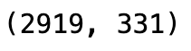

# 实战 Kaggle 比赛：预测房价

实现几个函数来方便下载数据。这里的几个函数都不重要，目的只是为了获得数据。

```python
import hashlib
import os
import tarfile
import zipfile
import requests

DATA_HUB = dict()
DATA_URL = 'http://d2l-data.s3-accelerate.amazonaws.com/'

def download(name, cache_dir=os.path.join('..', 'data')):  
    """下载一个DATA_HUB中的文件，返回本地文件名。"""
    assert name in DATA_HUB, f"{name} 不存在于 {DATA_HUB}."
    url, sha1_hash = DATA_HUB[name]
    os.makedirs(cache_dir, exist_ok=True)
    fname = os.path.join(cache_dir, url.split('/')[-1])
    if os.path.exists(fname):
        sha1 = hashlib.sha1()
        with open(fname, 'rb') as f:
            while True:
                data = f.read(1048576)
                if not data:
                    break
                sha1.update(data)
        if sha1.hexdigest() == sha1_hash:
            return fname
    print(f'正在从{url}下载{fname}...')
    r = requests.get(url, stream=True, verify=True)
    with open(fname, 'wb') as f:
        f.write(r.content)
    return fname

def download_extract(name, folder=None):  
    """下载并解压zip/tar文件。"""
    fname = download(name)
    base_dir = os.path.dirname(fname)
    data_dir, ext = os.path.splitext(fname)
    if ext == '.zip':
        fp = zipfile.ZipFile(fname, 'r')
    elif ext in ('.tar', '.gz'):
        fp = tarfile.open(fname, 'r')
    else:
        assert False, '只有zip/tar文件可以被解压缩。'
    fp.extractall(base_dir)
    return os.path.join(base_dir, folder) if folder else data_dir

def download_all():  
    """下载DATA_HUB中的所有文件。"""
    for name in DATA_HUB:
        download(name)
```

使用pandas读入并处理数据

```python
%matplotlib inline
import numpy as np
import pandas as pd
import torch
from torch import nn
from d2l import torch as d2l

DATA_HUB['kaggle_house_train'] = (  
    DATA_URL + 'kaggle_house_pred_train.csv',
    '585e9cc93e70b39160e7921475f9bcd7d31219ce')

DATA_HUB['kaggle_house_test'] = (  
    DATA_URL + 'kaggle_house_pred_test.csv',
    'fa19780a7b011d9b009e8bff8e99922a8ee2eb90')

train_data = pd.read_csv(download('kaggle_house_train'))
test_data = pd.read_csv(download('kaggle_house_test'))

print(train_data.shape)
print(test_data.shape)
```


test_data由于没有label，比train data少一列。

查看前四个和最后两个特征，以及相应标签（注意train数据的最后一列是标签）

```python
print(train_data.iloc[0:4, [0, 1, 2, 3, -3, -2, -1]])
```

需要注意的是train_data是pandas中的类型，不是数组。需要用iloc属性来访问里面的元素。


在每个样本中，第一个特征是ID， 我们将其从数据集中删除。

```python
all_features = pd.concat((train_data.iloc[:, 1:-1], test_data.iloc[:, 1:]))
# 注意这里将train_data中所有行，从第一列开始到倒数第二列的数据和test_data中所有行，从第一列开始到最后的数据拼接。
```

将所有缺失的值替换为相应特征的平均值。 通过将特征重新缩放到零均值和单位方差来标准化数据

```python
# 通过dtypes属性获得pandas数据中所有元素的dtype，通过[]得到所有dtype不是object的元素的索引
numeric_features = all_features.dtypes[all_features.dtypes != 'object'].index
# 标准化数据
all_features[numeric_features] = all_features[numeric_features].apply(
    lambda x: (x - x.mean()) / (x.std()))
# fillna函数将所有not a number设置为0
all_features[numeric_features] = all_features[numeric_features].fillna(0)
```

处理完数值类的features之后，需要处理离散值。

我们用一次独热编码替换他们。

```python
all_features = pd.get_dummies(all_features, dummy_na=True)
all_features.shape
```



可以看到，处理完离散值之后，数据的维度变多了。之前第二维度为80，现在变成了331.

`get_dummies`是pandas实现ont hot编码的方式。

默认情况下，此参数设置为 dummy_na = False 。在这种情况下，get_dummies 不会为 NA 值创建dummy变量。如果 dummy_na = True ，get_dummies 将创建一个单独的变量，如果输入值丢失则包含 1，否则包含 0


从`pandas`格式中提取NumPy格式，并将其转换为张量表示

```python
n_train = train_data.shape[0] # 获取训练数据的条数
# 从拼接好的所有数据中获取训练数据
train_features = torch.tensor(all_features[:n_train].values,
                              dtype=torch.float32)
# 测试数据同理
test_features = torch.tensor(all_features[n_train:].values,
                             dtype=torch.float32)
# 获取标签
train_labels = torch.tensor(train_data.SalePrice.values.reshape(-1, 1),
                            dtype=torch.float32)
# 注意这里直接使用了csv数据中的某个列名作为属性。如果csv中列名有空格等其他符号，可用["Sale Price"]这种形式。
```

上述工作都是对数据的预处理操作。下面开始训练

训练：

```python
# 定义loss函数
loss = nn.MSELoss()
in_features = train_features.shape[1] # 单个数据的维度

# 定义模型
def get_net():
    net = nn.Sequential(nn.Linear(in_features, 1))
    return net
```

关于误差，我们其实更加关心相对误差$\frac{y-\hat y}{y}$，这是因为如果考虑绝对误差，一个大房子的价格通常比小房子贵很多，例如200w和30w，对大房子预估时，一次loss可能就有30w的大小，而对小房子来说，可能就5w左右。这样来看大房子的loss特别大。所以我们更关心相对误差。

解决这个问题的一种方法是用价格预测的对数来衡量差异。

```python
def log_rmse(net, features, labels):
    clipped_preds = torch.clamp(net(features), 1, float('inf'))
    rmse = torch.sqrt(loss(torch.log(clipped_preds), torch.log(labels)))
    return rmse.item()
```

我们的训练函数将借助Adam优化器

```python
def train(net, train_features, train_labels, test_features, test_labels,
          num_epochs, learning_rate, weight_decay, batch_size):
    train_ls, test_ls = [], []
    train_iter = d2l.load_array((train_features, train_labels), batch_size)
    # 使用Adam优化器
    optimizer = torch.optim.Adam(net.parameters(), lr=learning_rate,
                                 weight_decay=weight_decay)
    for epoch in range(num_epochs):
        for X, y in train_iter:
            optimizer.zero_grad()
            l = loss(net(X), y)
            l.backward()
            optimizer.step()
        train_ls.append(log_rmse(net, train_features, train_labels))
        if test_labels is not None:
            test_ls.append(log_rmse(net, test_features, test_labels))
    return train_ls, test_ls
```

K折交叉验证

```python
# 返回k折交叉验证的数据
def get_k_fold_data(k, i, X, y):
    assert k > 1
    fold_size = X.shape[0] // k
    X_train, y_train = None, None
    for j in range(k):
        idx = slice(j * fold_size, (j + 1) * fold_size)
        X_part, y_part = X[idx, :], y[idx]
        if j == i:
            X_valid, y_valid = X_part, y_part
        elif X_train is None:
            X_train, y_train = X_part, y_part
        else:
            X_train = torch.cat([X_train, X_part], 0) # 在第0维拼接
            y_train = torch.cat([y_train, y_part], 0)
    return X_train, y_train, X_valid, y_valid
```

返回训练和验证误差的平均值

```python
def k_fold(k, X_train, y_train, num_epochs, learning_rate, weight_decay,
           batch_size):
    train_l_sum, valid_l_sum = 0, 0
    for i in range(k):
        data = get_k_fold_data(k, i, X_train, y_train)
        net = get_net()
        train_ls, valid_ls = train(net, *data, num_epochs, learning_rate,
                                   weight_decay, batch_size)
        train_l_sum += train_ls[-1]
        valid_l_sum += valid_ls[-1]
        if i == 0:
            d2l.plot(list(range(1, num_epochs + 1)), [train_ls, valid_ls],
                     xlabel='epoch', ylabel='rmse', xlim=[1, num_epochs],
                     legend=['train', 'valid'], yscale='log')
        print(f'fold {i + 1}, train log rmse {float(train_ls[-1]):f}, '
              f'valid log rmse {float(valid_ls[-1]):f}')
    return train_l_sum / k, valid_l_sum / k
```

模型选择

```python
k, num_epochs, lr, weight_decay, batch_size = 5, 100, 5, 0, 64
train_l, valid_l = k_fold(k, train_features, train_labels, num_epochs, lr,
                          weight_decay, batch_size)
print(f'{k}-折验证: 平均训练log rmse: {float(train_l):f}, '
      f'平均验证log rmse: {float(valid_l):f}')
```


提交你的Kaggle预测

```python
def train_and_pred(train_features, test_feature, train_labels, test_data,
                   num_epochs, lr, weight_decay, batch_size):
    net = get_net()
    train_ls, _ = train(net, train_features, train_labels, None, None,
                        num_epochs, lr, weight_decay, batch_size)
    d2l.plot(np.arange(1, num_epochs + 1), [train_ls], xlabel='epoch',
             ylabel='log rmse', xlim=[1, num_epochs], yscale='log')
    print(f'train log rmse {float(train_ls[-1]):f}')
    preds = net(test_features).detach().numpy()
    test_data['SalePrice'] = pd.Series(preds.reshape(1, -1)[0])
    submission = pd.concat([test_data['Id'], test_data['SalePrice']], axis=1)
    submission.to_csv('submission.csv', index=False)

train_and_pred(train_features, test_features, train_labels, test_data,
               num_epochs, lr, weight_decay, batch_size)
```

