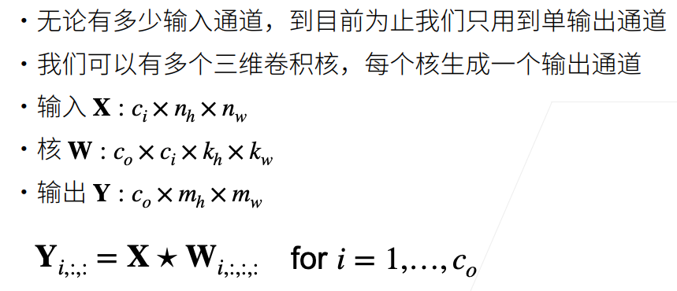
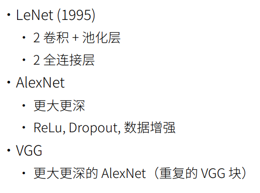

# 卷积神经网络

## 模型构造

`nn.Sequential`定义了一种特殊的Module。

如果我们自己来实现Sequential，则可以这样：

```python
class MySequential(nn.Module):
    def __init__(self, *args):
        super().__init__()
        for block in args:
            self._modules[block] = block

    def forward(self, X):
        for block in self._modules.values():
            X = block(X)
        return X
```

注意上面代码中的`self._modules`，这是一个有顺序的字典。

## 参数

通过`nn.Sequential`构造的网络可以通过数组下标的形式来访问某一个层。

例如，下面是一个单隐藏层的网络：

```python
import torch
from torch import nn

net = nn.Sequential(nn.Linear(4, 8), nn.ReLU(), nn.Linear(8, 1))
X = torch.rand(size=(2, 4))
net(X)
```


访问网络的输出层：

```python
net[2].state_dict()
```


可以看到有两个参数，weight和bias。

可以直接访问weight和bias：

```python
print(type(net[2].bias))
print(net[2].bias)
print(net[2].bias.data) # .data 才返回一个tensor
```


还可以查看梯度：

```python
net[2].weight.grad == None # True 因为还没有训练，梯度都还没被计算
```

### 一次性访问所有参数

```python
print(*[(name, param.shape) for name, param in net[0].named_parameters()]) # 仅访问第一层的参数
print(*[(name, param.shape) for name, param in net.named_parameters()])
```


注意访问整个网络所有参数时，有`0.weight`和`2.weight`，没有`1.weight`，这是因为只有第0层和第2层才有参数，第1层是RELU 激活函数。

可以通过`2.bias`的方式访问第2层网络的bias。

```python
net.state_dict()['2.bias'], net.state_dict()['2.bias'].data
```


代码执行后上面两种方式都是一样的，不知道是不是pytorch版本不同可能行为不同。

### 初始化参数

#### 内置初始化

```python
def init_normal(m):
    if type(m) == nn.Linear:
        nn.init.normal_(m.weight, mean=0, std=0.01)
        nn.init.zeros_(m.bias)

net.apply(init_normal)
net[0].weight.data[0], net[0].bias.data[0]
```


注意这里的`net.apply`方法，他会把传入的函数在net的每一层都执行。

还可以将weight等初始化为常数（通常逻辑上不会这样，这里只是展示可以这样做）：

```python
def init_constant(m):
    if type(m) == nn.Linear:
        nn.init.constant_(m.weight, 1)
        nn.init.zeros_(m.bias)

net.apply(init_constant)
net[0].weight.data[0], net[0].bias.data[0]
```


#### 对某些块应用不同的初始化方法

```python
def xavier(m):
    if type(m) == nn.Linear:
        nn.init.xavier_uniform_(m.weight)

def init_42(m):
    if type(m) == nn.Linear:
        nn.init.constant_(m.weight, 42)

net[0].apply(xavier) # 第0层执行xavier初始化
net[2].apply(init_42)	# 第2层执行init_42初始化
print(net[0].weight.data[0])
print(net[2].weight.data)
```


#### 自定义初始化

```python
def my_init(m):
    if type(m) == nn.Linear:
        print(
            "Init",
            *[(name, param.shape) for name, param in m.named_parameters()][0])
        nn.init.uniform_(m.weight, -10, 10)
        m.weight.data *= m.weight.data.abs() >= 5

net.apply(my_init)
net[0].weight[:2]
```


自定义初始化可以定义任何想要的效果。

还可以直接对net中参数进行修改：、

```python
net[0].weight.data[:] += 1
net[0].weight.data[0, 0] = 42
net[0].weight.data[0]
```


#### 参数绑定（共享层）

网络中某些层需要共享参数，则需要用到参数绑定了。

```python
shared = nn.Linear(8, 8)
net = nn.Sequential(nn.Linear(4, 8), nn.ReLU(), shared, nn.ReLU(), shared,
                    nn.ReLU(), nn.Linear(8, 1))
net(X)
print(net[2].weight.data[0] == net[4].weight.data[0])
net[2].weight.data[0, 0] = 100
print(net[2].weight.data[0] == net[4].weight.data[0])
```


## 从全连接层到卷积

### 平移不变性和局部性

假设我们想从一张图片中找到某个物体。合理的假设是：无论哪种方法找到这个物体，都应该和物体的位置无关。

1. 平移不变性（translation invariance）：不管检测对象出现在图像中的哪个位置，神经网络的前面几层应该对相同的图像区域具有相似的反应，即为“平移不变性”。

2. 局部性（locality）：神经网络的前面几层应该只探索输入图像中的局部区域，而不过度在意图像中相隔较远区域的关系，这就是“局部性”原则。最终，可以聚合这些局部特征，以在整个图像级别进行预测。

### 全连接层的限制

我们想要做猫和狗的分类任务。

如果使用一个不错的相机采集图片，则图片可能为12M像素，而RGB图片有三个通道，总共就有36M元素。

如果只是用一个单隐藏层的神经网络（并且神经元的数量为100），则模型有3.6B参数。

这是一个很庞大的数字。据估计地球上的猫大概有600M只，狗大概有900M只，而模型的参数远大于总共的猫和狗的数量，所以说，用全连接层分类猫和狗还不如直接记忆所有的猫和狗。

并且：


3.6B参数大概有14GB，对显卡的要求也很高。

### 重新考察全连接层

之前在softmax回归中，我们将图片展开为一个向量，权重为2维。现在因为需要保留空间信息，图片应该保持矩阵形式。矩阵中每个元素就是一个像素点的值。

那么现在将输入和输出变形为矩阵（高度，宽度），则权重变换为4-D张量，从`(h,w)`变换为`(h',w')`。
$$
h_{i,j}=\sum_{k,l}w_{i,j,k,l}x_{k,l}=\sum_{a,b}\nu_{i,j,a,b}x_{i+a,j+b}
$$
注意上面公式没有考虑偏移。从w到v的转换只是形式上的转换，$[\mathbf{V}]_{i,j,a,b}=[\mathbf{W}]_{i,j,i+a,j+b}$。 索引a和b通过在正偏移和负偏移之间移动覆盖了整个图像。

使用$[X]_{i,j} $和$[H]_{i,j} $分别表示输入图像和隐藏表示中位置（i,j）处的像素。为了使每个隐藏神经元都能接收到 每个输入像素的信息，我们将参数从权重矩阵（如同我们先前在多层感知机中所做的那样）替换为四阶权重 张量W。

为什么权重矩阵变化为4维：


之前输入仅有1维的时候，假设原来的输入为$x_i$，输出为$h_j$，则对应的权重为$w_{i,j}$，权重的下标分别对应输入的下标和输出的下标。

现在输入为2维张量，输出也为2维张量，则权重下标中需要的输入下标为2个维度，输出下标也为2个维度，则权重应为4维张量。

上图中x的下标使用的是i和j，但公式中x使用的下标是k和l。即反过来了。

#### 平移不变性


平移不变性意味着检测对象在输入$\mathbf X$中的平移，应该仅导致隐藏表示$\mathbf H$中的平移。也就是说，$\mathbf V$实际上不依赖于`(i,j)`的值，即$$[\mathbf{V}]_{i,j,a,b}=[\mathbf{V}]_{a,b}$$。

我们是在使用系数$[\mathbf{V}]_{a,b}$对位置`(i,j)`附近的像素`(i+a,j+a)`进行加权得到$[\mathbf{H}]_{i,j}$。

而$[\mathbf{V}]_{a,b}$的系数比$[\mathbf{V}]_{i,j,a,b}$的系数少很多，因为前者不再依赖于图像中的位置。

#### 局部性

如上所述，为了收集用来训练参数$[\mathbf{H}]_{i,j}$的相关信息，我们不应偏离到距`(i, j)`很远的地方。这意味着在$|a|>\Delta $或$|b|>\Delta $的范围（这里即一个矩形区域）之外，我们可以设置$[\mathbf{V}]_{a,b}=0$。因此，我们可以将$[\mathbf{H}]_{i,j}$重写。


在深度学习研究社区中，$\mathbf V$被称为*卷积核*（convolution kernel）或者*滤波器*（filter），亦或简单地称之为该卷积层的*权重*，通常该权重是可学习的参数。

说实话，原理这里我确实还是不太理解。

## 图像卷积

### 二维交叉相关


卷积是从左到右，从上到下做的。一个演示图为：


注意这是没有填充和步幅的卷积。

output尺寸计算公式：
$$
(n_h-k_h+1)\times(n_w-k_w+1)
$$

* $n_h$和$n_w$分别表示输入的高和宽
* $k_h$和$k_w$分别表示卷积核的高和宽

#### 代码实现

```python
def corr2d(X,K):
    h,w = X.shape
    Y = torch.zeros((h-K.shape[0]+1,w-K.shape[1]+1)) # output shape
    for i in range(Y.shape[0]):
        for j in range(Y.shape[1]):
            Y[i,j] = (X[i:i+K.shape[0],j:j+K.shape[1]]*K).sum() # element-wise multiplication and sum
    return Y
```

代码步骤为：先计算输出的形状，用0填充，然后遍历输出，计算每个元素的值。

遍历输出可以保证切片不会越界，从而不用检查边界。

### 二维卷积层

卷积层对输入和卷积核权重进行互相关运算，并在添加标量偏置之后产生输出。 所以，卷积层中的两个被训练的参数是卷积核权重和标量偏置。 就像我们之前随机初始化全连接层一样，在训练基于卷积层的模型时，我们也随机初始化卷积核权重。


当不考虑填充和步幅的时候，输出的尺寸计算方法为：
$$
(n_h-k_h+1)\times(n_w-k_w+1)
$$


#### 图像中目标的边缘检测

如下是卷积层的一个简单应用：通过找到像素变化的位置，来检测图像中不同颜色的边缘。 首先，我们构造一个6×8像素的黑白图像。中间四列为黑色（0），其余像素为白色（1）。

```python
X = torch.ones((6, 8))
X[:, 2:6] = 0
X
```

```
tensor([[1., 1., 0., 0., 0., 0., 1., 1.],
        [1., 1., 0., 0., 0., 0., 1., 1.],
        [1., 1., 0., 0., 0., 0., 1., 1.],
        [1., 1., 0., 0., 0., 0., 1., 1.],
        [1., 1., 0., 0., 0., 0., 1., 1.],
        [1., 1., 0., 0., 0., 0., 1., 1.]])
```

接下来，我们构造一个高度为1、宽度为2的卷积核`K`。当进行互相关运算时，如果水平相邻的两元素相同，则输出为零，否则输出为非零。

```python
K = torch.tensor([[1.0, -1.0]])
```

现在，我们对参数`X`（输入）和`K`（卷积核）执行互相关运算。 如下所示，输出`Y`中的1代表从白色到黑色的边缘，-1代表从黑色到白色的边缘，其他情况的输出为0。

```python
Y = corr2d(X, K)
Y
```

```
tensor([[ 0.,  1.,  0.,  0.,  0., -1.,  0.],
        [ 0.,  1.,  0.,  0.,  0., -1.,  0.],
        [ 0.,  1.,  0.,  0.,  0., -1.,  0.],
        [ 0.,  1.,  0.,  0.,  0., -1.,  0.],
        [ 0.,  1.,  0.,  0.,  0., -1.,  0.],
        [ 0.,  1.,  0.,  0.,  0., -1.,  0.]])
```

现在我们将输入的二维图像转置，再进行如上的互相关运算。 其输出如下，之前检测到的垂直边缘消失了。 不出所料，这个卷积核`K`只可以检测垂直边缘，无法检测水平边缘。

```python
corr2d(X.t(), K)
```

```
tensor([[0., 0., 0., 0., 0.],
        [0., 0., 0., 0., 0.],
        [0., 0., 0., 0., 0.],
        [0., 0., 0., 0., 0.],
        [0., 0., 0., 0., 0.],
        [0., 0., 0., 0., 0.],
        [0., 0., 0., 0., 0.],
        [0., 0., 0., 0., 0.]])
```


注意：交叉相关和卷积实际上是有区别的：


但由于其对称性，实际使用中我们都是计算的二维交叉相关。

#### 代码实现

基于上面定义的`corr2d`函数实现二维卷积层。在`__init__`构造函数中，将`weight`和`bias`**声明为两个模型参数**。前向传播函数调用`corr2d`函数并添加偏置。

```python
class Conv2D(nn.Module):
    def __init__(self, kernel_size):
        super().__init__()
        self.weight = nn.Parameter(torch.rand(kernel_size))
        self.bias = nn.Parameter(torch.zeros(1))

    def forward(self, x):
        return corr2d(x, self.weight) + self.bias
```

### 一维和三维交叉相关


​	


### 特征映射和感受野

输出的卷积层有时被称为*特征映射*（feature map），因为它可以被视为一个输入映射到下一层的空间维度的转换器。 

在卷积神经网络中，对于某一层的任意元素$x$，其*感受野*（receptive field）是指在前向传播期间可能影响$x$计算的所有元素（来自所有先前层）。


请注意，感受野可能大于输入的实际大小。让我们用上图为例来解释感受野： 给定2×2卷积核，阴影输出元素值19的感受野是输入阴影部分的四个元素。 假设之前输出为$\mathbf Y$，其大小为2×2，现在我们在其后附加一个卷积层，该卷积层以$\mathbf Y$为输入，输出单个元素$z$。 在这种情况下，$\mathbf Y$上的$z$的感受野包括$\mathbf Y$的所有四个元素，而**输入的感受野包括最初所有九个输入元素**。 因此，当一个特征图中的任意元素需要检测更广区域的输入特征时，我们可以构建一个更深的网络。

**感受野（Receptive Field），指的是神经网络中神经元“看到的”输入区域，在卷积神经网络中，feature map上某个元素的计算受输入图像上某个区域的影响，这个区域即该元素的感受野。**

卷积神经网络中，越深层的神经元看到的输入区域越大，如下图所示，kernel size 均为3×3，stride均为1，绿色标记的是Layer2 每个神经元看到的区域，黄色标记的是Layer3看到的区域，具体地，Layer2每个神经元可看到Layer1上 3×3大小的区域，Layer3每个神经元看到Layer2上 3×3 大小的区域，该区域可以又看到Layer1上 5×5大小的区域。


所以，**感受野是个相对概念，某层feature map上的元素看到前面不同层上的区域范围是不同的，通常在不特殊指定的情况下，感受野指的是看到输入图像上的区域。**

## 填充和步幅

假设以下情景： 有时，在应用了连续的卷积之后，我们最终得到的输出远小于输入大小。这是由于卷积核的宽度和高度通常大于1所导致的。比如，一个240×240像素的图像，经过10层5×5的卷积后，将减少到200×200像素。如此一来，**原始图像的边界丢失了许多有用信息**。而*填充*是解决此问题最有效的方法； 有时，我们可能希望大幅降低图像的宽度和高度。例如，如果我们发现原始的输入分辨率十分冗余。*步幅*则可以在这类情况下提供帮助。

### 填充 padding

在应用多层卷积时，我们常常丢失边缘像素。由于我们通常使用小卷积核，因此对于任何单个卷积，我们可能只会丢失几个像素。 但随着我们应用许多连续卷积层，累积丢失的像素数就多了。 解决这个问题的简单方法即为*填充*（padding）：在输入图像的边界填充元素（通常填充元素是0）。

给定（32x32）的输入图像，应用较大的（5x5）大小的卷积核，深度达到第7层输出大小为（4x4）。

卷积核大小为5x5时，每次卷积高度和宽度都减少4（h-5+1为最后的尺寸）。

当然，更大的卷积核可以更快的减小输出大小。


n表示原图像，k表示卷积核。

如果我们想要做很深的网络，则卷积后尺寸不能减小的太快。

填充可以控制输出的尺寸。


在原张量的上下左右都做填充（用0填充，当然也有其他的方式）。

新的输出大小为4x4，比原来的大小3x3还更大。

卷积动画演示：


通常，如果我们添加$p_h$行填充（大约一半在顶部，一半在底部）和$p_w$列填充（左侧大约一半，右侧一半），则输出形状将为


不考虑步幅，仅考虑填充时输出尺寸为：
$$
(n_h-k_h+p_h+1)\times(n_w-k_w+p_w+1)
$$

若取$p_h = k_h -1, p_w = k_w-1$，则输出形状为$n_h \times n_w$，即卷积后尺寸不变。这样的话做很深的网络也是可以的。

>  注意⚠️：$p_h$和$p_w$是包含所有的填充的大小，例如上下各填充一行，则$p_h=2$，宽度也是同理。

假设$k_h$是奇数，我们将在高度的两侧填充$k_h / 2$行。 如果$k_h$是偶数，则一种可能性是在输入顶部填充$\lceil k_h/2 \rceil $行，在底部填充$\lfloor k_h/2 \rfloor$行。同理，我们填充宽度的两侧。

假设$k_h=3,k_w=3$，则$p_h=3-1=2,p_w=2$，即上下和左右分别总共的填充为2，则上下各填充1行，左右各填充一列。

假设$k_h=4,k_w=4$，则$p_h=4-1=3,p_w=3$，不能整除，则上侧填充2行，下侧填充1行，左右侧同理。

卷积神经网络中卷积核的高度和宽度通常为奇数，例如1、3、5或7。 选择奇数的好处是，保持空间维度的同时，我们可以在顶部和底部填充相同数量的行，在左侧和右侧填充相同数量的列。

### 步幅 stride

在计算互相关时，卷积窗口从输入张量的左上角开始，向下、向右滑动。 在前面的例子中，我们默认每次滑动一个元素。 但是，有时候为了高效计算或是缩减采样次数，卷积窗口可以跳过中间位置，每次滑动多个元素。

填充减小的输出大小与层数线性相关。

给定输入大小244x244，在使用5x5卷积核的情况下，需要55层将输出降低到4x4（每层降低4）。

可见，要大量计算才能得到较小的输出。

步幅可以将线性相关变成指数级别。


下面是带有步幅的卷积的动画演示：


完整的计算输出尺寸的公式就为：
$$
\lfloor \frac{(n_h-k_h+p_h+s_h)}{s_h} \rfloor\times\lfloor \frac{(n_w-k_w+p_w+s_w)}{s_w} \rfloor
$$
当没有设置stride这个参数时，其实stride=1，当时求输出尺寸的公式为：
$$
\lfloor (n_h - k_h + p_h + 1) \rfloor \times \lfloor (n_w - k_w + p_w + 1) \rfloor
$$
这里的1其实就是stride，除以1被省略了。完整的形式如下
$$
\lfloor \frac{(n_h - k_h + p_h + 1)}{1} \rfloor \times \lfloor \frac{(n_w - k_w + p_w + 1)}{1} \rfloor
$$


## 多个输入和输出通道

我们之前都是使用的灰度图像，这样图像就是一个2d的张量，卷积核也是2d的。但彩色图像有三个通道，转化为灰度图像会丢失信息。


### 多输入单输出通道

当输入包含多个通道时，需要构造一个与输入数据具有相同输入通道数的卷积核，以便与输入数据进行互相关运算。

每个通道都有一个卷积核，结果是所有通道卷积结果的和（输出结果是单通道的）。


原数据和卷积核的通道数相同，并且卷积是在X和W对应的通道上进行的。

另一张图来实例整个过程：


即：由于只有一个卷积核，因此卷积后只输出单通道的卷积结果（黄色的块状部分表示一个卷积核，黄色块状是由三个通道堆叠在一起表示的，每一个黄色通道与输入卷积通道分别进行卷积，也就是channel数量要保持一致，图片组这里只是堆叠放在一起表示而已）。

### 多输入多输出通道



图示：


感觉是不同的filter（卷积核）提取不同的特征。

多通道卷积过程，例如输入一张三通道的图片，这时有多个卷积核进行卷积，并且每个卷积核都有三通道，分别对这张输入图片的三通道进行卷积操作。每个卷积核，分别输出三个通道，这三个通道进行求和，得到一个featuremap，有多少个卷积核，就有多少个featuremap。


每个输出通道可以识别特定的模式，然后这些输出作为下一层的输入，下一层可以将每个通道的模式读取，然后组合起来，就能得到一个组合的模式识别。


### 1x1 卷积层

1×1卷积，即$k_h=k_w=1$，看起来似乎没有多大意义。 毕竟，卷积的本质是有效提取相邻像素间的相关特征，而1×1卷积显然没有此作用。 尽管如此，1×1仍然十分流行，经常包含在复杂深层网络的设计中。

因为使用了最小窗口，1×1卷积失去了卷积层的特有能力——在高度和宽度维度上，识别相邻元素间相互作用的能力。 其实1×1卷积的唯一计算发生在通道上（即不识别空间信息，只识别通道信息）。

下图展示了使用1×1卷积核与3个输入通道和2个输出通道的互相关计算。 这里输入和输出具有相同的高度和宽度，输出中的每个元素都是从输入图像中同一位置的元素的线性组合（1x1卷积核只有一个值，共3个通道，共3个值，这些值作为系数分别和对应通道的元素相乘，然后加起来）。 我们可以将1×1卷积层看作在每个像素位置应用的全连接层，以$c_i$个输入值转换为$c_o$个输出值（卷积核的值就是权重，input中每个通道的像素就是feature）。 因为这仍然是一个卷积层，所以跨像素的权重是一致的。 同时，1×1卷积层需要的权重维度$c_o \times c_i$，再额外加上一个偏置。


小结：


⚠️：1x1卷积层可以用于调节网络层的通道数量

## 汇聚层/池化层

通常当我们处理图像时，我们希望逐渐降低隐藏表示的空间分辨率、聚集信息，这样随着我们在神经网络中层叠的上升，每个神经元对其敏感的感受野（输入）就越大。

而我们的机器学习任务通常会跟全局图像的问题有关（例如，“图像是否包含一只猫呢？”），所以我们最后一层的神经元应该对整个输入的全局敏感。通过逐渐聚合信息，生成越来越粗糙的映射，最终实现学习全局表示的目标，同时将卷积图层的所有优势保留在中间层。

*汇聚*（pooling）层具有双重目的：降低卷积层对位置的敏感性，同时降低对空间降采样表示的敏感性。


构造尺寸为1x2的卷积核，具体内容为`[1,-1]`，不设置padding和stride，使用默认的无填充和步幅1。

对X做卷积，则结果为Y。

与卷积层类似，汇聚层运算符由一个固定形状的窗口组成，该窗口根据其步幅大小在输入的所有区域上滑动，为固定形状窗口（有时称为*汇聚窗口*）遍历的每个位置计算一个输出。 然而，不同于卷积层中的输入与卷积核之间的互相关计算，汇聚层不包含参数。 相反，**池运算是确定性的**，我们通常计算汇聚窗口中所有元素的最大值或平均值。这些操作分别称为*最大汇聚层*（maximum pooling）和*平均汇聚层*（average pooling）。

### 二维最大池化


汇聚窗口形状为p×q的汇聚层称为p×q汇聚层，汇聚操作称为p×q汇聚。

上面的即2x2汇聚层，进行了2x2最大汇聚。

### 填充，步幅和多个通道


### 平均池化层


### 代码实现

不考虑填充和步幅：

```python
def pool2d(X,pool_size, mode='max'):
    p_h, p_w = pool_size
    Y = torch.zeros((X.shape[0] - p_h + 1, X.shape[1] - p_w + 1))
    for i in range(Y.shape[0]):
        for j in range(Y.shape[1]):
            if mode == 'max':
                Y[i,j] = X[i:i+p_h, j:j+p_w].max()
            elif mode == 'avg':
                Y[i,j] = X[i:i+p_h, j:j+p_w].mean()
    return Y
```

使用简单代码来验证：

```python
X = torch.tensor([[0.0, 1.0, 2.0], [3.0, 4.0, 5.0], [6.0, 7.0, 8.0]])
print(X)
pool2d(X, (2, 2))
```

输出：

```
tensor([[0., 1., 2.],
        [3., 4., 5.],
        [6., 7., 8.]])
tensor([[4., 5.],
        [7., 8.]])
```

### 填充和步幅

与卷积层一样，汇聚层也可以改变输出形状。和以前一样，我们可以通过填充和步幅以获得所需的输出形状。 下面，我们用深度学习框架中内置的二维最大汇聚层，来演示汇聚层中填充和步幅的使用。 我们首先构造了一个输入张量`X`，它有四个维度，其中样本数和通道数都是1。

```python
X = torch.arange(16, dtype=torch.float32).reshape((1, 1, 4, 4))
X
```

```
tensor([[[[ 0.,  1.,  2.,  3.],
          [ 4.,  5.,  6.,  7.],
          [ 8.,  9., 10., 11.],
          [12., 13., 14., 15.]]]])
```

默认情况下，深度学习框架中的**步幅与汇聚窗口的大小相同**。 因此，如果我们使用形状为`(3, 3)`的汇聚窗口，那么默认情况下，我们得到的步幅形状为`(3, 3)`。

```python
pool2d = nn.MaxPool2d(3)
pool2d(X) # tensor([[[[10.]]]])
```

填充和步幅可以手动设定。

```python
pool2d = nn.MaxPool2d(3, padding=1, stride=2)
pool2d(X)
```

```
tensor([[[[ 5.,  7.],
          [13., 15.]]]])
```

当然，我们可以设定一个任意大小的矩形汇聚窗口，并分别设定填充和步幅的高度和宽度。

```python
pool2d = nn.MaxPool2d((2, 3), stride=(2, 3), padding=(0, 1))
pool2d(X)
```

```
tensor([[[[ 5.,  7.],
          [13., 15.]]]])
```

### 多通道

在处理多通道输入数据时，汇聚层**在每个输入通道上单独运算**，而不是像卷积层一样在通道上对输入进行汇总。 这意味着**汇聚层的输出通道数与输入通道数相同**。 下面，我们将在通道维度上连结张量`X`和`X + 1`，以构建具有2个通道的输入。

```python
X = torch.cat((X, X + 1), 1)
X
```

```
tensor([[[[ 0.,  1.,  2.,  3.],
          [ 4.,  5.,  6.,  7.],
          [ 8.,  9., 10., 11.],
          [12., 13., 14., 15.]],

         [[ 1.,  2.,  3.,  4.],
          [ 5.,  6.,  7.,  8.],
          [ 9., 10., 11., 12.],
          [13., 14., 15., 16.]]]])
```

如下所示，汇聚后输出通道的数量仍然是2。

```python
pool2d = nn.MaxPool2d(3, padding=1, stride=2)
pool2d(X)
```

```
tensor([[[[ 5.,  7.],
          [13., 15.]],

         [[ 6.,  8.],
          [14., 16.]]]])
```


## 卷积神经网络（LeNet）

本节将介绍LeNet，它是最早发布的卷积神经网络之一，因其在计算机视觉任务中的高效性能而受到广泛关注。 这个模型是由AT&T贝尔实验室的研究员Yann LeCun在1989年提出的（并以其命名），目的是识别图像 ([LeCun *et al.*, 1998](https://zh-v2.d2l.ai/chapter_references/zreferences.html#id90))中的手写数字。 当时，Yann LeCun发表了第一篇通过反向传播成功训练卷积神经网络的研究，这项工作代表了十多年来神经网络研究开发的成果。

总体来看，LeNet（LeNet-5）由两个部分组成：

- 卷积编码器：由两个卷积层组成;
- 全连接层密集块：由三个全连接层组成。

LeNet总体架构：


输入图像尺寸为32x32，

* 第一层卷积层的卷积核的大小为5x5（32-5+1=28），并且共有6个卷积核，所以最后得到的feature map为6通道
* 第二层为汇聚层（池化层），核大小为2x2，没有padding，stride=2（尺寸减半）
* 第三层为卷积层，卷积核的大小仍然为5x5. 通道数增加为16
* 第四层为汇聚层，核大小2x2，没有padding，stride=2
* 第五层为全连接层，输入大小应为16x5x5，输出大小为120
* 第六层为全连接层，输入大小120，输出大小84
* 第七层为全连接层（实际为高斯，但现在不咋用，用全连接替代即可），输入大小84，输出为10

LeNet是为了识别手写数字，做的是分类任务，所以最后是10个类别。


通常的形状转变过程都是数据的尺寸变小，然而通道数增加。不同通道提取不同的特征。

### LeNet代码实现

```python
import torch
from torch import nn
from d2l import torch as d2l

net = nn.Sequential(
  	# 这里用的图片的原始尺寸就是28x28
    nn.Conv2d(1, 6, kernel_size=5, padding=2), nn.Sigmoid(),
    nn.AvgPool2d(kernel_size=2, stride=2),
    nn.Conv2d(6, 16, kernel_size=5), nn.Sigmoid(),
    nn.AvgPool2d(kernel_size=2, stride=2),
    nn.Flatten(),
    nn.Linear(16 * 5 * 5, 120), nn.Sigmoid(),
    nn.Linear(120, 84), nn.Sigmoid(),
    nn.Linear(84, 10))
```

我们对原始模型做了一点小改动，去掉了最后一层的高斯激活。除此之外，这个网络与最初的LeNet-5一致。

下面，我们将一个大小为28×28的单通道（黑白）图像通过LeNet。通过在每一层打印输出的形状，我们可以检查模型，以确保其操作与我们期望的下图一致。


```python
X = torch.rand(size=(1, 1, 28, 28), dtype=torch.float32)
for layer in net:
    X = layer(X)
    print(layer.__class__.__name__,'output shape: \t',X.shape)
```

```
Conv2d output shape:         torch.Size([1, 6, 28, 28])
Sigmoid output shape:        torch.Size([1, 6, 28, 28])
AvgPool2d output shape:      torch.Size([1, 6, 14, 14])
Conv2d output shape:         torch.Size([1, 16, 10, 10])
Sigmoid output shape:        torch.Size([1, 16, 10, 10])
AvgPool2d output shape:      torch.Size([1, 16, 5, 5])
Flatten output shape:        torch.Size([1, 400])
Linear output shape:         torch.Size([1, 120])
Sigmoid output shape:        torch.Size([1, 120])
Linear output shape:         torch.Size([1, 84])
Sigmoid output shape:        torch.Size([1, 84])
Linear output shape:         torch.Size([1, 10])
```

请注意，在整个卷积块中，与上一层相比，每一层特征的高度和宽度都减小了。 第一个卷积层使用2个像素的填充，来补偿5×5卷积核导致的特征减少。 相反，第二个卷积层没有填充，因此高度和宽度都减少了4个像素。 随着层叠的上升，通道的数量从输入时的1个，增加到第一个卷积层之后的6个，再到第二个卷积层之后的16个。 同时，每个汇聚层的高度和宽度都减半。最后，每个全连接层减少维数，最终输出一个维数与结果分类数相匹配的输出。


## 深度卷积神经网络AlexNet

AlexNet赢得2012年ImageNet竞赛。

AlexNet其实是更深更大的LeNet。

AlexNet的主要改进：

* 丢弃法（模型做正则，减少模型复杂度）
* 使用的激活函数不再是sigmoid，而是ReLU
* 池化层由AvgPooling变化为MaxPooling

AlexNet导致了计算机视觉方法论的改变。

在之前，计算机视觉的做法是人工特征提取，再通过SVM做分类。现在是通过CNN学习特征，然后用softmax回归做分类。


### AlexNet架构和LeNet的对比

前两层：


LeNet输入的图片大小为32x32，且为灰度图片，而AlexNet使用的是ImageNet的图片，这些图片都是3d的，并且尺寸为224x224.

所以使用了更大尺寸的卷积核，使用stride为4，经过此层后尺寸变为原来的四分之一。

池化层的核尺寸变为3x3，步幅为2.

LeNet的后两层也是卷积层+池化层，AlexNet再次基础上还增加三个新的卷积层以及一个池化层：


注意第三层和第四层的池化层的尺寸也是修改过的。

最后的几个全连接层：


注意这里的第一个全连接层和第二个全连接层隐藏数据的尺寸没有发生变化，但第二个全连接层不能被删除，这会导致模型性能的下降（为啥？）

### 更多细节


完整架构展示：


复杂度对比：


总结：


### 代码实现

#### 模型定义

注意模型输入的图片尺寸为：3x224x224

```python
net = nn.Sequential(
    # 这里使用一个11*11的更大窗口来捕捉对象。
    # 同时，步幅为4，以减少输出的高度和宽度。
    # 另外，输出通道的数目远大于LeNet
    nn.Conv2d(1, 96, kernel_size=11, stride=4, padding=1), nn.ReLU(),
    nn.MaxPool2d(kernel_size=3, stride=2),
    # 减小卷积窗口，使用填充为2来使得输入与输出的高和宽一致，且增大输出通道数
    nn.Conv2d(96, 256, kernel_size=5, padding=2), nn.ReLU(),
    nn.MaxPool2d(kernel_size=3, stride=2),
    # 使用三个连续的卷积层和较小的卷积窗口。
    # 除了最后的卷积层，输出通道的数量进一步增加。
    # 在前两个卷积层之后，汇聚层不用于减少输入的高度和宽度
    nn.Conv2d(256, 384, kernel_size=3, padding=1), nn.ReLU(),
    nn.Conv2d(384, 384, kernel_size=3, padding=1), nn.ReLU(),
    nn.Conv2d(384, 256, kernel_size=3, padding=1), nn.ReLU(),
    nn.MaxPool2d(kernel_size=3, stride=2),
    nn.Flatten(),
    # 这里，全连接层的输出数量是LeNet中的好几倍。使用dropout层来减轻过拟合
    nn.Linear(6400, 4096), nn.ReLU(),
    nn.Dropout(p=0.5),
    nn.Linear(4096, 4096), nn.ReLU(),
    nn.Dropout(p=0.5),
    # 最后是输出层。由于这里使用Fashion-MNIST，所以用类别数为10，而非论文中的1000
    nn.Linear(4096, 10))
```

使用简单数据验证模型是否正确：

```python
X = torch.rand(1, 1, 224, 224)
for layer in net:
    X = layer(X)
    print(layer.__class__.__name__,'output shape:\t',X.shape)
```


下面代码使用刚才定义的AlexNet对Fashion-Mnist数据集进行分类任务。

```python
import torch
from torch import nn
import torchvision
from torchvision.transforms import transforms
from torch.utils.data import DataLoader
from torch.utils.tensorboard import SummaryWriter

net = nn.Sequential(
    # 这里使用一个11*11的更大窗口来捕捉对象。
    # 同时，步幅为4，以减少输出的高度和宽度。
    # 另外，输出通道的数目远大于LeNet
    nn.Conv2d(1, 96, kernel_size=11, stride=4, padding=1), nn.ReLU(),
    nn.MaxPool2d(kernel_size=3, stride=2),
    # 减小卷积窗口，使用填充为2来使得输入与输出的高和宽一致，且增大输出通道数
    nn.Conv2d(96, 256, kernel_size=5, padding=2), nn.ReLU(),
    nn.MaxPool2d(kernel_size=3, stride=2),
    # 使用三个连续的卷积层和较小的卷积窗口。
    # 除了最后的卷积层，输出通道的数量进一步增加。
    # 在前两个卷积层之后，汇聚层不用于减少输入的高度和宽度
    nn.Conv2d(256, 384, kernel_size=3, padding=1), nn.ReLU(),
    nn.Conv2d(384, 384, kernel_size=3, padding=1), nn.ReLU(),
    nn.Conv2d(384, 256, kernel_size=3, padding=1), nn.ReLU(),
    nn.MaxPool2d(kernel_size=3, stride=2),
    nn.Flatten(),
    # 这里，全连接层的输出数量是LeNet中的好几倍。使用dropout层来减轻过拟合
    nn.Linear(6400, 4096), nn.ReLU(),
    nn.Dropout(p=0.5),
    nn.Linear(4096, 4096), nn.ReLU(),
    nn.Dropout(p=0.5),
    # 最后是输出层。由于这里使用Fashion-MNIST，所以用类别数为10，而非论文中的1000
    nn.Linear(4096, 10))


# 注意FashionMNIST的图片尺寸为28*28，需要将其Resize
trans_compose = transforms.Compose([transforms.Resize(224),transforms.ToTensor()]) 

train_data = torchvision.datasets.FashionMNIST(root='./Datasets/FashionMNIST', train=True, 
                                               transform=trans_compose, download=True)
test_data = torchvision.datasets.FashionMNIST(root='./Datasets/FashionMNIST', train=False,
                                                transform=trans_compose, download=True)

writer = SummaryWriter('./logs_alexnet')

num_workers = 4

# 记得加上num_workers参数，可以多线程读入数据，训练更快（不设置的话读取数据成了瓶颈）
train_dataloader = DataLoader(train_data,batch_size=128,shuffle=True,num_workers=num_workers) 
test_dataloader = DataLoader(test_data,batch_size=128,shuffle=False,num_workers=num_workers)

lr = 0.01
num_epochs = 10
loss_fn = nn.CrossEntropyLoss()
optimizer = torch.optim.SGD(net.parameters(), lr=lr)

total_train_step = 0
total_test_step = 0

device = torch.device('cuda' if torch.cuda.is_available() else 'cpu')

# 初始化权重
def xavier_init_weights(m):
    if type(m) == nn.Linear or type(m) == nn.Conv2d:
        nn.init.xavier_uniform_(m.weight)
net.apply(xavier_init_weights)

net = net.to(device)
loss_fn = loss_fn.to(device)

for epoch in range(num_epochs):
    print(f'Epoch {epoch+1}\n-------------------------------')
    net.train()
    for X, y in train_dataloader:
        X, y = X.to(device), y.to(device)
        y_hat = net(X)
        loss = loss_fn(y_hat, y)
        optimizer.zero_grad()
        loss.backward()
        optimizer.step()

        total_train_step += 1

        if total_train_step % 100 == 0:
            print(f"Train Step {total_train_step}, Loss: {loss.item()}")
            writer.add_scalar('train_loss',loss.item(),total_train_step)
            print('trained on ',device)
            
    net.eval()
    total_test_loss = 0
    total_accuracy = 0

    with torch.no_grad():
        for data in test_dataloader:
            imgs, targets = data
            imgs, targets = imgs.to(device),targets.to(device)
            outputs = net(imgs)

            loss = loss_fn(outputs,targets)
            total_test_loss += loss.item()

            accuracy = (outputs.argmax(1) == targets).sum()
            total_accuracy += accuracy

            total_test_step += 1
    
    print(f"Test Loss: {total_test_loss/len(test_dataloader)}")
    print(f"Test Accuracy: {total_accuracy/len(test_data)}")
    writer.add_scalar('test_loss',total_test_loss/len(test_dataloader),total_test_step)
    writer.add_scalar('test_accuracy',total_accuracy/len(test_data),total_test_step)
    total_test_step += 1

writer.close()
```

## 使用块的网络 VGG


VGG结构比AlexNet更规整。

经典卷积神经网络的基本组成部分是下面的这个序列：

1. 带填充以保持分辨率的卷积层；
2. 非线性激活函数，如ReLU；
3. 汇聚层，如最大汇聚层。

而一个VGG块与之类似，由一系列卷积层组成，后面再加上用于空间下采样的最大汇聚层。

AlexNet可以看作更深更大的LeNet，那么是否可以更深呢？

我们可以在AlexNet的结构上做选择，然后堆叠更多这样的结构。

* 更多的全连接层（参数量太多，太贵）
* 更多的卷积层
* 将卷积层组合成块。

### VGG 块

AlexNet使用的卷积核的尺寸是5x5，VGG块使用的卷积核则为3x3。这是做过实验后选择的结果。实验结果表明，相同参数量的情况下，5x5尺寸卷积核的网络浅些，3x3尺寸卷积核的网络深些，并且3x3尺寸卷积核的网络效果更好。


### VGG 架构

VGG架构很简单，可以由多个VGG块堆叠，然后最后后结全连接层。前面vgg块不同的堆叠次数得到不同的vgg架构，例如VGG-16和VGG-19. 注意VGG后面的数字表示卷积层数+全连接层数。


### 进度




### 和AlexNet的对比

与AlexNet、LeNet一样，VGG网络可以分为两部分：第一部分主要由卷积层和汇聚层组成，第二部分由全连接层组成。


### 总结


### 代码实现

#### 模型定义

```python
# num_convs: 卷积层数, in_channels: 输入通道数, out_channels: 输出通道数
def vgg_block(num_convs, in_channels, out_channels): 
    layers = []

    for _ in range(num_convs):
        layers.append(nn.Conv2d(in_channels, out_channels, kernel_size=3, padding=1))
        layers.append(nn.ReLU())
        in_channels = out_channels # 下一层的输入通道数等于上一层的输出通道数
    layers.append(nn.MaxPool2d(kernel_size=2, stride=2)) # 池化层
    return nn.Sequential(*layers)
  
# conv_arch结构：
# 例子： conv_arch = ((1, 64), (1, 128), (2, 256), (2, 512), (2, 512))  
# 每个元组代表一个VGG块，元组中的第一个元素代表卷积层数，第二个元素代表输出通道数
def vgg(conv_arch):
    conv_blks = [] # 保存所有的VGG块
    in_channels = 1 # 输入通道数 因为我们用的是Fashion-MNIST数据集，所以输入通道数为1（灰度图像）

    for (num_convs, out_channels) in conv_arch: # 逐个VGG块构建
        conv_blks.append(vgg_block(num_convs, in_channels, out_channels))
        in_channels = out_channels
             
    return nn.Sequential(
        *conv_blks, #vgg块
        nn.Flatten(),
        # 全连接层部分
        nn.Linear(out_channels*7*7, 4096), nn.ReLU(), nn.Dropout(0.5),
        nn.Linear(4096, 4096), nn.ReLU(), nn.Dropout(0.5),
        nn.Linear(4096, 10) # fashion-MNIST数据集有10个类别
    )
```

#### 完整代码实现

```python
import torch
from torch import nn
import torchvision
from torchvision.transforms import transforms
from torch.utils.data import DataLoader
from torch.utils.tensorboard import SummaryWriter


def vgg_block(num_convs, in_channels, out_channels): # num_convs: 卷积层数, in_channels: 输入通道数, out_channels: 输出通道数
    layers = []

    for _ in range(num_convs):
        layers.append(nn.Conv2d(in_channels, out_channels, kernel_size=3, padding=1))
        layers.append(nn.ReLU())
        in_channels = out_channels # 下一层的输入通道数等于上一层的输出通道数
    layers.append(nn.MaxPool2d(kernel_size=2, stride=2)) # 池化层
    return nn.Sequential(*layers)


def vgg(conv_arch):
    conv_blks = [] # 保存所有的VGG块
    in_channels = 1 # 输入通道数 因为我们用的是Fashion-MNIST数据集，所以输入通道数为1（灰度图像）

    for (num_convs, out_channels) in conv_arch: # 逐个VGG块构建
        conv_blks.append(vgg_block(num_convs, in_channels, out_channels))
        in_channels = out_channels
            
    
    return nn.Sequential(
        *conv_blks, #vgg块

        nn.Flatten(),

        # 全连接层部分
        nn.Linear(out_channels*7*7, 4096), nn.ReLU(), nn.Dropout(0.5),
        nn.Linear(4096, 4096), nn.ReLU(), nn.Dropout(0.5),
        nn.Linear(4096, 10) # fashion-MNIST数据集有10个类别
    )


device = torch.device('cuda' if torch.cuda.is_available() else 'cpu')
    
conv_arch = ((1, 64), (1, 128), (2, 256), (2, 512), (2, 512)) # 每个元组代表一个VGG块，元组中的第一个元素代表卷积层数，第二个元素代表输出通道数


trans_compose = transforms.Compose([transforms.Resize(224), transforms.ToTensor()])
train_data = torchvision.datasets.FashionMNIST(root='./Datasets/FashionMNIST', train=True, transform=trans_compose, download=True)
test_data = torchvision.datasets.FashionMNIST(root='./Datasets/FashionMNIST', train=False, transform=trans_compose, download=True)


num_workers = 4
batch_size = 128
lr = 0.05
num_epochs = 10

train_dataloader = DataLoader(train_data, batch_size=batch_size, shuffle=True, num_workers=num_workers)
test_dataloader = DataLoader(test_data, batch_size=batch_size, shuffle=False, num_workers=num_workers)

ratio = 4
small_conv_arch = [(pair[0], pair[1] // ratio) for pair in conv_arch] # 将输出通道数减小为原来的1/4 以减少计算量

net = vgg(small_conv_arch)

# 别忘了对网络参数初始化，不初始化的话（默认的随机初始化），Loss可能要到几个epoch后才下降。
def init_weights(m):
        if type(m) == nn.Linear or type(m) == nn.Conv2d:
            nn.init.xavier_uniform_(m.weight)
net.apply(init_weights)

loss_fn = nn.CrossEntropyLoss()
optimizer = torch.optim.SGD(net.parameters(), lr=lr) # 优化器定义一定要放到net之后

writer = SummaryWriter('./logs_vgg')


net = net.to(device)
loss_fn = loss_fn.to(device)

total_train_step = 0
total_test_step = 0

for epoch in range(num_epochs):
    print(f'Epoch {epoch+1}\n-------------------------------')
    net.train()
    for X, y in train_dataloader:
        X, y = X.to(device), y.to(device)
        optimizer.zero_grad()
        y_pred = net(X)
        loss = loss_fn(y_pred, y)
        loss.backward()
        optimizer.step()
        total_train_step += 1

        if total_train_step % 100 == 0:
            print(f"Train Step {total_train_step}, Loss: {loss.item()}")
            writer.add_scalar('train_loss',loss.item(),total_train_step)
            print('trained on ',device)

    total_test_loss = 0
    total_accuracy = 0
    net.eval()
    with torch.no_grad():
        for data in test_dataloader:
            imgs, targets = data
            imgs, targets = imgs.to(device),targets.to(device)
            outputs = net(imgs)

            loss = loss_fn(outputs,targets)
            total_test_loss += loss.item()

            accuracy = (outputs.argmax(1) == targets).sum()
            total_accuracy += accuracy

            total_test_step += 1
    
    print(f"Test Loss: {total_test_loss/len(test_dataloader)}")
    print(f"Test Accuracy: {total_accuracy/len(test_data)}")
    writer.add_scalar('test_loss',total_test_loss/len(test_dataloader),total_test_step)
    writer.add_scalar('test_accuracy',total_accuracy/len(test_data),total_test_step)
    total_test_step += 1

writer.close() 
```

## 网络中的网络NiN


LeNet、AlexNet和VGG都有一个共同的设计模式：通过一系列的卷积层与汇聚层来提取空间结构特征；然后通过全连接层对特征的表征进行处理。 AlexNet和VGG对LeNet的改进主要在于如何扩大和加深这两个模块。 或者，可以想象在这个过程的早期使用全连接层。然而，如果使用了全连接层，可能会完全放弃表征的空间结构。 *网络中的网络*（*NiN*）提供了一个非常简单的解决方案：在每个像素的通道上分别使用多层感知机 。

### 全连接层的问题

之前学习过的网络LeNet、AlexNet以及VGG中，卷积层的参数是较少的。

如果是多输入多输出通道的情况，则卷积层参数的个数为：$c_i \times c_o \times k^2$，其中，$c_i, c_o$分别为输入通道数以及输出通道数，k是卷积核的尺寸（默认是卷积核高宽相同）。

然而这些模型的参数大部分都是最后的基层全连接的参数。


### NiN块


NiN块以一个普通卷积层开始，后面是两个1×1的卷积层。这两个1×1卷积层充当带有ReLU激活函数的逐像素全连接层。 第一层的卷积窗口形状通常由用户设置。 随后的卷积窗口形状固定为1×1。

两个1x1卷积层步幅为1，没有填充，故这两个层不会改变数据的尺寸。他们两个层起到全连接层的作用。

### NiN架构

NiN没有全连接层。

交替使用NiN块和步幅为2的最大池化层，逐步减小高宽和增大通道数。

最后使用全局平均汇聚层得到输出（该层的输入通道数就是分类的类别数）。

最初的NiN网络是在AlexNet后不久提出的，显然从中得到了一些启示。 NiN使用窗口形状为11×11、5×5和3×3的卷积层，输出通道数量与AlexNet中的相同。 每个NiN块后有一个最大汇聚层，汇聚窗口形状为3×3，步幅为2。

NiN和AlexNet之间的一个显著区别是NiN完全取消了全连接层。 相反，NiN使用一个NiN块，其输出通道数等于标签类别的数量。最后放一个*全局平均汇聚层*（global average pooling layer），生成一个对数几率 （logits）。NiN设计的一个优点是，它显著减少了模型所需参数的数量。然而，在实践中，这种设计有时会增加训练模型的时间。


### 总结


### 代码实现

#### 模型结构

```python
def nin_block(in_channels, out_channels, kernel_size, stride, padding):
    return nn.Sequential(
        nn.Conv2d(in_channels,out_channels, kernel_size, stride, padding), nn.ReLU(),
        nn.Conv2d(out_channels, out_channels, kernel_size=1), nn.ReLU(),
        nn.Conv2d(out_channels, out_channels, kernel_size=1), nn.ReLU()
    )


net = nn.Sequential(
    nin_block(1, 96, kernel_size=11, stride=4, padding=0),
    nn.MaxPool2d(3, stride=2),
    nin_block(96, 256, kernel_size=5, stride=1, padding=2),
    nn.MaxPool2d(3, stride=2),
    nin_block(256, 384, kernel_size=3, stride=1, padding=1),
    nn.MaxPool2d(3, stride=2),
    nn.Dropout(0.5), # 添加了dropout层
    nin_block(384, 10, kernel_size=3, stride=1, padding=1),
    nn.AdaptiveAvgPool2d((1,1)), # 全局平均池化层
    nn.Flatten() # 将四维的输出转成二维的输出，其形状为(批量大小, 10)
)
```

#### 完整实现

```python
import torch
from torch import nn
import torchvision
from torchvision.transforms import transforms
from torch.utils.data import DataLoader
from torch.utils.tensorboard import SummaryWriter


def nin_block(in_channels, out_channels, kernel_size, stride, padding):
    return nn.Sequential(
        nn.Conv2d(in_channels,out_channels, kernel_size, stride, padding), nn.ReLU(),
        nn.Conv2d(out_channels, out_channels, kernel_size=1), nn.ReLU(),
        nn.Conv2d(out_channels, out_channels, kernel_size=1), nn.ReLU()
    )


net = nn.Sequential(
    nin_block(1, 96, kernel_size=11, stride=4, padding=0),
    nn.MaxPool2d(3, stride=2),
    nin_block(96, 256, kernel_size=5, stride=1, padding=2),
    nn.MaxPool2d(3, stride=2),
    nin_block(256, 384, kernel_size=3, stride=1, padding=1),
    nn.MaxPool2d(3, stride=2),
    nn.Dropout(0.5), # 添加了dropout层
    nin_block(384, 10, kernel_size=3, stride=1, padding=1),
    nn.AdaptiveAvgPool2d((1,1)), # 全局平均池化层
    nn.Flatten() # 将四维的输出转成二维的输出，其形状为(批量大小, 10)
)

trans_compose = transforms.Compose([transforms.Resize(224), transforms.ToTensor()])
train_data = torchvision.datasets.FashionMNIST(root='./Datasets/FashionMNIST', train=True, transform=trans_compose, download=True)
test_data = torchvision.datasets.FashionMNIST(root='./Datasets/FashionMNIST', train=False,transform=trans_compose, download=True)

batch_size = 128
lr = 0.1
num_epochs = 10
num_workers = 4


train_dataloader = DataLoader(train_data, batch_size=batch_size, shuffle=True, num_workers=num_workers)
test_dataloader = DataLoader(test_data, batch_size=batch_size, shuffle=False, num_workers=num_workers)

def xvaier_init_weights(m):
    if type(m) == nn.Conv2d or type(m) == nn.Linear:
        torch.nn.init.xavier_uniform_(m.weight)
net.apply(xvaier_init_weights)


loss_fn = nn.CrossEntropyLoss()
optimizer = torch.optim.SGD(net.parameters(), lr=lr)
writer = SummaryWriter('logs/nin')
device = torch.device('cuda' if torch.cuda.is_available() else 'cpu')


loss_fn = loss_fn.to(device)
net = net.to(device)

total_train_step = 0
total_test_step = 0


for epoch in range(num_epochs):
    print(f'Epoch [{epoch+1}/{num_epochs}]')
    net.train()
    for X,y in train_dataloader:
        X,y = X.to(device), y.to(device)
        optimizer.zero_grad()
        y_hat = net(X)
        loss = loss_fn(y_hat, y)
        loss.backward()
        optimizer.step()
        total_train_step += 1

        if total_train_step % 100 == 0:
            print('Epoch [{}/{}], Step [{}/{}], Loss: {:.4f}'.format(epoch+1, num_epochs, total_train_step, len(train_dataloader), loss.item()))
            writer.add_scalar('train_loss', loss.item(), total_train_step)

    total_test_loss = 0
    total_test_accuracy = 0
    net.eval()
    with torch.no_grad():

        for X,y in test_dataloader:
            X,y = X.to(device), y.to(device)
            y_hat = net(X)
            loss = loss_fn(y_hat, y)
            total_test_loss += loss.item()

            accuracy = (y_hat.argmax(1) == y).sum()
            total_test_accuracy += accuracy

            total_test_step += 1
    print(f"Test Loss: {total_test_loss/len(test_dataloader)}")
    print(f"Test Accuracy: {total_test_accuracy/len(test_data)}")
    writer.add_scalar('test_loss',total_test_loss/len(test_dataloader),total_test_step)
    writer.add_scalar('test_accuracy',total_test_accuracy/len(test_data),total_test_step)
    total_test_step += 1

writer.close()
```

## batch norm

### 理论介绍

Batch Normalization即批量规范化。

本节将介绍*批量规范化*（batch normalization） ([Ioffe and Szegedy, 2015](https://zh-v2.d2l.ai/chapter_references/zreferences.html#id75))，这是一种流行且有效的技术，可持续加速深层网络的收敛速度。

为什么需要批量规范化层呢？让我们来回顾一下训练神经网络时出现的一些实际挑战。

首先，数据预处理的方式通常会对最终结果产生巨大影响。 回想一下我们应用多层感知机来预测房价的例子（ [4.10节](https://zh-v2.d2l.ai/chapter_multilayer-perceptrons/kaggle-house-price.html#sec-kaggle-house)）。 使用真实数据时（这些数据可能相差特别大，例如一个特征是房龄，这个值通常在0-100范围内；而另一个特征是预估房价，其可能的范围是几十万到上亿，这两种特征数据值差距非常大，量级都不同），我们的第一步是标准化输入特征，使其平均值为0，方差为1。 直观地说，这种标准化可以很好地与我们的优化器配合使用，因为它可以将参数的量级进行统一。

第二，对于典型的多层感知机或卷积神经网络。当我们训练时，**中间层中的变量**（例如，多层感知机中的仿射变换输出）可能具有更广的变化范围：不论是沿着从输入到输出的层，跨同一层中的单元，或是随着时间的推移，模型参数的随着训练更新变幻莫测。 批量规范化的发明者非正式地假设，这些变量分布中的这种偏移可能会阻碍网络的收敛。 直观地说，我们可能会猜想，如果一个层的可变值是另一层的100倍，这可能需要对学习率进行补偿调整。

第三，更深层的网络很复杂，容易过拟合。 这意味着正则化变得更加重要。

批量规范化应用于单个可选层（也可以应用到所有层），其原理如下：**在每次训练迭代中，我们首先规范化输入，即通过减去其均值并除以其标准差，其中两者均基于当前小批量处理。** 接下来，我们应用比例系数和比例偏移。 正是由于这个基于*批量*统计的*标准化*，才有了*批量规范化*的名称。

请注意，如果我们尝试使用大小为1的小批量应用批量规范化，我们将无法学到任何东西。 这是因为在减去均值之后，每个隐藏单元将为0（批量大小为1，则只有当前一个输入，整个批量的期望和这个值相同）。 所以，只有使用足够大的小批量，批量规范化这种方法才是有效且稳定的。 请注意，在应用批量规范化时，批量大小的选择可能比没有批量规范化时更重要。总而言之，使用批量规范化之后，batch size这个超参数需要更仔细的考虑其取值。

整体做规范化的图示：


而batch norm：从形式上来说，用$\mathbf{x}\in \mathcal{B}$表示一个来自小批量$\mathcal{B}$的输入，批量规范化BN根据以下表达式转换$\mathbf x$：


$$
\mathrm{BN}(\mathbf{x})=\gamma\odot\frac{\mathbf{x}-\hat{\boldsymbol{\mu}}_{\mathcal{B}}}{\hat{\boldsymbol{\sigma}}_{\mathcal{B}}}+\beta.
$$
由于单位方差（与其他一些魔法数）是一个主观的选择，因此我们通常包含 *拉伸参数*（scale）$\gamma$和*偏移参数*（shift）$\beta$，它们的形状与$\mathbf x$相同。 请注意，$\gamma$和$\beta$是需要与其他模型参数一起学习的参数。

由于在训练过程中，中间层的变化幅度不能过于剧烈，而批量规范化将每一层主动居中，并将它们重新调整为给定的平均值和大小。
$$
\begin{aligned}
&\hat{\mu}_{B} =\frac{1}{|\mathcal{B}|}\sum_{\mathbf{x}\in\mathcal{B}}\mathbf{x},  \\
&\hat{\sigma}_{\mathcal{B}}^{2} =\frac1{|\mathcal{B}|}\sum_{\mathbf{x}\in\mathcal{B}}(\mathbf{x}-\hat{\boldsymbol{\mu}}_{\mathcal{B}})^2+\epsilon. 
\end{aligned}
$$
注意方差计算式子中添加了一个常量$\epsilon \gt 0$，来确保进行Batch Norm的时候不会除以0.

另外，批量规范化层在”训练模式“（通过小批量统计数据规范化）和“预测模式”（通过数据集统计规范化）中的功能不同。 在训练过程中，我们无法使用整个数据集来估计平均值和方差，所以只能根据每个小批次的平均值和方差不断训练模型。 而在预测模式下，可以根据整个数据集精确计算批量规范化所需的平均值和方差。（我之前了解的是使用期望和标准差的moving average来作为推理的期望和方差）。

### 批量规范化层

 我们在下面讨论这两种情况：全连接层和卷积层，他们的批量规范化实现略有不同。

#### 全连接层

通常，我们将批量规范化层置于全连接层中的仿射变换和激活函数之间。 设全连接层的输入为$\mathbf x$，权重参数和偏置参数分别为$\mathbf W$和$\mathbf b$，激活函数为$\phi$，批量规范化的运算符为$BN$。 那么，使用批量规范化的全连接层的输出的计算公式如下：
$$
\mathbf{h}=\phi(\mathrm{BN}(\mathbf{Wx}+\mathbf{b}))
$$

#### 卷积层

同样，对于卷积层，我们可以在**卷积层之后和非线性激活函数之前**应用批量规范化。 当卷积有多个输出通道时，我们需要对这些通道的“每个”输出执行批量规范化，每个通道都有自己的拉伸（scale）和偏移（shift）参数，这两个参数都是标量。 

假设我们的小批量包含$m$个样本，并且对于每个通道，卷积的输出具有高度$p$和宽度$q$。 那么对于卷积层，我们在每个输出通道的$m \times p \times q$个元素上同时执行每个批量规范化。 因此，在计算平均值和方差时，我们会收集所有空间位置的值，然后在给定通道内应用相同的均值和方差，以便在每个空间sds位置对值进行规范化。

#### 预测过程中的Batch Norm

正如我们前面提到的，批量规范化在训练模式和预测模式下的行为通常不同。 首先，将训练好的模型用于预测时，我们**不再需要样本均值中的噪声**以及在微批次上**估计每个小批次**产生的样本方差了。 其次，例如，我们可能需要使用我们的模型对逐个样本进行预测。 一种常用的方法是通过**移动平均**估算整个训练数据集的样本均值和方差，并在预测时使用它们得到确定的输出。 可见，和暂退法一样，批量规范化层在训练模式和预测模式下的计算结果也是不一样的。


## 残差网络 Resnet

假设我们真正要找的函数是$f^*$，我们使用深度学习技术就是为了尽量逼近这个函数。假设我们的模型是一个函数类，则其中与$f^*$最接近的那个函数就是我们能找到的最好的近似函数。

如果$f^*$包含在我们模型的函数类中，则我们很有可能能找到这个最优的函数，但大多数情况下，$f^*$并没有包含在我们模型的函数类中。通过加深网络，我们可以扩大模型函数类的范围，使得近似函数能够更加逼近$f^*$。

如果只是简单的加深网络，则网络规模能扩大，但我们并不能保证新的最优函数能够更加逼近$f^*$：


左边非嵌套函数类中虽然$F_3$比$F_1$更接近$F^*$，但$F_6$却离的更远了。

因此，只有当较复杂的函数类包含较小的函数类时，我们才能确保提高它们的性能。 对于深度神经网络，如果我们能将新添加的层训练成*恒等映射*（identity function）$f(\bold x) = \bold x$，新模型和原模型将同样有效。 同时，由于新模型可能得出更优的解来拟合训练数据集，因此添加层似乎更容易降低训练误差。

针对这一问题，何恺明等人提出了*残差网络*（ResNet） ([He *et al.*, 2016](https://zh-v2.d2l.ai/chapter_references/zreferences.html#id60))。 它在2015年的ImageNet图像识别挑战赛夺魁，并深刻影响了后来的深度神经网络的设计。 残差网络的核心思想是：每个附加层都应该更容易地包含原始函数作为其元素之一。 于是，*残差块*（residual blocks）便诞生了，这个设计对如何建立深层神经网络产生了深远的影响。 凭借它，ResNet赢得了2015年ImageNet大规模视觉识别挑战赛。

### 残差块


假设原始输入为x，我们想要的理想映射为$f(x)$，那么上图中左边虚线框中的部分需要直接拟合出$f(x)$，而右边虚线框中的部分则需要拟合为$f(x)-x$。

如果我们想要学到的理想映射为之前说到的恒等映射（$f(x)=x$），则（上图中右边虚线框上方）只需要在计算加权和的时候，将虚线框中内容的权重设置为0（偏置也设置为0）.

在残差块中，输入可通过跨层数据线路更快地向前传播。

ResNet沿用了VGG完整的3×3卷积层设计。 残差块里首先有2个有**相同输出通道数**的3×3卷积层。 每个卷积层后接一个批量规范化层和ReLU激活函数。 然后我们通过跨层数据通路，跳过这2个卷积运算，将输入直接加在最后的ReLU激活函数前。 **这样的设计要求2个卷积层的输出与输入形状一样，从而使它们可以相加。** 

如果想改变通道数（比如通过多通道输入多通道输出改变数据的通道数，则输入x要加到卷积层的输出的话需要将x的通道数修改成卷积层输出的通道数，而这可以通过1x1卷积实现），就需要引入一个额外的1×1卷积层来将输入变换成需要的形状后再做相加运算。 残差块的实现如下：

```python
import torch
from torch import nn
from torch.nn import functional as F
from d2l import torch as d2l


class Residual(nn.Module): 
    def __init__(self, input_channels, num_channels,
                 use_1x1conv=False, strides=1):
        super().__init__()
        self.conv1 = nn.Conv2d(input_channels, num_channels,
                               kernel_size=3, padding=1, stride=strides)
        self.conv2 = nn.Conv2d(num_channels, num_channels,
                               kernel_size=3, padding=1)
        if use_1x1conv:
            self.conv3 = nn.Conv2d(input_channels, num_channels,
                                   kernel_size=1, stride=strides)
        else:
            self.conv3 = None
        self.bn1 = nn.BatchNorm2d(num_channels)
        self.bn2 = nn.BatchNorm2d(num_channels)

    def forward(self, X):
        Y = F.relu(self.bn1(self.conv1(X)))
        Y = self.bn2(self.conv2(Y))
        if self.conv3:
            X = self.conv3(X)
        Y += X
        return F.relu(Y)
```

此代码生成两种类型的网络： 一种是当`use_1x1conv=False`时，应用ReLU非线性函数之前，将输入添加到输出。 另一种是当`use_1x1conv=True`时，添加通过1×1卷积调整通道和分辨率。


另外，也可以通过将1x1卷积层的stride设置成和卷积层一样的stride，这样改变了形状，但x和卷积层输出同步改变了形状，依然可以相加。

下面我们来查看输入和输出形状一致的情况。

```python
blk = Residual(3,3)
X = torch.rand(4, 3, 6, 6)
Y = blk(X)
Y.shape # torch.Size([4, 3, 6, 6])
```

我们也可以在增加输出通道数的同时，减半输出的高和宽。

```python
blk = Residual(3,6, use_1x1conv=True, strides=2)
blk(X).shape # torch.Size([4, 6, 3, 3])
```

### ResNet模型

ResNet的前两层跟之前介绍的GoogLeNet中的一样： 在输出通道数为64、步幅为2的7×7卷积层后，接步幅为2的3×3的最大汇聚层。 不同之处在于ResNet每个卷积层后增加了批量规范化层。

```python
b1 = nn.Sequential(nn.Conv2d(1, 64, kernel_size=7, stride=2, padding=3),
                   nn.BatchNorm2d(64), nn.ReLU(),
                   nn.MaxPool2d(kernel_size=3, stride=2, padding=1))
```

 ResNet使用4个由残差块组成的模块，每个模块使用若干个同样输出通道数的残差块。 第一个模块的通道数同输入通道数一致。 由于之前已经使用了步幅为2的最大汇聚层，所以无须减小高和宽。 之后的每个模块在第一个残差块里将上一个模块的通道数翻倍，并将高和宽减半。

下面我们来实现这个模块。注意，我们对第一个模块做了特别处理。

```python
def resnet_block(input_channels, num_channels, num_residuals,
                 first_block=False):
    blk = []
    for i in range(num_residuals):
        if i == 0 and not first_block:
            blk.append(Residual(input_channels, num_channels,
                                use_1x1conv=True, strides=2))
        else:
            blk.append(Residual(num_channels, num_channels))
    return blk
```

上面的结果就是，如果是第一个模块（frist_block=True)，则该resnet_block中每个残差块都是不使用1x1卷积的；否则该resnet_block中第一个残差块使用了1x1卷积，其余残差块不使用1x1卷积。

接着在ResNet加入所有残差块，这里每个模块使用2个残差块。

```python
b2 = nn.Sequential(*resnet_block(64, 64, 2, first_block=True))
b3 = nn.Sequential(*resnet_block(64, 128, 2))
b4 = nn.Sequential(*resnet_block(128, 256, 2))
b5 = nn.Sequential(*resnet_block(256, 512, 2))
```

最后，与GoogLeNet一样，在ResNet中加入全局平均汇聚层，以及全连接层输出。

```python
net = nn.Sequential(b1, b2, b3, b4, b5,
                    nn.AdaptiveAvgPool2d((1,1)),
                    nn.Flatten(), nn.Linear(512, 10))
```

每个模块有4个卷积层（不包括恒等映射的1×1卷积层）。 加上第一个7×7卷积层和最后一个全连接层，共有18层。 因此，这种模型通常被称为ResNet-18。 通过配置不同的通道数和模块里的残差块数可以得到不同的ResNet模型，例如更深的含152层的ResNet-152。 虽然ResNet的主体架构跟GoogLeNet类似，但ResNet架构更简单，修改也更方便。这些因素都导致了ResNet迅速被广泛使用。 下图描述了完整的ResNet-18。


在训练ResNet之前，让我们观察一下ResNet中不同模块的输入形状是如何变化的。 在之前所有架构中，分辨率降低，通道数量增加，直到全局平均汇聚层聚集所有特征。

```python
X = torch.rand(size=(1, 1, 224, 224))
for layer in net:
    X = layer(X)
    print(layer.__class__.__name__,'output shape:\t', X.shape)
```

```
Sequential output shape:     torch.Size([1, 64, 56, 56])
Sequential output shape:     torch.Size([1, 64, 56, 56])
Sequential output shape:     torch.Size([1, 128, 28, 28])
Sequential output shape:     torch.Size([1, 256, 14, 14])
Sequential output shape:     torch.Size([1, 512, 7, 7])
AdaptiveAvgPool2d output shape:      torch.Size([1, 512, 1, 1])
Flatten output shape:        torch.Size([1, 512])
Linear output shape:         torch.Size([1, 10])
```

同之前一样，我们在Fashion-MNIST数据集上训练ResNet。

```python
lr, num_epochs, batch_size = 0.05, 10, 256
train_iter, test_iter = d2l.load_data_fashion_mnist(batch_size, resize=96)
d2l.train_ch6(net, train_iter, test_iter, num_epochs, lr, d2l.try_gpu())
```

```
loss 0.012, train acc 0.997, test acc 0.893
5032.7 examples/sec on cuda:0
```


### 小结

- 学习嵌套函数（nested function）是训练神经网络的理想情况。在深层神经网络中，学习另一层作为恒等映射（identity function）较容易（尽管这是一个极端情况）。
- 残差映射可以更容易地学习同一函数，例如将权重层中的参数近似为零。
- 利用残差块（residual blocks）可以训练出一个有效的深层神经网络：输入可以通过层间的残余连接更快地向前传播。
- 残差网络（ResNet）对随后的深层神经网络设计产生了深远影响。


