# 计算机视觉
## 目标检测和边界框

很多时候图像里有多个我们感兴趣的目标，我们不仅想知道它们的类别，还想得到它们在图像中的具体位置。 在计算机视觉里，我们将这类任务称为*目标检测*（object detection）或*目标识别*（object recognition）。

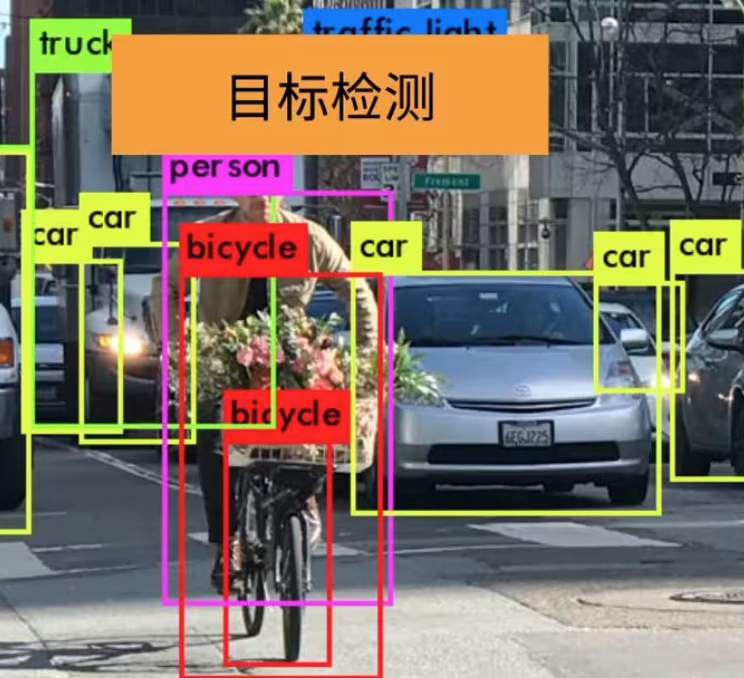

### 边界框

在目标检测中，我们通常使用*边界框*（bounding box）来描述对象的空间位置。 边界框是矩形的，由矩形左上角的以及右下角的𝑥和𝑦坐标决定。 另一种常用的边界框表示方法是边界框中心的(𝑥,𝑦)轴坐标以及框的宽度和高度。

目标检测中x，y坐标轴和数学上常用的坐标轴不同。x轴还是从左到右以0开始，但y轴上，是从上到下0开始的。

两种表示方法的转换：

```python
def box_corner_to_center(boxes):
    """从（左上，右下）转换到（中间，宽度，高度）"""
    x1, y1, x2, y2 = boxes[:, 0], boxes[:, 1], boxes[:, 2], boxes[:, 3]
    cx = (x1 + x2) / 2
    cy = (y1 + y2) / 2
    w = x2 - x1
    h = y2 - y1
    boxes = torch.stack((cx, cy, w, h), axis=-1)
    return boxes

def box_center_to_corner(boxes):
    """从（中间，宽度，高度）转换到（左上，右下）"""
    cx, cy, w, h = boxes[:, 0], boxes[:, 1], boxes[:, 2], boxes[:, 3]
    x1 = cx - 0.5 * w
    y1 = cy - 0.5 * h
    x2 = cx + 0.5 * w
    y2 = cy + 0.5 * h
    boxes = torch.stack((x1, y1, x2, y2), axis=-1)
    return boxes
```

以一个例子来画出边界框：


```python
d2l.set_figsize()
img = d2l.plt.imread('../img/catdog.jpg')
d2l.plt.imshow(img);
```


我们将根据坐标信息定义图像中狗和猫的边界框。 图像中坐标的原点是图像的左上角，**向右的方向为𝑥轴的正方向，向下的方向为𝑦轴的正方向**。

```python
## bbox是边界框的英文缩写
dog_bbox, cat_bbox = [60.0, 45.0, 378.0, 516.0], [400.0, 112.0, 655.0, 493.0]
```

可以通过转换两次来验证边界框转换函数的正确性：

```python
boxes = torch.tensor((dog_bbox, cat_bbox))
box_center_to_corner(box_corner_to_center(boxes)) == boxes

tensor([[True, True, True, True],
        [True, True, True, True]])
```

我们可以将边界框在图中画出，以检查其是否准确。 画之前，我们定义一个辅助函数`bbox_to_rect`。 它将边界框表示成`matplotlib`的边界框格式。

```python
def bbox_to_rect(bbox, color):
    ## 将边界框(左上x,左上y,右下x,右下y)格式转换成matplotlib格式：
    ## ((左上x,左上y),宽,高)
    return d2l.plt.Rectangle(
        xy=(bbox[0], bbox[1]), width=bbox[2]-bbox[0], height=bbox[3]-bbox[1],
        fill=False, edgecolor=color, linewidth=2)
```

到现在，已经有三种矩形框的表示方法了，但第三种应该只有maplotlib使用。

在图像上添加边界框之后，我们可以看到两个物体的主要轮廓基本上在两个框内。

```python
fig = d2l.plt.imshow(img)
fig.axes.add_patch(bbox_to_rect(dog_bbox, 'blue'))
fig.axes.add_patch(bbox_to_rect(cat_bbox, 'red'));
```

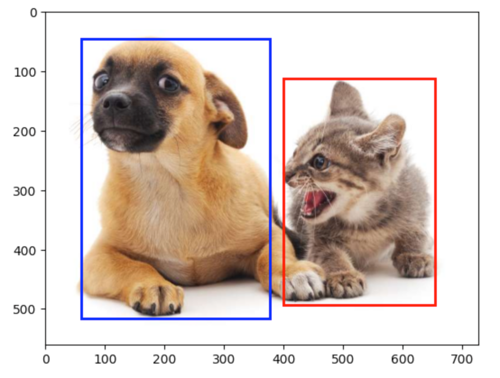

### 数据集

* 目标检测领域没有像MNIST和Fashion-MNIST那样的小数据集
* 目标检测的数据集通常来说比图片分类的数据集小很多，因为标注的成本很高
* 对于图片分类来说，最简单的就是给定一个CSV文件（图片与标号一一对应）或者是给定一个文件夹（每个类对应一个子文件夹，对应标号的图片放在子文件夹下）
* 对于目标检测来说就不能简单的用文件夹的形式，因为一张图片中可能存在多个类，所以就不能放在子文件夹中，所以通常来说目标检测的数据集的标号需要额外存储
* 假设使用文本文件存储的话，每一行表示一个物体，每一行分别由图片文件名（因为一张图片中可能有多个物体，所以同一个文件名可能会出现多次）、物体类别（标号）、边缘框（图片中物体的位置）组成，每一行一共有6（1+1+4）个值

#### COCO数据集

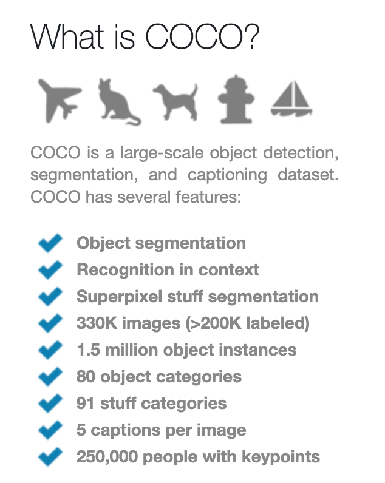

目标检测中比较常见的数据集，类似于ImageNet在图片分类中的地位。
访问地址：https://cocodataset.org/#home

COCO数据集中有 80 个类别，330k 图片，1.5M 物体（每张图片中有多个物体）。虽然类别看起来少，但由于每个图片中有多个物体，其实最后COCO的体量和ImageNet差不多。


需要注意的是，目标检测数据集的表示方法和普通图像分类中数据集表示方法不同，要注意数据集中数据的组织形式。不同的数据集可能有不同的表示方法。


### 总结

- 目标检测不仅可以识别图像中所有感兴趣的物体，还能识别它们的位置，该位置通常由矩形边界框表示。
- 我们可以在两种常用的边界框表示（中间，宽度，高度）和（左上，右下）坐标之间进行转换。

## 锚框

目标检测算法通常会在输入图像中采样大量的区域，然后判断这些区域中是否包含我们感兴趣的目标，并调整区域边界从而更准确地预测目标的*真实边界框*（ground-truth bounding box）。 不同的模型使用的区域采样方法可能不同。 这里我们介绍其中的一种方法：以每个像素为中心，生成多个缩放比和宽高比（aspect ratio）不同的边界框。 这些边界框被称为*锚框*（anchor box）。

### 生成多个锚框

假设输入图像的高度为ℎ，宽度为𝑤。 我们以图像的**每个像素为中心**生成不同形状的锚框：*缩放比*为𝑠∈(0,1]，*宽高比*为𝑟>0。 那么锚框的宽度和高度分别是$hs\sqrt{r}$和$hs/\sqrt{r}$。 请注意，当中心位置给定时，已知宽和高的锚框是确定的。

要生成多个不同形状的锚框，让我们设置许多缩放比（scale）取值$s_1, \cdots, s_n$和许多宽高比（aspect ratio）取值$r_1,\cdots,r_m$。 当使用这些比例和长宽比的所有组合以每个像素为中心时，输入图像将总共有$whnm$个锚框（共wh个像素，每个像素有nm个锚框）。 尽管这些锚框可能会覆盖所有真实边界框，但计算复杂性很容易过高。 在实践中，我们只考虑包含𝑠1或𝑟1的组合：
$$
(s_1,r_1),(s_1,r_2),\ldots,(s_1,r_m),(s_2,r_1),(s_3,r_1),\ldots,(s_n,r_1).
$$
也就是说，以同一像素为中心的锚框的数量是$𝑛+𝑚−1$。 对于整个输入图像，将共生成$𝑤ℎ(𝑛+𝑚−1)$个锚框。

上述生成锚框的方法在下面的`multibox_prior`函数中实现。 我们指定输入图像、尺寸列表和宽高比列表，然后此函数将返回所有的锚框。

```python
def multibox_prior(data, sizes, ratios):  # data是输入的图像，sizes就是缩放比scale，ratios就是宽高比
    """生成以每个像素为中心具有不同形状的锚框"""
    in_height, in_width = data.shape[-2:]
    device, num_sizes, num_ratios = data.device, len(sizes), len(ratios)
    boxes_per_pixel = (num_sizes + num_ratios - 1) # 每个像素的锚框的个数
    size_tensor = torch.tensor(sizes, device=device)
    ratio_tensor = torch.tensor(ratios, device=device)

    # 为了将锚点移动到像素的中心，需要设置偏移量。
    # 因为一个像素的高为1且宽为1，我们选择偏移我们的中心0.5
    offset_h, offset_w = 0.5, 0.5
    steps_h = 1.0 / in_height  # 在y轴上缩放步长
    steps_w = 1.0 / in_width  # 在x轴上缩放步长

    # 生成锚框的所有中心点
    # y轴上，steps_h将y轴（总长度in_height)分为in_height份。center_h 相当于 i/in_height，即中心点的y轴坐标
    center_h = (torch.arange(in_height, device=device) + offset_h) * steps_h
    center_w = (torch.arange(in_width, device=device) + offset_w) * steps_w
    shift_y, shift_x = torch.meshgrid(center_h, center_w, indexing='ij') # 通过 meshgrid 函数生成所有像素中心点的网格
    shift_y, shift_x = shift_y.reshape(-1), shift_x.reshape(-1)

    # 生成“boxes_per_pixel”个高和宽，
    # 之后用于创建锚框的四角坐标(xmin,xmax,ymin,ymax)
    w = torch.cat((size_tensor * torch.sqrt(ratio_tensor[0]),
                   sizes[0] * torch.sqrt(ratio_tensor[1:])))* in_height / in_width  # 处理矩形输入
    
    h = torch.cat((size_tensor / torch.sqrt(ratio_tensor[0]),
                   sizes[0] / torch.sqrt(ratio_tensor[1:])))
    # 除以2来获得半高和半宽
    anchor_manipulations = torch.stack((-w, -h, w, h)).T.repeat(
                                        in_height * in_width, 1) / 2

    # 每个中心点都将有“boxes_per_pixel”个锚框，
    # 所以生成含所有锚框中心的网格，重复了“boxes_per_pixel”次
    out_grid = torch.stack([shift_x, shift_y, shift_x, shift_y],
                dim=1).repeat_interleave(boxes_per_pixel, dim=0)
    output = out_grid + anchor_manipulations
    return output.unsqueeze(0)
```

可以看到返回的锚框变量`Y`的形状是（批量大小，锚框的数量，4）。

```python
img = d2l.plt.imread('../img/catdog.jpg')
h, w = img.shape[:2]

print(h, w)
X = torch.rand(size=(1, 3, h, w))
Y = multibox_prior(X, sizes=[0.75, 0.5, 0.25], ratios=[1, 2, 0.5])
Y.shape
```

```
561 728
torch.Size([1, 2042040, 4])
```


## 语义分割

本节将探讨*语义分割*（semantic segmentation）问题，它重点关注于如何将图像分割成属于不同语义类别的区域。 与目标检测不同，语义分割可以识别并理解图像中每一个像素的内容：其语义区域的标注和预测是像素级的。 [图13.9.1](https://zh-v2.d2l.ai/chapter_computer-vision/semantic-segmentation-and-dataset.html#fig-segmentation)展示了语义分割中图像有关狗、猫和背景的标签。 与目标检测相比，语义分割标注的像素级的边框显然更加精细。

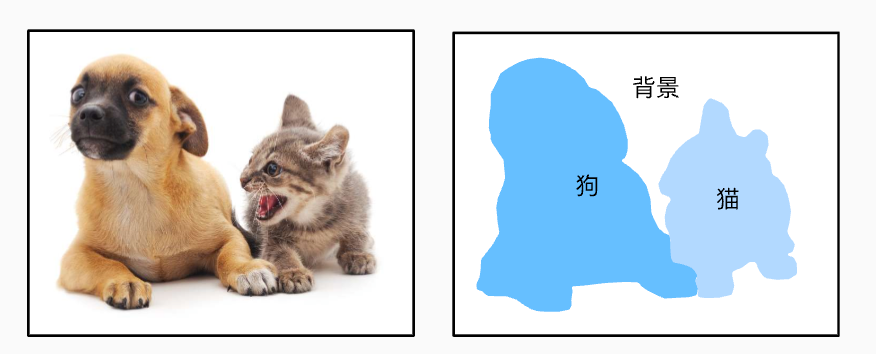

### 图像分割和实例分割

计算机视觉领域还有2个与语义分割相似的重要问题，即*图像分割*（image segmentation）和*实例分割*（instance segmentation）。 我们在这里将它们同语义分割简单区分一下。

- *图像分割*将图像划分为若干组成区域，这类问题的方法通常利用图像中像素之间的相关性。它在训练时不需要有关图像像素的标签信息，在预测时也无法保证分割出的区域具有我们希望得到的语义。以 [图13.9.1](https://zh-v2.d2l.ai/chapter_computer-vision/semantic-segmentation-and-dataset.html#fig-segmentation)中的图像作为输入，图像分割可能会将狗分为两个区域：一个覆盖以黑色为主的嘴和眼睛，另一个覆盖以黄色为主的其余部分身体。
- *实例分割*也叫*同时检测并分割*（simultaneous detection and segmentation），它研究如何识别图像中各个目标实例的像素级区域。与语义分割不同，实例分割不仅需要区分语义，还要区分不同的目标实例。例如，如果图像中有两条狗，则实例分割需要区分像素属于的两条狗中的哪一条。

### Pascal VOC2012 语义分割数据集

使用d2l代码下载数据集太慢了（没有科学上网）。在本机上科学上网之后下载：

```
http://d2l-data.s3-accelerate.amazonaws.com/VOCtrainval_11-May-2012.tar
```

下载后解压：

```shell
tar -xvf VOCtrainval_11-May-2012.tar
```

解压该文件后得到一个`VOCdevkit`文件夹。进入`VOCdevkit/VOC2012`，我们可以看到数据集的不同组件。

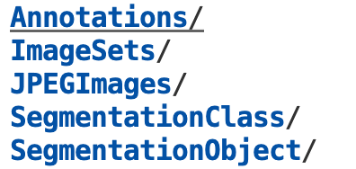

`ImageSets/Segmentation`路径包含用于训练和测试样本的文本文件（这个文件包含了各个图片的文件名，包括训练、测试的图片，这个文件名同时也是对应的标签的文件名），而`JPEGImages`和`SegmentationClass`路径分别存储着每个示例的输入图像和标签。 

此处的标签也采用图像格式，其尺寸和它所标注的输入图像的尺寸相同。 此外，**标签中颜色相同的像素属于同一个语义类别。** 下面将`read_voc_images`函数定义为将所有输入的图像和标签读入内存。

```python
def read_voc_images(voc_dir, is_train=True):
    """读取所有VOC图像并标注"""
    txt_fname = os.path.join(voc_dir, 'ImageSets', 'Segmentation',
                             'train.txt' if is_train else 'val.txt')
    mode = torchvision.io.image.ImageReadMode.RGB
    with open(txt_fname, 'r') as f:
        images = f.read().split()
    features, labels = [], []
    for i, fname in enumerate(images):
        features.append(torchvision.io.read_image(os.path.join(
            voc_dir, 'JPEGImages', f'{fname}.jpg')))
        labels.append(torchvision.io.read_image(os.path.join(
            voc_dir, 'SegmentationClass' ,f'{fname}.png'), mode))
    return features, labels

train_features, train_labels = read_voc_images(voc_dir, True)
```


注意：语义分割的标签是像素级的，每个像素都有标签。所以会导致一些问题，例如不能进行resize。（feature是一张图片，label也是一张图片）如果对feature进行resize，那么标签应该对应的进行resize，但resize是对图像进行拉伸等操作，其RGB值会变化，例如原本以(128,0,0)红色作为标签表示✈️，resize后红色变为粉红，但粉红可能没有标号。


## YOLO

### 数据集

目标检测数据集常用的一共有两个：

* Pascal VOC
* COCO

#### Pascal VOC

Pascal VOC（Visual Object Classes）是一个在视觉对象类别识别和检测领域的基准，提供了标准化的数据集、评估程序和评分机制，用于评估目标检测算法。以下是关于Pascal VOC的一些关键点：

1. **数据集**：数据集包含了不同类别（或类别）的图像，例如人、动物、车辆和室内物品。它包括带有对象标注、位置（边界框）和分割掩码的图像。
2. **挑战赛**：Pascal VOC每年组织目标检测、分类、分割和动作分类的挑战赛。这些挑战赛极大地推动了计算机视觉研究的进展。
3. **评估指标**：评估使用精度（precision）、召回率（recall）和平均精度（mAP）等指标来评估模型的性能。这些指标有助于比较不同的算法，并改进目标检测的最新技术。
4. **影响力**：Pascal VOC在各种目标检测算法和技术的发展中具有重要影响，包括卷积神经网络（CNN）等深度学习模型的发展。
5. **版本**：Pascal VOC挑战赛始于2005年，持续到2012年，每年的挑战赛都会引入新的任务并改进数据集。VOC2012数据集是最广泛使用的版本之一，用于基准测试。

VOC 2007包含9963张图片，24640个标注；VOC 2012包含11530张图片，27450个标注。

该数据集一共有20个分类：

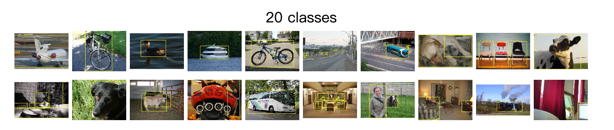

#### MS COCO

COCO（Common Objects in Context）是一个广泛使用的视觉数据集，用于对象检测、分割和图像描述等任务。以下是关于COCO数据集的一些关键点：

1. **数据集规模和类别**：
   - COCO数据集包含超过33万个图像，其中超过20万个图像带有标注。
   - 数据集涵盖80个对象类别，包括人、动物、家具、交通工具等。
2. **标注类型**：
   - **对象检测**：提供对象的边界框标注。
   - **实例分割**：提供对象的精确分割掩码。
   - **关键点检测**：对人体的关键点（如眼睛、鼻子、关节）进行标注。
   - **全景分割**：提供整个图像中所有像素的分割标注，不仅包括对象还包括背景。
   - **图像描述**：每张图像配有5个不同的自然语言描述。
3. **评估指标**：
   - 使用平均精度（AP）作为主要评估指标，AP是在不同的IoU（Intersection over Union）阈值下计算的。
   - 还有其他指标，如平均召回率（AR）等，用于综合评估模型的性能。
4. **挑战赛**：
   - COCO每年举办国际比赛，如COCO对象检测、COCO实例分割等，吸引了全球顶尖的研究团队参与。
   - 这些比赛推动了计算机视觉算法的进步和新技术的开发。
5. **影响力**：
   - COCO数据集因其丰富的标注和复杂的场景而被广泛使用，是计算机视觉研究和应用的重要资源。
   - 许多顶尖的计算机视觉模型和算法都是在COCO数据集上进行训练和评估的，如Mask R-CNN、YOLO、SSD等。


#### YOLO格式

Ultralytics YOLO 格式是一种数据集配置格式，可以定义数据集根目录、训练/验证/测试图像目录的相对路径（或包含图像路径的 *.txt 文件的相对路径）以及类名字典。

例子：

```yaml
# Train/val/test sets as 1) dir: path/to/imgs, 2) file: path/to/imgs.txt, or 3) list: [path/to/imgs1, path/to/imgs2, ..]
path: ../datasets/coco8  # dataset root dir
train: images/train  # train images (relative to 'path') 4 images
val: images/val  # val images (relative to 'path') 4 images
test:  # test images (optional)

# Classes (80 COCO classes)
names:
  0: person
  1: bicycle
  2: car
  # ...
  77: teddy bear
  78: hair drier
  79: toothbrush
```

此格式的标签应导出为 YOLO 格式，每个图像有一个 *.txt 文件。如果图像中没有对象（object），则不需要 *.txt 文件。 

`*.txt` 文件的格式应为每个对象一行，采用`class x_center y_center width height`格式。框坐标必须采用**标准化** xywh 格式（从 0 到 1）。如果框以像素为单位，则应将 x_center 和宽度除以图像宽度，并将 y_center 和高度除以图像高度。类编号应该从零开始索引（从 0 开始）。（即x_center和y_center的值应该为图像的相对位置，例如x_center=y_center=0.5表示图像的中心）


上图对应的标签文件包含2个人（类0）和领带（类27）：


使用 Ultralytics YOLO 格式时，训练和验证图像和标签的组织形式如下面的 COCO8 数据集示例所示：

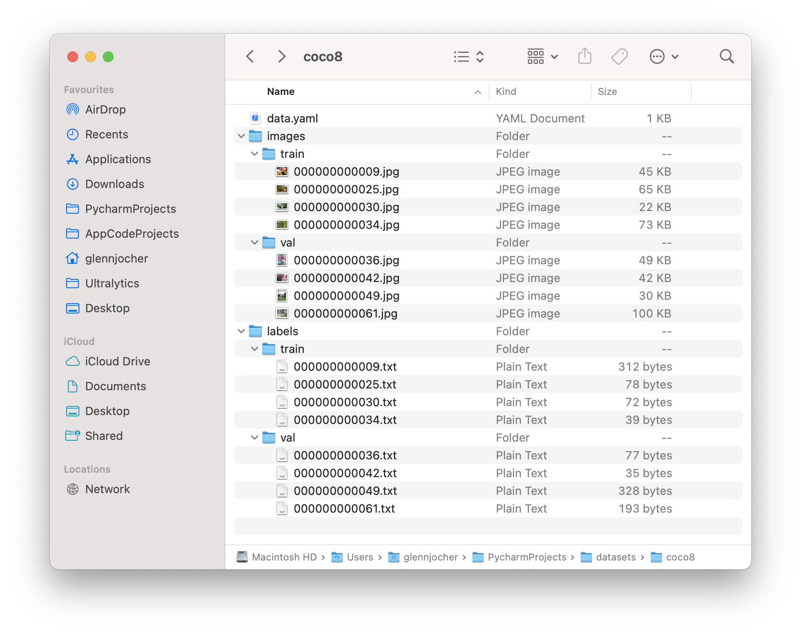


### 目标检测性能指标

#### 检测精度

##### Precision、Recall、F1 Score

定义TP，FP，TN，FN：

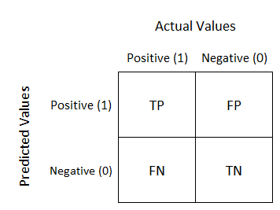

TP即True Positive，即预测为正类（P，positive），且预测正确（True）。

FP即False Positive，即预测为正类，但预测错误。

 TN即True Negative，即预测为负类，且预测正确。


$$
Precision=\frac{TP}{TP+FP}\\Recall=\frac{TP}{TP+FN} \\ Fl~score=\frac{2\times Precision\times Recall}{Precision+Recall}
$$

* 精度Precision（查准率）是评估预测的准不准
* 召回率Recall（查全率）是评估找的全不全

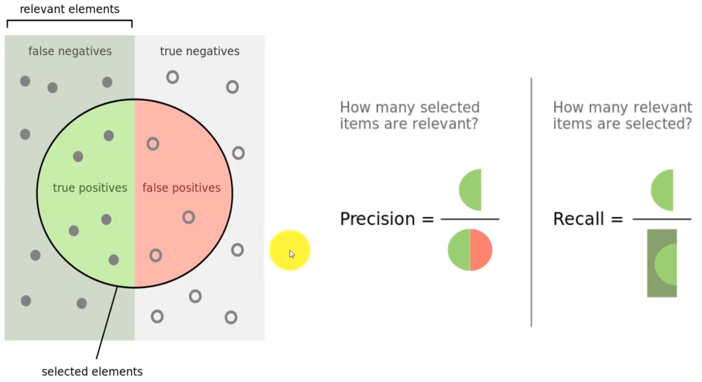


##### IOU

IOU：Intersection Over Unit，即交并比。

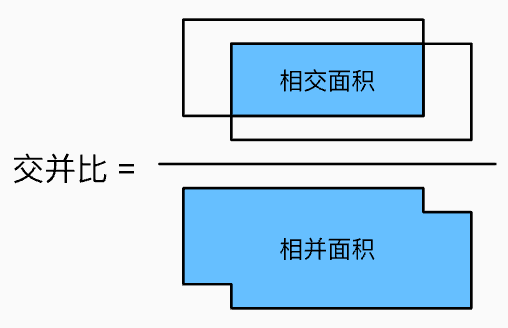

我们可以为IOU值设置一个Threshold，然后用它来判断这次检测的结果。例如，设置IoU的门槛值为0.5，那么：

* 若IoU大于等于0.5，则结果为TP
* 若IoU小于0.5，则认为是一次错误的检测，结果为FP
* 当图像中存在真实值（Groud Truth）并且模型无法检测到该对象时，将其分类为FN。即漏检的情况
* TN 是图像中我们没有预测对象的每个部分。该指标对于对象检测没有用，因此我们忽略 TN。

##### AP，mAP

AP（Average Precision）衡量的是学习出来的模型在每个类别上的好坏；mAP（mean Average Precision）衡量的是学出的模型在所有类别上的好坏，mAP就是取所有类别上AP的均值。

Pascal VOC中，threshold的值就为0.5。若检测到同一目标的多个检测，则视第一个检测为正样本，其余的为负样本（FN）


COCO中AP和mAP略有不同。

AP@.50表示IoU threshold为0.5，AP@.75表示IoU threshold为0.75。

COCO中，AP是使用多个IoU threshold的平均精度。

AP@[.5:.95] 对应于 loU 从 0.5 到 0.95 的平均 AP，步长为 0.05。

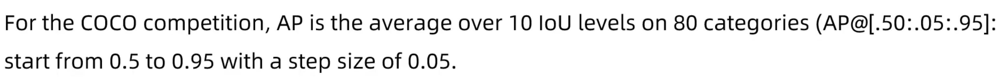
$$
mAP_{\mathrm{COCO}}=\frac{mAP_{0.50}+mAP_{0.55}+\ldots+mAP_{0.95}}{10}
$$


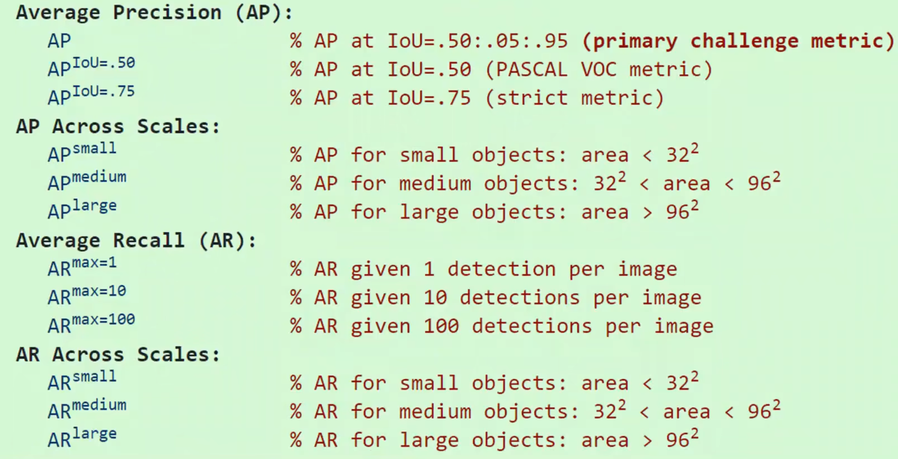


#### 检测速度


### 


