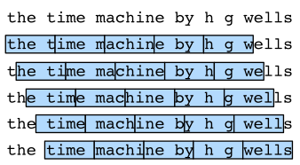

# 循环神经网络

## 1. 序列模型

实际中很多数据是有时序结构的。

例如：

* 电影的评价随时间变化而变化
  * 拿奖后评分上升，直到奖项被遗忘
  * 看到很多好电影后，人们的期望变高
  * 季节性问题
  * 导演、演员的负面报道导致评分变低
* 音乐、语言、文本以及视频都是连续的
* 大地震发生后，发生小地震的概率比单纯发生小地震高
* 人的互动是连续的

到目前为止，我们一直关注输入由单个特征向量$\mathbf{x}\in\mathbb{R}^{d}$组成的模型。 开发能够处理序列的模型时，观点的主要变化是我们现在关注由特征向量的有序列表组成的输入$\mathbf{x}_{1},\ldots,\mathbf{x}_{T}$，其中每个特征向量$\mathbf{x}_{t}$由位于$\mathbb{R}^{d}$中的时间步长$t\in\mathbb{Z}^{+}$索引。

一些数据集由单个大规模序列组成。 例如，考虑一下气候科学家可能获得的极长的传感器读数流。 在这种情况下，我们可以通过随机采样某个**预定长度的子序列**来创建训练数据集。 更常见的是，我们的数据作为序列的集合到达。 考虑以下示例：（i）文档集合，每个文档都表示为自己的单词序列，并且每个文档都有自己的长度$T_i$; (ii) 患者在医院住院的序列表示，其中每次住院由多个事件组成，序列长度大致取决于住院时间的长度。

以前，在处理单个输入时，我们假设它们是从相同的基础分布$P(X)$中独立采样的。 虽然我们仍然假设整个序列（例如，整个文档或患者轨迹）是独立采样的，但我们**不能假设每个时间步到达的数据彼此独立**。 例如，可能稍后出现在文档中的单词在很大程度上取决于文档中较早出现的单词。 患者在入院第 10 天可能接受的药物在很大程度上取决于前 9 天发生的情况。

这应该不足为奇。 如果我们不相信序列中的元素是相关的，那么我们一开始就不会费心将它们建模为序列。 考虑搜索工具和现代电子邮件客户端中流行的自动填充功能的有用性。 它们之所以有用，正是因为在给定一些初始前缀的情况下，通常可以预测序列可能的延续（不完美，但比随机猜测更好）。 对于大多数序列模型，我们不需要序列的独立性，甚至平稳性。 相反，我们只要求序列本身是从整个序列上的某个固定的基础分布中采样的。

这种灵活的方法允许出现以下现象：

1. 文档在开头与结尾看起来明显不同； 
2. 患者在住院期间病情逐渐康复或死亡； 
3. 客户品味在与推荐系统持续交互的过程中以可预测的方式变化。

我们有时希望在给定顺序结构化输入的情况下预测固定目标 $y$（例如，基于电影评论的情感分类）。 在其他时候，我们希望预测给定固定输入情况下一个顺序结构化的目标$(y_1,\ldots,y_T)$（例如图像标题）。 还有一些时候，我们的目标是根据顺序结构化输入（例如机器翻译或视频字幕）来预测顺序结构化目标。 这种序列到序列的任务有两种形式：

1. 对齐（aligned）：每个时间步的输入与相应的目标（例如，词性标记）对齐； 
2. 未对齐（unaligned）：输入和目标不一定表现出逐步对应（例如，机器翻译）。

在我们担心处理任何类型的目标之前，我们可以解决最直接的问题：无监督密度建模（也称为序列建模）。 在这里，给定一组序列，我们的目标是估计概率质量函数，它告诉我们看到任何给定序列的可能性有多大，即$p(\mathbf{x}_{1},\ldots,\mathbf{x}_{T})$。

### 1.1 统计工具

在时间$t$观察到$x_t$，那么得到$T$个不独立的随机变量$(x_1,...x_T)\thicksim p(\mathbf{x})$。则
$$
x_t\sim P(x_t\mid x_{t-1},\ldots,x_1)
$$
整个序列的估计值可以表示为：
$$
P(x_1,\ldots,x_T)=\prod_{t=1}^TP(x_t\mid x_{t-1},\ldots,x_1)
$$
即：
$$
p(\mathbf{x})=p(x_1)\cdot p(x_2|x_1)\cdot p(x_3|x_1,x_2)\cdot...p(x_T|x_1,...x_{T-1})
$$
这个公式是由条件概率公式推出来的。


以x2为例，x1出发的黄色箭头指向x2，即$p(x_2|x_1)$，后面的同理。

还可以反向计算：
$$
p(\mathbf{x})=p(x_T)\cdot p(x_{T-1}|x_T)\cdot p(x_{T-2}|x_{T-1},x_T)\cdot...p(x_1|x_2,...x_T)
$$


但这种形式物理上不一定可行。例如用未来发生的事预测过去发生的事可能就不可行，因为未来发生的事是过去发生的事导致的。

对条件概率建模：
$$
p(x_t|x_1,...x_{t-1})=p(x_t|f(x_1,...x_{t-1}))
$$
对见过的数据建模，也称**自回归模型**。

我们之前进行的任务，例如图像识别，是分类问题，并且数据是图片，而结果为标签，即用图片预测标签。

而在这里，我们是使用之前的数据预测现在的数据。

"自回归"这个名字来源于模型的基本特性。在自回归模型中，一个变量是由它自身的过去值进行回归得到的。“自”（auto）意味着自我，“回归”（regression）则是指统计模型中的一种预测方法。因此，"自回归"就是指一个变量基于其自身过去的值进行预测。类似的还有自分类。

建模有两种方案：

* 马尔可夫模型
* 潜变量模型

#### 1.1.1 马尔可夫假设

假设当前数据只和$\tau$个过去数据点相关：


$$
p(x_t|x_1,...x_{t-1})=p(x_t|x_{t-\tau},...x_{t-1})=p(x_t|f(x_{t-\tau},...x_{t-1}))
$$
那么现在输入的长度固定了（只有前$\tau$个$x_i$作为输入），即使用$x_{t-1},\ldots,x_{t-\tau}$而不是$x_{t-1},\ldots,x_{1}$来估计$x_t$。

特别地，如果$\tau=1$，则可以得到一个*一阶马尔可夫模型*（first-order Markov model）:
$$
P(x_1,\ldots,x_T)=\prod_{t=1}^TP(x_t\mid x_{t-1})\text{ when }P(x_1\mid x_0)=P(x_1)
$$

此时$x_t$仅和$x_{t-1}$有关。

#### 1.1.2 潜变量模型

引入潜变量$h_t$来表示过去信息$h_t=f(x_1,...x_{t-1})$。这样$x_t=p(x_t|h_t)$。


可将模型拆分为两个模型：

第一个模型接受$x$和$h$作为输入，得出输出$h'$，第二个模型接受$x$和$h'$，得到输出$x'$。

### 1.2 马尔可夫模型代码实现

#### 1.2.1 数据生成

首先生成一些数据，使用正弦函数和一些可加性噪声来生成序列数据， 时间步为1,2,…,1000。

```python
%matplotlib inline
import torch
from torch import nn
from d2l import torch as d2l

T = 1000  # 总共产生1000个点
time = torch.arange(1, T + 1, dtype=torch.float32) # 生成[1,1001)的序列
x = torch.sin(0.01 * time) + torch.normal(0, 0.2, (T,))
d2l.plot(time, [x], 'time', 'x', xlim=[1, 1000], figsize=(6, 3))
```


然后，将这个序列转换为模型的特征-标签（feature-label）对。每个时间步中，我们有label $y=x_t$，features $\mathbf{x}_t=[x_{t-\tau},\ldots,x_{t-1}]$。（即t时间，我们的标签是$x_t$的值，特征则是$\tau$个之前x的值）。

注意：由于我们缺少$y_1,y_2,y_3,y_\tau$的历史（如$y_1$需要$x_{1-\tau},...,x_{1-1}$，这些数据我们没有），所以最后我们共有1000-$\tau$个数据对。一个简单的解决办法是：如果拥有足够长的序列就丢弃这几项； 另一个方法是用零填充序列。这里为了简单期间，我们直接丢弃这几项。另外，我们使用前600个数据对进行训练，其余作为测试集。

```python
tau = 4
features = torch.zeros((T - tau, tau)) # 共T-tau个数据对，每个feature有4个x_i
for i in range(tau):
    features[:, i] = x[i: T - tau + i]	# features第i列设置成x中第i个索引元素到T-tau+i-1索引元素
    # features的设置很巧妙。例如tau=4时，则features第一行的结果就为 x0,x1,x2,x3，后续列也是同理的
labels = x[tau:].reshape((-1, 1)) # 将labels设置成一列，如果tau=4，则第一行就是x_4，也就是第一个label

batch_size, n_train = 16, 600
# 只有前n_train个样本用于训练
train_iter = d2l.load_array((features[:n_train], labels[:n_train]),
                            batch_size, is_train=True)
```

固定输入的长度后，这就是一个简单的回归问题了。这里使用一个相当简单的架构训练模型： 一个拥有两个全连接层的多层感知机，ReLU激活函数和平方损失。

#### 1.2.2 网络结构

```python
# 初始化网络权重的函数
def init_weights(m):
    if type(m) == nn.Linear:
        nn.init.xavier_uniform_(m.weight)

# 一个简单的多层感知机
def get_net():
    net = nn.Sequential(nn.Linear(4, 10), # 这里4其实就是tau的值，即特征数
                        nn.ReLU(),
                        nn.Linear(10, 1))
    net.apply(init_weights)
    return net

# 平方损失。注意：MSELoss计算平方误差时不带系数1/2
loss = nn.MSELoss(reduction='none')
```

#### 1.2.3 训练

开始训练：

```python
def train(net, train_iter, loss, epochs, lr):
    trainer = torch.optim.Adam(net.parameters(), lr)
    for epoch in range(epochs):
        for X, y in train_iter:
            trainer.zero_grad()
            l = loss(net(X), y)
            l.sum().backward()
            trainer.step()
        print(f'epoch {epoch + 1}, '
              f'loss: {d2l.evaluate_loss(net, train_iter, loss):f}')

net = get_net()
train(net, train_iter, loss, 5, 0.01)
```

```
epoch 1, loss: 0.076846
epoch 2, loss: 0.056340
epoch 3, loss: 0.053779
epoch 4, loss: 0.056320
epoch 5, loss: 0.051650
```

#### 1.2.4 预测

由于训练损失很小，因此我们期望模型能有很好的工作效果。 让我们看看这在实践中意味着什么。 首先是检查模型预测下一个时间步的能力， 也就是*单步预测*（one-step-ahead prediction）。

```python
onestep_preds = net(features)
d2l.plot([time, time[tau:]],
         [x.detach().numpy(), onestep_preds.detach().numpy()], 'time',
         'x', legend=['data', '1-step preds'], xlim=[1, 1000],
         figsize=(6, 3))
```


正如我们所料，单步预测效果不错。 即使这些预测的时间步超过了600+4（`n_train + tau`）， 其结果看起来仍然是可信的。 然而有一个小问题：如果数据观察序列的时间步只到604， 我们需要一步一步地向前迈进：
$$
\begin{aligned}
&\hat{x}_{605}& =f(x_{601},x_{602},x_{603},x_{604}),  \\
&\hat{x}_{606}& =f(x_{602},x_{603},x_{604},\hat{x}_{605}),  \\
&\hat{x}_{607}& =f(x_{603},x_{604},\hat{x}_{605},\hat{x}_{606}),  \\
&\hat{x}_{608}& =f(x_{604},\hat{x}_{605},\hat{x}_{606},\hat{x}_{607}),  \\
&\hat{x}_{609}& =f(\hat{x}_{605},\hat{x}_{606},\hat{x}_{607},\hat{x}_{608}),  \\
&&\text{.}
\end{aligned}
$$
通常，对于直到$x_t$的观测序列，其在时间步$t+k$处的预测输出$\hat 𝑥_{𝑡+𝑘} $称为𝑘*步预测*（𝑘-step-ahead-prediction）。 由于我们的观察已经到了$𝑥_{604}$，它的𝑘步预测是$\hat 𝑥_{604+𝑘}$。 换句话说，我们必须使用我们自己的预测（而不是原始数据）来进行多步预测。 让我们看看效果如何。

```python
multistep_preds = torch.zeros(T)
multistep_preds[: n_train + tau] = x[: n_train + tau]
for i in range(n_train + tau, T):
    multistep_preds[i] = net(
        multistep_preds[i - tau:i].reshape((1, -1)))

d2l.plot([time, time[tau:], time[n_train + tau:]],
         [x.detach().numpy(), onestep_preds.detach().numpy(),
          multistep_preds[n_train + tau:].detach().numpy()], 'time',
         'x', legend=['data', '1-step preds', 'multistep preds'],
         xlim=[1, 1000], figsize=(6, 3))
```


如上面的例子所示，绿线的预测显然并不理想。 经过几个预测步骤之后，预测的结果很快就会衰减到一个常数。 为什么这个算法效果这么差呢？事实是由于错误的累积： 假设在步骤1之后，我们积累了一些错误$\epsilon_{1}=\bar{\epsilon}$。 于是，步骤2的输入被扰动了$\epsilon_1$， 结果积累的误差是依照次序的$\epsilon_{2}=\bar{\epsilon}+c\epsilon_{1}$， 其中𝑐为某个常数，后面的预测误差依此类推。 因此误差可能会相当快地偏离真实的观测结果。 例如，未来24小时的天气预报往往相当准确， 但超过这一点，精度就会迅速下降。 我们将在本章及后续章节中讨论如何改进这一点。

基于𝑘=1,4,16,64，通过对整个序列预测的计算， 让我们更仔细地看一下𝑘步预测的困难。

```python
max_steps = 64

features = torch.zeros((T - tau - max_steps + 1, tau + max_steps))
# 列i（i<tau）是来自x的观测，其时间步从（i）到（i+T-tau-max_steps+1）
for i in range(tau):
    features[:, i] = x[i: i + T - tau - max_steps + 1]

# 列i（i>=tau）是来自（i-tau+1）步的预测，其时间步从（i）到（i+T-tau-max_steps+1）
for i in range(tau, tau + max_steps):
    features[:, i] = net(features[:, i - tau:i]).reshape(-1)

steps = (1, 4, 16, 64)
d2l.plot([time[tau + i - 1: T - max_steps + i] for i in steps],
         [features[:, (tau + i - 1)].detach().numpy() for i in steps], 'time', 'x',
         legend=[f'{i}-step preds' for i in steps], xlim=[5, 1000],
         figsize=(6, 3))
```


以上例子清楚地说明了当我们试图预测更远的未来时，预测的质量是如何变化的。 虽然“4步预测”看起来仍然不错，但超过这个跨度的任何预测几乎都是无用的。

## 2. 文本预处理

序列数据存在许多种形式，文本是最常见例子之一。

例如，一篇文章可以被简单地看作一串单词序列，甚至是一串字符序列。 本节中，我们将解析文本的常见预处理步骤。 这些步骤通常包括：

1. 将文本作为字符串加载到内存中。
2. 将字符串拆分为词元（即token。分为单词和字符）。
3. 建立一个词表，将拆分的词元映射到数字索引。
4. 将文本转换为数字索引序列，方便模型操作。

### 2.1 读取数据集

首先，我们从H.G.Well的[时光机器](https://www.gutenberg.org/ebooks/35)中加载文本。 这是一个相当小的语料库，只有30000多个单词，但足够我们小试牛刀， 而现实中的文档集合可能会包含数十亿个单词。 下面的函数将数据集读取到由多条文本行组成的列表中，其中每条文本行都是一个字符串。 为简单起见，我们在这里忽略了标点符号和字母大写。

```python
!wget -O timemachine.txt http://d2l-data.s3-accelerate.amazonaws.com/timemachine.txt
# 把文件直接下载下来，这样不报错。

# d2l.DATA_HUB['time_machine'] = (d2l.DATA_URL + 'timemachine.txt',
#                                 '090b5e7e70c295757f55df93cb0a180b9691891a')
def read_time_machine():  #@save
    """将时间机器数据集加载到文本行的列表中"""
    # with open(d2l.download('time_machine'), 'r') as f: 
    with open('timemachine.txt', 'r') as f:
        lines = f.readlines()
    return [re.sub('[^A-Za-z]+', ' ', line).strip().lower() for line in lines]

lines = read_time_machine()
print(f'# 文本总行数: {len(lines)}')
print(lines[0])
print(lines[10])
```


### 2.2 词元化 Tokenize

下面的`tokenize`函数将文本行列表（`lines`）作为输入， 列表中的每个元素是一个文本序列（如一条文本行）。 每个文本序列又被拆分成一个词元列表，*词元*（token）是文本的基本单位。 最后，返回一个由词元列表组成的列表，其中的每个词元都是一个字符串（string）。

```python
def tokenize(lines, token='word'): 
    """将文本行拆分为单词或字符词元"""
    if token == 'word':
        return [line.split() for line in lines]
        # split()以空格为分隔符
    elif token == 'char':
        # 对字符串使用list会返回每个字符的列表。例如list('he')返回的就是['h','e']
        return [list(line) for line in lines]
    else:
        print('错误：未知词元类型：' + token)

tokens = tokenize(lines)
for i in range(11):
    print(tokens[i])
```

```
['the', 'time', 'machine', 'by', 'h', 'g', 'wells']
[]
[]
[]
[]
['i']
[]
[]
['the', 'time', 'traveller', 'for', 'so', 'it', 'will', 'be', 'convenient', 'to', 'speak', 'of', 'him']
['was', 'expounding', 'a', 'recondite', 'matter', 'to', 'us', 'his', 'grey', 'eyes', 'shone', 'and']
['twinkled', 'and', 'his', 'usually', 'pale', 'face', 'was', 'flushed', 'and', 'animated', 'the']
```

### 2.3 词表 Vocabulary

词元的类型是字符串，而模型需要的输入是数字，因此这种类型不方便模型使用。 

现在，让我们构建一个字典，通常也叫做*词表*（vocabulary）， 用来将字符串类型的词元映射到从0开始的数字索引中。 

我们先将训练集中的所有文档合并在一起，对它们的唯一词元进行统计， 得到的统计结果称之为*语料*（corpus）。 

然后根据每个唯一词元的出现频率，为其分配一个数字索引（感觉就是词频统计，这里的词指的就是词元）。 很少出现的词元通常被移除，这可以降低复杂性。另外，语料库中不存在或已删除的任何词元都将映射到一个特定的未知词元“`<unk>`”（即unknown）。 我们可以选择增加一个列表，用于保存那些被保留的词元， 例如：填充词元（“`<pad>`”）； 序列开始词元（“`<bos>`”）； 序列结束词元（“`<eos>`”）。

```python
class Vocab:  
    """文本词表"""
    """
    Parameters:
        tokens: A list of tokens to build the vocabulary from. Default is None.
        min_freq: Minimum frequency a token must have to be included in the vocabulary. Default is 0.
        reserved_tokens: A list of reserved tokens that should always be included in the vocabulary. Default is None.
    """
    def __init__(self, tokens=None, min_freq=0, reserved_tokens=None):
        if tokens is None:
            tokens = []
        if reserved_tokens is None:
            reserved_tokens = []
        # 按出现频率排序
        counter = count_corpus(tokens)
        # 存储按频率降序排列的tokens（词元）。
        # lambda x: x[1] 函数用于指定排序应基于每个元组的第二个元素（tokens频率）。x是一个元组，在这里即(token, freq)
        self._token_freqs = sorted(counter.items(), key=lambda x: x[1],
                                   reverse=True)
        # 未知词元的索引为0，然后各个保留词元的索引从1开始。（unk词元和保留词元占据较小的索引）
        self.idx_to_token = ['<unk>'] + reserved_tokens
        # 将每个token映射到其相应索引
        self.token_to_idx = {token: idx
                             for idx, token in enumerate(self.idx_to_token)}
        for token, freq in self._token_freqs:
            # 由于_token_freqs中的词元以频率递减的形式排好序了，当遍历到某个词元，
            # 它的出现频率小于最小频率，那么后续所有的词元出现频率都小于最小频率
            if freq < min_freq:
                break
            if token not in self.token_to_idx: # 仅当当前词元不在list中时才添加
                self.idx_to_token.append(token)
                self.token_to_idx[token] = len(self.idx_to_token) - 1

    def __len__(self):
        return len(self.idx_to_token)


    def __getitem__(self, tokens):
        """
            If a single token is given, it returns its index.
            If a list or tuple of tokens is given, it returns a list of indices corresponding to the tokens.
        """
        if not isinstance(tokens, (list, tuple)):
            return self.token_to_idx.get(tokens, self.unk)
        return [self.__getitem__(token) for token in tokens]

    def to_tokens(self, indices):
        """
            If a single index is given, it returns the corresponding token.
            If a list or tuple of indices is given, it returns a list of corresponding tokens.
        """
        if not isinstance(indices, (list, tuple)):
            return self.idx_to_token[indices]
        return [self.idx_to_token[index] for index in indices]

    @property
    def unk(self):  # 返回未知词元的索引
        return 0    # 未知词元的索引为0

    @property
    def token_freqs(self): # 返回词元出现频率的列表。
        return self._token_freqs

def count_corpus(tokens):  
    """统计词元的频率"""
    # 这里的tokens是1D列表或2D列表
    if len(tokens) == 0 or isinstance(tokens[0], list):
        # 将词元列表展平成一个列表
        tokens = [token for line in tokens for token in line]
    return collections.Counter(tokens)
```

我们首先使用时光机器数据集作为语料库来构建词表，然后打印前几个高频词元及其索引。

```python
vocab = Vocab(tokens)
print(list(vocab.token_to_idx.items())[:10])
```

```
[('<unk>', 0), ('the', 1), ('i', 2), ('and', 3), ('of', 4), ('a', 5), ('to', 6), ('was', 7), ('in', 8), ('that', 9)]
```

现在，我们可以将每一条文本行转换成一个数字索引列表。

```python
for i in [0, 10]:
    print('文本:', tokens[i])
    print('索引:', vocab[tokens[i]])
```

```
文本: ['the', 'time', 'machine', 'by', 'h', 'g', 'wells']
索引: [1, 19, 50, 40, 2183, 2184, 400]
文本: ['twinkled', 'and', 'his', 'usually', 'pale', 'face', 'was', 'flushed', 'and', 'animated', 'the']
索引: [2186, 3, 25, 1044, 362, 113, 7, 1421, 3, 1045, 1]
```

### 2.4 整合所有功能

在使用上述函数时，我们将所有功能打包到`load_corpus_time_machine`函数中， 该函数返回`corpus`（词元索引列表）和`vocab`（时光机器语料库的词表）。 我们在这里所做的改变是：

1. 为了简化后面章节中的训练，我们使用字符（而不是单词）实现文本词元化；
2. 时光机器数据集中的每个文本行不一定是一个句子或一个段落，还可能是一个单词，因此返回的`corpus`仅处理为单个列表，而不是使用多词元列表构成的一个列表。

```python
def load_corpus_time_machine(max_tokens=-1):  #@save
    """返回时光机器数据集的词元索引列表和词表"""
    lines = read_time_machine()
    tokens = tokenize(lines, 'char')
    vocab = Vocab(tokens)
    # 因为时光机器数据集中的每个文本行不一定是一个句子或一个段落，
    # 所以将所有文本行展平到一个列表中
    corpus = [vocab[token] for line in tokens for token in line]
    if max_tokens > 0:
        corpus = corpus[:max_tokens]
    return corpus, vocab

corpus, vocab = load_corpus_time_machine()
len(corpus), len(vocab)
```

```
(170580, 28)
```

### 2.5 小结

- 文本是序列数据的一种最常见的形式之一。
- 为了对文本进行预处理，我们通常将文本拆分为词元，构建词表将词元字符串映射为数字索引，并将文本数据转换为词元索引以供模型操作。

## 3. 语言模型和数据集

在之前的章节中，我们了解了如何将文本数据映射为词元， 以及将这些词元可以视为一系列离散的观测，例如单词或字符。 假设长度为𝑇的文本序列中的词元依次为$x_1,x_2,\ldots,x_T$。 于是，$x_{t}(1\leq t\leq T)$ 可以被认为是文本序列在时间步𝑡处的观测或标签。 在给定这样的文本序列时，*语言模型*（language model）的目标是估计序列的联合概率
$$
P(x_1,x_2,\ldots,x_T)
$$
例如，只需要一次抽取一个词元$x_{t}\sim P(x_{t}\mid x_{t-1},\ldots,x_{1})$， 一个理想的语言模型就能够基于模型本身生成自然文本。 与猴子使用打字机完全不同的是，从这样的模型中提取的文本都将作为自然语言（例如，英语文本）来传递。 只需要基于前面的对话片断中的文本， 就足以生成一个有意义的对话。 显然，我们离设计出这样的系统还很遥远， 因为它需要“理解”文本，而不仅仅是生成语法合理的内容。

尽管如此，语言模型依然是非常有用的。 例如，短语“to recognize speech”和“to wreck a nice beach”读音上听起来非常相似。 这种相似性会导致语音识别中的歧义，但是这很容易通过语言模型来解决， 因为第二句的语义很奇怪。 同样，在文档摘要生成算法中， “狗咬人”比“人咬狗”出现的频率要高得多， 或者“我想吃奶奶”是一个相当匪夷所思的语句， 而“我想吃，奶奶”则要正常得多。

### 3.1 语言模型

包含了四个单词的一个文本序列的概率是：

$P(\text{deep, learning, is, fun})=P(\text{deep})P(\text{learning}\mid\text{deep})P(\text{is}\mid\text{deep, learning})P(\text{fun}\mid\text{deep, learning, is})$

为了训练语言模型，我们需要计算单词的概率， 以及给定前面几个单词后出现某个单词的条件概率。 这些概率本质上就是语言模型的参数。

这里，我们假设训练数据集是一个大型的文本语料库，那么，训练数据集中词的概率可以根据给定词的相对词频来计算。 例如，可以将估计值$$\hat{P}(\mathrm{deep})$$计算为任何以单词“deep”开头的句子的概率。 一种（稍稍不太精确的）方法是统计单词“deep”在数据集中的出现次数， 然后将其除以整个语料库中的单词总数。 这种方法效果不错，特别是对于频繁出现的单词。

接下来，我们可以尝试估计
$$
\hat{P}(\text{learning}\mid\text{deep})=\frac{n(\text{deep, learning})}{n(\text{deep})}
$$
其中$𝑛(𝑥)$和$n(x,x^{\prime})$分别是单个单词和连续单词对（例如deep和learning连续出现）的出现次数。 

不幸的是，由于连续单词对“deep learning”的出现频率要低得多， 所以估计这类单词正确的概率要困难得多。 特别是对于一些不常见的单词组合，要想找到足够的出现次数来获得准确的估计可能都不容易。 而对于三个或者更多的单词组合，情况会变得更糟。 许多合理的三个单词组合可能是存在的，但是在数据集中却找不到。 除非我们提供某种解决方案，来将这些单词组合指定为非零计数， 否则将无法在语言模型中使用它们。 如果数据集很小，或者单词非常罕见，那么这类单词出现一次的机会可能都找不到。

### 3.2 马尔可夫模型与n元语法

当序列很长时，因为文本量不够大，很可能$n(x_1,...,x_T)\leq1$。使用马尔可夫假设可以缓解这个问题：

一元语法：
$$
P(x_1,x_2,x_3,x_4)=P(x_1)P(x_2)P(x_3)P(x_4)=\frac{n(x_1)}n\frac{n(x_2)}n\frac{n(x_3)}n\frac{n(x_4)}n
$$


二元语法：
$$
P(x_1,x_2,x_3,x_4)=P(x_1)P(x_2\mid x_1)P(x_3\mid x_2)P(x_4\mid x_3)=\frac{n(x_1)}n\frac{n(x_1,x_2)}{n(x_1)}\frac{n(x_2,x_3)}{n(x_2)}\frac{n(x_3,x_4)}{n(x_3)}
$$
三元语法：
$$
p(x_1,x_2,x_3,x_4)=p(x_1)p(x_2|x_1)p(x_3|x_1,x_2)p(x_4|x_2,x_3)
$$
通常，涉及一个、两个和三个变量的概率公式分别被称为 *一元语法*（unigram）、*二元语法*（bigram）和*三元语法*（trigram）模型。 下面，我们将学习如何去设计更好的模型。（涉及几个变量就是几元语法）

结合马尔可夫假设，一元语法即$\tau=0$，二元语法即$\tau=1$，三元语法即$\tau=2$。

假设共有1000个词，若使用二元语法，那么将得到$1000 \times 1000$种组合（类似矩阵，对角线是相同token组合）

### 3.3 自然语言统计

根据时光机器数据集构建的词表， 打印前10个最常用的（频率最高的）单词：

```python
import random
import torch
import re
from d2l import torch as d2l

def read_time_machine():  #@save
    """将时间机器数据集加载到文本行的列表中"""
    # with open(d2l.download('time_machine'), 'r') as f: 
    with open('timemachine.txt', 'r') as f:
        lines = f.readlines()
    return [re.sub('[^A-Za-z]+', ' ', line).strip().lower() for line in lines]

tokens = d2l.tokenize(read_time_machine())
# 因为每个文本行不一定是一个句子或一个段落，因此我们把所有文本行拼接到一起
corpus = [token for line in tokens for token in line]
vocab = d2l.Vocab(corpus)
vocab.token_freqs[:10]
```

> 注意：time_machine.txt文件已经下载到当前文件夹中

```
[('the', 2261),
 ('i', 1267),
 ('and', 1245),
 ('of', 1155),
 ('a', 816),
 ('to', 695),
 ('was', 552),
 ('in', 541),
 ('that', 443),
 ('my', 440)]
```

正如我们所看到的，最流行的词看起来很无聊， 这些词通常被称为***停用词*（stop words）**，因此可以被过滤掉。 尽管如此，它们本身仍然是有意义的，我们仍然会在模型中使用它们。 此外，还有个明显的问题是词频衰减的速度相当地快。 例如，最常用单词的词频对比，第10个还不到第1个的1/5。 为了更好地理解，我们可以画出的词频图：

```python
freqs = [freq for token, freq in vocab.token_freqs]
d2l.plot(freqs, xlabel='token: x', ylabel='frequency: n(x)',
         xscale='log', yscale='log')
```


注意x，y轴的刻度都是log。该曲线呈对数线性。

通过此图我们可以发现：*词频以一种明确的方式迅速衰减。* 将前几个单词（这几个单词出现的频率都很高）作为例外消除后，剩余的所有单词大致遵循双对数坐标图上的一条直线。 这意味着单词的频率满足*齐普夫定律*（Zipf’s law）， 即第𝑖个最常用单词的频率$𝑛_𝑖$为：
$$
n_i\propto\frac1{i^\alpha}
$$
等价于：
$$
\log n_i=-\alpha\log i+c
$$
其中$\alpha$是刻画分布的指数，$c$是常数。 这告诉我们想要通过计数统计和平滑来建模单词是不可行的， 因为这样建模的结果会**大大高估尾部单词的频率**，也就是所谓的不常用单词。 

那么其他的词元组合，比如二元语法、三元语法等等，又会如何呢？ 我们来看看二元语法的频率是否与一元语法的频率表现出相同的行为方式。

```python
# 邻接词元对 corpus[:-1]去除最后一个元素，corpus[1:]去除第一个元素，结果就是邻接词元对
#例如，('momo', 'jojo','coco')作为corpus，那么zip后的结果是：('momo','jojo'),('jojo','coco')
bigram_tokens = [pair for pair in zip(corpus[:-1], corpus[1:])] 
bigram_vocab = Vocab(bigram_tokens)
bigram_vocab.token_freqs[:10]
```

```
[(('of', 'the'), 309),
 (('in', 'the'), 169),
 (('i', 'had'), 130),
 (('i', 'was'), 112),
 (('and', 'the'), 109),
 (('the', 'time'), 102),
 (('it', 'was'), 99),
 (('to', 'the'), 85),
 (('as', 'i'), 78),
 (('of', 'a'), 73)]
```

这里值得注意：在十个最频繁的词对中，有九个是由两个停用词组成的， 只有一个与“the time”有关。 我们再进一步看看三元语法的频率是否表现出相同的行为方式。

```python
trigram_tokens = [triple for triple in zip(corpus[:-2], corpus[1:-1], corpus[2:])]
trigram_vocab = Vocab(trigram_tokens)
trigram_vocab.token_freqs[:10]
```

```
[(('the', 'time', 'traveller'), 59),
 (('the', 'time', 'machine'), 30),
 (('the', 'medical', 'man'), 24),
 (('it', 'seemed', 'to'), 16),
 (('it', 'was', 'a'), 15),
 (('here', 'and', 'there'), 15),
 (('seemed', 'to', 'me'), 14),
 (('i', 'did', 'not'), 14),
 (('i', 'saw', 'the'), 13),
 (('i', 'began', 'to'), 13)]
```

最后，我们直观地对比三种模型中的词元频率：一元语法、二元语法和三元语法。

```python
bigram_freqs = [freq for token, freq in bigram_vocab.token_freqs]
trigram_freqs = [freq for token, freq in trigram_vocab.token_freqs]
d2l.plot([freqs, bigram_freqs, trigram_freqs], xlabel='token: x',
         ylabel='frequency: n(x)', xscale='log', yscale='log',
         legend=['unigram', 'bigram', 'trigram'])
```


### 3.4 读取长序列数据

由于序列数据本质上是连续的，因此我们在处理数据时需要解决这个问题。 在第一节中我们以一种相当特别的方式做到了这一点： 当序列变得太长而不能被模型一次性全部处理时， 我们可能希望拆分这样的序列方便模型读取（指的是将文本序列拆分为词元吗？）。

在介绍该模型之前，我们看一下总体策略。 假设我们将使用神经网络来训练语言模型， 模型中的网络一次处理具有**预定义长度** （例如𝑛个时间步）的一个小批量序列。 现在的问题是如何随机生成一个小批量数据的特征和标签以供读取。

首先，由于文本序列可以是任意长的， 例如整本《时光机器》（*The Time Machine*）， 于是任意长的序列可以被我们划分为具有相同时间步数的子序列。 当训练我们的神经网络时，这样的小批量子序列将被输入到模型中。 假设网络一次只处理具有𝑛个时间步的子序列。 下图画出了 从原始文本序列获得子序列的所有不同的方式， 其中𝑛=5，并且每个时间步的词元对应于一个字符（感觉意思就是词元是char类型）。 请注意，因为我们可以选择任意偏移量来指示初始位置，所以我们有相当大的自由度。



因此，我们应该选择哪一个呢？ 事实上，他们都一样的好。 然而，如果我们只选择一个偏移量， 那么用于训练网络的、所有可能的子序列的覆盖范围将是有限的。 因此，我们可以从随机偏移量开始划分序列， 以同时获得*覆盖性*（coverage）和*随机性*（randomness）。 下面，我们将描述如何实现*随机采样*（random sampling）和 *顺序分区*（sequential partitioning）策略。

#### 随机采样（random sampling）

在随机采样中，每个样本都是在原始的长序列上任意捕获的子序列。 在迭代过程中，来自两个相邻的、随机的、小批量中的子序列不一定在原始序列上相邻。 对于语言建模，目标是基于到目前为止我们看到的词元来预测下一个词元， 因此**标签是移位了一个词元的原始序列。**

> 例如，假设一个样本是`the time machine by h g w`，则其对应的标签为`he time machine by h g we`。

下面的代码每次可以从数据中随机生成一个小批量。 在这里，参数`batch_size`指定了每个小批量中子序列样本的数目， 参数`num_steps`是每个子序列中预定义的时间步数。

```python
def seq_data_iter_random(corpus, batch_size, num_steps):  #@save
    """使用随机抽样生成一个小批量子序列"""
    # 从随机偏移量开始对序列进行分区，随机范围包括num_steps-1
    corpus = corpus[random.randint(0, num_steps - 1):]
    # corpus中最后一个元素是最后一个样本的标签的一部分。
    # 减去1，是因为我们需要考虑标签 
    num_subseqs = (len(corpus) - 1) // num_steps
    # 长度为num_steps的子序列的起始索引
    initial_indices = list(range(0, num_subseqs * num_steps, num_steps))
    # 在随机抽样的迭代过程中，
    # 来自两个相邻的、随机的、小批量中的子序列不一定在原始序列上相邻
    random.shuffle(initial_indices)

    def data(pos):
        # 返回从pos位置开始的长度为num_steps的序列
        return corpus[pos: pos + num_steps]

    num_batches = num_subseqs // batch_size
    for i in range(0, batch_size * num_batches, batch_size):
        # 在这里，initial_indices包含子序列的随机起始索引
        initial_indices_per_batch = initial_indices[i: i + batch_size]
        X = [data(j) for j in initial_indices_per_batch]
        Y = [data(j + 1) for j in initial_indices_per_batch]
        yield torch.tensor(X), torch.tensor(Y)
```

下面我们生成一个从0到34的序列。 假设批量大小为2，时间步数为5，这意味着可以生成$\lfloor(35-1)/5\rfloor=6$​个“特征－标签”子序列对。 如果设置小批量大小为2，我们只能得到3个小批量。

```python
my_seq = list(range(35))
for X, Y in seq_data_iter_random(my_seq, batch_size=2, num_steps=5):
    print('X: ', X, '\nY:', Y)
```

```python
X:  tensor([[13, 14, 15, 16, 17],
        [28, 29, 30, 31, 32]])
Y: tensor([[14, 15, 16, 17, 18],  # [13, 14, 15, 16, 17]的标签就为[14, 15, 16, 17, 18]
        [29, 30, 31, 32, 33]])
X:  tensor([[ 3,  4,  5,  6,  7],
        [18, 19, 20, 21, 22]])
Y: tensor([[ 4,  5,  6,  7,  8],
        [19, 20, 21, 22, 23]])
X:  tensor([[ 8,  9, 10, 11, 12],
        [23, 24, 25, 26, 27]])
Y: tensor([[ 9, 10, 11, 12, 13],
        [24, 25, 26, 27, 28]])
```

#### 顺序分区（sequential partitioning）

在迭代过程中，除了对原始序列可以随机抽样外， 我们还可以保证两个相邻的小批量中的子序列在原始序列上也是相邻的。 这种策略在基于小批量的迭代过程中保留了拆分的子序列的顺序，因此称为顺序分区。

```python
def seq_data_iter_sequential(corpus, batch_size, num_steps):  #@save
    """使用顺序分区生成一个小批量子序列"""
    # 从随机偏移量开始划分序列
    offset = random.randint(0, num_steps)
    num_tokens = ((len(corpus) - offset - 1) // batch_size) * batch_size 
    # offset之前的部分直接丢弃
    Xs = torch.tensor(corpus[offset: offset + num_tokens])
    Ys = torch.tensor(corpus[offset + 1: offset + 1 + num_tokens])
    Xs, Ys = Xs.reshape(batch_size, -1), Ys.reshape(batch_size, -1)
    num_batches = Xs.shape[1] // num_steps
    for i in range(0, num_steps * num_batches, num_steps):
        X = Xs[:, i: i + num_steps]
        Y = Ys[:, i: i + num_steps]
        yield X, Y
```

基于相同的设置，通过顺序分区读取每个小批量的子序列的特征`X`和标签`Y`。 通过将它们打印出来可以发现： 迭代期间来自两个相邻的小批量中的子序列在原始序列中确实是相邻的。

```python
for X, Y in seq_data_iter_sequential(my_seq, batch_size=2, num_steps=5):
    print('X: ', X, '\nY:', Y)
```

```
X:  tensor([[ 0,  1,  2,  3,  4],
        [17, 18, 19, 20, 21]])
Y: tensor([[ 1,  2,  3,  4,  5],
        [18, 19, 20, 21, 22]])
X:  tensor([[ 5,  6,  7,  8,  9],
        [22, 23, 24, 25, 26]])
Y: tensor([[ 6,  7,  8,  9, 10],
        [23, 24, 25, 26, 27]])
X:  tensor([[10, 11, 12, 13, 14],
        [27, 28, 29, 30, 31]])
Y: tensor([[11, 12, 13, 14, 15],
        [28, 29, 30, 31, 32]])
```

现在，我们将上面的两个采样函数包装到一个类中， 以便稍后可以将其用作数据迭代器。

```python
class SeqDataLoader:  #@save
    """加载序列数据的迭代器"""
    def __init__(self, batch_size, num_steps, use_random_iter, max_tokens):
        if use_random_iter:
            self.data_iter_fn = d2l.seq_data_iter_random
        else:
            self.data_iter_fn = d2l.seq_data_iter_sequential
        self.corpus, self.vocab = d2l.load_corpus_time_machine(max_tokens)
        self.batch_size, self.num_steps = batch_size, num_steps

    def __iter__(self):
        return self.data_iter_fn(self.corpus, self.batch_size, self.num_steps)
```

最后，我们定义了一个函数`load_data_time_machine`， 它同时返回数据迭代器和词表， 因此可以与其他带有`load_data`前缀的函数 （如  `d2l.load_data_fashion_mnist`）类似地使用。

```python
def load_data_time_machine(batch_size, num_steps,  #@save
                           use_random_iter=False, max_tokens=10000):
    """返回时光机器数据集的迭代器和词表"""
    data_iter = SeqDataLoader(
        batch_size, num_steps, use_random_iter, max_tokens)
    return data_iter, data_iter.vocab
```

### 3.5 小结

- 语言模型是自然语言处理的关键。
- 𝑛元语法通过截断相关性，为处理长序列提供了一种实用的模型。
- 长序列存在一个问题：它们很少出现或者从不出现。（但某些长序列是需要用到的，或者说比较关键，而很少出现导致概率极小，这就是一个问题）
- 齐普夫定律支配着单词的分布，这个分布不仅适用于一元语法，还适用于其他𝑛元语法。
- 通过拉普拉斯平滑法可以有效地处理结构丰富而频率不足的低频词词组。
- 读取长序列的主要方式是随机采样和顺序分区。在迭代过程中，后者可以保证来自两个相邻的小批量中的子序列在原始序列上也是相邻的。

## 4. 循环神经网络


## 5. 门控循环单元（GRU）

### 5.1 门控隐状态

序列中某些词元是不重要的。

门控循环单元与普通的循环神经网络之间的关键区别在于： 前者支持隐状态的门控。 这意味着模型有专门的机制来确定应该何时更新隐状态， 以及应该何时重置隐状态。 这些机制是可学习的。 

一个例子，如果第一个词元非常重要， 模型将学会在第一次观测之后不更新隐状态。 同样，模型也可以学会跳过不相关的临时观测。 最后，模型还将学会在需要的时候重置隐状态。 下面我们将详细讨论各类门控。

### 5.1.1 重置门和更新门

我们首先介绍*重置门*（reset gate）和*更新门*（update gate）。 我们把它们设计成(0,1)区间中的向量， 这样我们就可以进行凸组合。 

重置门允许我们控制“可能还想记住”的过去状态的数量； 更新门将允许我们控制新状态中有多少个是旧状态的副本。


输入是由当前时间步的输入$X_t$和前一时间步的隐状态$H_{t-1}$给出。

重置门和更新门的数学表达式：
$$
\mathbf{R}_t=\sigma(\mathbf{X}_t\mathbf{W}_{xr}+\mathbf{H}_{t-1}\mathbf{W}_{hr}+\mathbf{b}_r),\\\mathbf{Z}_t=\sigma(\mathbf{X}_t\mathbf{W}_{xz}+\mathbf{H}_{t-1}\mathbf{W}_{hz}+\mathbf{b}_z),
$$
其中，$\mathbf{X}_t\in\mathbb{R}^{n\times d}$，n是样本个数，d是输入个数；$\mathbf{H}_{t-1}\in\mathbb{R}^{n\times h}$，h是隐藏单元个数。$\mathbf{R}_{t}， \mathbf{Z}_{t}\in\mathbb{R}^{n\times h}$。

$\mathbf{W}_{xr},\mathbf{W}_{xz}\in\mathbb{R}^{d\times h}$和$\mathbf{W}_{hr},\mathbf{W}_{hz}\in\mathbb{R}^{h\times h}$是权重参数，$\mathbf{b}_r,\mathbf{b}_z\in\mathbb{R}^{1\times h}$是偏置参数。求和过程中会触发广播机制。

### 5.1.2 候选隐状态

使用重置门和常规隐状态更新机制（$\mathbf{H}_t=\phi(\mathbf{X}_t\mathbf{W}_{xh}+\mathbf{H}_{t-1}\mathbf{W}_{hh}+\mathbf{b}_h)$）集成，得到在时间t步的候选隐状态（candidate hidden state）$\tilde{\mathbf{H}}_t\in\mathbb{R}^{n\times h}$：
$$
\tilde{\mathbf{H}}_t=\tanh(\mathbf{X}_t\mathbf{W}_{xh}+(\mathbf{R}_t\odot\mathbf{H}_{t-1})\mathbf{W}_{hh}+\mathbf{b}_h)
$$
可以看到，这里使用的激活函数变成了tanh，并且$R_t$和$H_{t-1}$逐元素相乘。

$\mathbf{W}_{xh} \in \mathbb{R}^{d \times h}$和$\mathbf{W}_{hh} \in \mathbb{R}^{h \times h}$是权重参数，$\mathbf{b}_h \in \mathbb{R}^{1 \times h}$是偏置项，符号$\odot$是Hadamard积运算符。 在这里，我们使用tanh非线性激活函数来确保候选隐状态中的值保持在区间(−1,1)中。

使用了重置门之后，可以减少以往状态的影响。每当重置门中的值接近1时，此时退化为原来的RNN；重置门中的值接近0时，退化为mlp。

应用重置门之后的计算流程：


### 5.1.3 隐状态

上述的计算结果只是候选隐状态，我们仍然需要结合更新门的效果。 这一步确定新的隐状态$\mathbf{H}_t \in \mathbb{R}^{n \times h}$ 在多大程度上来自旧的状态$\mathbf{H}_{t-1}$和 新的候选状态$\tilde{\mathbf{H}}_t$。 

更新门$Z_t$仅需要在 $\mathbf{H}_{t-1}$和$\tilde{\mathbf{H}}_t$之间进行按元素的凸组合就可以实现这个目标：
$$
\mathbf{H}_t=\mathbf{Z}_t\odot\mathbf{H}_{t-1}+(1-\mathbf{Z}_t)\odot\tilde{\mathbf{H}}_t
$$
从公式上可以看出，每当更新门接近1时，模型就倾向于保留旧状态。此时来自$X_t$的信息基本上被忽略（因为它的信息存储在候选隐状态中）。相反，每当更新门接近0时，新的隐状态就会接近候选隐状态。

这些设计可以帮助我们处理循环神经网络中的梯度消失问题， 并更好地捕获时间步距离很长的序列的依赖关系。 例如，如果整个子序列的所有时间步的更新门都接近于1， 则无论序列的长度如何，在序列起始时间步的旧隐状态都将很容易保留并传递到序列结束。

更新门起作用后的计算流：


总之，门控循环单元具有以下两个显著特征：

- 重置门有助于捕获序列中的短期依赖关系；
- 更新门有助于捕获序列中的长期依赖关系。

## 6. 长短期记忆网络（LSTM）


## 7. 编码器-解码器架构

机器翻译是序列转换模型的一个核心问题， 其输入和输出都是长度可变的序列。 为了处理这种类型的输入和输出， 我们可以设计一个包含两个主要组件的架构： 第一个组件是一个*编码器*（encoder）： 它接受一个长度可变的序列作为输入， 并将其转换为**具有固定形状**的编码状态（state）。 第二个组件是*解码器*（decoder）： 它将固定形状的编码状态映射到长度可变的序列。 这被称为*编码器-解码器*（encoder-decoder）架构， 如下图所示。


或者？


我们以英语到法语的机器翻译为例： 给定一个英文的输入序列：“They”“are”“watching”“.”。 首先，这种“编码器－解码器”架构将长度可变的输入序列编码成一个“状态”， 然后对该状态进行解码， 一个词元（token）接着一个词元地生成翻译后的序列作为输出： “Ils”“regordent”“.”。 由于“编码器－解码器”架构是形成后续章节中不同序列转换模型的基础， 因此本节将把这个架构转换为接口方便后面的代码实现。

### 6.1 编码器

在编码器接口中，我们只指定长度可变的序列作为编码器的输入`X`。 任何继承这个`Encoder`基类的模型将完成代码实现。

```python
from torch import nn

class Encoder(nn.Module):
    """编码器-解码器架构的基本编码器接口"""
    def __init__(self, **kwargs):
        super(Encoder, self).__init__(**kwargs)

    def forward(self, X, *args):
        raise NotImplementedError
```

### 6.2 解码器

在下面的解码器接口中，我们新增一个`init_state`函数， 用于将编码器的输出（`enc_outputs`）转换为编码后的状态。 注意，此步骤可能需要额外的输入，例如：输入序列的有效长度， 这在 [9.5.4节](https://zh-v2.d2l.ai/chapter_recurrent-modern/machine-translation-and-dataset.html#subsec-mt-data-loading)中进行了解释。 为了逐个地生成长度可变的词元序列， 解码器在每个时间步都会将输入 （例如：在前一时间步生成的词元）和编码后的状态 映射成当前时间步的输出词元。

```python
#@save
class Decoder(nn.Module):
    """编码器-解码器架构的基本解码器接口"""
    def __init__(self, **kwargs):
        super(Decoder, self).__init__(**kwargs)

    def init_state(self, enc_outputs, *args):
        raise NotImplementedError

    def forward(self, X, state):
        raise NotImplementedError
```

### 6.3 合并编码器和解码器

总而言之，“编码器-解码器”架构包含了一个编码器和一个解码器， 并且还拥有可选的额外的参数。 在前向传播中，编码器的输出用于生成编码状态， 这个状态又被解码器作为其输入的一部分。

```python
#@save
class EncoderDecoder(nn.Module):
    """编码器-解码器架构的基类"""
    def __init__(self, encoder, decoder, **kwargs):
        super(EncoderDecoder, self).__init__(**kwargs)
        self.encoder = encoder
        self.decoder = decoder

    def forward(self, enc_X, dec_X, *args):
        enc_outputs = self.encoder(enc_X, *args)
        dec_state = self.decoder.init_state(enc_outputs, *args)
        return self.decoder(dec_X, dec_state)
```

### 6.4 小结

- “编码器－解码器”架构可以将长度可变的序列作为输入和输出，因此适用于机器翻译等序列转换问题。
- 编码器将长度可变的序列作为输入，并将其转换为具有固定形状的编码状态。
- 解码器将具有固定形状的编码状态映射为长度可变的序列。


## 7. 序列到序列学习（Seq2seq）

机器翻译中的输入序列和输出序列都是长度可变的。 为了解决这类问题，我们设计了一个通用的”编码器－解码器“架构。 本节，我们将使用两个循环神经网络的编码器和解码器， 并将其应用于*序列到序列*（sequence to sequence，seq2seq）类的学习任务 ([Cho *et al.*, 2014](https://zh-v2.d2l.ai/chapter_references/zreferences.html#id24), [Sutskever *et al.*, 2014](https://zh-v2.d2l.ai/chapter_references/zreferences.html#id160))。

遵循编码器－解码器架构的设计原则， 循环神经网络编码器使用长度可变的序列作为输入， 将其转换为固定形状的隐状态。 换言之，输入序列的信息被*编码*到循环神经网络编码器的隐状态中。 为了连续生成输出序列的词元， 独立的循环神经网络解码器是**基于输入序列的编码信息 和输出序列已经看见的或者生成的词元来预测下一个词元。**下图演示了 如何在机器翻译中使用两个循环神经网络进行序列到序列学习。


上图中编码器的最终隐藏状态始终作为解码器的一部分输入。

上图中， 特定的`<eos>`表示序列结束词元。 一旦输出序列生成此词元，模型就会停止预测。 在循环神经网络解码器的初始化时间步，有两个特定的设计决定： 首先，特定的`<bos>`表示序列开始词元，它是解码器的输入序列的第一个词元。 其次，使用循环神经网络编码器最终的隐状态来初始化解码器的隐状态。 例如，在 ([Sutskever *et al.*, 2014](https://zh-v2.d2l.ai/chapter_references/zreferences.html#id160))的设计中， 正是基于这种设计将输入序列的编码信息送入到解码器中来生成输出序列的。 

在其他一些设计中 ([Cho *et al.*, 2014](https://zh-v2.d2l.ai/chapter_references/zreferences.html#id24))， 如上图所示， 编码器最终的隐状态**在每一个时间步都作为解码器的输入序列的一部分。** 类似于 [8.3节](https://zh-v2.d2l.ai/chapter_recurrent-neural-networks/language-models-and-dataset.html#sec-language-model)中语言模型的训练， 可以允许标签成为原始的输出序列， 从源序列词元`“<bos>”“Ils”“regardent”“.” `到新序列词元 `“Ils”“regardent”“.”“<eos>”`来移动预测的位置。


