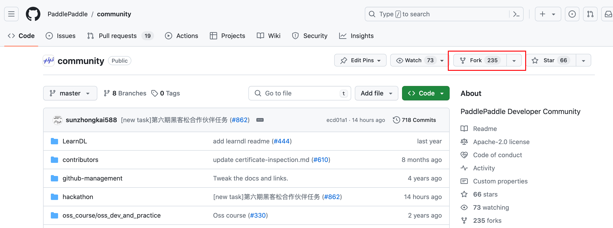
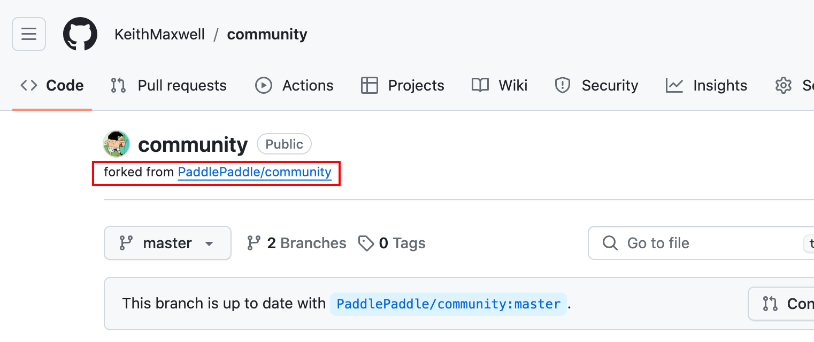
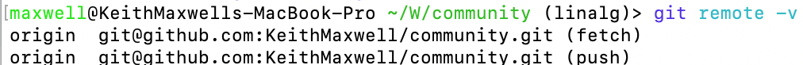

# Github使用指南

## PR提交

PR即Pull Request

Pull Request（拉取请求）是一种在版本控制系统（如Git）中使用的功能，通常用于协作开发项目。当一个开发者在自己的分支上完成了一些更改并希望将这些更改合并到项目的主分支或其他分支时，他们会创建一个Pull Request。这个Pull Request包含了他们所做的更改的详细描述以及请求将这些更改合并到目标分支的请求。

其他团队成员可以审查Pull Request，并提供反馈、建议或修改请求。一旦所有的讨论和修改都完成，并且项目负责人（或者其他有权限的人员）审查并批准了这个Pull Request，那么这些更改就会被合并到目标分支中。

通过使用Pull Request，团队可以更好地控制和管理代码的质量，确保新的更改不会破坏项目的稳定性，并促进协作和知识分享。

要进行一次PR，则需要先fork要参与的项目。这次以paddlepaddle的[【Hackathon 6th】优秀稿件征集与传播](https://github.com/PaddlePaddle/Paddle/issues/62907)为例子。

首先找到要上传的库：


然后fork该库：



GitHub上的Fork（分叉）是指将一个开源项目的代码库复制到自己的GitHub账户下的操作。Fork的作用主要包括：

1. **独立开发**: Fork允许开发者在自己的账户下独立开发项目，而不影响原始项目。

2. **实验和修改**: 开发者可以在Fork后的项目中进行实验、修改和定制，而不会影响原始项目的稳定性和功能。

3. **贡献**: Fork后的项目可以提交Pull Request给原始项目，向原作者提供自己的改进或修复。这种方式使得开源项目的贡献者可以轻松地为项目做出贡献。

4. **学习**: Fork还可以作为学习他人代码的途径。通过Fork别人的项目，你可以阅读、学习和理解别人的代码，从中获取经验和灵感。

总之，GitHub的Fork功能为开发者提供了一种简单有效的方式来参与开源项目，并促进了开源社区的发展和进步。

我们这里就是要使用到贡献的功能。

fork该库之后，就能在自己的主页看到这个仓库了：



还可以看到这个库是从哪儿fork过来的。

现在我们就可以将这个库通过`git clone`到本地，做修改了。

```shell
git clone xxxx.git
```

注意：最好选择ssh的链接，如果配置了ssh密钥则可以免密push。

当项目克隆到本地之后，我们就可以对其作出修改了。

通常我们会建立本地的新分支，一般从 master 分支上创建新分支。：

```shell
git checkout -b 分支名
```

建立了新分支之后，可以将我们的修改提交。（git add和commit）

> 注意⚠️：一定要配置本地git的用户名和用户邮箱:
>
> ```shell
> git config user.name 你的用户名
> git config user.email 你的邮箱
> ```
>
> 注意：这里的邮箱应该是你绑定在github上的邮箱。或者你要使用一个新的邮箱，则需要将这个新的邮箱绑定到github上。

在准备发起 Pull Request 之前，需要同步原仓库最新文件内容。

首先通过 git remote 查看当前远程仓库的名字。

```shell
git remote -v
```



这里 origin 是你 clone 的远程仓库的名字，也就是自己用户名下的 community，接下来创建一个原始 community 仓库的远程主机，命名为 upstream。

```shell
git remote add upstream git@github.com:KeithMaxwell/community.git
```

获取 upstream 的最新代码并更新当前分支。

```shell
git fetch upstream
git pull upstream master
```

将本地的修改推送到 GitHub 上:

```shell
git push origin 分支名
```

注意这里的分支名是你之前用check out设置的分支名