# Linux

## 用户管理

### 查看已有用户以及其默认的shell

查看`/etc/passwd`文件中的内容即可。

```shell
cat /etc/passwd
```

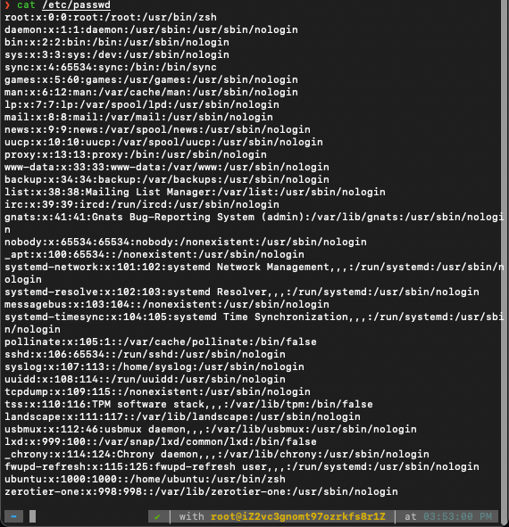


### 1. 用户

#### 添加用户

```shell
useradd -m username
```

该命令为用户创建相应的帐号和用户目录/home/username；

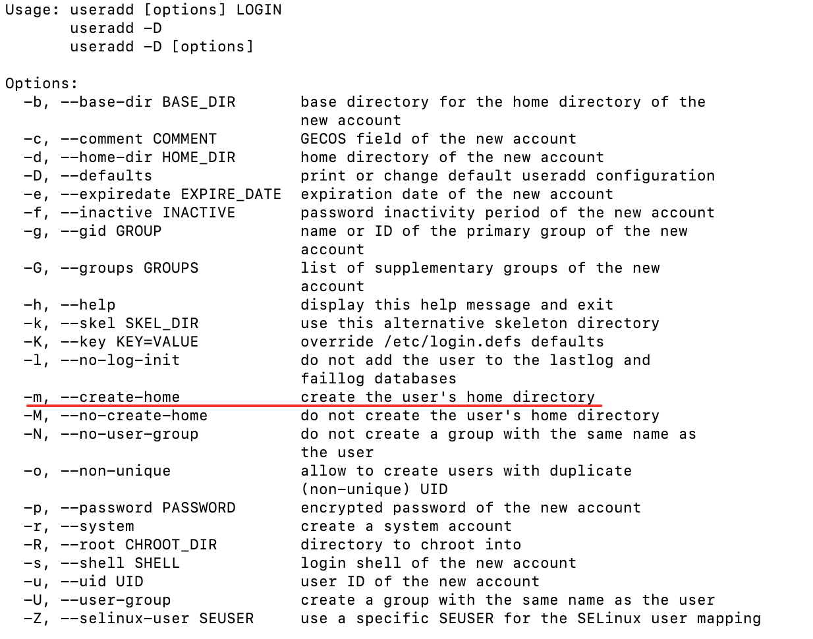

用户添加之后，设置密码：

密码以交互方式创建:

```shell
passwd username
```

#### 删除用户

```shell
userdel -r username
```

不带选项使用 userdel，只会删除用户。用户的家目录将仍会在/home目录下。要完全的删除用户信息，使用-r选项；

帐号切换 登录帐号为userA用户状态下，切换到userB用户帐号工作:

```shell
su userB
```

进入交互模型，输入密码授权进入；

### 2. 用户的组
#### 将用户加入到组

默认情况下，添加用户操作也会相应的增加一个同名的组，用户属于同名组； 查看当前用户所属的组:

```shell
groups
```

一个用户可以属于多个组，将用户加入到组:

```shell
usermod -G groupName username
```

变更用户所属的根组(将用加入到新的组，并从原有的组中除去）:

```shell
usermod -g groupName username
```

#### 查看系统所有组
系统的所有用户及所有组信息分别记录在两个文件中：/etc/passwd , /etc/group 默认情况下这两个文件对所有用户可读：

查看所有用户及权限:

```shell
more /etc/passwd
```

查看所有的用户组及权限:

```shell
more /etc/group
```

### 3. 用户权限

使用`ls -l`可查看文件的属性字段，文件属性字段总共有10个字母组成，第一个字母表示文件类型，如果这个字母是一个减号”-”,则说明该文件是一个普通文件。字母”d”表示该文件是一个目录，字母”d”,是dirtectory(目录)的缩写。 后面的9个字母为该文件的权限标识，3个为一组，分别表示文件所属用户、用户所在组、其它用户的读写和执行权限； 例如:

```shell
ls -l /etc/group
## -rwxrw-r-- colin king 725 2013-11-12 15:37 /home/colin/a
```

表示这个文件对文件拥有者colin这个用户可读写、可执行；对colin所在的组（king）可读可写；对其它用户只可读；

#### 更改读写权限

使用chmod命令更改文件的读写权限，更改读写权限有两种方法，一种是字母方式，一种是数字方式

字母方式:

```shell
chmod userMark(+|-)PermissionsMark
```

userMark取值：

- u：用户
- g：组
- o：其它用户
- a：所有用户

PermissionsMark取值：

- r:读
- w：写
- x：执行

例如:

```shell
chmod a+x main         ## 对所有用户给文件main增加可执行权限
chmod g+w blogs        ## 对组用户给文件blogs增加可写权限
```

数字方式：

数字方式直接设置所有权限，相比字母方式，更加简洁方便；

使用三位八进制数字的形式来表示权限，第一位指定属主的权限，第二位指定组权限，第三位指定其他用户的权限，每位通过4(读)、2(写)、1(执行)三种数值的和来确定权限。如6(4+2)代表有读写权，7(4+2+1)有读、写和执行的权限。

例如:

```shell
chmod 740 main     ## 将main的用户权限设置为rwxr-----
```

#### 更改文件或目录的拥有者

```shell
chown username dirOrFile
```

Chown: change owner

使用-R选项递归更改该目下所有文件的拥有者:

```shell
chown -R weber server/
```

#### 赋予sudo权限

为用户赋予sudo权限（通过添加用户到用户组的方式）：

```shell
usermod -a -G sudo username
```

注意这里是sudo，而不是root。这里是Debian类的系统才可以。如果是redhat，则是wheel用户组有sudo权限。

在CentOS和其他基于RedHat的发行版本中，wheel组的成员默认具有sudo权限。

```shell
sudo usermod -aG wheel 用户名
```

在Unix/Linux发行版中，usermod命令用于通过命令行修改或更改已创建用户帐户的任何属性

-a选项与-G选项一起使用，用于将用户添加到辅助组

这意味着，如果你想将一个用户添加到一个已存在的附加组，你可以使用usermod -a -G命令。

例如，如果你想将用户username添加到groupname组，你可以使用以下命令：usermod -a -G groupname username。

这将把username添加到groupname组，而不会影响用户的其他组成员资格。

如果不使用-a选项，用户将从所有其他组中删除，只添加到指定的组。

因此，-a选项在添加用户到新组时非常有用，因为它保留了用户的现有组成员资格。

注意：不要修改`/etc/sudoers`文件的存取权限，否则会出现一个很难处理的问题：

```
sudo: /etc/sudoers is world writable
sudo: no valid sudoers sources found, quitting
sudo: unable to initialize policy plugin
```

您遇到的错误消息表明 sudoers 文件的权限存在问题。 sudoers 文件 (/etc/sudoers) 不应被 root 用户以外的任何人写入。该错误消息警告您该文件是全局可写的，这是一个安全风险。

To fix this issue, you'll need to correct the permissions on the sudoers file. Here's a general approach:

1. Boot into single-user mode or use a root shell to have administrative privileges.

2. Run the following command to change the permissions of the sudoers file:

   ```
   bashCopy code
   chmod 440 /etc/sudoers
   ```

   This command sets the file permissions to read and write for the owner (root) and read-only for the group and others.

3. If you can't run the above command because sudo is not working, you might need to restart the system in recovery mode or use a live CD/USB to access the filesystem and modify the permissions.

After making these changes, the sudo command should work correctly. Ensure that only the root user has write permissions to the sudoers file to maintain security. If you encounter any issues or need further assistance, please provide additional details about your system, and I'll do my best to help.

如果没有root账户，则需要进入recovery mode才能修改了。（使用网上其他找到的方法都不太行）

直接修改sudoers文件：sudoers文件定义了哪些用户和组具有sudo权限。您可以通过编辑此文件来为用户添加sudo权限。要编辑sudoers文件，**请使用`visudo`命令**，这个命令在保存文件时会检查语法错误。如果您希望用户在使用sudo时不需要输入密码，可以在文件末尾添加以下行：

```shell
用户名 ALL=(ALL) NOPASSWD:ALL
```


### 4. 环境变量

bashrc与profile都用于保存用户的环境信息，bashrc用于交互式non-loginshell，而profile用于交互式login shell。

`/etc/profile，/etc/bashrc` 是系统全局环境变量设定

`~/.profile，~/.bashrc`用户目录下的私有环境变量设定

当登入系统获得一个shell进程时，其读取环境设置脚本分为三步:

1. 首先读入的是全局环境变量设置文件/etc/profile，然后根据其内容读取额外的文档，如/etc/profile.d和/etc/inputrc
2. 读取当前登录用户Home目录下的文件~/.bash_profile，其次读取~/.bash_login，最后读取~/.profile，这三个文档设定基本上是一样的，读取有优先关系
3. 读取~/.bashrc

~/.profile与~/.bashrc的区别:

- 这两者都具有个性化定制功能
- ~/.profile可以设定本用户专有的路径，环境变量，等，它只能登入的时候执行一次
- ~/.bashrc也是某用户专有设定文档，可以设定路径，命令别名，每次shell script的执行都会使用它一次

例如，我们可以在这些环境变量中设置自己经常进入的文件路径，以及命令的快捷方式：

```shell
.bashrc
alias m='more'
alias cp='cp -i'
alias mv='mv -i'
alias ll='ls -l'
alias lsl='ls -lrt'
alias lm='ls -al|more'

log=/opt/applog/common_dir
unit=/opt/app/unittest/common

.bash_profile
. /opt/app/tuxapp/openav/config/setenv.prod.sh.linux
export PS1='$PWD#'
```

通过上述设置，我们进入log目录就只需要输入cd $log即可；


## 存储结构与管理硬盘

### 1. **一切从“/”开始**

在Linux系统中，目录、字符设备、套接字、硬盘、光驱、打印机等都被抽象成文件形式，即[刘遄](https://www.linuxprobe.com/)老师一直强调的“Linux系统中一切都是文件”。

在Linux系统中，最常见的目录以及所对应的存放内容如下表所示。

| 目录名称    | 应放置文件的内容                                             |
| ----------- | ------------------------------------------------------------ |
| /boot       | 开机所需文件—内核、开机菜单以及所需配置文件等                |
| /dev        | 以文件形式存放任何设备与接口                                 |
| **/etc**    | **配置文件**                                                 |
| /home       | 用户主目录                                                   |
| /bin        | 存放单用户模式下还可以操作的[命令](https://www.linuxcool.com/) |
| /lib        | 开机时用到的函数库，以及/bin与/sbin下面的命令要调用的函数    |
| /sbin       | 开机过程中需要的命令                                         |
| /media      | 用于挂载设备文件的目录                                       |
| /opt        | 放置第三方的软件                                             |
| /root       | 系统管理员的家目录                                           |
| /srv        | 一些网络服务的数据文件目录                                   |
| /tmp        | 任何人均可使用的“共享”临时目录                               |
| /proc       | 虚拟文件系统，例如系统内核、进程、外部设备及网络状态等       |
| /usr/local  | 用户自行安装的软件                                           |
| /usr/sbin   | Linux系统开机时不会使用到的软件/命令/[脚本](https://www.linuxcool.com/) |
| /usr/share  | 帮助与说明文件，也可放置共享文件                             |
| /var        | 主要存放经常变化的文件，如日志                               |
| /lost+found | 当文件系统发生错误时，将一些丢失的文件片段存放在这里         |

### 2. 物理设备的命名规则

在Linux系统中一切都是文件，硬件设备也不例外。既然是文件，就必须有文件名称。系统内核中的udev设备管理器会自动把硬件名称规范起来，目的是让用户通过设备文件的名字可以猜出设备大致的属性以及分区信息等；这对于陌生的设备来说特别方便。另外，udev设备管理器的服务会一直以守护进程的形式运行并侦听内核发出的信号来管理/dev目录下的设备文件。Linux系统中常见的硬件设备及其文件名称如下表所示。

| 硬件设备      | 文件名称           |
| ------------- | ------------------ |
| IDE设备       | /dev/hd[a-d]       |
| SCSI/SATA/U盘 | /dev/sd[a-z]       |
| virtio设备    | /dev/vd[a-z]       |
| 软驱          | /dev/fd[0-1]       |
| 打印机        | /dev/lp[0-15]      |
| 光驱          | /dev/cdrom         |
| 鼠标          | /dev/mouse         |
| 磁带机        | /dev/st0或/dev/ht0 |

IDE以及软驱现在已经很少见了。所以一般的硬盘设备都是以`/dev/sd`开头。而一台主机上可以有多块硬盘，因此系统采用a～z来代表26块不同的硬盘（默认从a开始分配），而且硬盘的分区编号也很有讲究：

> 主分区或扩展分区的编号从1开始，到4结束；
>
> 逻辑分区从编号5开始。

国内很多Linux培训讲师以及很多知名Linux图书在讲到设备和分区名称时，总会讲错两个知识点。第一个知识点是设备名称的理解错误。很多培训讲师和Linux技术图书中会提到，比如/dev/sda表示主板上第一个插槽上的存储设备，学员或读者在实践操作的时候会发现果然如此，因此也就对这条理论知识更加深信不疑。但真相不是这样的，/dev目录中sda设备之所以是a，并不是由插槽决定的，而是由系统内核的识别顺序来决定的，而恰巧很多主板的插槽顺序就是系统内核的识别顺序，因此才会被命名为/dev/sda。大家以后在使用iSCSI网络存储设备时就会发现，明明主板上第二个插槽是空着的，但系统却能识别到/dev/sdb这个设备—就是这个道理。

第二个知识点是对分区名称的理解错误。很多Linux培训讲师会告诉学员，分区的编号代表分区的个数。比如sda3表示这是设备上的第3个分区，而学员在做实验的时候确实也会得出这样的结果。但是这个理论知识是错误的，因为分区的数字编码不一定是强制顺延下来的，也有可能是手工指定的。因此sda3只能表示是编号为3的分区，而不能判断sda设备上已经存在了3个分区。

在填了这两个“坑”之后，再来分析一下/dev/sda5这个设备文件名称包含哪些信息，如图6-2所示。


### 4. 挂载硬件设备

mount命令用于挂载文件系统，格式为“mount文件系统 挂载目录”。

mount命令中可用的参数及作用如夏表所示。

| 参数 | 作用                                 |
| ---- | ------------------------------------ |
| -a   | 挂载所有在/etc/fstab中定义的文件系统 |
| -t   | 指定文件系统的类型                   |

挂载是在使用硬件设备前所执行的最后一步操作。只需使用mount命令把硬盘设备或分区与一个目录文件进行关联，然后就能在这个目录中看到硬件设备中的数据了。

对于比较新的Linux系统来讲，一般不需要使用`-t`参数来指定文件系统的类型，Linux系统会自动进行判断。

而mount中的`-a`参数则厉害了，它会在执行后自动检查`/etc/fstab`文件中有无被疏漏挂载的设备文件，如果有，则进行自动挂载操作。

例如，要把设备/dev/sdb2挂载到/backup目录，只需要在mount命令中填写设备与挂载目录参数就行，系统会自动判断要挂载文件的类型，命令如下：

```shell
mount /dev/sdb2 /backup
```

### 磁盘信息

常用的磁盘信息查看命令，通常有三种。

#### df

最常用的形式：

```shell
df -h
```

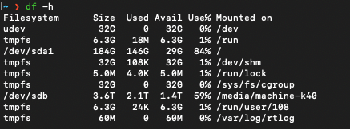

该命令可以查看已挂载的磁盘的大小以及使用情况，另外最后还有挂载点。

Linux df（英文全拼：disk free） 命令用于显示目前在 Linux 系统上的文件系统磁盘使用情况统计。

```
df [选项]... [FILE]...
```

- 文件-a, --all 包含所有的具有 0 Blocks 的文件系统
- 文件--block-size={SIZE} 使用 {SIZE} 大小的 Blocks
- 文件-h, --human-readable 使用人类可读的格式(预设值是不加这个选项的...)
- 文件-H, --si 很像 -h, 但是用 1000 为单位而不是用 1024
- 文件-i, --inodes 列出 inode 资讯，不列出已使用 block
- 文件-k, --kilobytes 就像是 --block-size=1024
- 文件-l, --local 限制列出的文件结构
- 文件-m, --megabytes 就像 --block-size=1048576
- 文件--no-sync 取得资讯前不 sync (预设值)
- 文件-P, --portability 使用 POSIX 输出格式
- 文件--sync 在取得资讯前 sync
- 文件-t, --type=TYPE 限制列出文件系统的 TYPE
- 文件-T, --print-type 显示文件系统的形式
- 文件-x, --exclude-type=TYPE 限制列出文件系统不要显示 TYPE
- 文件-v (忽略)
- 文件--help 显示这个帮手并且离开
- 文件--version 输出版本资讯并且离开

显示文件系统的磁盘使用情况统计：

```
# df 
Filesystem     1K-blocks    Used     Available Use% Mounted on 
/dev/sda6       29640780 4320704     23814388  16%     / 
udev             1536756       4     1536752    1%     /dev 
tmpfs             617620     888     616732     1%     /run 
none                5120       0     5120       0%     /run/lock 
none             1544044     156     1543888    1%     /run/shm 
```

第一列指定文件系统的名称，第二列指定一个特定的文件系统1K-块1K是1024字节为单位的总内存。用和可用列正在使用中，分别指定的内存量。

使用列指定使用的内存的百分比，而最后一栏"安装在"指定的文件系统的挂载点。

#### lsblk

最常用的形式是

```shell
lsblk -f # 显示UUID
# 或
lsblk
```

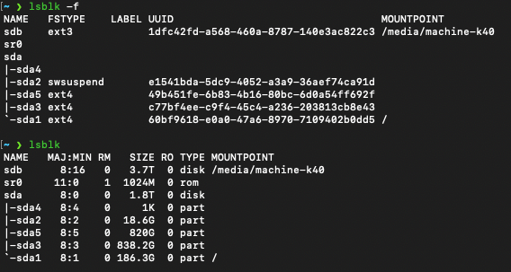

7个栏目名称如下：

1. **NAME** ：这是块设备名。
2. **MAJ:MIN** ：本栏显示主要和次要设备号。
3. **RM** ：本栏显示设备是否可移动设备。注意，在本例中设备sdb和sr0的RM值等于1，这说明他们是可移动设备。
4. **SIZE** ：本栏列出设备的容量大小信息。例如298.1G表明该设备大小为298.1GB，而1K表明该设备大小为1KB。
5. **RO** ：该项表明设备是否为只读。在本案例中，所有设备的RO值为0，表明他们不是只读的。
6. **TYPE** ：本栏显示块设备是否是磁盘或磁盘上的一个分区。在本例中，sda和sdb是磁盘，而sr0是只读存储（rom）。
7. **MOUNTPOINT** ：本栏指出设备挂载的挂载点。


loop设备是一种伪设备，是使用文件来模拟块设备的一种技术，文件模拟成块设备后, 就像一个磁盘或光盘一样使用。在使用之前，一个 loop 设备必须要和一个文件进行连接。这种结合方式给用户提供了一个替代块特殊文件的接口。因此，如果这个文件包含有一个完整的文件系统，那么这个文件就可以像一个磁盘设备一样被 mount 起来。之所以叫loop设备（回环），其实是从文件系统这一层来考虑的，因为这种被 mount 起来的镜像文件它本身也包含有文件系统，通过loop设备把它mount起来，它就像是文件系统之上再绕了一圈的文件系统，所以称为 loop。


原文链接：https://blog.csdn.net/scaleqiao/article/details/46777811

可以显示所有的设备，并显示其挂载点。

1. **获取命令帮助**：

   ```
   $ lsblk --help
   ```

   

2. **查看命令版本**：

   ```
   $ lsblk -V
   ```

   

3. **列出所有块设备**：

   ```
   $ lsblk -a
   ```

   

4. **查看 SCSI 信息**：

   ```
   $ lsblk -S
   ```

   

5. **查看指定块设备信息**：

   ```
   $ lsblk /dev/sda1
   $ lsblk /dev/sda
   ```

   

6. **查看块设备的文件系统类型及 UUID**：

   ```
   $ lsblk -f
   ```

   

7. **查看块设备的完整路径**：

   ```
   $ lsblk -p
   ```

   

8. **以列表形式展示块设备**： 默认以树状形式展示：

   ```
   $ lsblk -lp
   ```

`lsblk` 命令对于管理和了解系统中的磁盘设备非常有用。

#### fdisk

`fdisk` 是一个 Linux 命令行工具，用于管理磁盘分区。它允许用户查看、创建、调整大小、删除、移动和复制分区。虽然它不支持 GUID 分区表（GPT），但它支持 MBR、Sun、SGI 和 BSD 分区表

以下是关于 `fdisk` 的一些重要信息：

- **命令含义**：`fdisk` 的全称是 **固定磁盘**（Fixed Disk）或 **格式化磁盘**（Format Disk）。
- **功能**：`fdisk` 允许用户在硬盘上查看、创建、调整大小、删除、移动和复制分区。
- **分区表支持**：它支持 MBR、Sun、SGI 和 BSD 分区表，但不支持 GUID 分区表（GPT）。
- **分区数量限制**：每块硬盘最多可以创建四个主分区，其中一个可以作为扩展分区，下设多个逻辑分区。
- **使用建议**：对于大分区操作，请使用其他工具，如 `parted` 或 `cfdisk`。
- **安装**：`fdisk` 作为核心组件内置于 Linux 中，无需手动安装。

如果你想查看特定分区的信息，可以使用以下命令：

```
$ sudo fdisk -l /dev/sda
```

此命令将列出指定硬盘的分区信息，包括分区的起始、结束扇区、大小和文件系统类型。在日常管理中，`fdisk` 是一个非常有用的工具，帮助管理员管理磁盘分区并确保系统正常运行。

最常使用的格式就是：

```shell
sudo fdisk -l
```

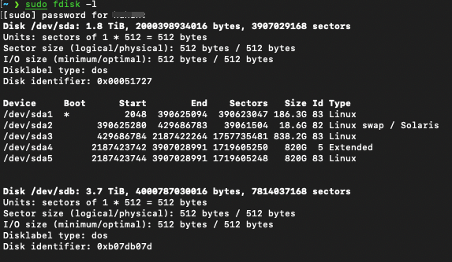

### 挂载磁盘

先使用lsblk命令查看各个设备的挂载点。下面是一个例子：

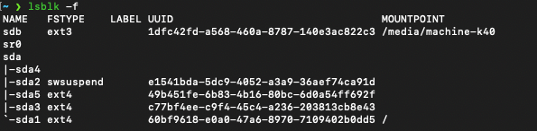

可以看到，只有sda1和sdb两个设备挂载了，其他的设备没有挂载。

这里以挂载sd5设备为例子（挂载设备到新建的文件夹）。

首先可以新建一个文件夹：

```shell
sudo mkdir /disk5
```

接下来要使用mount命令进行挂载：

mount命令用于挂载文件系统，格式为“mount文件系统 挂载目录”。

mount命令中可用的参数及作用如夏表所示。

| 参数 | 作用                                 |
| ---- | ------------------------------------ |
| -a   | 挂载所有在/etc/fstab中定义的文件系统 |
| -t   | 指定文件系统的类型                   |

挂载是在使用硬件设备前所执行的最后一步操作。只需使用mount命令把硬盘设备或分区与一个目录文件进行关联，然后就能在这个目录中看到硬件设备中的数据了。

对于比较新的Linux系统来讲，一般不需要使用`-t`参数来指定文件系统的类型，Linux系统会自动进行判断。

而mount中的`-a`参数则厉害了，它会在执行后自动检查`/etc/fstab`文件中有无被疏漏挂载的设备文件，如果有，则进行自动挂载操作。

例如，要把设备/dev/sdb2挂载到/backup目录，只需要在mount命令中填写设备与挂载目录参数就行，系统会自动判断要挂载文件的类型，命令如下：

```shell
mount /dev/sdb2 /backup
```

将`sdb5`挂载到`/disk5`：

```shell
sudo mount /dev/sda5 /disk5
```

挂载成功后，可以使用lsblk命令查看：

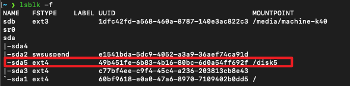

#### 自动挂载

用上面这种方式挂载磁盘是临时的，机器重启后不会自动挂载。可以将信息写入`/etc/fstab`中，这样系统开机后会自动挂载磁盘。

这里就要使用到UUID了。

查看现在系统中已有的信息：

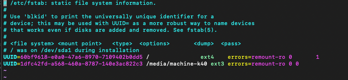

新增sda5设备：

```yaml
# /etc/fstab: static file system information.
#
# Use 'blkid' to print the universally unique identifier for a
# device; this may be used with UUID= as a more robust way to name devices
# that works even if disks are added and removed. See fstab(5).
#
# <file system> <mount point>   <type>  <options>       <dump>  <pass>
# / was on /dev/sda1 during installation
UUID=60bf9618-e0a0-47a6-8970-7109402b0dd5 /               ext4    errors=remount-ro 0       1
UUID=1dfc42fd-a568-460a-8787-140e3ac822c3 /media/machine-k40 ext3 errors=remount-ro 0 0
UUID=49b451fe-6b83-4b16-80bc-6d0a54ff692f /disk5 					ext4 		errors=remount-ro 0 0 # 新增的disk5
```

这样系统开机时就会自动将sd5设备挂载到`/disk5`文件夹了。

#### 取消挂载

使用umount命令取消挂载磁盘。

```shell
sudo umount /dev/sda5
```


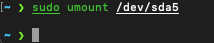

指令执行成功不会有输出。


## 配置文件

通常，Linux系统中软件的配置文件都是存放在`/etc`中的。这通常是全局配置文件的存放地点。

对于ssh服务来说，它的配置文件其实存放于`/etc/ssh`中。

## crontab定时任务

### crontab 命令

crontab 命令格式如下：

```shell
crontab [-u user] file crontab [-u user] [ -e | -l | -r ]
```

说明：

- `-u user`：用来设定某个用户的 crontab 服务；
- `file`：file 是命令文件的名字，表示将 file 做为 crontab 的任务列表文件并载入 crontab。如果在命令行中没有指定这个文件，crontab 命令将接受标准输入（键盘）上键入的命令，并将它们载入 crontab。
- `-e`：编辑某个用户的 crontab 文件内容。如果不指定用户，则表示编辑当前用户的 crontab 文件。
- `-l`：显示某个用户的 crontab 文件内容，如果不指定用户，则表示显示当前用户的 crontab 文件内容。
- `-r`：从/var/spool/cron 目录中删除某个用户的 crontab 文件，如果不指定用户，则默认删除当前用户的 crontab 文件。
- `-i`：在删除用户的 crontab 文件时给确认提示。

有两种方法写入定时任务：

- 在命令行输入：`crontab -e` 然后添加相应的任务，存盘退出。
- 直接编辑 `/etc/crontab` 文件，即 `vi /etc/crontab`，添加相应的任务。

> 最主要的两个用法就是`crontab -e`添加相应的任务，以及`crontab -l`查看相应的任务。

### crontab 文件

crontab 要执行的定时任务都被保存在 `/etc/crontab` 文件中。

crontab 的文件格式如下：

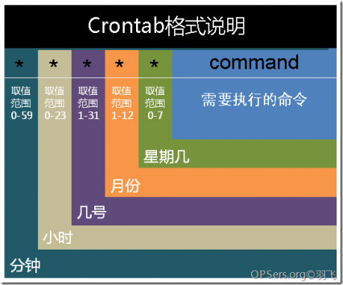

#### 标准字段

**逗号**用于分隔列表。例如，在第 5 个字段(星期几)中使用 `MON,WED,FRI` 表示周一、周三和周五。

**连字符**定义范围。例如，`2000-2010` 表示 2000 年至 2010 年期间的每年，包括 2000 年和 2010 年。

除非用反斜杠()转义，否则命令中的**百分号(%)**会被替换成换行符，第一个百分号后面的所有数据都会作为标准输入发送给命令。

| 字段         | 是否必填 | 允许值          | 允许特殊字符 |
| :----------- | :------- | :-------------- | :----------- |
| Minutes      | 是       | 0–59            | `*`,`-`      |
| Hours        | 是       | 0–23            | `*`,`-`      |
| Day of month | 是       | 1–31            | `*`,`-`      |
| Month        | 是       | 1–12 or JAN–DEC | `*`,`-`      |
| Day of week  | 是       | 0–6 or SUN–SAT  | `*`,`-`      |

`/etc/crontab` 文件示例：

```shell
SHELL=/bin/bash
PATH=/sbin:/bin:/usr/sbin:/usr/bin
MAILTO=root

# For details see man 4 crontabs

# Example of job definition:
# .---------------- minute (0 - 59)
# |  .------------- hour (0 - 23)
# |  |  .---------- day of month (1 - 31)
# |  |  |  .------- month (1 - 12) OR jan,feb,mar,apr ...
# |  |  |  |  .---- day of week (0 - 6) (Sunday=0 or 7) OR sun,mon,tue,wed,thu,fri,sat
# |  |  |  |  |
# *  *  *  *  * user-name  command to be executed

# 每两个小时以root身份执行 /home/hello.sh 脚本
0 */2 * * * root /home/hello.sh
```


在每天0点0分运行一段脚本的crontab文件：

```shell
0 0 * * * /root/gitea_backup/backup.sh
```

> ⚠️：一定要确保要运行的文件有运行权限：
>
> ```shell
> chmod +x file
> ```
>
> 如果没有运行权限则定时任务无法进行。

## 杂项

### 1. [Mac下Homebrew安装的软件放在什么地方](https://www.cnblogs.com/EasonJim/p/7875920.html)

**一般情况是这么操作的：**

1、通过brew install安装应用最先是放在/usr/local/Cellar/目录下。

2、有些应用会自动创建软链接放在/usr/bin或者/usr/sbin，同时也会将整个文件夹放在/usr/local

3、可以使用**brew list 软件名**确定安装位置。

**比如安装autojump应用之后会在这些地方创建（sudo find / -name "autojump"）：**

/Users/jim/Library/Logs/Homebrew/autojump
/usr/local/bin/autojump
/usr/local/Cellar/autojump
/usr/local/Cellar/autojump/22.5.1/bin/autojump
/usr/local/Cellar/autojump/22.5.1/libexec/bin/autojump
/usr/local/Cellar/autojump/22.5.1/share/autojump
/usr/local/opt/autojump
/usr/local/share/autojump
/usr/local/var/homebrew/linked/autojump

另外一种方法：

```
brew --prefix mycli
# 输出
/usr/local/opt/mycli
```

**特殊情况：**

如果发现哪些应用没有软链接的，那么这个应用就是很老没人维护的，此时需要自己手动链接到/usr/bin下来使用。

**其它查找应用路径的方式（brew config | grep HOMEBREW）：**

HOMEBREW_VERSION: 1.3.8
HOMEBREW_PREFIX: /usr/local
HOMEBREW_GIT_CONFIG_FILE: /usr/local/Homebrew/.git/config

https://segmentfault.com/q/1010000008185835/a-1020000008217599

https://github.com/Homebrew/legacy-homebrew/issues/46275

https://stackoverflow.com/questions/31622073/brew-change-package-install-location

### 2. Linux服务器 scp/ssh 配置免密码

案例： 

* 服务器A对服务器B、C进行ssh连接，免输入密码
* 或服务器A向服务器B、C复制文件(源文件在服务器A上)，免输入密码 

主机：

* 主机A：192.168.0.221 
* 主机B：192.168.0.227  
* 主机C：192.168.0.228 

配置步骤：

1. 配置地址映射

   1. 打开/etc/hosts文件

   2. 追加内容：

      ```shell
      # 域名         别名
      192.168.0.221 A
      192.168.0.227 B
      192.168.0.228 C
      ```

   三台主机都要这么配置，对于配置的自己的别名，相当于冗余了。虽然多配置了自己的地址映射，但这样配置可以使用multiExec，一次性配置好所有主机。

2. 各自生成密钥

   ```shell
   ssh-keygen # 生成公钥以及私钥
   ```

3. 分发密钥

   ```shell
   ssh-copy-id host
   ```

   分发密钥的时候，会把`~/.ssh/id_rsa.pub`文件的内容追加到host的`~/.ssh/authorized_keys`文件中。这一步是通过ssh来完成的。也就是说，如果本机的当前用户是maxwell，则会向你询问 `ssh maxwell@host`的密码。如果host主机没有这个用户，则会失败。

   可以在使用该命令时制定要登陆的用户：

   ```shell
    ssh-copy-id root@host	#root即为要登陆的用户
   ```

   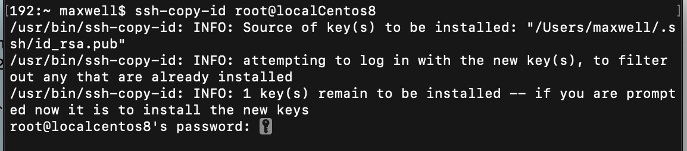

 该命令还可以通过`-i`参数指定公钥的位置：

```shell
ssh-copy-id -i .ssh/id_rsa.pub  用户名字@host
```

另外，ssh-copy-id使用默认的ssh端口号，即22端口，可以在命令中指明端口号：

```shell
ssh-copy-id -p 端口号 用户名字@host
```

还可以通过修改`.ssh`文件夹中的配置文件来实现上面的操作：

修改文件`~/.ssh/config`

```shell
Host 192.168.2.173
  HostName 192.168.2.173
  User ubuntu
  Port 2222
```

现在可直接通过命令：

```shell
ssh-copy-id host
```

来分发密钥了。

### 3. oh my zsh安装与配置

#### 安装

很神奇的事，mac使用ohmyz.sh网站提供的curl或wget方式安装的命令都无法使用，报错为：

```shell
➜  ~    sh -c "$(curl -fsSL https://raw.github.com/ohmyzsh/ohmyzsh/master/tools/install.sh)"
curl: (7) Failed to connect to raw.githubusercontent.com port 443: Connection refused
➜  ~ 
```

（wget也差不多，都是显示Connection refused）

现在的办法就是我们直接将这个安装脚本文件下载下来。

直接在浏览器中输入：

```
https://raw.github.com/ohmyzsh/ohmyzsh/master/tools/install.sh
```

然后会得到一个网页，里面的内容就是安装脚本的内容。全选复制后，在电脑中创建一个脚本文件来存储这些内容：

```shell
touch install.sh
vim install.sh
```

将复制的内容粘贴到install.sh文件中即可。

然后修改该文件为可执行文件（难得想直接777）：

```shell
chmod 777 install.sh
./install.sh
```

安装完成。

注意oh my zsh安装脚本会clone github上的内容，所以确保上述操作都是在搭梯子后完成的。

#### 配置一些好用的插件

当安装完oh my zsh时，默认会配置一个插件，即git。我们可以下载一些好用的插件，例如用于zsh的高亮插件 zsh-syntax-highlighting：

##### 高亮

zsh-syntax-highlighting 插件为 shell zsh 提供语法高亮显示。当命令在 zsh 提示符下输入到交互式终端时，它可以突出显示命令。这有助于在运行命令之前检查命令，特别是捕获语法错误。

主页地址：https://github.com/zsh-users/zsh-syntax-highlighting

###### 安装

执行下面的命令安装 zsh-syntax-highlighting：

```shell
cd ~/.oh-my-zsh/custom/plugins/
git clone https://github.com/zsh-users/zsh-syntax-highlighting.git
```

###### 配置

接着打开 ~/.zshrc 文件进行编辑。找到 plugins，我们需要把高亮插件加上：

```
plugins=(
	git
	zsh-syntax-highlighting
)
```

请务必保证插件顺序，zsh-syntax-highlighting 必须在最后一个。

然后在文件末尾添加：

```shell
source ~/.oh-my-zsh/custom/plugins/zsh-syntax-highlighting/zsh-syntax-highlighting.zsh
```

保存退出之后，source .zshrc即可。

### 4. vim简易配置

配置语法高亮、自动换行、tab为4个空格等。

在`~`文件中找到.vimrc文件，改文件是vim的配置文件。如果没有，则直接创建该文件即可。

添加如下内容：

```shell
syntax on
set ts=4
set softtabstop=4
set shiftwidth=4
set expandtab
set autoindent
```

### 5. VMare设置共享文件夹

#### 步骤一：VMware设置共享文件夹

假设我们设置的共享文件夹为：`A:/VMShare`

运行linux系统，如果以上步骤在linux系统开机的时候进行的则重启linux系统

输入命令`vmware-hgfsclient`查看共享目录是否已经设置成功:


#### 步骤二：手动挂载共享目录

1. 在mnt目录下创建hgfs目录（如果没有的话）
2. 输入`vmhgfs-fuse .host:/VMShare /mnt/hgfs`进行手动挂载，其中VMShare是共享文件夹名，/mnt/hgfs是挂载目录名

到这里手动挂载已经成功，但是这种挂载每次关机就会失效，我们还得重新执行一次挂载命令

#### 步骤三：自动挂载共享目录

用vim打开/etc/fstab文件，添加一行挂载信息

```shell
.host:/VMShare /mnt/hgfs fuse.vmhgfs-fuse allow_other,defaults 0 0
```

注意这里的共享文件夹的位置一定要写成自己配置的共享文件夹位置。

使用`mount -a`指令让刚刚写入的挂载信息立即生效:

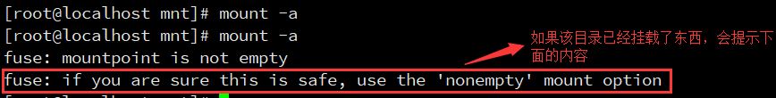

#### 步骤四：卸载共享目录

使用`umount /mnt/hgfs`卸载刚刚挂载的目录

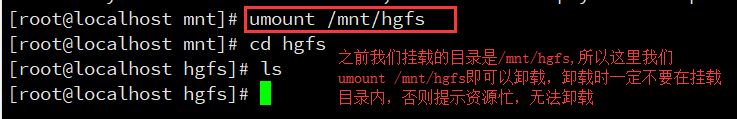

永久卸载就直接把`/etc/fstab`文件里面相关挂载记录删除即可

### 6. Zsh起始配置文件

#### Source命令

source命令也称为“点命令”，也就是一个点符号（.）,是bash的内部命令。

功能：使Shell读入指定的Shell程序文件并依次执行文件中的所有语句。

source命令通常用于重新执行刚修改的初始化文件，使之立即生效，而不必注销并重新登录。

用法：`source filename` 或 `. filename`

source命令(从 C Shell 而来)是bash shell的内置命令;点命令(.)，就是个点符号(从Bourne Shell而来)是source的另一名称。

source filename 与 sh filename 及./filename执行脚本的区别在那里呢？

1. 当shell脚本具有可执行权限时，用`sh filename`与`./filename`执行脚本是没有区别得。`./filename`是因为当前目录没有在PATH中，所有"."是用来表示当前目录的。
2. `sh filename以及./filename` 重新建立一个子shell，在子shell中执行脚本里面的语句，该子shell继承父shell的环境变量，但子shell新建的、改变的变量不会被带回父shell，除非使用export。
3. `source filename`：这个命令其实只是简单地读取脚本里面的语句依次在当前shell里面执行，没有建立新的子shell。那么脚本里面所有新建、改变变量的语句都会保存在当前shell里面。

#### Shell类型

##### Login Shell 和 Non-login Shell

* login shell：取得bash 时需要完整的登录流程的，就称为login shell。举例来说，你要由tty1～tty6 登录，需要输入用户的账号与密码，此时取得的bash 就称为“login shell”。
* non-login shell：取得 bash 接口的方法不需要重复登录的举动，举例来说，你以 X Window登录Linux后，再以X 的图形界面启动终端机，此时那个终端接口并没有需要再次输入账号与密码，那个bash 的环境就称为non-login shell 了。你在原本的bash 环境下再次执行bash这个命令，同样也没有输入账号密码，那第二个bash（子进程）也是non-login shell。

##### Interactive Shell和 Non-interactive Shell

* Interactive Shell：即需要你给出命令，然后它处理后给出输出的shell
* Non-interactive Shell：即运行脚本的shell，并不需要输入。

##### 排列组合

- **interactive login shell:** You log into a remote computer via, for example `ssh`. Alternatively, you drop to a tty on your local machine (Ctrl+Alt+F1) and log in there.
- **interactive non-login shell:** Open a new terminal.
- **non-interactive non-login shell:** Run a script. All scripts run in their own subshell and this shell is not interactive. It only opens to execute the script and closes immediately once the script is finished.
- **non-interactive login shell:** This is extremely rare, and you're unlikey to encounter it. One way of launching one is `echo command | ssh server`. When `ssh` is launched without a command (so `ssh` instead of `ssh command` which will run `command` on the remote shell) it starts a login shell. If the `stdin` of the `ssh` is not a tty, it starts a non-interactive shell. This is why `echo command | ssh server` will launch a non-interactive login shell. You can also start one with `bash -l -c command`.

#### 配置文件

Zsh 有几个系统范围（system-wide）和用户本地（User-local）配置文件。

zsh 将从以下五种启动文件中读取命令：

* zshenv
* zprofile
* zshrc
* zlogin
* zlogout

其中，系统范围的配置文件即以上5种文件。

系统范围的配置文件依赖于安装，但默认安装在 `*/etc*` 中。(`System-wide configuration files are installation-dependent but are installed in */etc* by default.`)

用户本地配置文件与它们的全局对应文件具有相同的名称，但以点（隐藏）为前缀。 Zsh 在存储在`$ZDOTDIR` 环境变量中的路径中查找这些文件。但是，如果未定义该变量，Zsh 将在用户的主目录中查找这些文件。

通常情况下，`ZDOTDIR`都是未被设置的，所以用户本地配置文件通常位于`~`文件夹中。

配置文件按以下顺序读取：

1.  /etc/zshenv
2. ~/.zshenv
3. /etc/zprofile
4. ~/.zprofile
5. /etc/zshrc
6. ~/.zshrc
7. /etc/zlogin
8. ~/.zlogin
9. ~/.zlogout
10. /etc/zlogout

##### zshenv

这个文件被 Zsh 的所有实例执行source命令，因此，它应该尽可能小，并且应该只定义环境变量。

##### zprofile

这个文件类似于zlogin，但它是在zsh source执行zshrc之前被source执行的。 它是为 KornShell（ksh）粉丝添加的。 请参阅下面对 zlogin 的描述，了解它可能包含的内容。

zprofile 和 zlogin 不打算同时使用，但可以这样做。

##### zshrc

该文件被interactive shell用source命令执行。 它应该定义别名、函数、shell 选项和键绑定。

##### zlogin

该文件由login shell source zshrc 之后source，因此，它应该包含需要在登录时执行的命令。

这不是定义别名、函数、shell 选项和键绑定的文件。 它不应该改变 shell 环境。

##### zlogout

此文件在注销期间由login shell使用source命令执行。 它应该用于显示消息和删除文件。


### 7. 安装zsh以及oh my zsh

[链接](https://zhuanlan.zhihu.com/p/38061286)

安装前，可以查看当前系统有那些shell：

```shell
chensir@ubantu:~$ cat /etc/shells
# /etc/shells: valid login shells
/bin/sh
/bin/bash
/usr/bin/bash
/bin/rbash
/usr/bin/rbash
/bin/dash
/usr/bin/dash
```

查看当前系统默认shell：

```shell
chensir@ubantu:~$ echo $SHELL
/bin/bash
```

#### 安装zsh

```shell
sudo apt install zsh -y
```

如果很慢，可能是没有设置apt源为国内源。

安装完成后，可再次查看系统中有的shell：

```shell
➜  huhan cat /etc/shells
# /etc/shells: valid login shells
/bin/sh
/bin/bash
/bin/rbash
/bin/dash
/usr/bin/tmux
/usr/bin/screen
/usr/bin/fish
/bin/zsh
/usr/bin/zsh
```

#### 设置zsh为默认shell

```shell
chsh -s /usr/bin/zsh
```

然后退出当前登录，新开一个窗口就能看到默认shell变成zsh了。

####  安装oh my zsh

使用清华镜像站安装。[链接](https://mirrors.tuna.tsinghua.edu.cn/help/ohmyzsh.git/)

在本地克隆后获取安装脚本。

```shell
git clone https://mirrors.tuna.tsinghua.edu.cn/git/ohmyzsh.git
cd ohmyzsh/tools
REMOTE=https://mirrors.tuna.tsinghua.edu.cn/git/ohmyzsh.git sh install.sh
```

#### 语法高亮

安装插件

```shell
sudo apt install zsh-syntax-highlighting
```

修改配置文件

```shell
echo "source /usr/share/zsh-syntax-highlighting/zsh-syntax-highlighting.zsh" >> ~/.zshrc
```

重新加载

```shell
source ~/.zshrc
```

重新打开终端窗口可以看到效果。

这种方式是将插件安装到`/usrshare`文件夹中，如果在`.zshrc`中plugin项加入`zsh-syntax-highlighting`会报错，即找不到它。这是因为ohmyzsh默认插件安装地址是`~/.oh-my-zsh/custom/plugins/`

使用git安装：

```shell
git clone https://github.com/zsh-users/zsh-syntax-highlighting.git ${ZSH_CUSTOM:-~/.oh-my-zsh/custom}/plugins/zsh-syntax-highlighting

# 或者使用南京大学的镜像
git clone https://mirror.nju.edu.cn/git/zsh-syntax-highlighting.git ${ZSH_CUSTOM:-~/.oh-my-zsh/custom}/plugins/zsh-syntax-highlighting
```

完成后，在`.zshrc`中修改plugins：

```shell
plugins=(
    ...
    zsh-syntax-highlighting
)
```

建议将该插件放到最后面。


#### 自动提示

安装：

```shell
git clone https://mirror.nju.edu.cn/git/zsh-autosuggestions ${ZSH_CUSTOM:-~/.oh-my-zsh/custom}/plugins/zsh-autosuggestions
```

编辑 `~/.zshrc` 在 `plugins=` 中添加 `zsh-autosuggestions`:

```shell
plugins=( ... zsh-autosuggestions)
```


## 网络

### 端口转发和端口映射

#### 什么是端口映射

端口映射：端口映射就是将内网中的主机的一个端口映射到外网主机的一个端口，提供相应的服务。当用户访问外网IP的这个端口时，服务器自动将请求映射到对应局域网内部的机器上。

比如：

我们在内网中有一台Web服务器，但是外网中的用户是没有办法直接访问该服务器的。于是我们可以在**路由器**上设置一个端口映射，**只要外网用户访问路由器ip的80端口，那么路由器会把自动把流量转到内网Web服务器的80端口上**。并且，在路由器上还存在一个Session，当内网服务器返回数据给路由器时，路由器能准确的将消息发送给外网请求用户的主机。在这过程中，路由器充当了一个反向代理的作用，他保护了内网中主机的安全。

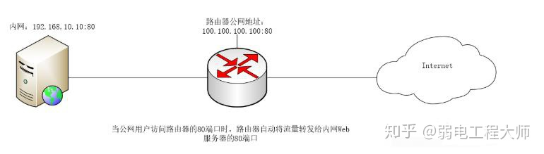

#### 什么是端口转发

端口转发：端口转发（Port forwarding），有时被叫做隧道，是安全壳（SSH） 为网络安全通信使用的一种方法。

比如，我们现在在内网中，是没有办法直接访问外网的。但是我们可以通过路由器的NAT方式访问外网。假如我们内网现在有100台主机，那么我们现在都是通过路由器的这一个公网IP和外网通信的。那么，当互联网上的消息发送回来时，路由器是怎么知道这个消息是给他的，而另外消息是给你的呢？这就要我们的**ip地址和路由器的端口进行绑定**了，这时，在路由器中就会有一个**内网ip和路由器端口对应的一张表**。当路由器的10000端口收到消息时，就知道把消息发送给他，而当20000端口收到消息时，就知道把消息发送给你。这就是端口转发，其转发一个端口收到的流量，给另一个主机。

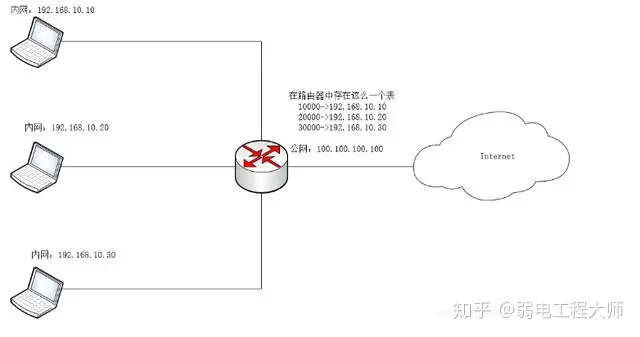

#### 两者的区别

端口转发：转发的重点在“转”上面。送快递的过来，把所有快递都交给门口保安，保安再根据每件快递上的收件人来分发。

端口映射：就是在大门口给每个人装个柜子，送快递的直接按收件人名字，把快递放到对应的柜子里面。

#### windows上实现端口映射

```shell
netsh interface portproxy add v4tov4 listenaddress=0.0.0.0 listenport=2222 connectaddress=[IP] connectport=[PORT]

# 例子
netsh interface portproxy add v4tov4 listenaddress=0.0.0.0 listenport=2222  connectaddress=172.20.160.223  connectport=2222 # 将同网段的主机172.20.160.223的2222端口映射到本机的0.0.0.0的2222端口，现在本机可以通过localhost:2222来访问该主机。
```

### 内网穿透

#### 1. 什么是内网穿透?

在了解内网穿透原理之前，我们先说什么是内网穿透。内网，就是在公司或者家庭内部，建立的局域网络或者是办公网络，可以实现多台电脑之间的资源共享，包括设备、资料、数据等。而外网则是通过一个网关与其它的网络系统连接，相对于内网而言，这种网络系统称之为外部网络，常见的就是我们日常使用的互联网。

一般而言，在没有固定公网IP的情况下，外网设备无法直接访问内网设备。而内网穿透技术，顾名思义就是能让外网的设备找到处于内网的设备，从而实现数据通信。

#### 2. 内网穿透的原理

内网穿透，又称为NAT穿透。NAT背后的设备，它们的主要特点是 ，可以访问外网，但不能被外网设备有效访问。基于这一特点，NAT穿透技术是让NAT背后的设备，先访问指定的外网服务器，由指定的外网服务器搭建桥梁，打通内、外网设备的访问通道，实现外网设备访问到内网设备。

该技术除了可以访问隐藏在NAT后的设备，同样可以穿透防火墙。这是因为防火墙一般只拦截了入站没有拦截出站，所以也可以让防火墙内的设备对外提供服务。

由于内网设备并不是与外网设备直接相连，所以在安全性上是毋庸置疑的，内网穿透可以说是安全与效率兼得。 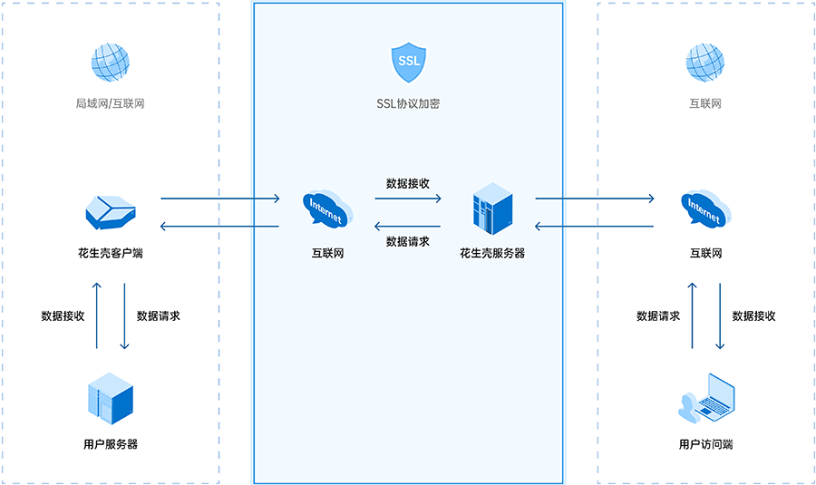

#### 3. 如何实现内网穿透

我们可以安装[花生壳](https://hsk.oray.com/)内网穿透软件，在软件上添加[映射](https://hsk.oray.com/)时，配置被访问内网设备的相关信息 ，以及选择用作外网访问该映射的[域名](https://domain.oray.com/)。当映射诊断信息提示连接成功时，即可实现内网穿透。

利用花生壳的内网穿透技术，外网的设备通过访问固定域名，连接花生壳服务器所搭建的通道，顺畅地与内网设备进行数据通信。


# AI服务器常用配置

## Cuda以及驱动

### Cuda卸载

默认使用的服务器是ubuntu。

```shell
sudo apt remove nvidia*
sudo apt remove cuda*
sudo apt remove cudnn*
```

如果你的shell是zsh，则可能没有开启`*`通配符，在用户目录中的`.zshrc`文件中加入：

```shell
setopt nonomatch 
```

如果之前是 deb 包安装的，还要操作如下步骤:

```shell
sudo apt-key list | grep cuda
```

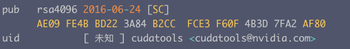

注意 ： AE09 FE4B BD22 3A84 B2CC FCE3 F60F 4B3D 7FA2 AF80 最后两端数字字母：

```shell
sudo apt-key del 7FA2AF80
```

进入仓库目录

```shell
cd 
sudo rm cuda*
```

自动清除

```shell
sudo apt autoremove
```


### Cuda安装

在nvidia提供的网址：[链接](https://developer.nvidia.com/cuda-downloads?target_os=Linux&target_arch=x86_64&Distribution=Ubuntu)，选择正确的架构和系统来安装。如果达不到最新版的cuda支持的最低系统版本，则安装以前版本的cuda。

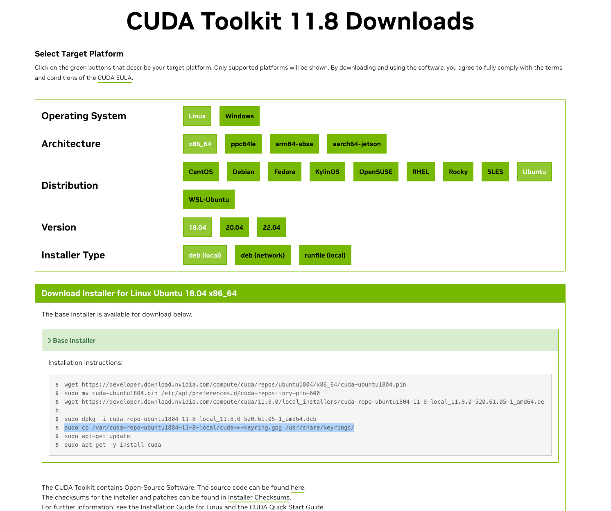

然后照着上面的指令安装即可。

### 多cuda版本

已安装某个版本的cuda后，还可以安装另一个版本的cuda。（例如平常用的cuda版本和生产要用cuda版本不同）。

第一个版本的cuda通常是使用deb安装的。要安装第二个版本的cuda，可以选择使用runfile来安装。

如果runfile安装遇到错误，可以根据提示查看

```shell
cat /var/log/nvidia-installer.log
```

然后解决错误。

常见的一个错误是服务器开启了X server，这会导致驱动安装失败。可以关闭x server再次运行runfile。

## conda

### 安装

conda可以安装miniconda（体积小）或者anaconda（2G+）。这里安装miniconda。

这四条命令可以快速、安静地安装最新的 64 位版本安装程序，然后自行清理。要安装不同版本或架构的 Miniconda for Linux，请更改 wget 命令中 .sh 安装程序的名称。

```shell
mkdir -p ~/miniconda3 # 这里是将miniconda安装到用户文件夹中
wget https://repo.anaconda.com/miniconda/Miniconda3-latest-Linux-x86_64.sh -O ~/miniconda3/miniconda.sh
bash ~/miniconda3/miniconda.sh -b -u -p ~/miniconda3
rm -rf ~/miniconda3/miniconda.sh
```

这条命令是用来安装或更新Miniconda的。让我们来详细解释一下各个部分的含义：

- `bash`：这是一个Unix shell，用于执行后面的脚本。
- `~/miniconda3/miniconda.sh`：这是要执行的脚本的路径。`~`代表你的用户主目录，`miniconda3/miniconda.sh`是在该目录下的`miniconda.sh`脚本。
- `-b`：这个选项告诉安装程序在安装过程中不需要与用户交互，所有的设置都使用默认值。
- `-u`：这个选项告诉安装程序如果已经安装了Miniconda，那么就更新它。
- `-p ~/miniconda3`：这个选项指定了安装或更新Miniconda的位置，`~/miniconda3`表示将其安装或更新在你的用户主目录下的`miniconda3`文件夹中。

总的来说，这条命令的意思是在用户主目录下的`miniconda3`文件夹中安装或更新Miniconda，并且在安装过程中使用所有的默认设置。如果`miniconda3`文件夹中已经安装了Miniconda，那么就更新它。如果没有安装Miniconda，那么就安装它。所有的这些过程都不需要用户交互。

安装后，初始化新安装的 Miniconda。以下命令用于初始化 bash 和 zsh shell：

```shell
~/miniconda3/bin/conda init bash
~/miniconda3/bin/conda init zsh
```

### 配置

设置国内源：

修改用户目录下的`.condarc`文件：

```yaml
channels:
  - https://mirrors.tuna.tsinghua.edu.cn/anaconda/cloud/conda-forge/
  - https://mirrors.tuna.tsinghua.edu.cn/anaconda/pkgs/pro/
  - https://mirrors.tuna.tsinghua.edu.cn/anaconda/pkgs/r/
  - https://mirrors.tuna.tsinghua.edu.cn/anaconda/pkgs/free/
  - https://mirrors.tuna.tsinghua.edu.cn/anaconda/pkgs/main/
  - defaults
show_channel_urls: true
```

### 设置虚拟环境默认路径

使用`conda info`命令可以查看默认路径：

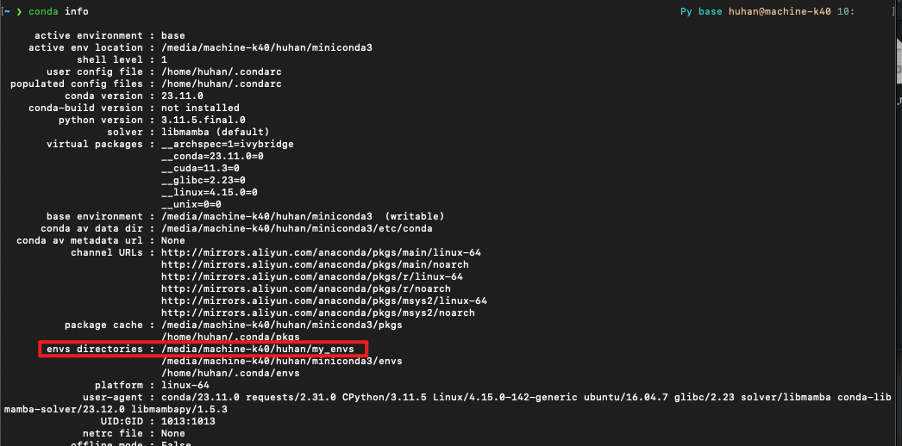

conda环境默认安装在用户目录下，如果选择默认路径，那么之后创建虚拟环境，也是安装在用户目录下。不想占用系统盘空间，可以修改conda虚拟环境路径。

(1)首先，找到用户目录下的.condarc文件（没有就创建）。

(2)打开.condarc文件之后，添加或修改.condarc 中的 env_dirs 设置环境路径，按顺序第⼀个路径作为默认存储路径，搜索环境按先后顺序在各⽬录中查找。直接在.condarc添加：

```yaml
envs_dirs:
  - /media/machine-k40/huhan/my_envs
```

然后，在Anaconda Prompt执行**conda info**命令，就可以看到修改默认环境路径成功

###  fish shell报错

如果fish版本比较低（如2.7.1），在执行了conda init之后，fish会报错：

```
- (line 1): Variables may not be used as commands. In fish, please define a function or use 'eval $CONDA_EXE'.
$CONDA_EXE shell.fish $cmd $argv
^
in command substitution
        called on line 67 of file -

in function “conda”
        called on line 147 of file -
        with parameter list “activate base”

from sourcing file -
        called on line 5 of file ~/.config/fish/config.fish

from sourcing file ~/.config/fish/config.fish
        called during startup
```

要解决这个问题只需要将fish升级到3版本以上即可。

```shell
sudo add-apt-repository ppa:fish-shell/release-3
sudo apt-get update
sudo apt-get install fish
```

升级后conda就能正常使用了。

## Pip

### 设置国内源

默认情况下 pip 使用的是国外的镜像，在下载的时候速度非常慢，本文我们介绍使用国内清华大学的源，地址为：

```
https://pypi.tuna.tsinghua.edu.cn/simple
```

我们可以直接在 pip 命令中使用 **-i** 参数来指定镜像地址，例如：

```shell
pip3 install numpy -i https://pypi.tuna.tsinghua.edu.cn/simple
```

以上命令使用清华镜像源安装 numpy 包。

这种只对当前安装对命令有用，如果需要全局修改，则需要修改配置文件。

Linux/Mac os 环境中，配置文件位置在 ~/.pip/pip.conf（如果不存在创建该目录和文件）：

```shell
mkdir ~/.pip
```

打开配置文件 **~/.pip/pip.conf**，修改如下：

```yaml
[global]
index-url = https://pypi.tuna.tsinghua.edu.cn/simple
[install]
trusted-host = https://pypi.tuna.tsinghua.edu.cn
```

### 修改默认缓存地址

Linux 安装 Python 后，使用 pip 安装软件包。

默认的 pip 缓存路径是 `~/.cache/pip`

但是如果想放到另外的文件夹，则可以执行下列命令：

> 双引号中，输入自己想保存的路径

```
pip config set global.cache-dir "/home/pi/udisk/.cache/pip"
```

会出现一个提示，即修改好了
可以看到，它其实是在用户目录的 `.config/pip/` 下创建了一个配置文件，并写入配置

```
pi@raspberrypi:~ $ pip config set global.cache-dir "/home/pi/udisk/.cache/pip"
Writing to /home/pi/.config/pip/pip.conf
```

下面即是配置文件
将下面的配置文件直接写入到 `~/.config/pip/pip.conf` 也是可以生效的

```
[global]
cache-dir = /home/pi/udisk/.cache/pip
```

## 常用命令

### 查看显卡负载 nvidia-smi

如果将cuda安装在wsl2中，驱动安装在win11上，则可能遇到下面的问题：

WSL2报错：`nvidia-smi Command ‘nvidia-smi‘ not found, but can be installed with:`

解决方法：

```shell
cp /usr/lib/wsl/lib/nvidia-smi /usr/bin/nvidia-smi
```

问题即path中没有`/usr/lib/wsl/lib`。将其复制到path中有的路径中去即可。

如果还有问题，可能是nvidia-smi没有执行权限。

```shell
chmod ogu+x /usr/bin/nvidia-smi
```

在终端输入命令`nvidia-smi`，可以查看显卡使用情况：

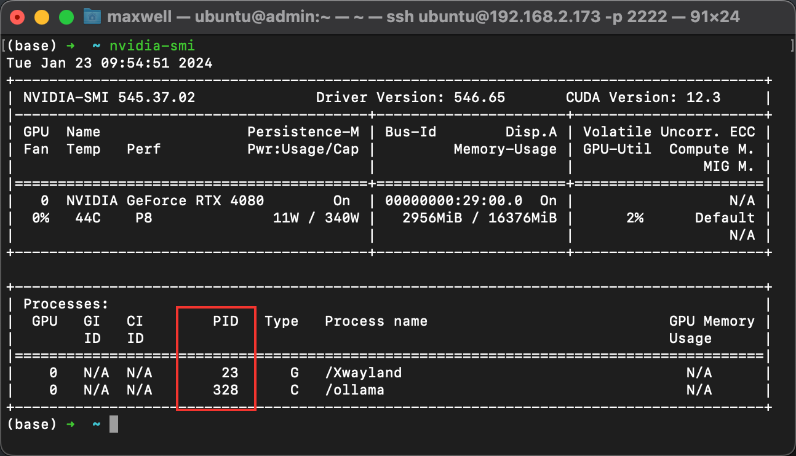

但是，这样只能查看某一时刻的显卡使用情况。为了实时显示显卡的使用情况，可以添加参数。在终端输入命令：

```shell
watch -n 5 nvidia-smi
```

这样系统就会每隔5秒刷新一次使用情况。这里的`5`可以依据需要进行修改。

如上图所示，在红框里显示了占用GPU的进程信息。每个进程有一个唯一的PID，如果想关闭掉某个进程，可以使用命令：

```shell
sudo kill -9 PID
```

使用`-a`参数可以看到完整的显卡信息：

```shell
nvidia-smi -a
```

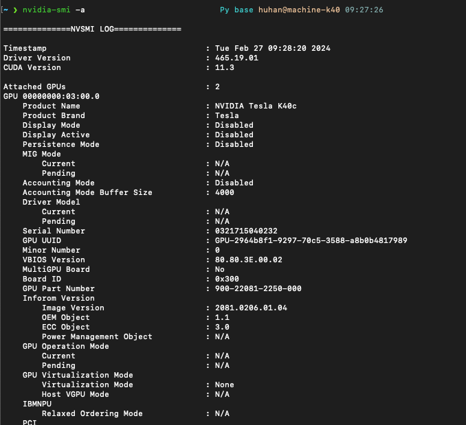

### 磁盘信息

常用的磁盘信息查看命令，通常有三种。

#### df

最常用的形式：

```shell
df -h
```


该命令可以查看已挂载的磁盘的大小以及使用情况，另外最后还有挂载点。

Linux df（英文全拼：disk free） 命令用于显示目前在 Linux 系统上的文件系统磁盘使用情况统计。

```
df [选项]... [FILE]...
```

- 文件-a, --all 包含所有的具有 0 Blocks 的文件系统
- 文件--block-size={SIZE} 使用 {SIZE} 大小的 Blocks
- 文件-h, --human-readable 使用人类可读的格式(预设值是不加这个选项的...)
- 文件-H, --si 很像 -h, 但是用 1000 为单位而不是用 1024
- 文件-i, --inodes 列出 inode 资讯，不列出已使用 block
- 文件-k, --kilobytes 就像是 --block-size=1024
- 文件-l, --local 限制列出的文件结构
- 文件-m, --megabytes 就像 --block-size=1048576
- 文件--no-sync 取得资讯前不 sync (预设值)
- 文件-P, --portability 使用 POSIX 输出格式
- 文件--sync 在取得资讯前 sync
- 文件-t, --type=TYPE 限制列出文件系统的 TYPE
- 文件-T, --print-type 显示文件系统的形式
- 文件-x, --exclude-type=TYPE 限制列出文件系统不要显示 TYPE
- 文件-v (忽略)
- 文件--help 显示这个帮手并且离开
- 文件--version 输出版本资讯并且离开

显示文件系统的磁盘使用情况统计：

```
# df 
Filesystem     1K-blocks    Used     Available Use% Mounted on 
/dev/sda6       29640780 4320704     23814388  16%     / 
udev             1536756       4     1536752    1%     /dev 
tmpfs             617620     888     616732     1%     /run 
none                5120       0     5120       0%     /run/lock 
none             1544044     156     1543888    1%     /run/shm 
```

第一列指定文件系统的名称，第二列指定一个特定的文件系统1K-块1K是1024字节为单位的总内存。用和可用列正在使用中，分别指定的内存量。

使用列指定使用的内存的百分比，而最后一栏"安装在"指定的文件系统的挂载点。

#### lsblk

最常用的形式是

```shell
lsblk -f # 显示UUID
# 或
lsblk
```


7个栏目名称如下：

1. **NAME** ：这是块设备名。
2. **MAJ:MIN** ：本栏显示主要和次要设备号。
3. **RM** ：本栏显示设备是否可移动设备。注意，在本例中设备sdb和sr0的RM值等于1，这说明他们是可移动设备。
4. **SIZE** ：本栏列出设备的容量大小信息。例如298.1G表明该设备大小为298.1GB，而1K表明该设备大小为1KB。
5. **RO** ：该项表明设备是否为只读。在本案例中，所有设备的RO值为0，表明他们不是只读的。
6. **TYPE** ：本栏显示块设备是否是磁盘或磁盘上的一个分区。在本例中，sda和sdb是磁盘，而sr0是只读存储（rom）。
7. **MOUNTPOINT** ：本栏指出设备挂载的挂载点。


loop设备是一种伪设备，是使用文件来模拟块设备的一种技术，文件模拟成块设备后, 就像一个磁盘或光盘一样使用。在使用之前，一个 loop 设备必须要和一个文件进行连接。这种结合方式给用户提供了一个替代块特殊文件的接口。因此，如果这个文件包含有一个完整的文件系统，那么这个文件就可以像一个磁盘设备一样被 mount 起来。之所以叫loop设备（回环），其实是从文件系统这一层来考虑的，因为这种被 mount 起来的镜像文件它本身也包含有文件系统，通过loop设备把它mount起来，它就像是文件系统之上再绕了一圈的文件系统，所以称为 loop。


原文链接：https://blog.csdn.net/scaleqiao/article/details/46777811

可以显示所有的设备，并显示其挂载点。

1. **获取命令帮助**：

   ```
   $ lsblk --help
   ```

   

2. **查看命令版本**：

   ```
   $ lsblk -V
   ```

   

3. **列出所有块设备**：

   ```
   $ lsblk -a
   ```

   

4. **查看 SCSI 信息**：

   ```
   $ lsblk -S
   ```

   

5. **查看指定块设备信息**：

   ```
   $ lsblk /dev/sda1
   $ lsblk /dev/sda
   ```

   

6. **查看块设备的文件系统类型及 UUID**：

   ```
   $ lsblk -f
   ```

   

7. **查看块设备的完整路径**：

   ```
   $ lsblk -p
   ```

   

8. **以列表形式展示块设备**： 默认以树状形式展示：

   ```
   $ lsblk -lp
   ```

`lsblk` 命令对于管理和了解系统中的磁盘设备非常有用。

#### fdisk

`fdisk` 是一个 Linux 命令行工具，用于管理磁盘分区。它允许用户查看、创建、调整大小、删除、移动和复制分区。虽然它不支持 GUID 分区表（GPT），但它支持 MBR、Sun、SGI 和 BSD 分区表

以下是关于 `fdisk` 的一些重要信息：

- **命令含义**：`fdisk` 的全称是 **固定磁盘**（Fixed Disk）或 **格式化磁盘**（Format Disk）。
- **功能**：`fdisk` 允许用户在硬盘上查看、创建、调整大小、删除、移动和复制分区。
- **分区表支持**：它支持 MBR、Sun、SGI 和 BSD 分区表，但不支持 GUID 分区表（GPT）。
- **分区数量限制**：每块硬盘最多可以创建四个主分区，其中一个可以作为扩展分区，下设多个逻辑分区。
- **使用建议**：对于大分区操作，请使用其他工具，如 `parted` 或 `cfdisk`。
- **安装**：`fdisk` 作为核心组件内置于 Linux 中，无需手动安装。

如果你想查看特定分区的信息，可以使用以下命令：

```
$ sudo fdisk -l /dev/sda
```

此命令将列出指定硬盘的分区信息，包括分区的起始、结束扇区、大小和文件系统类型。在日常管理中，`fdisk` 是一个非常有用的工具，帮助管理员管理磁盘分区并确保系统正常运行。

最常使用的格式就是：

```shell
sudo fdisk -l
```


### 挂载磁盘

先使用lsblk命令查看各个设备的挂载点。下面是一个例子：


可以看到，只有sda1和sdb两个设备挂载了，其他的设备没有挂载。

这里以挂载sd5设备为例子（挂载设备到新建的文件夹）。

首先可以新建一个文件夹：

```shell
sudo mkdir /disk5
```

接下来要使用mount命令进行挂载：

mount命令用于挂载文件系统，格式为“mount文件系统 挂载目录”。

mount命令中可用的参数及作用如夏表所示。

| 参数 | 作用                                 |
| ---- | ------------------------------------ |
| -a   | 挂载所有在/etc/fstab中定义的文件系统 |
| -t   | 指定文件系统的类型                   |

挂载是在使用硬件设备前所执行的最后一步操作。只需使用mount命令把硬盘设备或分区与一个目录文件进行关联，然后就能在这个目录中看到硬件设备中的数据了。

对于比较新的Linux系统来讲，一般不需要使用`-t`参数来指定文件系统的类型，Linux系统会自动进行判断。

而mount中的`-a`参数则厉害了，它会在执行后自动检查`/etc/fstab`文件中有无被疏漏挂载的设备文件，如果有，则进行自动挂载操作。

例如，要把设备/dev/sdb2挂载到/backup目录，只需要在mount命令中填写设备与挂载目录参数就行，系统会自动判断要挂载文件的类型，命令如下：

```shell
mount /dev/sdb2 /backup
```

将`sdb5`挂载到`/disk5`：

```shell
sudo mount /dev/sda5 /disk5
```

挂载成功后，可以使用lsblk命令查看：


#### 自动挂载

用上面这种方式挂载磁盘是临时的，机器重启后不会自动挂载。可以将信息写入`/etc/fstab`中，这样系统开机后会自动挂载磁盘。

这里就要使用到UUID了。

查看现在系统中已有的信息：


新增sda5设备：

```yaml
# /etc/fstab: static file system information.
#
# Use 'blkid' to print the universally unique identifier for a
# device; this may be used with UUID= as a more robust way to name devices
# that works even if disks are added and removed. See fstab(5).
#
# <file system> <mount point>   <type>  <options>       <dump>  <pass>
# / was on /dev/sda1 during installation
UUID=60bf9618-e0a0-47a6-8970-7109402b0dd5 /               ext4    errors=remount-ro 0       1
UUID=1dfc42fd-a568-460a-8787-140e3ac822c3 /media/machine-k40 ext3 errors=remount-ro 0 0
UUID=49b451fe-6b83-4b16-80bc-6d0a54ff692f /disk5 					ext4 		errors=remount-ro 0 0 # 新增的disk5
```

这样系统开机时就会自动将sd5设备挂载到`/disk5`文件夹了。

#### 取消挂载

使用umount命令取消挂载磁盘。

```shell
sudo umount /dev/sda5
```


指令执行成功不会有输出。

# SSH的三种端口转发

> 来源：https://jeremyxu2010.github.io/2018/12/ssh%E7%9A%84%E4%B8%89%E7%A7%8D%E7%AB%AF%E5%8F%A3%E8%BD%AC%E5%8F%91/

最近工作中经常需要ssh登录到某台跳板机，再连接受限网络环境中的某台服务器。以前经常用SSH端口转发这一功能，但周围的同事好像对这个并不清楚，这里记录一下以备其它同事询问。

SSH一共提供了 3 种端口转发，分别是`本地转发（-L参数）`、`远程转发（-R参数）`和`动态转发（-D参数）`。接下来我就一一介绍这几种不同的转发方式的使用。

### 一些术语和约定

既然提到转发，就应该明白：这是三台主机之间要合作干的事。不然为何不两台主机直连，而要通过第三者转发？

本地主机：形式为IP或域名，你当前正在使用的这台机器；

远程主机：形式与本地主机一样。这里的远程并不是指实际的距离有多远，准确地说是另一台；

### 本地转发

本地转发，顾名思义就是把本地主机端口通过待登录主机端口转发到远程主机端口上去。

本地转发通过参数 `-L` 指定，格式：`-L [本地主机:]本地主机端口:远程网络主机:远程网络主机端口`。加上ssh待登录主机，这里就有了三台主机。

举例：ssh -L 0.0.0.0:50000:host2:80 user@host1。这条命令将`host2`的80端口映射到本地的50000端口，前提是待登录主机`host1`上可以正常连接到`host2`的80端口。

畅想一下这个功能的作用：

1. 因为本地的mysql更顺手，想用本地的mysql客户端命令连接受限网络环境的mysql服务端。
2. 本地安装了开发工具，想用这个开发工具连接受限网络环境中某个服务的远程调试端口。
3. ……

### 远程转发

远程转发是指把登录主机所在网络中某个端口通过本地主机端口转发到远程主机上。

远程转发通过参数 `-R` 指定，格式：`-R [登录主机:]登录主机端口:本地网络主机:本地网络主机端口`。

举例：ssh -R 0.0.0.0:8080:host2:80 user@host1。这条命令将`host2`的80端口映射到待登录主机host1的8080端口，前提是本地主机可以正常连接`host2`的80端口。

畅想一下这个功能的作用：

1. 本地网络中有一个http代理，通过这个代理可以上外网，因此通过这条命令将这个http代理映射到待登录主机的某个端口，这样受限网络环境中所有其它服务器即可使用这个http代理上外网了。
2. 在本机开发了一个web应用，想拿给别人测试，但现在你却处在内网，外网是无法直接访问内网的主机的，怎么办！？很多人可能会说，找台有公网IP的主机，重新部署一下就行了。这样可行，但太麻烦。然而自从你了解了ssh的远程转发之后，一切都变得简单了。只需在本地主机上执行一下上面例子的命令即可实现外网访问内网的web应用。

**注意**：

1. sshd_config里要打开`AllowTcpForwarding`选项，否则`-R`远程端口转发会失败。
2. 默认转发到远程主机上的端口绑定的是`127.0.0.1`，如要绑定`0.0.0.0`需要打开sshd_config里的`GatewayPorts`选项。这个选项如果由于权限没法打开也有办法，可配合`ssh -L`将端口绑定到`0.0.0.0`，聪明的你应该能想到办法，呵呵。

### 动态转发

相对于本地转发和远程转发的单一端口转发模式而言，动态转发有点更加强劲的端口转发功能，即是无需固定指定被访问目标主机的端口号。这个端口号需要在本地通过协议指定，该协议就是简单、安全、实用的 [SOCKS](https://en.wikipedia.org/wiki/SOCKS) 协议。

动态转发通过参数 `-D` 指定，格式：`-D [本地主机:]本地主机端口`。相对于前两个来说，动态转发无需再指定远程主机及其端口。它们由通过 SOCKS协议 连接到本地主机端口的那个主机。

举例：ssh -D 50000 user@host1。这条命令创建了一个SOCKS代理，所以通过该SOCKS代理发出的数据包将经过`host1`转发出去。

怎么使用？

1. 用firefox浏览器，在浏览器里设置使用socks5代理`127.0.0.1:50000`，然后浏览器就可以访问`host1`所在网络内的任何IP了。

2. 如果是普通命令行应用，使用[proxychains-ng](https://github.com/rofl0r/proxychains-ng)，参考命令如下：

   ```bash
   brew install proxychains-ng
   vim /usr/local/etc/proxychains.conf ### 在ProxyList配置段下添加配置 "socks5 	127.0.0.1 50000"
   proxychains-ng wget http://host2 ### 在其它命令行前添加proxychains-ng即可
   ```

3. 如果是ssh，则用以下命令使用socks5代理：

   ```bash
   ssh -o ProxyCommand='/usr/bin/nc -X 5 -x 127.0.0.1:5000 %h %p' user@host2
   ```

畅想一下这个功能的作用：

1. 想访问受限网络环境中的多种服务
2. FQ
3. ……

### SSH Over HTTP Tunnel

有一些HTTP代理服务器支持HTTP Tunnel，目前HTTP Tunnel的主要作用是辅助代理HTTPS请求，详情参见[这里](http://joji.me/zh-cn/blog/the-http-connect-tunnel)。今天在工作中竟发现有同事通过HTTP Tunnel连接ssh过去，猛然想起来HTTP Tunnel的原理里并没有限制连接的目标服务一定是HTTP或HTTPS服务，貌似只要是基于TCP的服务都可以。macOS下ssh走CONNECT tunnel稍微麻烦一点，参考命令如一下：

```bash
brew install corkscrew
ssh -o ProxyCommand='/usr/local/bin/corkscrew http_proxy_host http_proxy_port %h %p' user@host2
```

### 总结

都是些小技巧，不过掌握了作用还是挺大的，可以大大提高生产力的。

文章作者 Jeremy Xu

上次更新 2018-12-15

许可协议 © Copyright 2020 Jeremy Xu

## 动态转发+socket代理

使用这两种技术可访问某台服务器所在地址的网络。

首先，在本地机运行命令：

```shell
ssh -D 50000 -p 225 huhan@113.54.158.33
```

这里的`-D 50000`指明动态转发的端口号（本地机端口）。后面的内容就和普通情况下使用ssh登陆远程服务器的内容一致了。

然后就可以打开firefox中设置socket代理了。

进入firefox设置，滑到最底部，然后点击设置。

然后填入必要的信息即可。

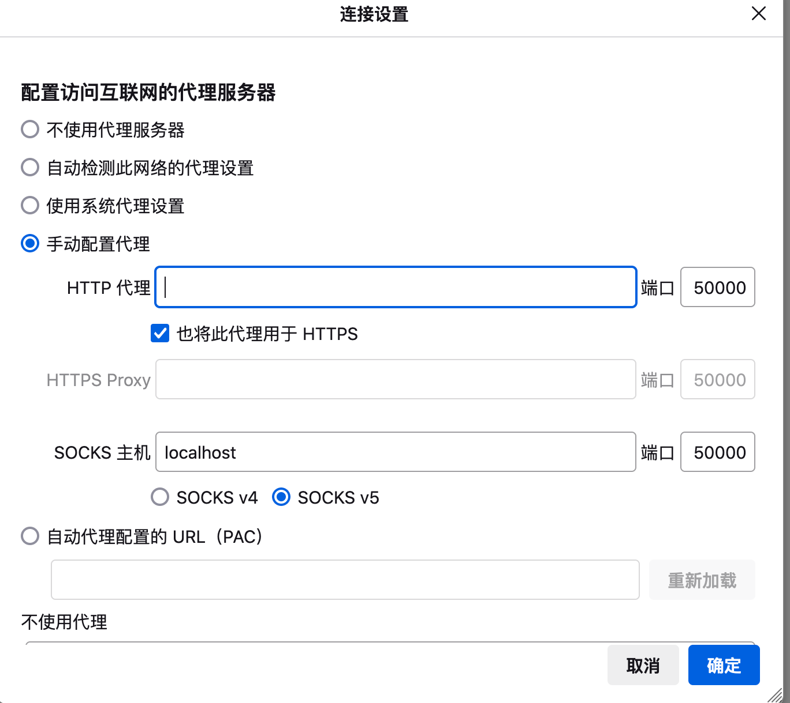

这里的端口要填写之前ssh命令中`-D`参数指定的端口。然后就可以访问该服务器上的网络了。

例如访问该服务器局域网中的路由器管理页面，其ip地址为`192.168.0.1`：

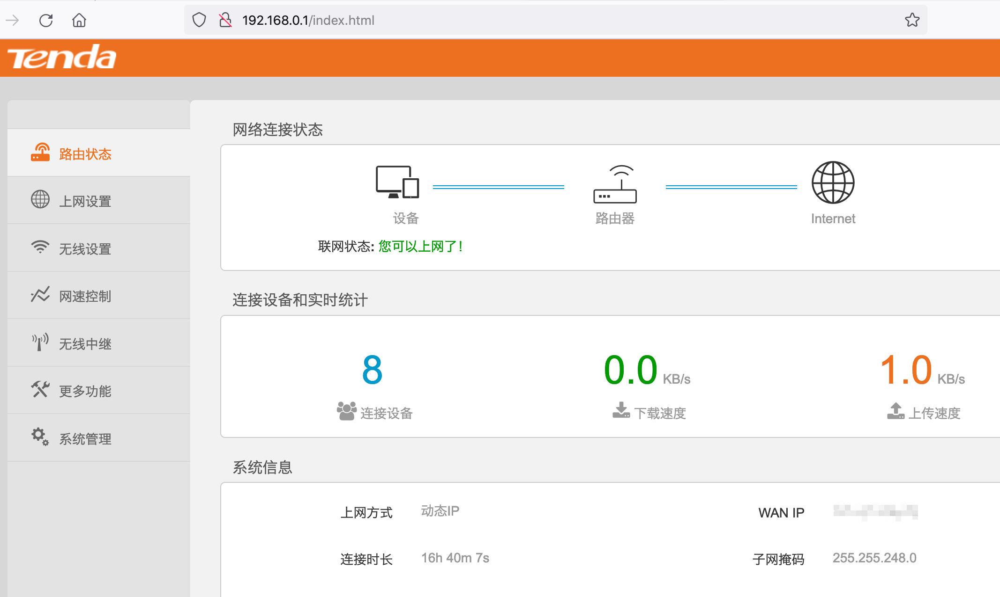


# Conda

## 获取版本号

```bash
conda --version
# Or
conda -V
```

## 获取帮助

```bash
conda --help
conda -h
```

查看某一命令的帮助，如update以及remove命令

```bash
conda update --help
conda remove --help
# -h works also
```

## 环境管理

### 查看环境管理的全部命令帮助

查看环境管理的全部命令帮助：

```bash
conda env -h
```

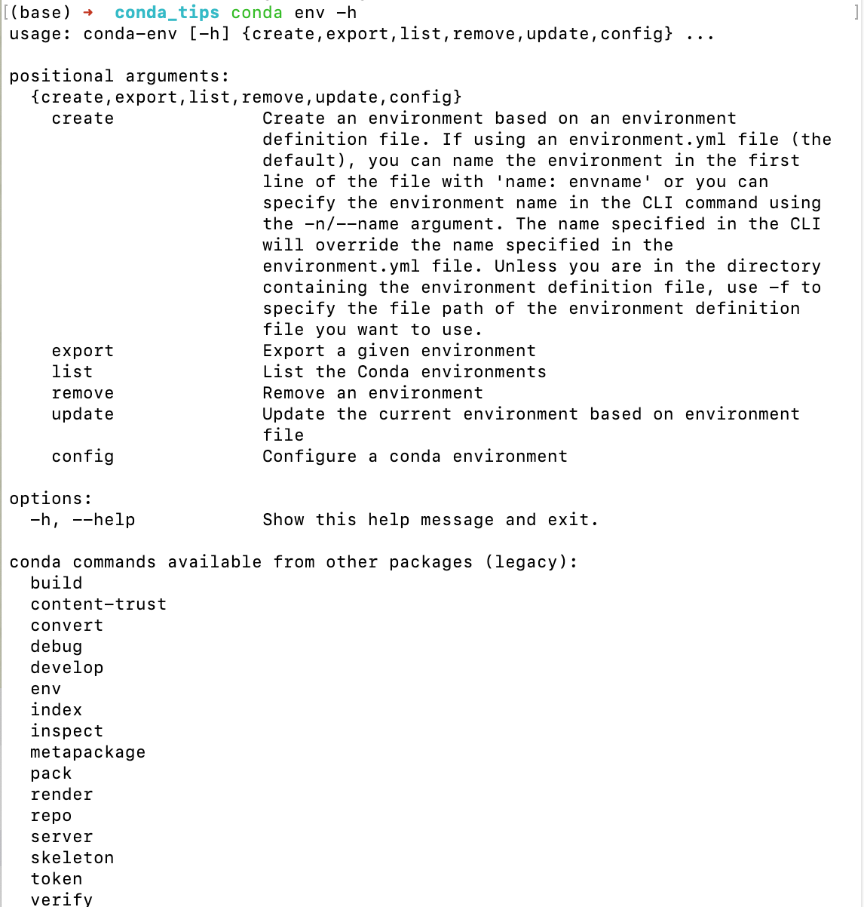

### 创建环境

```bash
conda create --name your_env_name
```

输入`y`确认创建。

### 创建指定路径的环境

输入以下命令创建一个名为myenv的新环境，并指定环境路径为/path/to/myenv：

```shell
conda create --prefix /path/to/myenv myenv
# 或
conda create -p /path/to/myenv myenv
```

注意该参数不能和`--name`一起用，这个参数其实包含了环境名。

要激活这个环境，不能只是简单的`conda activate myenv`，而是需要带上完整的路径。

```shell
conda activate /path/to/myenv
```

另外，可以通过改变conda虚拟环境的默认位置来实现。这需要修改conda的配置文件。

conda环境默认安装在用户目录下，如果选择默认路径，那么之后创建虚拟环境，也是安装在用户目录下。不想占用系统盘空间，可以修改conda虚拟环境路径。

(1)首先，找到用户目录下的.condarc文件（没有就创建）。

(2)打开.condarc文件之后，添加或修改.condarc 中的 env_dirs 设置环境路径，按顺序第⼀个路径作为默认存储路径，搜索环境按先后顺序在各⽬录中查找。直接在.condarc添加：

```yaml
envs_dirs:
  - /media/machine-k40/huhan/my_envs #这里修改成你要放的位置
```

然后，在Anaconda Prompt执行**conda info**命令，就可以看到修改默认环境路径成功

### 创建指定python版本的环境

```bash
conda create --name your_env_name python=2.7
conda create --name your_env_name python=3
conda create --name your_env_name python=3.5
```

### 创建包含某些包的环境

```bash
conda create --name your_env_name numpy scipy
```

### 创建指定python版本下包含某些包的环境

```bash
conda create --name your_env_name python=3.5 numpy scipy
```


### 列举当前所有环境

```bash
conda info --envs
conda env list
```

### 进入某个环境

```bash
activate your_env_name
```

### 推出当前环境

```bash
deactivate
```

### 复制某个环境

```bash
conda create --name new_env_name --clone old_env_name
```

### 删除某个环境

```bash
conda remove --name your_env_name --all
```


## 分享环境

如果你想把你当前的环境配置与别人分享，这样ta可以快速建立一个与你一模一样的环境（同一个版本的python及各种包）来共同开发/进行新的实验。一个分享环境的快速方法就是给ta一个你的环境的`.yml`文件。

首先通过`activate target_env`要分享的环境`target_env`，然后输入下面的命令会在当前工作目录下生成一个`environment.yml`文件，

```bash
conda env export > environment.yml
```

小伙伴拿到`environment.yml`文件后，将该文件放在工作目录下，可以通过以下命令从该文件创建环境

```bash
conda env create -f environment.yml
```

## 包管理

### 列举当前活跃环境下的所有包

```bash
conda list
```


### 列举一个非当前活跃环境下的所有包

```bash
conda list -n your_env_name
```

### 为指定环境安装某个包

```bash
conda install -n env_name package_name
```

如果不能通过conda install来安装，文档中提到可以从Anaconda.org安装，但我觉得会更习惯用pip直接安装。pip在Anaconda中已安装好，不需要单独为每个环境安装pip。如需要用pip管理包，activate环境后直接使用即可。


