# Clash

## Linux clash

Linux上使用clash-core实现翻墙，并使用dashboard网页操控。

由于clash-core作者删库了，不能到原作者的github页面下载对应的程序，但github上还有clash-core的备份。

### clash-core下载

找到后选择对应的版本下载。

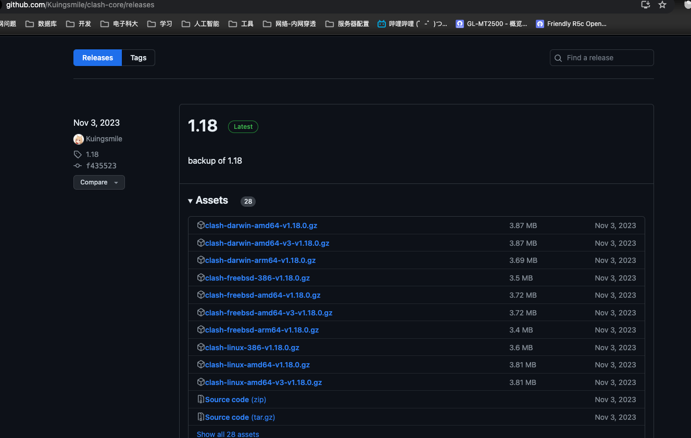

这里我们选择`clash-linux-amd64-v1.18.0.gz`，下载到服务器上（下载到用户目录中），然后使用gzip命令解压：

```shell
gzip -d clash-linux-amd64-v1.18.0.gz
```

该命令会解压gz文件，并在完成后删除gz文件。

解压后，可以将该程序放到任何你想要放的位置，这里就将其放在用户目录中的clash文件夹中。将原文件重命名为更简单的格式（为了方便，当然你也可以不重命名），并赋予其执行的权限。

```shell
mkdir clash
mv clash-linux-amd64-v1.18.0 clash
cd clash
mv clash-linux-amd64-v1.18.0 clash
chmod +x clash
```

现在，就可以执行clash。当然，此时执行clash是不能翻墙的。

```shell
./clash
```

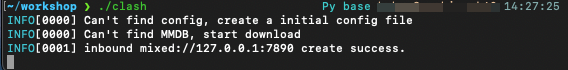

由于没有配置文件，所以clash会自动创建配置文件。默认的配置文件在`~/.config/clash`中。

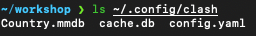

clash可以指定配置文件：

```shell
clash -f config.yaml
```

通过`-f`参数可以指定配置文件。

### 获取配置文件

下面我们使用v2rayse网站上的免费节点来演示如何获得配置文件。

首先进入网站：[v2rayse](v2rayse.com)

然后选择免费节点。

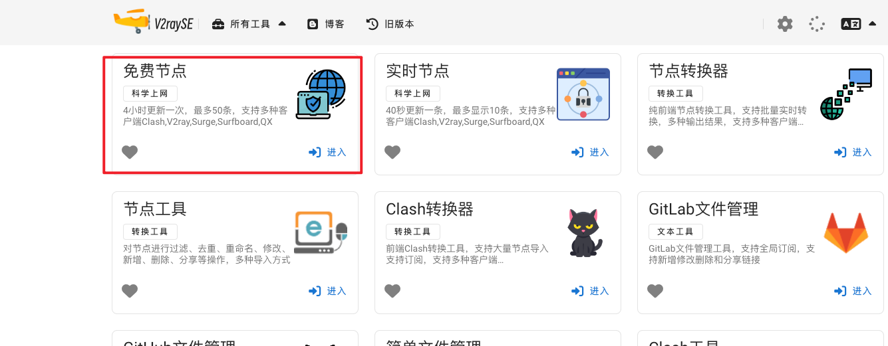

通过youtube的直播获取密码

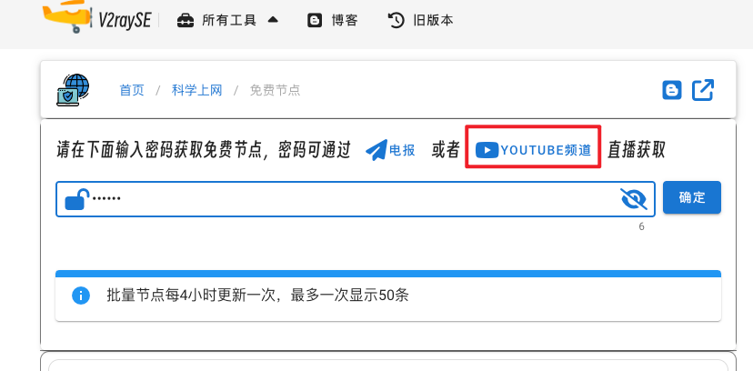

然后选择节点，并转换为clash：

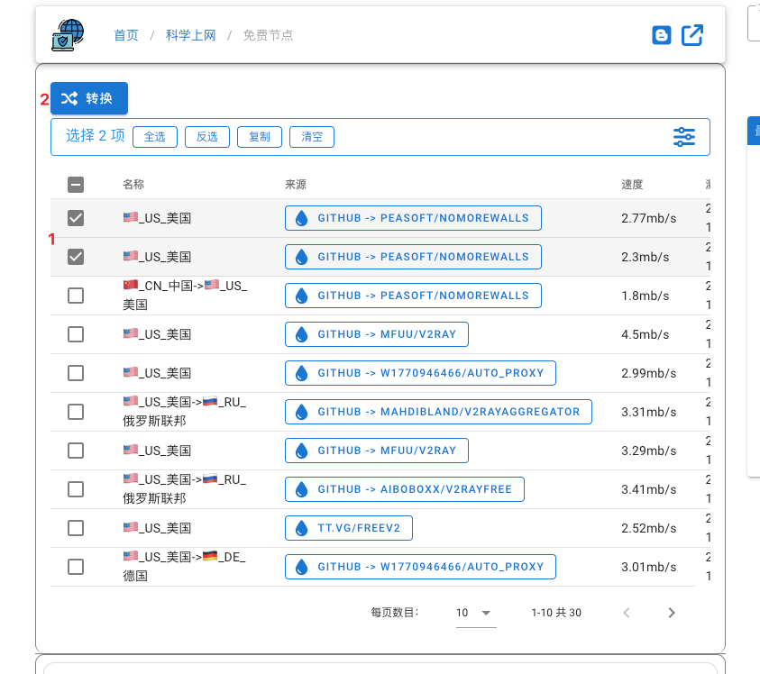

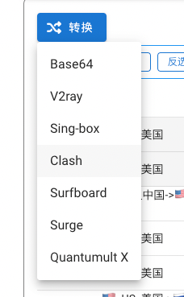

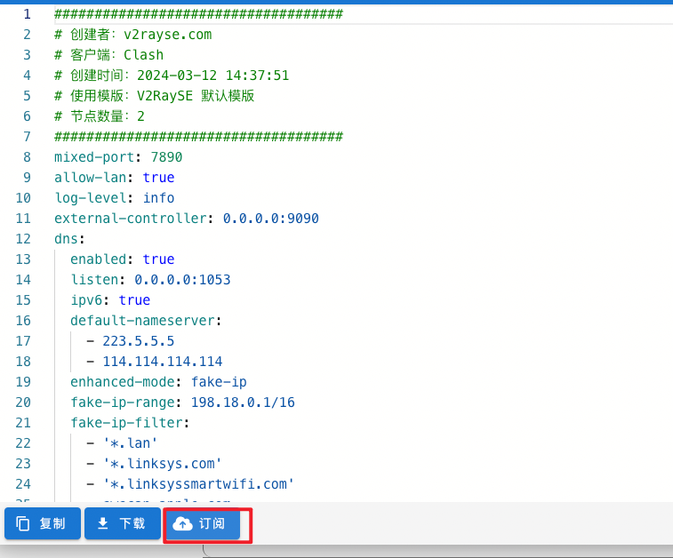

可以直接复制网页上的配置，然后复制到自己新建的一个yaml文件中，或者点击订阅。

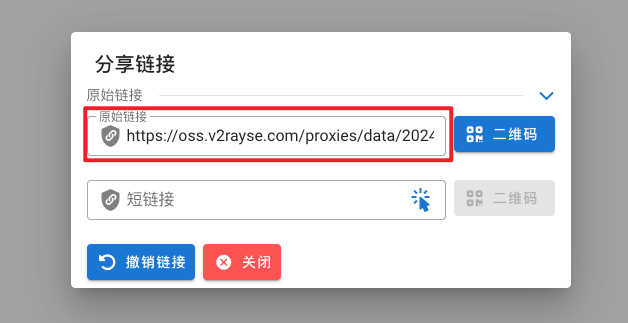

如果点击订阅，则复制红框中的链接，然后在服务器上使用wget下载该配置文件：

```shell
wget https://oss.v2rayse.com/proxies/data/2024-03-12/uWGOySf.yaml
```

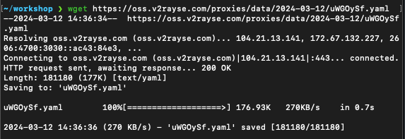

现在我们就可以指定该配置文件来运行clash了。

```shell
./clash -f uWGOySf.yaml
```

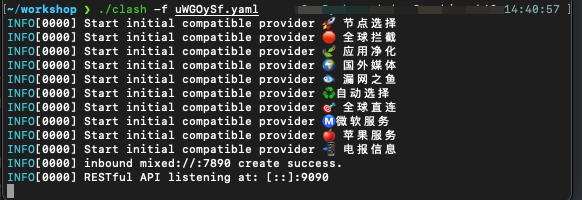

### 设置代理

此时设置好proxy就可以访问外网了。

新打开一个shell命令行，然后设置代理：

```shell
export http_proxy=http://127.0.0.1:7890
export https_proxy=http://127.0.0.1:7890
```

尝试访问google：

```shell
curl www.google.com
```

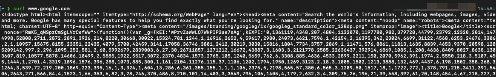

但这样设置代理的方式挺麻烦的。每次新打开一个shell命令行，都要输入上面的命令。

设置一个别名来代替：

```shell
alias proxy="export http_proxy=http://127.0.0.1:7890;export https_proxy=http://127.0.0.1:7890"
alias unproxy="unset http_proxy;unset https_proxy"
```

将这段内容添加到你的shell的配置文件中。（bash可以放到`.bashrc`中，zsh可以放到`.zshrc`中）

然后每次要使用代理时，执行proxy即可，不想使用时执行unproxy即可。

### 添加clash到系统服务中

可以将clash添加到系统服务中（这里使用systemd）。

在`/etc/systemd/system`中添加clash的信息：

```shell
vim /etc/systemd/system/clash.service
```

添加如下内容：

```shell
[Unit]
Description=clash-core
[Service]
Type=simple
ExecStart=你的clash地址 -f 你的配置文件
```

然后重启systemd：

```shell
sudo systemctl daemon-reload
```

此时就可以通过系统服务来打开clash了：

```shell
sudo systemctl start clash
```

可以查看其状态：

```shell
sudo systemctl status clash
```

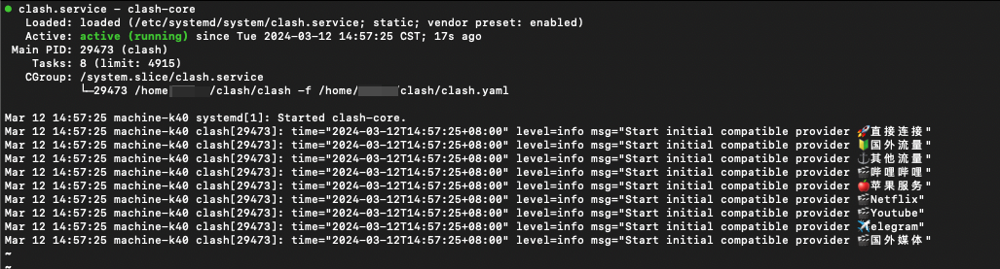

### 添加UI

由于没有找到原作者的dashboard的备份，我们这里使用另一个ui。

[yacd](https://github.com/haishanh/yacd)

在release中下载文件（下载最新版）：

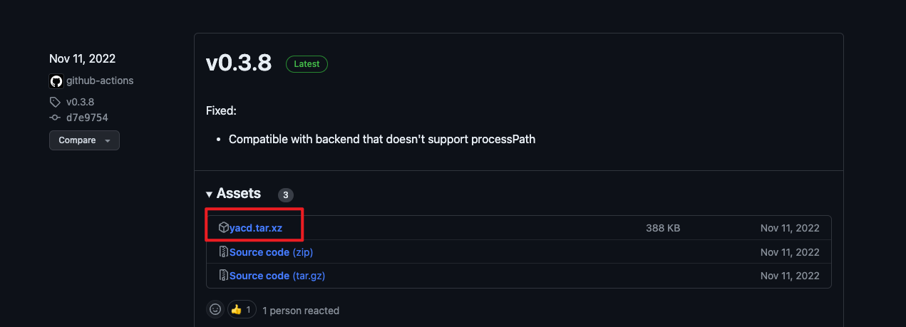

这里下载到用户目录中。

解压文件：

```shell
tar -xf yacd.tar.xz
```

我们之前将clash以及他的配置文件放在`~/clash`中，这个文件夹也可以放过去：

```shell
mv public ~/clash
```

然后将public文件夹修改为dashboard(不修改也可以)：

```shell
cd ~/clash
mv public dashboard
```

然后修改clash要使用的配置文件（这里是clash.yaml），添加以下内容：

```shell
external-ui: /home/user/clash/dashboard # 这里要改成你自己dashboard的路径
```

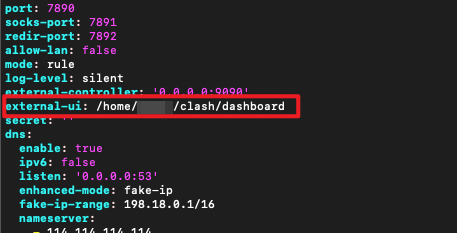

保存文件后，重启clash：

```shell
sudo systemctl restart clash
```

重启成功后，可以访问`localhost:9090/ui`来打开网页。

可以通过端口转发来访问，第一种方式：直接使用ssh命令进行端口转发：

```shell
ssh -p ssh端口号 -f -N -L 服务器端口号:localhost:本机端口号 用户名@ip地址
```

通常服务器端口号和本机端口号都是用9090，即ui的默认端口。

另一一个方式是在vscode中设置：

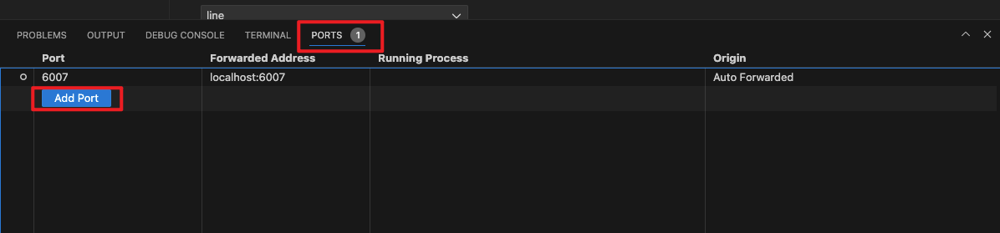

点击PORTS，然后Add Port，输入9090，回车则自动配置好：

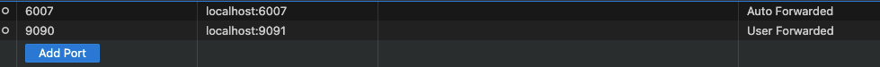

现在在我们自己的电脑上访问`localhost:9091/ui`就可以了。

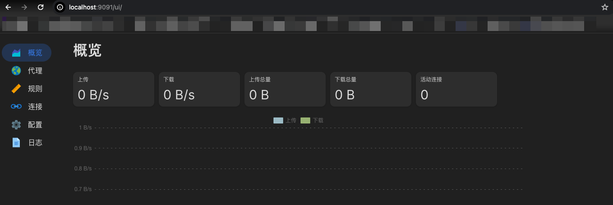

## clash 订阅配置文件

clash的订阅配置文件，通常以`*.yaml`的格式出现。

我的Fenda订阅的配置文件中，添加chat策略组，并加入关键字匹配。

```yaml
  -
    name: chat
    type: select
    proxies:
      - 美国01
      - 美国02
      - 美国03
      - 美国04
      - 美国05
  # 然后在rules选项下面添加：
  - DOMAIN-KEYWORD,bing,chat
  - DOMAIN-KEYWORD,gpt,chat
  - DOMAIN-KEYWORD,openai,chat
  - DOMAIN-KEYWORD,claude,chat
  - DOMAIN-KEYWORD,anthropic,chat
  
```

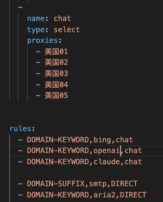

修改之后，在clash中导入该配置文件即可。

效果如下：

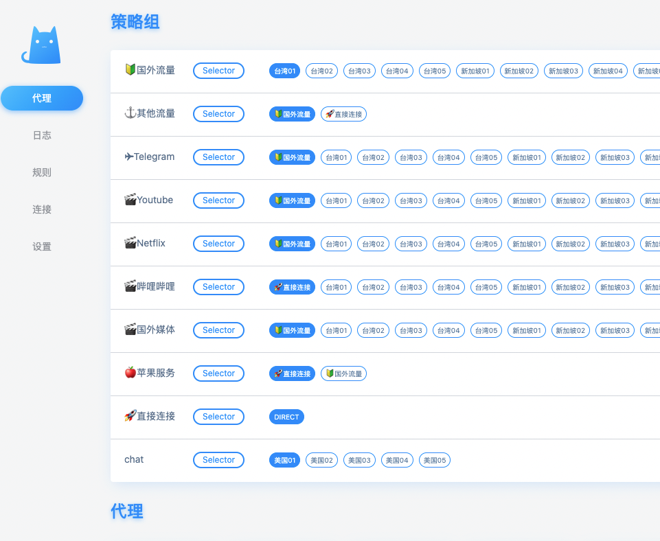

## 策略组

在 Clash 代理工具中，策略组（Policy Group）是用于管理和选择代理节点的逻辑组。策略组的类型决定了如何从组内的多个节点中选择一个节点进行代理。常见的策略组类型有以下几种：

1. **Selector（手动选择器）**：
   - 用户可以手动选择一个具体的节点进行连接。
   - 适用于用户希望明确控制使用哪个节点的情况。
2. **URL Test（URL测试）**：
   - 自动通过测试节点访问指定的 URL，以确定延迟最低的节点进行连接。（测试改组所有节点并连接延迟最低节点）
   - 常用于需要选择网络质量较好的节点时。
3. **Fallback（故障转移）**：
   - 按照配置的顺序依次尝试节点，直到找到一个可用的节点。
   - 适用于希望确保连接稳定性的情况，即如果一个节点失效，则自动切换到下一个节点。
4. **Load Balancing（负载均衡）**：
   - 通过轮询或其他算法在多个节点之间分配流量，以实现负载均衡。
   - 适用于需要在多个节点之间均匀分配流量的场景。
5. **Relay（中继）**：
   - 将流量通过多个代理节点转发，以增加匿名性或绕过复杂的网络限制。
   - 常用于需要多跳代理的情况。

这些策略组类型可以帮助用户根据不同的需求和网络环境灵活地选择和管理代理节点，提升网络连接的稳定性和速度。

### 使用URL Test选项来自动选择最快的节点

下面是一个使用`url-test`的例子：

```yaml
  - name: 非香港
    type: url-test
    url: http://www.gstatic.com/generate_204
    interval: 300
    use:
      - FlyingBird-TaiWan
      - FlyingBird-Singapore
      - FlyingBird-Malaysia
      - FlyingBird-Japan
      - FlyingBird-USA
      - FlyingBird-UK
```

注意`url-test`和`select`的差别：

```yaml
  - name: Non-HK
    type: url-test
    url: http://www.gstatic.com/generate_204
    interval: 300
    use:
      - FlyingBird-TaiWan
      - FlyingBird-Singapore
      - FlyingBird-Malaysia
      - FlyingBird-Japan
      - FlyingBird-USA
      - FlyingBird-UK
  - name: Colin
    type: select
    interval: 300
    proxies:
      - 直接连接
      - 境外流量
```

可见，`url-test`多出了url参数。这个参数即各个节点测速的网址。

我自己的fenda机场配置文件的实际例子：

```yaml
  -
    name: fastest
    type: url-test
    url: http://www.google.com
    interval: 300
    proxies:
      - 新加坡01
      - 新加坡02
      - 新加坡03
      - 新加坡04
      - 新加坡05
      - 日本01
      - 日本02
      - 日本03
      - 日本04
      - 日本05
      - 香港01
      - 香港02
      - 香港03
      - 香港04
      - 香港05
      - 香港06
      - 香港07
      - 香港08
      - 香港09
      - 香港10
```

策略组的类型为 `url-test`，表示 Clash 会通过访问指定的 URL 来测试代理节点的延迟，从而自动选择最快的节点。

**interval: 300**的解释：设置测试的时间间隔为 300 秒（5分钟）。每隔 5 分钟，Clash 将重新测试所有代理节点的延迟，以确保选择的节点是当前最快的。

## 规则

- DOMAIN-SUFFIX：域名后缀匹配
- DOMAIN：域名匹配
- DOMAIN-KEYWORD：域名关键字匹配
- IP-CIDR：IP段匹配
- SRC-IP-CIDR：源IP段匹配
- GEOIP：GEOIP数据库（国家代码）匹配
- DST-PORT：目标端口匹配
- SRC-PORT：源端口匹配
- PROCESS-NAME：源进程名匹配
- RULE-SET：Rule Provider规则匹配
- MATCH：全匹配