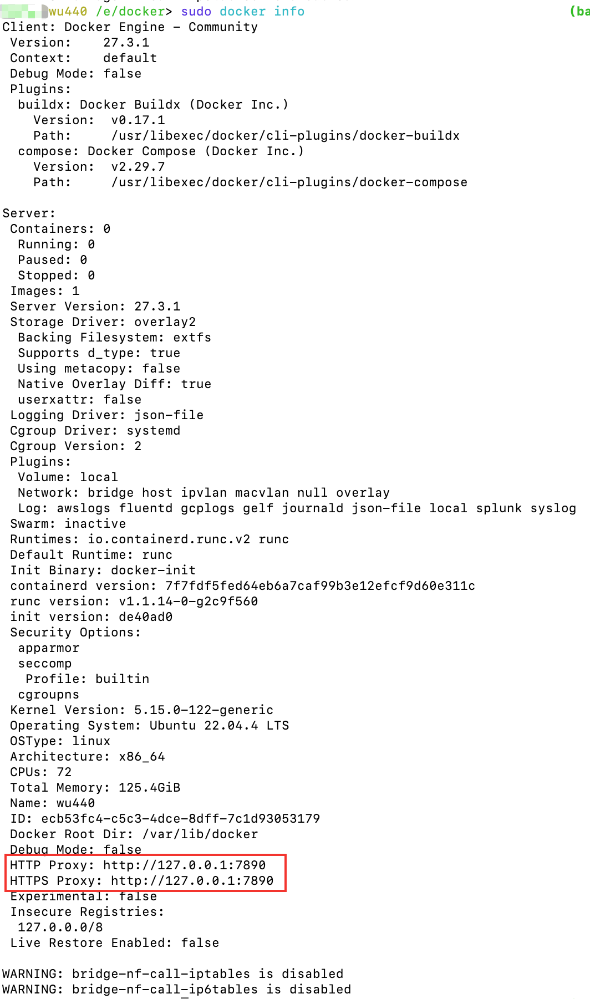
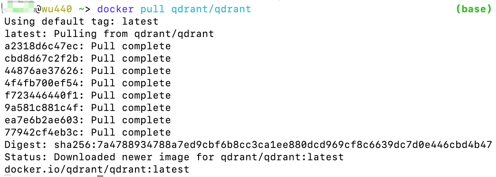

# Docker

## 安装

安装docker engine到ubuntu 2204服务器上。

1. 设置docker的apt仓库：

   注意：不要使用fish去执行echo的命令，使用bash/zsh去执行（fish会报错，因为他不兼容bash的一些指令）。

   ```bash
   # Add Docker's official GPG key:
   sudo apt-get update
   sudo apt-get install ca-certificates curl
   sudo install -m 0755 -d /etc/apt/keyrings
   sudo curl -fsSL https://download.docker.com/linux/ubuntu/gpg -o /etc/apt/keyrings/docker.asc
   sudo chmod a+r /etc/apt/keyrings/docker.asc
   
   # Add the repository to Apt sources:
   echo \
     "deb [arch=$(dpkg --print-architecture) signed-by=/etc/apt/keyrings/docker.asc] https://download.docker.com/linux/ubuntu \
     $(. /etc/os-release && echo "$VERSION_CODENAME") stable" | \
     sudo tee /etc/apt/sources.list.d/docker.list > /dev/null
   sudo apt-get update
   ```

   > 注意：由于网络问题update这一步和接下来的安装可能都会出错，解决方法就是连接上vpn再进行update和install。

2. 安装docker的软件包。

   安装最新的版本：

   ```shell
   $ sudo apt-get install docker-ce docker-ce-cli containerd.io docker-buildx-plugin docker-compose-plugin
   ```

   ------

   如果没有报错，应该安装成功。

安装docker-compose：

**Docker Compose** 是一个可用于定义和运行多容器 Docker 应用程序的工具。使用 Compose，你可以使用 Compose 文件来配置应用程序的服务。然后，使用单个命令，你可以从配置中创建和启动所有服务。

下列任何方式都可以安装 Docker Compose 。

### 方式 1、使用二进制文件安装 Docker Compose

从 [这里](https://github.com/docker/compose/releases) 下载最新 Docker Compose 。

当我在写这篇文章时，最新版本是 **2.6.1** 。

运行下列命令安装最新稳定的 Docker Compose 文件：

```bash
sudo curl -L "https://github.com/docker/compose/releases/download/v2.6.1/docker-compose-$(uname -s)-$(uname -m)" -o /usr/local/bin/docker-compose
```

如果有更新版本，只需要将上述命令中的 **v2.6.1** 替换为最新的版本号即可。请不要忘记数字前的 **"v"** 。

最后，使用下列命令赋予二进制文件可执行权限：

```bash
sudo chmod +x /usr/local/bin/docker-compose
```

运行下列命令检查安装的 Docker Compose 版本：

```bash
sudo docker-compose version
```

### 方式 2、使用 pip 安装 Docker Compose

或许，我们可以使用 **pip** 安装 Docker Compose 。pip 是 Python 包管理器，用来安装使用 Python 编写的应用程序。

安装 pip 后，运行以下命令安装 Docker Compose。下列命令对于所有 Linux 发行版都是相同的！

```bash
pip install docker-compose
```

安装 Docker Compose 后，使用下列命令检查版本：

```bash
docker-compose --version
```

你将会看到类似下方的输出：

```bash
docker-compose version 2.6.1
```

恭喜你！我们已经成功安装了 Docker 社区版和 Docker Compose 。

## Docker pull使用代理

由于国内docker镜像站逐渐关闭，不好找到稳定的镜像站，遂直接使用代理。

首先， docker pull 和 docker build/docker run 使用代理的方式不一样！

docker pull 的代理被 systemd 接管，所以需要设置 systemd…

代理配置文件在`/etc/systemd/system/docker.service.d/http-proxy.conf`中。

```properties
[Service]
Environment="HTTP_PROXY=http://127.0.0.1:7890"
Environment="HTTPS_PROXY=http://127.0.0.1:7890"
```

注意上面写的服务器地址是你的代理的地址和端口。我这里使用的是clash，服务器在本地，端口使用默认的7890。

然后需要重启systemd daemon以及docker。

```shell
sudo systemctl daemon-reload
sudo systemctl restart docker
```

配置完之后，可以使用`docker info`来查看配置的信息。这个命令还可以显示出配置的镜像网站等信息。

```shell
sudo docker info
```



## 使用docker命令不加sudo

步骤：

1. 创建名为docker的组，如果之前已经有该组就会报错，可以忽略这个错误：

```shell
sudo groupadd docker
```

2. 将当前用户加入组docker：

```shell
sudo gpasswd -a ${USER} docker
```

3. 重启docker服务(生产环境请慎用)：

```shell
sudo systemctl restart docker
```

4. 添加访问和执行权限：

```shell
sudo chmod a+rw /var/run/docker.sock
```

5. 操作完毕，验证一下，现在可以不用带sudo了：



