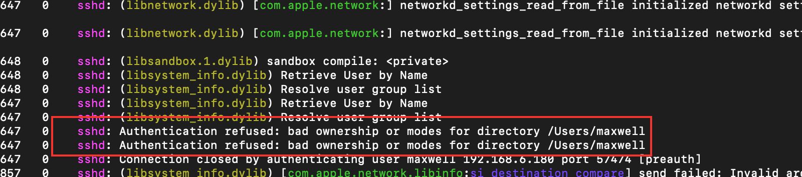

## ssh免密登陆

ssh免密登陆配置其实很简单。

1. 本机使用ssh-keygen命令生成公钥和私钥
2. 然后使用ssh-copy-id user@ip即可将公钥配置到服务器（ip）
3. 默认情况下， 免密登陆已经配置好了

具体的流程：

### 1. 生成SSH密钥对

首先，确保你在客户端（本地机器）上已经生成了SSH密钥对。

#### 在客户端生成密钥对

打开终端并运行以下命令：

```shell
ssh-keygen -t rsa -b 4096 -C "your_email@example.com"
```

- **`-t rsa`**：指定密钥类型为RSA。
- **`-b 4096`**：指定密钥长度为4096位。
- **`-C "your_email@example.com"`**：添加一个注释（通常是邮箱）。

按提示操作，默认会将密钥保存在`~/.ssh/id_rsa`（私钥）和`~/.ssh/id_rsa.pub`（公钥）。

### 2. 将公钥复制到服务器

将生成的公钥复制到服务器的`~/.ssh/authorized_keys`文件中。

#### 使用`ssh-copy-id`（如果可用）

```
ssh-copy-id username@server_ip
```

#### 手动复制公钥

如果无法使用`ssh-copy-id`，可以手动复制公钥：

1. 在客户端运行：

   ```
   cat ~/.ssh/id_rsa.pub
   ```

2. 复制输出的公钥内容。

3. 通过SSH登录到服务器：

   ```
   ssh username@server_ip
   ```

4. 在服务器上执行以下命令：

   ```
   mkdir -p ~/.ssh
   chmod 700 ~/.ssh
   nano ~/.ssh/authorized_keys
   ```

5. 将复制的公钥粘贴到`authorized_keys`文件中，保存并退出。

6. 设置`authorized_keys`文件权限：

   ```
   chmod 600 ~/.ssh/authorized_keys
   ```


但实际上，服务器的ssh配置文件可能还需要修改，但默认情况下是不用修改的。如果免密登陆失败，则说明配置文件可能出现了问题。

### ssh免密登陆mac遇到的问题

要在macOS上通过SSH实现免密登录，`sshd_config`文件中设置`PubkeyAuthentication yes`是必要的一步，但这只是配置过程的一部分。免密登录失败可能由多种原因引起，以下是详细的排查步骤和解决方案，帮助你成功配置SSH免密登录。


#### 1. 检查权限设置

**SSH对文件和目录权限非常敏感**，确保以下权限设置正确：

#### 在服务器上

```
chmod 700 ~/.ssh
chmod 600 ~/.ssh/authorized_keys
chmod 700 ~
```

> 注意⚠️：这里的用户家目录的权限通常是导致免密登陆配置失败的原因

#### 在客户端上

```
chmod 700 ~/.ssh
chmod 600 ~/.ssh/id_rsa
chmod 644 ~/.ssh/id_rsa.pub
```

#### 2. 配置`sshd_config`

确保服务器上的`sshd_config`文件正确配置。

##### 编辑`sshd_config`

在服务器上编辑`sshd_config`文件：

```
sudo nano /etc/ssh/sshd_config
```

##### 确认以下设置：

```
PubkeyAuthentication yes
AuthorizedKeysFile .ssh/authorized_keys
PasswordAuthentication no
ChallengeResponseAuthentication no
```

- **`PubkeyAuthentication yes`**：启用公钥认证。
- **`AuthorizedKeysFile .ssh/authorized_keys`**：指定公钥文件路径。
- **`PasswordAuthentication no`**：禁用密码认证（可选，但增强安全性）。
- **`ChallengeResponseAuthentication no`**：禁用挑战响应认证。

**注意**：在修改`PasswordAuthentication`和`ChallengeResponseAuthentication`前，确保公钥认证正常工作，以免被锁定。

##### 重新启动SSH服务

在macOS上，可以通过以下命令重新启动SSH服务：

```
sudo launchctl stop com.openssh.sshd
sudo launchctl start com.openssh.sshd
```

或者使用：

```
sudo systemsetup -f -setremotelogin off
sudo systemsetup -f -setremotelogin on
```

> 这一步不一定有用

#### 3. 验证SSH连接

尝试从客户端连接到服务器：

```
ssh username@server_ip
```

如果一切配置正确，应该不再提示输入密码。

#### 4. 排查常见问题

如果免密登录仍然失败，按照以下步骤排查问题：

##### a. 增加SSH客户端的详细日志

在客户端上使用`-v`选项查看详细日志：

```shell
ssh -v username@server_ip
```

你也可以增加更多的`v`来获取更详细的信息（最多`-vvv`）：

```
ssh -vvv username@server_ip
```

查看输出日志中有关公钥认证的部分，找出失败的原因。

##### b. 检查服务器的SSH日志 ‼️

在服务器上查看SSH守护进程的日志：

- **macOS**：

  macOS使用`system.log`记录SSH日志。可以使用以下命令查看：

  ```shell
  sudo log show --predicate 'process == "sshd"' --info --last 1h
  ```

  或者查看具体的日志文件：

  ```
  sudo tail -f /var/log/system.log
  ```

我遇到的问题：



可以看到，sshd明确指出了用户家目录文件权限的问题（bad ownership），将起权限设置为700即可解决问题。

##### c. 确认*`authorized_keys`文件内容

确保`~/.ssh/authorized_keys`文件中包含正确的公钥内容，没有多余的空格或换行。

##### d. 检查SELinux或防火墙设置

虽然macOS不像某些Linux发行版那样使用SELinux，但确保防火墙设置允许SSH连接。

##### e. 确认使用正确的私钥

如果你有多个SSH密钥，确保客户端使用了正确的私钥。可以通过指定私钥文件：

```
ssh -i ~/.ssh/id_rsa username@server_ip
```

或者在`~/.ssh/config`中配置：

```
Host server_alias
    HostName server_ip
    User username
    IdentityFile ~/.ssh/id_rsa
```

然后使用：

```
ssh server_alias
```

##### f. 确认主目录和`.ssh`目录的所有者

确保用户的主目录和`.ssh`目录属于正确的用户：

```
ls -ld ~
ls -ld ~/.ssh
ls -l ~/.ssh/authorized_keys
```

所有者应该是相应的用户，且不应该属于其他用户。

##### g. 确认`sshd_config`文件的语法正确

在服务器上运行以下命令检查`sshd_config`的语法：

```
sudo sshd -t
```

如果没有输出，说明语法正确。如果有错误，根据提示修正。

#### 7. 其他注意事项

- **密钥类型**：推荐使用RSA或Ed25519密钥，避免使用较弱的密钥类型。
- **私钥保护**：确保私钥文件（如`~/.ssh/id_rsa`）权限设置为600，避免被其他用户读取。
- **多用户环境**：如果服务器有多个用户，确保每个用户的`authorized_keys`文件正确配置。
- **跳板机**：如果通过跳板机连接，确保每一跳都配置正确的密钥认证。

通过以上步骤，你应该能够成功配置并排查SSH免密登录问题。


## 无sudo权限安装ollama

ollama官网中的安装方式是运行一行命令：

```shell
curl -fsSL https://ollama.com/install.sh | sh
```

但这条命令要求用户有sudo权限才能执行下去。但我们在服务器上并没有获得