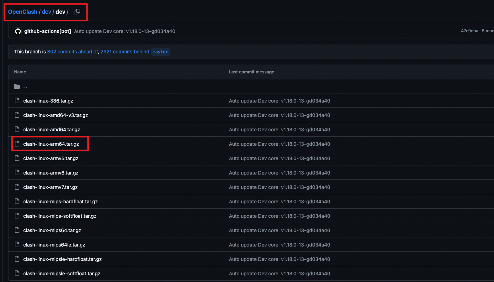
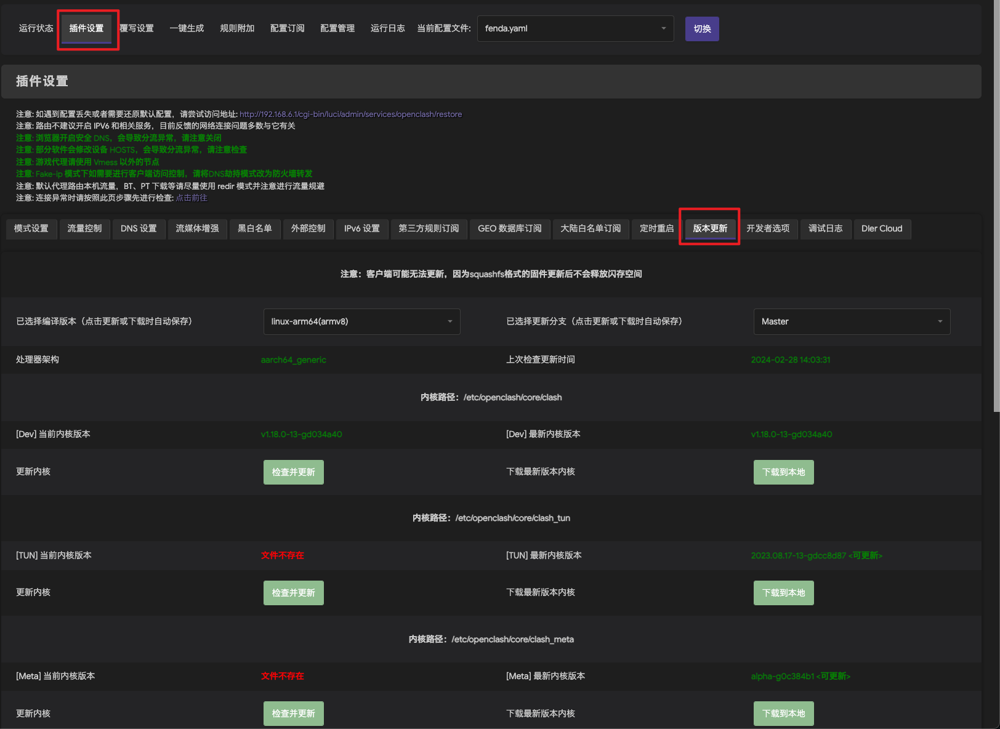
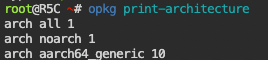
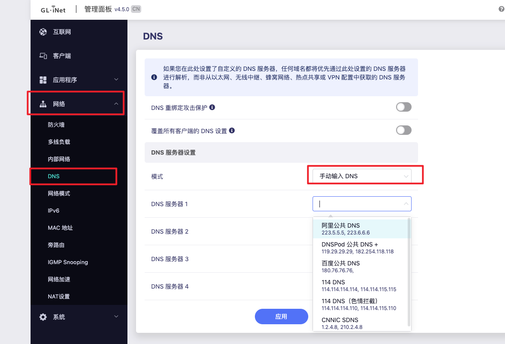

# openwrt软件配置

## openclash

下载好luci-app-openclash后，还需要下载对应版本的内核。记住是在dev/dev文件夹下的才是需要的内核。




openclash插件设置中，选择版本更新可以看到内核的情况。



还能看到处理器的架构，以选择合适的内核下载。注意，armv8架构的cpu所需要的内核，合并到arm64里面去了。下载arm64的即可。


## 杂项

### 查看CPU架构

不清楚 CPU 架构类型可通过运行 `opkg print-architecture` 命令查询。

```shell
opkg print-architecture
```



### openclash和zerotier/tailscale冲突的问题

打开openclash后，接着打开zerotier或tailscale组网，会发现无法连接百度、网易云、github等，ip地址也看不到（在openclash的页面可以看到）。

网上到处找了解决方法都没有找到，看到一些帖子说大概率是DNS出问题了。

更新了openclash为最新版本（v0.46.003) ，zerotier配置了端口之后，openclash和zerotier没有冲突了。（tailscale没有试了）

### glinet路由器更新固件后goodcloud掉线

这个问题真的是很傻逼，glinet更新官方固件如果没有选择保留配置的选项，那么更新后第三方插件都会被删除，但这些插件的一些设置没有恢复默认。

我这里感觉是因为，我用了openclash这个第三方软件，这个软件会修改路由器的dns设置，然后固件更新之后这个设置没有变，但openclash没有了，导致dns配置错误，路由器可以ping具体的ip地址，但域名无法解析。解决方法就是重设路由器的dns服务器。

我先将路由器的dns设置成阿里云的:



但发现没有改善，路由器仍然无法解析域名。（可能过一会儿dns才生效）。

然后将dns模式再次设置为自动获取，这次尝试更新软件源，发现成功了，goodcloud上也显示设备上线了。


