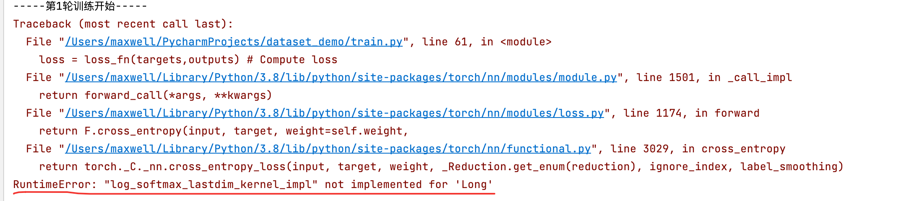
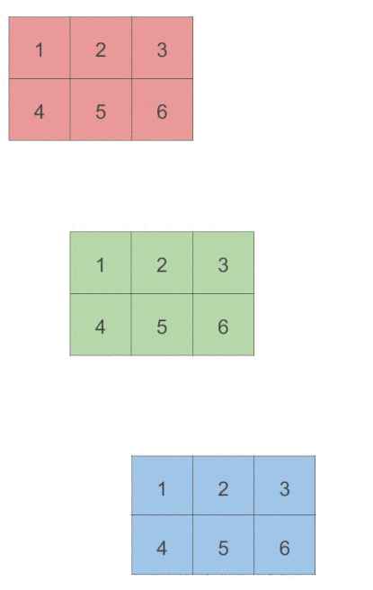

# PyTorch

## 概述

首先，正如 Python 一样， PyTorch 有一个扩展名为“.py”的文件，但在该文件中有很多非 Python 代码。事实上，由于性能原因， PyTorch 大部分是用 C++和 CUDA 编写的， CUDA 是一种 来自英伟达的类 C++的语言， 可以被编译并在 GPU 上以并行方式运行。

### Save & Load models

2 ways to save models:

```python
vgg16 = torchvision.models.vgg16()
## The first way to save.  Save both network structures and parameters.
torch.save(vgg16,"vgg16_method1.pth")

## 2nd. Save only parameters
torch.save(vgg16.state_dict(),"v
```

Corresponding 2 ways to load models:

```python
## 以方式一保存的模型，需要这样加载
model = torch.load("./vgg16_method1.pth")

## 以方式二保存的模型仅有参数，需要先设置网络结构，再加载参数
vgg16 = torchvision.models.vgg16()
vgg16.load_state_dict(torch.load("./vgg16_method2.pth"))
```

Note：方式一保存的模型，加载时（如果在其他页面），则需要先把模型定义的代码引入。

另外，使用GPU训练的模型要在只有CPU环境的电脑中加载时，需要加入一个参数：

```python
model = torch.load("model_gpu.pth",map_location=torch.device("cpu"))
```


### Built in models

在torchvision包中，集成了一些常用的关于vision的模型。


首字母大写的名称指的是实现了许多流行模型的 Python 类，它们的体系结构不同，即输入 和输出之间操作的编排不同。

**首字母小写的名称指的是一些便捷函数，它们返回这些类实例化 的模型**，有时使用不同的参数集。例如， resnet101 表示返回一个有 101 层网络的 ResNet 实例， resnet152 表示返回一个有 152 层网络的 ResNet 实例， 以此类推。 


### PyTorch Hub

PyTorch 在 1.0 版本中引入了 Torch Hub， 它是一种机制，通过该机制作者可以在 GitHub 上 发布模型，无论是否预先训练过权重，都可以通过 PyTorch 可以理解的接口将其公开发布。这使 得从第三方加载预训练的模型就像加载 TorchVision 模型一样简单。

作者若要通过 Torch Hub 机制发布模型，只需将一个名为 hubconf.py 的文件放在 GitHub 存 储库的根目录下。该文件的结构非常简单。


在我们寻找有趣的预训练模型时，我们现在可以搜索包含 hubconf.py 文件的 GitHub 存储库。 我们马上就会知道可以使用 torch.hub 模块来加载他们。

在 GitHub 中访问 TorchVision 时，我们会注意到它包含一个 hubconf.py 文件。我们要做的第 1 件事就是在该文件中查找存储库的入口点，稍后我们需要指定它们。以 TorchVision 为例，有 resnet18 和 resnet50， 我们已经知道它们的作用：它们分别返回 18 层和 50 层 ResNet 模型。我们 还可以看到入口点函数包含参数 pretrained， 该参数值如果为 true， 返回的模型将使用从 ImageNet 获得的权重进行初始化，正如我们在本章前面看到的。

现在我们知道了**存储库、入口点和一个有趣的关键参数**，这就是我们使用 torch.hub 加载模 型所需要的全部内容，我们甚至不需要复制存储库。没错， PyTorch 会帮我们处理的。代码如下：


以上代码将设法将 pytorch/vision 主分支的快照及其权重下载到本地目录，这里默认下载到 本地的 torch/hub 目录下。然后运行 resnet18 入口点函数，该函数返回实例化的模型。根据环境的不同， Python 可能会缺少一些模块，如 PIL。 我们报告，以便我们采取行动。

注意，入口点函数应该返回模型，但是，严格地说，这也不是必须的。


### Training & Testing Neural Networks


### In PyTorch

Training & Testing Neural Networks - in Pytorch


Step1: Load data.


## Dataset & Dataloader

Dataset: stores data samples and expected values

Dataloader: groups data in batches, enables multiprocessing

```python
dataset = MyDataset(file)
dataloader = DataLoader(dataset,batch_size,shuffle=True)
## In the training case, shuffle = Ture 
## In the testing case, shuffle = False
```

Rewrite functions

```python
from torch.utils.data import Dataset, DataLoader

class MyDataset(Dataset):
    def __init__(self,file):    ## Read data & preprocess
        self.data = ...
    
    def __getitem__(self, index):   ## Returns one sample at a time 通常带一个参数，即一个索引
        return self.data[index]
    
    def __len__(self):          ## Returns the size of the dataset
        return len(self.data)
```

Example:

```python
dataset = MyDataset(file)
dataloader = DataLoader(dataset,batch_size=5,shuffle=False)
## In the definition of MyDataset class, 
```


DataLoader invoke getitem function on dataset to load data.

### Split data   [:,-1], [:,:-1]

Note train_data is a tensor.

- **`train_data[:, -1]`** selects all the rows (samples) of the last column (target variable) of the **`train_data`** tensor.
- **`train_data[:, :-1]`** selects all rows of **`train_data`** except the last column.

**`train_data[:, :-1]`** is used to extract the input features (all columns except the last) from the training data, while **`train_data[:, -1]`** is used to extract the target labels (only the last column) from the training data. This separation of features and labels is a common practice in supervised learning.

判断如何分割的诀窍就是逗号，逗号作为分割。

### Dataset

Dataset定义方法：


三个需要重写的方法：

- init函数： 定义之后需要使用到的数据，通常是全局变量的形式（类全局变量）
- getitem函数：通常带有一个参数，idx，即index的缩写。返回需要的数据（单个）
- len函数：返回长度

例子：

一个蚂蚁和蜜蜂的数据集，组织形式如下:


train文件夹下的为训练数据集，val文件夹下的为validation数据集。并且，他们的子文件夹ants中包含蚂蚁图片，即input features，而label即文件夹名ants，bees也是类似的。


可以将所有蚂蚁图片的文件名读入，作为数组，然后getitem中通过idx获取到对应的文件名，再读入实例中。

```python
from torch.utils.data import Dataset
from PIL import Image
import os

class MyDataset(Dataset):
    def __init__(self, root_dir, label_dir):
        self.root_dir = root_dir  ## 可通过创建类全局变量将变量在各个方法中共享
        self.label_dir = label_dir
        self.path = os.path.join(self.root_dir, self.label_dir)  ## 将路径拼接起来
        self.img_path = os.listdir(self.path)  ## listdir类似shell中的ls命令，在这个情况下列出的全都是图片文件名

    def __getitem__(self, idx):  ## idx: index 索引
        img_name = self.img_path[idx]  ## 从图片地址列表中获取对应索引图片的文件名
        img_item_path = os.path.join(self.root_dir, self.label_dir, img_name)  ## 拼接图片路径
        ## img_item_path = os.path.join(self.path,img_name) ## 一样的小国
        img = Image.open(img_item_path)  ## 读取图片到实例中
        label = self.label_dir  ## 文件组织中，label即文件夹名
        return img, label

    def __len__(self):
        return len(self.img_path)  ## 列表长度即数据集长度
```

More example:


这次label的信息不在文件夹名，而是在对应的*_label文件夹中的txt文件中。


```python
import os
from torch.utils.data import Dataset
from PIL import Image
class MyDataset(Dataset):
    def __init__(self,root_dir,feature_dir,label_dir):
        self.root_dir = root_dir ## 数据集根目录名
        self.feature_dir = feature_dir ## input 目录名
        self.label_dir = label_dir      ## target（label） 目录名
        self.feature_path = os.path.join(self.root_dir,self.feature_dir) ## input所在路径
        self.label_path = os.path.join(self.root_dir,self.label_dir)    ## output所在路径

        self.img_names = os.listdir(self.feature_path)      ## 所有input（图片）文件名集合
        self.label_names = os.listdir(self.label_path)      ## 所有input（图片）文件名集合
    def __getitem__(self, idx):
        img_name = self.img_names[idx]
        img_item_path = os.path.join(self.feature_path,img_name)
        image = Image.open(img_item_path)
        label_name = self.label_names[idx]
        label_item_path = os.path.join(self.label_path,label_name)
        with open(label_item_path) as f:
            label = f.read()
        return image,label
    def __len__(self):
        return len(self.img_names)
root_dir = "dataset2/train"
ants_feature_dir = "ants_image"
ants_label_dir = "ants_label"
bees_feature_dir = "bees_image"
bees_label_dir = "bees_label"
ants_dataset = MyDataset(root_dir,ants_feature_dir,ants_label_dir)
bees_dataset = MyDataset(root_dir,bees_feature_dir,bees_label_dir)

print(bees_dataset[0])
bees_dataset[0][0].show()
```

### Dataloader

Import parameters:


Regard batch size:

We’ve mentioned that dataloader will invoke the `__getitem__()` method from dataset class. If the batch size is 4, then dataloader will invoke `__getitem__()` four times for one batch.


Example:

```python
import torchvision

from torch.utils.data import DataLoader
from torch.utils.tensorboard import SummaryWriter

test_data = torchvision.datasets.CIFAR10("./dataset",train=False,transform=torchvision.transforms.ToTensor(),download=True)

## Initialize dataloader
test_loader = DataLoader(test_data,batch_size=4,shuffle=True,num_workers=0,drop_last=False)

## First picture(feature) and target in the test dataset
img, target = test_data[0]
print(img.shape)
print(target)

writer = SummaryWriter("logs")
step = 0
## Get data from dataloader:
for data in test_loader:
    imgs, targets = data
    ## note it is add_images not add_image
    writer.add_images("test_data",imgs,step) ## imgs is 4-D tensor with 4(batch-size) 3-D img tensor
    step += 1

writer.close()
```

Regard shuffle:

shuffle set to True means to have the data reshuffled at every epoch:

```python
writer = SummaryWriter("logs")
## shuffle set to true, so data are different in every epoch
for epoch in range(2):
    ## Get data from dataloader:
    for data in test_loader:
        step = 0
        imgs, targets = data
        ## note it is add_images not add_image
        writer.add_images(f"epoch {epoch}",imgs,step) ## imgs is 4-D tensor with 4(batch-size) 3-D img tensor
        step += 1

writer.close()
```


## Tensor

### 实际数据转换为浮点

由于浮点数是网络处理信息的方式，因此我们需要一种方法，将我们希望处理的真实世界的 数据编码为网络可理解的数据，然后将输出解码为我们可以理解和使用的数据。

深度神经网络通常在不同阶段学习将数据从一种形式转换为另一种形式，这意味着**每个阶段 转换的数据可以被认为是一个中间表征序列。**

一般来说，这些中间表征是浮点数的集合，它们描述输入的特征，并以一种有助于描述输入映射到神经网络输出的方式捕获数据的结构。这些描述是针对当前任务的， 是从相关的例子 中学习到的。


请记住，这些中间表征是将**输入与前一层神经元的权重结合**的结果。

PyTorch处理和存储数据的方式：张量

在深度学习中，张量可以将向量和矩阵推广到任意维度


Tensor: High-dimensional matrices (arrays) 或者说多维数组。


### Shape

Check with .shape .


### Creating Tensors

Directly from data (list or numpy.ndarray):

```python
x = torch.tensor([[1, -1], [-1, 1]])
x = torch.tensor(np.array([[1, -1], [-1, 1]]))
x = torch.from_numpy(np.array([[1, -1], [-1, 1]]))
## Result:
tensor([[ 1, -1],
[-1,  1]])
```

Tensor of constant zeros & ones:

```python
x = torch.zeros([2,2]) ## 2x2 tensor
y = torch.ones([1,2,5]) ## 1x2x5 tensor

tensor([[0., 0.],
        [0., 0.]])
tensor([[[1., 1., 1., 1., 1.],
         [1., 1., 1., 1., 1.]]])
```

### 张量的本质

Python 列表或数字元组是在内存中单独分配的 Python 对象的集合。另外， PyTorch 张量或 NumPy 数组通常是**连续内存块的视图**，这些内存块包含未装箱的 C 数字类型， 而不是 Python 对象。


### 张量的存储视图

现在是时候让我们更仔细地看看底层的实现了。张量中的值被分配到由 torch.Storage 实例 所管理的连续内存块中。存储区是由数字数据组成的一维数组，即包含给定类型的数字的连续 内存块，例如 float（代表 32 位浮点数）或 int64（代表 64 位整数）。一个 PyTorch 的 Tensor 实 例就是这样一个 Storage 实例的视图，该实例能够使用偏移量和每个维度的步长对该存储区进 行索引① 。

多个张量可以索引同一存储区，即使它们索引到的数据不同。我们可以看下图 所示的示例。事实上，当我们在 3.2 节中请求 points[0]时， 我们得到的是另一个张量，它索引了与张量 points 相同的存储区，只是**没有索引存储区中的所有内容**，而且索引到的张量具有不同的维度， 一个是一维，一个是二维。但是**底层内存只分配一次，因此可以快速创建数据的备用张量视图， 而不管 Storage 实例管理的数据的大小。**


#### 索引存储区

让我们看看在实际中如何使用二维点来索引存储区。可以使用 storage()访问给定张量的存 储区：


尽管张量显示自己有 3 行 2 列，但底层的存储区是一个大小为 6 的连续数组。从这个意义上 说，张量只知道如何将一对索引转换成存储区中的一个位置。

我们还可以手动索引存储区。

```python
points_storage = points.storage() 
points_storage[0] ## 4.0
```

我们不能用 2 个索引来索引二维张量的存储区。不管和存储区关联的任何其他张量的维度是 多少，它的布局始终是一维的。 从这点来说，改变一个存储区的值导致与其关联的张量的内容发生变化就不足为怪了。

#### 就地操作张量

有少量操作仅作为 Tensor 对象的方法存在。这些操作可 以从名称结尾的下画线识别出来，如 `zero_()`， 这表明该方法通过修改输入张量，而不是创建一个 新的输出张量，然后返回新创建的输出张量。


### 张量元数据：大小、偏移量和步长

为了在存储区中建立索引，张量依赖于一些明确定义它们的信息：大小、偏移量和步长。图 3.5 显示了它们如何相互作用。大小（在 NumPy 中称之为形状）是一个元组，表示张量在每个维 度上有多少个元素。偏移量是指存储区中某元素相对张量中的第 1 个元素的索引。步长是指存储 区中为了获得下一个元素需要跳过的元素数量。


### Common Operations

Common arithmetic functions are supported, such as:


Mean: Average.

#### 使用列表索引访问二维tensor


```python
y = torch.tensor([[4.0,1.5],[5.0,3.0],[2.0,1.0]])

y[0,1]
## tensor(1.5000)
```


#### Transpose

Transpose: transpose two specified dimensions

```python
x = torch.zeros([2,3])
print(x.shape) ## torch.Size([2, 3])
x = x.transpose(0,1)
print(x.shape) ## torch.Size([3, 2])
```


#### Arithmetic Operations

Tensor中的数值计算都是element-wise的。

+，-，*，/实际上是对两个tensor中所有的对应位置的元素进行计算。


#### Squeeze

Squeeze: remove the specified dimension with length = 1

```python
x = torch.zeros([1,2,3])
x = x.squeeze(0)
x.shape ## torch.Size([2, 3])
## if the size of the dimension is not 1:
x = torch.zeros([1,2,3])
x = x.squeeze(1)
x.shape ## torch.Size([1, 2, 3])
```

如果指定的dimension的size不是1，则不做任何改变

#### Unsqueeze

Unsqueeze: expand a new dimension

```python
x = torch.zeros([2,3])
x = x.unsqueeze(1) ## dim=1
x.shape ## torch.Size([2, 1, 3])
```


#### Concatenate

Cat: concatenate multiple tensors

```python
x = torch.zeros([2, 1, 3])
y = torch.zeros([2, 3, 3])
z = torch.zeros([2, 2, 3])
w = torch.cat([x, y, z], dim=1)
w.shape ## torch.Size([2, 6, 3])
```

Note: Except for dim 1, the other dims of the x,y,z are the same.


#### More Operations

[torch.Tensor — PyTorch 2.0 documentation](https://pytorch.org/docs/stable/tensors.html)

### Data Type

在神经网络中发生的计算通常是用 32 位浮点精度执行的。采用更高的 精度，如 64 位，并不会提高模型精度，反而需要更多的内存和计算时间。

为了给张量分配一个正确的数字类型，我们可以指定适当的 dtype 作为构造函数的参数

```python
double_points = torch.ones(10, 2, dtype=torch.double) 
short_points = torch.tensor([[1, 2], [3, 4]], dtype=torch.short)
```

我们可以通过访问相应的属性来找出一个张量的 dtype 值：

```python
short_points.dtype
```

我们还可以使用相应的转换方法将张量创建函数的输出转换为正确的类型:

```python
double_points = torch.zeros(10, 2).double() 
short_points = torch.ones(10, 2).short()
## 或者使用另一种更方便的方法
double_points = torch.zeros(10, 2).to(torch.double) 
short_points = torch.ones(10, 2).to(dtype=torch.short)
```

**在底层， to()方法会检查转换是否是必要的， 如果必要，则执行转换。**以 dtype 命名的类型转 换方法（如 float()）是 to()的简写， 但 to()方法可以接收其他参数.

在操作中输入多种类型时，输入会自动向较大类型转换。因此，如果我们想要进行 32 位计 算，我们需要确保所有的输入最多是 32 位的。

Using different data types for model and data will cause errors.


More:

[torch.Tensor — PyTorch 2.0 documentation](https://pytorch.org/docs/stable/tensors.html)

### Device

Tensors & modules will be computed with CPU by default.

Use .to() to move tensors to appropriate devices.

```python
x = x.to('cpu') ## CPU
x = x.to('cuda') ## GPU
## Check if your computer has NVIDIA GPU
torch.cuda.is_available()
```

Multiple GPUs: specify ‘cuda:0’, ‘cuda:1’, ‘cuda:2’, …

### Gradient Calculation

```python
x = torch.tensor([[1., 0.], [-1., 1.]], requires_grad=True)
z = x.pow(2).sum()
z.backward() ## Computes the gradient of current tensor w.r.t. graph leaves.
print(x.grad)
## Result:
tensor([[ 2.,  0.],
        [-2.,  2.]])
```


## Network Layers torch.nn


### General

Step2: Use pytorch to define neural networks

torch.nn – Network Layers

Linear Layer (Fully-connected Layer): nn.Linear(in_features, out_features)


Parameters in nn.Linear(32,64): 

- The first parameter 32 refer to the size of the last dimension of the input tensor
- The second parameter 64 refer to the size of the last dimension of the output tensor

Linear Layer:


X: 32x1 matrix, b: 64x1 matrix.

```python
layer = torch.nn.Linear(32,64) ### input 32, output 64
print(layer.weight.shape) ### torch.Size([64, 32])
print(layer.bias.shape) ### torch.Size([64])
```

#### Non-Linear Activation Functions

- Sigmoid Activation: nn.Sigmoid()
- ReLU Activation: nn.ReLU()

#### Build your own neural network

```python
import torch.nn as nn
class MyModel(nn.Module):
    def __init__(self): ### Initialize your model & define layers
        super(MyModel,self).__init__()
        self.net = nn.Sequential(   ### 3 layers
            nn.Linear(10,32),   ### 1st layer
            nn.Sigmoid(),       ### activation function
            nn.Linear(32,1)     ### 2nd layer
        )
    def forward(self,x):    ### Compute output of your NN
        return self.net(x)
```

Note:


#### Loss Function

Step3: Loss Function

- Mean Squared Error (for regression tasks): criterion=nn.MSELoss()
- Cross Entropy(for classification tasks): criterion=nn.CrossEntropyLoss()

loss = criterion(model_output,expected_value) 

#### Optimization torch.optim

Step4: Optimization

- Gradient-based optimization algorithms that adjust network parameters to reduce error.
- E.g. Stochastic Gradient Descent (SGD):torch.optim.SGD(model.parameters(), lr, momentum = 0)

```python
optimizer = torch.optim.SGD(model.parameters(), lr, momentum = 0)
```

❗❗Note: For every batch of data:

1. Call optimizer.zero_grad() to reset gradients of model parameters. 
2. Call loss.backward() to backpropagate gradients of prediction loss.
3. Call optimizer.step() to adjust model parameters.

#### detach()

**`tensor.detach().item()`** is used in PyTorch to obtain a Python number from a tensor.

Here is what it does step by step:

- **`detach()`** creates a new tensor that shares storage with the original tensor but does not require gradient. This is done to avoid updating the gradient for the original tensor.
- **`item()`** converts the resulting tensor to a Python number. This is useful because some operations on tensors return tensors rather than Python numbers, and sometimes it is necessary to obtain a Python number in order to use it in other parts of the code.

The resulting value is a scalar, which can be used, for example, to print a single value from a tensor or to compare it with another scalar value.

### Containers


#### Module

Base class for **all** neural network modules. A general template:

```python
import torch.nn as nn
import torch.nn.functional as F

class Model(nn.Module):
    def __init__(self):
        super().__init__()
        self.conv1 = nn.Conv2d(1, 20, 5)
        self.conv2 = nn.Conv2d(20, 20, 5)

    def forward(self, x):
        x = F.relu(self.conv1(x))
        return F.relu(self.conv2(x))
```

forward: 即神经网络的运算（前向传播）


A simple example:

```python
class MyNetwork(nn.Module):
    def __init__(self):
        super(MyNetwork,self).__init__()

    def forward(self,x):
        result = x + 1
        return result

net = MyNetwork()
x = 1
y = net(x) ### 传递参数给forward，注意不要直接调用forward，而是用实例
print(y) ### 2
```

As the note in forward mentioned, one should call the Module instance instead of forward method.

#### Convolutional Layers

Note: torch.nn 是对 torch.nn.functional的封装，如果要知道更多底层细节，则需要查看torch.nn.functional中的实现。但只掌握torch.nn的使用方法就可以了。


图片是2d的（这里的2d是指图片是平面的），这里以torch.nn.funtional.conv2d为例。

Parameters：


Note: The parameters have requirements of shape, make sure the requirements are meet.


Code:

```python
import torch
import torch.nn.functional as F
input = torch.tensor([[1,2,0,3,1],
                     [0,1,2,3,1],
                     [1,2,1,0,0],
                     [5,2,3,1,1],
                     [2,1,0,1,1]])
### 卷积核，或filter
kernel = torch.tensor([[1,2,1],
                       [0,1,0],
                       [2,1,0]])
### conv2d参数有shape要求：
### (minibatch,in_channels,iH,iW)
input = torch.reshape(input,(1,1,5,5)) ### batch设置为1 2维矩阵，平面，channel数为1
### (out_channels,in_channels/group,kH,kW)
kernel = torch.reshape(kernel,(1,1,3,3))

output = F.conv2d(input,kernel,stride=1)
print(output)
### out
tensor([[[[10, 12, 12],
          [18, 16, 16],
          [13,  9,  3]]]])
```

Padding设置为1时，会在input的上下左右都填充：而填充的数字通常为0


如果stride仍为1，且卷积核大小仍为3X3，则最后output尺寸为：5X5

torch.nn.conv2d:


Note the parameters of nn.conv2d is way different to nn.functional.conv2d’s.


dilation很少用，使用默认设置即可。

Animations to describe the parameters: 

[conv_arithmetic/README.md at master · vdumoulin/conv_arithmetic](https://github.com/vdumoulin/conv_arithmetic/blob/master/README.md)

#### Pooling layers

pooling layers 即池化层


The most common used pooling layer is nn.MaxPool2d.


Sliding windows: pooling kernel

Parameters：


Code:

```python
import torch
from torch import nn
from torch.nn import MaxPool2d

### input = torch.tensor([[1,2,0,3,1],
###                      [0,1,2,3,1],
###                      [1,2,1,0,0],
###                      [5,2,3,1,1],
###                      [2,1,0,1,1]],dtype=torch.float32) ### 注意tensor要为float类型
### 或者
input = torch.FloatTensor([[1,2,0,3,1],
                     [0,1,2,3,1],
                     [1,2,1,0,0],
                     [5,2,3,1,1],
                     [2,1,0,1,1]])

input = torch.reshape(input,(-1,1,5,5)) ### shape参数中第一个设置为-1，让它自己计算值
print(input.shape)

class MyNetwork(nn.Module):
    def __init__(self):
        super(MyNetwork,self).__init__()
        self.maxpool1 = MaxPool2d(kernel_size=3,ceil_mode=True)

    def forward(self,input):
        output = self.maxpool1(input)
        return output

model = MyNetwork()
output = model(input)
print(output)
```

使用tensorboard展示结果：

```python
import torch
from torch import nn
from torch.nn import MaxPool2d
from torch.utils.tensorboard import SummaryWriter
from torch.utils.data import DataLoader
import torchvision
### input = torch.tensor([[1,2,0,3,1],
###                      [0,1,2,3,1],
###                      [1,2,1,0,0],
###                      [5,2,3,1,1],
###                      [2,1,0,1,1]],dtype=torch.float32) ### 注意tensor要为float类型
### 或者
input = torch.FloatTensor([[1,2,0,3,1],
                     [0,1,2,3,1],
                     [1,2,1,0,0],
                     [5,2,3,1,1],
                     [2,1,0,1,1]])

input = torch.reshape(input,(-1,1,5,5)) ### shape参数中第一个设置为-1，让它自己计算值
print(input.shape)

class MyNetwork(nn.Module):
    def __init__(self):
        super(MyNetwork,self).__init__()
        self.maxpool1 = MaxPool2d(kernel_size=3,ceil_mode=True)

    def forward(self,input):
        output = self.maxpool1(input)
        return output

model = MyNetwork()
### output = model(input)
### print(output)

writer = SummaryWriter("./logs_maxpool")
step = 0

dataset = torchvision.datasets.CIFAR10("./dataset",train=False,
                                       transform=torchvision.transforms.ToTensor(),
                                       download=True)
dataloader = DataLoader(dataset,batch_size=64)

for data in dataloader:
    img,label = data
    writer.add_images("input",img,global_step=step)
    step += 1
    output = model(img)
    writer.add_images("maxpool", output, global_step=step)

writer.close()
```

#### Non-linear activations

##### ReLU


Code:

```python
import torch
from torch import nn
from torch.nn import ReLU
input = torch.tensor([[1,-0.5],
                      [-1,3]])
print(input.shape)
class MyModel(nn.Module):
    def __init__(self):
        super(MyModel,self).__init__()
        self.relu1 = ReLU()

    def forward(self,input):
        output = self.relu1(input)
        return output

model = MyModel()
output = model(input)
print(output)
### output:
tensor([[1., 0.],
        [0., 3.]])
```

##### sigmoid

Code:

```python
import torch
import torchvision
from torch import nn
from torch.nn import ReLU, Sigmoid
from torch.utils.data import DataLoader
from torch.utils.tensorboard import SummaryWriter

class MyModel(nn.Module):
    def __init__(self):
        super(MyModel, self).__init__()
        self.sigmoid1 = Sigmoid()

    def forward(self, input):
        output = self.sigmoid1(input)
        return output

model = MyModel()

writer = SummaryWriter("./logs_sigmoid")
dataset = torchvision.datasets.CIFAR10("./dataset",train=False,
                                       transform=torchvision.transforms.ToTensor(),
                                       download=True)
dataloader = DataLoader(dataset,batch_size=64)
step = 0
for data in dataloader:
    imgs,targets = data
    writer.add_images("input",imgs,global_step=step)
    output = model(imgs)
    writer.add_images("output",output,global_step=step)
    step += 1

writer.close()
```

#### Sequential

CIFAR10 dataset network structure:


The first convolution layer’s kernel size is 5x5, and note the output of it is 32 channel and the kernel size of the inputs is not changed. In order to set the proper value of padding, we need to do some math. Here’s the formula:


Usually, dialiation is set to 1(default). 

In this case, padding and stride are unknown parameters.

$$
H_{out}(32) = [\frac{32(H_{in}) + 2 \times padding  - 1 \times (5-1) - 1}{stride}]
$$

Assume stride = 1, so padding = 2. If stride is 2, then padding should be very large. So we set stride to 1.

Note: After flatten, the input of linear layer has a shape of [1024]. And there’re 2 linear layer (because there’re 64 hidden units ).

Example: (Not using sequential)

```python
import torch
from torch import nn
from torch.nn import Conv2d, MaxPool2d, Flatten, Linear

class MyModel(nn.Module):
    def __init__(self):
        super(MyModel,self).__init__()
        ### stride is 1 in default
        self.conv1 = Conv2d(3,32,5,padding=2)
        self.maxpool1 = MaxPool2d(2)
        self.conv2 = Conv2d(32,32,5,padding=2)
        self.maxpool2 = MaxPool2d(2)
        self.conv3 = Conv2d(32,64,5,padding=2)
        self.maxpool3 = MaxPool2d(2)
        self.flatten = Flatten()
        self.linear1 = Linear(1024,64)
        self.linear2 = Linear(64,10)

    def forward(self,x):
        x = self.conv1(x)
        x = self.maxpool1(x)
        x = self.conv2(x)
        x = self.maxpool2(x)
        x = self.conv3(x)
        x = self.maxpool3(x)
        x = self.flatten(x)
        x = self.linear1(x)
        x = self.linear2(x)
        return x

model = MyModel()
print(model)

### Note: If some parameters of the function in network are set incorrectly, there's no complains.
### We should generate some random values and try to run this model

input = torch.zeros((64,3,32,32))
output = model(input)
print(output.shape)
```

Using sequential:

```python
import torch
from torch import nn
from torch.nn import Conv2d, MaxPool2d, Flatten, Linear, Sequential

class MyModel(nn.Module):
    def __init__(self):
        super(MyModel,self).__init__()
        ### stride is 1 in default
        self.model1 = Sequential(
            Conv2d(3, 32, 5, padding=2),
            MaxPool2d(2),
            Conv2d(32, 32, 5, padding=2),
            MaxPool2d(2),
            Conv2d(32, 64, 5, padding=2),
            MaxPool2d(2),
            Flatten(),
            Linear(1024, 64),
            Linear(64, 10)
        )

    def forward(self,x):
        x = self.model1(x)
        return x

model = MyModel()
print(model)

### Note: If some parameters of the function in network are set incorrectly, there's no complains.
### We should generate some random values and try to run this model

input = torch.zeros((64,3,32,32))
output = model(input)
print(output.shape)
```


## Loss Functions


### L1Loss


### Cross Entropy


上图中log其实是以e为底。应该写ln

Cross Entropy使用注意：

参数重先写预测值，再写targets

```python
loss = loss_fn(outputs,targets) ## Compute loss
```

否则可能遇到一些错误。

比如targets为整形的tensor，先写targets通常会报错：



而当我们将targets类型转换为FloatTensor，还是会报错：

```python
targets = targets.float()
loss = loss_fn(targets,outputs) ## Compute loss
```


这是因为，我们传入的第二个参数outputs的shape为：Tensor.size([64,10])，为2D，它作为loss_fn重target参数的值就不符合条件。

## BP & Optimizer

### BP

BP(BackPropagation) 即反向传播。通过正向传播和反向传播，可以求得梯度（gradient）。再通过梯度下降法（Gradient Descent）可以优化模型。


Code:

```python
class MyModel(nn.Module):
    def __init__(self):
        super(MyModel,self).__init__()
        ## stride is 1 in default
        self.model1 = Sequential(
            Conv2d(3, 32, 5, padding=2),
            MaxPool2d(2),
            Conv2d(32, 32, 5, padding=2),
            MaxPool2d(2),
            Conv2d(32, 64, 5, padding=2),
            MaxPool2d(2),
            Flatten(),
            Linear(1024, 64),
            Linear(64, 10)
        )

    def forward(self,x):
        x = self.model1(x)
        return x

dataset = torchvision.datasets.CIFAR10("./dataset",train=False,
                                       transform=torchvision.transforms.ToTensor(),
                                       download=True)
dataloader = DataLoader(dataset,batch_size=1)
loss = nn.CrossEntropyLoss()
model = MyModel()

for data in dataloader:
    imgs,targets = data
    outputs = model(imgs)
    result_loss = loss(outputs,targets)
    result_loss.backward() ## Compute gradient
```

### Optimizer

[torch.optim — PyTorch 2.0 documentation](https://pytorch.org/docs/stable/optim.html?highlight=optimizer#torch.optim.Optimizer)


Code:

```python
import torch
import torchvision.datasets
from torch import nn
from torch.nn import Conv2d, MaxPool2d, Flatten, Linear, Sequential
from torch.utils.data import DataLoader

class MyModel(nn.Module):
    def __init__(self):
        super(MyModel, self).__init__()
        ## stride is 1 in default
        self.model1 = Sequential(
            Conv2d(3, 32, 5, padding=2),
            MaxPool2d(2),
            Conv2d(32, 32, 5, padding=2),
            MaxPool2d(2),
            Conv2d(32, 64, 5, padding=2),
            MaxPool2d(2),
            Flatten(),
            Linear(1024, 64),
            Linear(64, 10)
        )

    def forward(self, x):
        x = self.model1(x)
        return x

dataset = torchvision.datasets.CIFAR10("./dataset", train=False,
                                       transform=torchvision.transforms.ToTensor(),
                                       download=True)
dataloader = DataLoader(dataset, batch_size=1)
loss = nn.CrossEntropyLoss()
model = MyModel()
optim = torch.optim.SGD(model.parameters(),lr=0.01)

## 只进行了一轮学习
for data in dataloader:
    imgs, targets = data
    outputs = model(imgs)
    result_loss = loss(outputs, targets)
    optim.zero_grad() ## Clear the gradient  computed last time
    result_loss.backward()  ## Compute gradient
    optim.step()     ## Optimization
```

如果进行多轮学习：

```python
## 进行20轮学习
n_epochs = 20
for epoch in range(n_epochs):
    running_loss = 0.0
    for data in dataloader:
        imgs, targets = data
        outputs = model(imgs)
        result_loss = loss(outputs, targets)
        optim.zero_grad() ## Clear the gradient  computed last time
        result_loss.backward()  ## Compute gradient
        optim.step()     ## Optimization
        running_loss = running_loss + result_loss
    print(running_loss) ## 总体loss
```

再套一个循环即可。多轮学习可以提高性能。


As you can see, total loss is decreased.

## Entire procedure of deep learning

```python
## Neural Network Training Setup
dataset = MyDataset(file) ## read data via MyDataset
tr_set = DataLoader(dataset,16,shuffle=True) ## put dataset into DataLoader
model = MyModel().to(device)    ## construct model and move to device (cpu/cuda)
criterion = nn.MSELoss()        ## set loss function
optimizer = torch.optim.SGD(model.parameters(),0.1) ## set optimizer

## Neural Network Training Loop
for epoch in range(n_epochs):               ## iterate n_epochs
    model.train()                           ## set model to train mode
    for x,y in tr_set:                      ## iterate through the dataloader
        optimizer.zero_grad()               ## set gradient to zero
        x,y = x.to(device), y.to(device)    ## move data to device
        pred = model(x)                     ## forward pass (compute output)
        loss = criterion(pred,y)            ## compute loss
        loss.backward()                     ## compute gradient (backpropagation)
        optimizer.step()                    ## update model with optimizer

## Neural Network Validation Loop
model.eval()                                ## set model to evaluation mode
total_loss = 0
for x, y in dv_set:                         ## iterate through the dataloader
    x, y = x.to(device), y.to(device)
    with torch.no_grad():                   ## disable gradient calculation
        pred = model(x)                     ## forward pass
        loss = criterion(pred, y)
    total_loss += loss.cpu().item() * len(x)## accumulate loss
    avg_loss = total_loss / len(dv_set.dataset) ## compute averaged loss

## Neural Network Testing Loop
model.eval()                                ## set model to evaluation mode
preds = []
for x in tt_set:                            ## iterate through the dataloader
    x = x.to(device)
    with torch.no_grad():
        pred = model(x)
        preds.append(pred.cpu())            ## collect prediction
```

### eval & no_grad

model.eval(): Changes behaviour of some model layers, such as dropout and batch normalization.

with torch.no_grad():  Prevents calculations from being added into gradient computation graph. Usually used to prevent accidental training on validation/testing data.

### Save/Load Trained Models

```python
## Save 
torch.save(model.state_dict(), path) 

## Load
ckpt = torch.load(path)
model.load_state_dict(ckpt)
```

## 用到的一些方法

要查看一个tensor的形状，则要用到tensor.shape的方法。例如：

```python
w = torch.tensor(([2,-3.4],[5,8.8]))
w.shape
## torch.Size([2, 2])
```

如果直接对tensor使用len方法，则返回的是第0维的尺寸。


### torch

#### torch.arange


#### torch.repeat_interleave


#### torch.mean


#### torch.zeros


#### torch.stack


stack会导致升维。

#### torch.cat

将给定的tensors按给定dim拼接


#### torch.clamp

将输入中的所有元素限制在 [ min, max ] 范围内。


#### torch.rand

注意torch.rand是返回一个在$[0,1)$上的均匀分布，tensor的尺寸由参数size决定。


#### torch.randn

返回一个标准正态分布，形状为传入的size参数的值。


#### torch.zeros_like

类似torch.zeros产生一个全是0.的tensor，like表示产生的tensor的shape和输入的tensor相同。


#### torch.normal


第一个参数是均值，第二个参数是标准差。

注意该函数还有多个不同的形式。现在提取出一个会使用到的形式：


#### torch.matmul

即矩阵乘法。

pytorch中矩阵乘法有简写的形式：

$torch.matmul(A,B)$等价于$A @ B$


一个简单例子：


a，b都是二维tensor，即2维矩阵。matmul对他们进行矩阵乘法。

#### torch.reshape


reshape的某个参数被设置为-1时，表示这个维度由其他维度的大小来自动推测。

reshape返回的结果通常都是view，而不是副本。需要注意这个问题。

#### torch.sort


#### torch.squeeze


squeeze仅当维度大小为1时才删除。

#### torch.unsqueeze


#### [None,...] 切片

```python
x = torch.tensor([1,2,3,4])
x.unsqueeze(0),x[None,...] # (tensor([[1, 2, 3, 4]]), tensor([[1, 2, 3, 4]]))
x.unsqueeze(1),x[...,None]

# 输出
(tensor([[1],
         [2],
         [3],
         [4]]),
 tensor([[1],
         [2],
         [3],
         [4]]))
```

[None, ...] 是 .unsqueeze(0) 的 numpy 表示法。两者是等价的。具有高级索引的版本可能会慢一些，因为它需要进行更多检查才能准确找出您想要执行的操作。

还有类似的：

```python
x[None,:], x[:,None]
```

输出

```
(tensor([[1, 2, 3, 4]]),
 tensor([[1],
         [2],
         [3],
         [4]]))
```

#### torch.max

```python
torch.max(input, dim, keepdim=False, *, out=None)
```

**Returns a namedtuple `(values, indices)` where `values` is the maximum value of each row of the `input` tensor in the given dimension `dim`. And `indices` is the index location of each maximum value found (argmax).**

**If `keepdim` is `True`, the output tensors are of the same size as `input` except in the dimension `dim` where they are of size 1. Otherwise, `dim` is squeezed (see `[torch.squeeze()](https://pytorch.org/docs/stable/generated/torch.squeeze.html#torch.squeeze)`), resulting in the output tensors having 1 fewer dimension than `input`.**

Note: **If there are multiple maximal values in a reduced row then the indices of the first maximal value are returned.**

**Parameters:**

**• input (*[Tensor](https://pytorch.org/docs/stable/tensors.html#torch.Tensor)*) – the input tensor.
• dim (*[int](https://docs.python.org/3/library/functions.html#int)*) – the dimension to reduce.
• keepdim (*[bool](https://docs.python.org/3/library/functions.html#bool)*) – whether the output tensor has `dim` retained or not. Default: `False`.**

**Keyword Arguments:**

**out (*[tuple](https://docs.python.org/3/library/stdtypes.html#tuple), optional*) – the result tuple of two output tensors (max, max_indices)**

Example:

```python
a = torch.randn(4, 4)
### a:
tensor([[-1.2360, -0.2942, -0.1222,  0.8475],
        [ 1.1949, -1.1127, -2.2379, -0.6702],
        [ 1.5717, -0.9207,  0.1297, -1.8768],
        [-0.6172,  1.0036, -0.6060, -0.2432]])
torch.max(a, 1)
### :
torch.return_types.max(values=tensor([0.8475, 1.1949, 1.5717, 1.0036]), indices=tensor([3, 0, 0, 1]))
```

#### torch.tensor

##### torch.Tensor.repeat


`x.repeat(4,2)`即0维重复4次，1维重复两次。

##### torch.Tensor.dim


##### torch.tensor.type


指定dtype参数的值，则返回原tensor转换为指定dtype类型的tensor；

不指定dtype参数的值，则返回tensor的类型。

##### torch.tensor.detach


在一些pytorch的版本中，数据需要detach之后才能转换为numpy类型。

##### torch.tensor.repeat

```python
x = torch.tensor([1, 2, 3])
print(x.repeat(4, 2, 1))
### Result:
tensor([[[1, 2, 3],
         [1, 2, 3]],

        [[1, 2, 3],
         [1, 2, 3]],

        [[1, 2, 3],
         [1, 2, 3]],

        [[1, 2, 3],
         [1, 2, 3]]])
```

扩展步骤如下(倒着执行)：

1. 最后一个维度1：此时将[1, 2, 3]中的数字直接重复1次，得到[1, 2, 3]，保持没变
2. 倒数第二个维度2：先将上一步骤的结果增加一个维度，得到[[1, 2, 3]]，然后将最外层中括号中的整体重复2次，得到[    [1, 2, 3], [1, 2, 3]]
3. 倒数第三个维度4：先将上一步骤的结果增加一个维度，得到[[[1, 2, 3], [1, 2, 3]]]，然后将最外层中括号中的整体重复4次，得到[    [[1, 2, 3], [1, 2, 3]], [[1, 2, 3], [1, 2, 3]], [[1, 2, 3], [1, 2, 3]], [[1, 2, 3], [1, 2, 3]]]4三个维度扩展结束，得到结果。

##### torch.tensor.item

将tensor转换为python中的标准数字类型并返回。只在tensor只有一个元素时才能使用。


#### torch.nn

##### torch.nn.Flatten

配合nn.Sequential使用。


将原tensor拉平为2D tensor。不给任何参数的时候，保留第0维度不变，其他维度变为一个向量。

#### torch.flatten


#### torch.utils

##### torch.utils.data

###### torch.utils.data.TensorDataset


参数可接收多个tensor作为输入，但要求各个tensor的第一个维度大小相同。

## Tensorboard

使用方法：

```python
from torch.utils.tensorboard import SummaryWriter

"""
Examples::

      from torch.utils.tensorboard import SummaryWriter

      ## create a summary writer with automatically generated folder name.
      writer = SummaryWriter()
      ## folder location: runs/May04_22-14-54_s-MacBook-Pro.local/

      ## create a summary writer using the specified folder name.
      writer = SummaryWriter("my_experiment")
      ## folder location: my_experiment

      ## create a summary writer with comment appended.
      writer = SummaryWriter(comment="LR_0.1_BATCH_16")
      ## folder location: runs/May04_22-14-54_s-MacBook-Pro.localLR_0.1_BATCH_16/
"""
writer = SummaryWriter("logs") ## 设置保存的文件夹

## 常用的两个方法：

## writer.add_image()

## 绘制 y=x 函数的图像
for i in range(100):
    writer.add_scalar("y=x",i,i)

## 关闭
writer.close()
```

代码运行完毕后，还需要启动tensorboard：

```bash
## --logdir 指定log文件夹
tensorboard --logdir=logs --port=6007
## 或写为
tensorboard --logdir logs --port 6007
```

tensorboad默认的port是6006，如果有多个用户在一台主机上使用tensorboard，可能会出现问题。这时可以设置指定的port来避免错误发生。

### add_scalar


scalar_value 可以是纵轴（y轴），global_step看成横轴（x轴）

```python
from torch.utils.tensorboard import SummaryWriter
writer = SummaryWriter("logs") ## 设置保存的文件夹
## 常用的两个方法：
## 绘制 y=x 函数的图像
for i in range(100):
    writer.add_scalar("y=x",i,i)
    ## add_scalar中参数第一个是图像名，然后先纵轴y，再横轴x

## 关闭
writer.close()
```


### add_image


第一个tag依然是标题，第二个参数是图片数据，可以的类型为 torch.Tensor, numpy.ndarry or string/blobname。

注意用PIL包中的Image函数生成的图片对象不是以上类型，需要转换。

另外需要注意的是图片通道位置的问题（shape）。H:height, W: width, C: Channel

转换为numpy数组后，可以通过shape查看图片的通道。

```python
from torch.utils.tensorboard import SummaryWriter
from PIL import Image
import numpy as np
writer = SummaryWriter("logs") ## 设置保存的文件夹

img_path = "hymenoptera_data/train/ants/0013035.jpg"
img_PIL = Image.open(img_path)
print(type(img_PIL))    ## PIL.JpegImagePlugin.JpegImageFile 不符合add_image中img_tensor 类型要求
img_nparry = np.array(img_PIL) ## 转换为numpy ndarry类型
print(img_nparry.shape) ## (512, 768, 3)
## 可见第三个位置为通道数，需设置dataformats

writer.add_image("Ants",img_nparry,1,dataformats='HWC')
## 关闭
writer.close()
```

还可以通过python console调试时查看图片通道。


上述代码运行完毕后，可以在tensorboard中看到：


代码中add_image中的第三个参数就是step。如果仅修改图片地址，然后更改step：

```python
img_path = "hymenoptera_data/train/bees/16838648_415acd9e3f.jpg"
img_PIL = Image.open(img_path)
print(type(img_PIL))    ## PIL.JpegImagePlugin.JpegImageFile 不符合add_image中img_tensor 类型要求
img_nparry = np.array(img_PIL) ## 转换为numpy ndarry类型

writer.add_image("Ants",img_nparry,2,dataformats='HWC')
```


拖动进度条可修改step，查看不同step的图片。

如果想要单独显示，需更改tag为新的标题。

### 在Colab上运行tensorboard

代码运行完毕后：

```python
%load_ext tensorboard
%tensorboard --logdir logdir
```

重载tensorboard：

```python
%reload_ext tensorboard
```

## Transforms

torchvision中的transforms

常用的几个：


### transforms使用方法

#### ToTensor

```python
from torchvision import transforms
from PIL import Image

img_path = "hymenoptera_data/train/bees/16838648_415acd9e3f.jpg"
img = Image.open(img_path) 

tensor_trans = transforms.ToTensor() ### 获取ToTensor对象
img_tensor = tensor_trans(img)
print(img_tensor)
```

#### Normalize


归一化公式类似于将正态分布转换为标准正态分布

公式：

$$
output[i] = \frac{input[i]-mean[i]}{std[i]}
$$

i即为channel编号。

```python
### Normalize（归一化）的使用
### 图片是RGB三通道的，所以均值（mean），标准差（std）也是三层的
trans_norm = transforms.Normalize([0.5,0.5,0.5],[0.5,0.5,0.5])
img_norm = trans_norm(img_tensor)
```

#### Resize

Resize中参数可以是单个int或是一个元组，包含高和宽。


```python
### Resize
print(img.size)
### img.show()
trans_size = transforms.Resize((250,250))
img_resize = trans_size(img)
```

#### Compose

```python
### Compose
trans_resize2 = transforms.Resize(250)
### PIL -> PIL -> tensor
### trans_resize2的输出作为trans_totensor的输入，注意类型要匹配
trans_compose = transforms.Compose([trans_resize2,trans_totensor])
img_resize2 = trans_compose(img)
```

### Transform和数据集结合使用

torchvision中包含内置的一些数据集，包括Image classification、Image detection or segmentation等等

#### Built-in datasets

**All datasets are subclasses of `[torch.utils.data.Dataset](https://pytorch.org/docs/stable/data.html#torch.utils.data.Dataset)` i.e, they have `__getitem__` and `__len__` methods implemented. Hence, they can all be passed to a `[torch.utils.data.DataLoader](https://pytorch.org/docs/stable/data.html#torch.utils.data.DataLoader)` which can load multiple samples in parallel using `torch.multiprocessing` workers. For example:**

```python
imagenet_data = torchvision.datasets.ImageNet('path/to/imagenet_root/')
data_loader = torch.utils.data.DataLoader(imagenet_data,
                                          batch_size=4,
                                          shuffle=True,
                                          num_workers=args.nThreads)
```

**All the datasets have almost similar API. They all have two common arguments: `transform` and `target_transform` to transform the input and target respectively. You can also create your own datasets using the provided [base classes](https://pytorch.org/vision/stable/datasets.html#base-classes-datasets).**

例子：

```python
import torchvision

train_set = torchvision.datasets.CIFAR10("./dataset",train=True,download=True) ### 自动下载
test_set = torchvision.datasets.CIFAR10("./dataset",train=False,download=True)
### train_set 中图片是PIL.Image.Image类型
print(type(train_set[0][0]))
```

要批量的将数据集中的图片转换为tensor：

```python
### 要将图片转换为tensor，则需要使用transform
dataset_transform = torchvision.transforms.Compose([
    torchvision.transforms.ToTensor()
])
train_set = torchvision.datasets.CIFAR10("./dataset",train=True,transform=dataset_transform,download=True)
test_set = torchvision.datasets.CIFAR10("./dataset",train=False,transform=dataset_transform,download=True)
print(test_set[0][1])
```

使用transform参数。

## 修改已有的模型

### VGG


常用的为VGG16以及VGG19。

```python
### Network with initial parameters
vgg16_false = torchvision.models.vgg16(pretrained=False)

### Network with pretrained parameters using dataset ImageNet(2012)
vgg16_true = torchvision.models.vgg16(pretrained=True)

### Print the structure of vgg16
print(vgg16_true)
```

```python
VGG(
  (features): Sequential(
    (0): Conv2d(3, 64, kernel_size=(3, 3), stride=(1, 1), padding=(1, 1))
    (1): ReLU(inplace=True)
    (2): Conv2d(64, 64, kernel_size=(3, 3), stride=(1, 1), padding=(1, 1))
    (3): ReLU(inplace=True)
    (4): MaxPool2d(kernel_size=2, stride=2, padding=0, dilation=1, ceil_mode=False)
    (5): Conv2d(64, 128, kernel_size=(3, 3), stride=(1, 1), padding=(1, 1))
    (6): ReLU(inplace=True)
    (7): Conv2d(128, 128, kernel_size=(3, 3), stride=(1, 1), padding=(1, 1))
    (8): ReLU(inplace=True)
    (9): MaxPool2d(kernel_size=2, stride=2, padding=0, dilation=1, ceil_mode=False)
    (10): Conv2d(128, 256, kernel_size=(3, 3), stride=(1, 1), padding=(1, 1))
    (11): ReLU(inplace=True)
    (12): Conv2d(256, 256, kernel_size=(3, 3), stride=(1, 1), padding=(1, 1))
    (13): ReLU(inplace=True)
    (14): Conv2d(256, 256, kernel_size=(3, 3), stride=(1, 1), padding=(1, 1))
    (15): ReLU(inplace=True)
    (16): MaxPool2d(kernel_size=2, stride=2, padding=0, dilation=1, ceil_mode=False)
    (17): Conv2d(256, 512, kernel_size=(3, 3), stride=(1, 1), padding=(1, 1))
    (18): ReLU(inplace=True)
    (19): Conv2d(512, 512, kernel_size=(3, 3), stride=(1, 1), padding=(1, 1))
    (20): ReLU(inplace=True)
    (21): Conv2d(512, 512, kernel_size=(3, 3), stride=(1, 1), padding=(1, 1))
    (22): ReLU(inplace=True)
    (23): MaxPool2d(kernel_size=2, stride=2, padding=0, dilation=1, ceil_mode=False)
    (24): Conv2d(512, 512, kernel_size=(3, 3), stride=(1, 1), padding=(1, 1))
    (25): ReLU(inplace=True)
    (26): Conv2d(512, 512, kernel_size=(3, 3), stride=(1, 1), padding=(1, 1))
    (27): ReLU(inplace=True)
    (28): Conv2d(512, 512, kernel_size=(3, 3), stride=(1, 1), padding=(1, 1))
    (29): ReLU(inplace=True)
    (30): MaxPool2d(kernel_size=2, stride=2, padding=0, dilation=1, ceil_mode=False)
  )
  (avgpool): AdaptiveAvgPool2d(output_size=(7, 7))
  (classifier): Sequential(
    (0): Linear(in_features=25088, out_features=4096, bias=True)
    (1): ReLU(inplace=True)
    (2): Dropout(p=0.5, inplace=False)
    (3): Linear(in_features=4096, out_features=4096, bias=True)
    (4): ReLU(inplace=True)
    (5): Dropout(p=0.5, inplace=False)
    (6): Linear(in_features=4096, out_features=1000, bias=True)
  )
)
```

#### 在VGG16上添加层

```python
### Network with initial parameters
vgg16_false = torchvision.models.vgg16(pretrained=False)
### vgg16_false = torchvision.models.vgg16(weight=)

### Network with pretrained parameters using dataset ImageNet(2012)
vgg16_true = torchvision.models.vgg16(pretrained=True)

### CIFAR10 has only 10 classes while pretrained vgg16 has 1000 output(ImageNet has 1000 classes).
train_data = torchvision.datasets.CIFAR10("./dataset",train=False,
                                          transform=torchvision.transforms.ToTensor(),
                                          download=True)

### Add layer to existing network
vgg16_true.add_module('add_linear',nn.Linear(1000,10))

### Print the structure of modified vgg16
print(vgg16_true)
```


Or add it to the sequential part(classifier):

```python
### Add layer to existing network
vgg16_true.classifier.add_module('add_linear',nn.Linear(1000,10))

### Print the structure of modified vgg16
print(vgg16_true)
```


#### 直接修改


Modify the last layer of classifier directly:

```python
vgg16_false.classifier[6] = nn.Linear(4096,10)
print(vgg16_false)
```


## 完整模型训练套路

### ⚠️：设置optimizer的代码一定要放到net变量的后面

遇到一个奇葩情况：

```python
net = vgg(conv_arch)


loss_fn = nn.CrossEntropyLoss()
optimizer = torch.optim.SGD(net.parameters(), lr=lr) # 这里设置了optimizer

ratio = 4
small_conv_arch = [(pair[0], pair[1] // ratio) for pair in conv_arch] # 将输出通道数减小为原来的1/4 以减少计算量

net = vgg(small_conv_arch) # 这里又修改了net变量
```

开始训练后，模型loss一直不变小，我还以为是学习率等问题，结果是因为optimizer中的net的参数都是之前的net的参数。

正确的做法为：

```python
net = vgg(conv_arch)

ratio = 4
small_conv_arch = [(pair[0], pair[1] // ratio) for pair in conv_arch] # 将输出通道数减小为原来的1/4 以减少计算量

net = vgg(small_conv_arch) # 这里又修改了net变量

loss_fn = nn.CrossEntropyLoss()
optimizer = torch.optim.SGD(net.parameters(), lr=lr) # 这里设置了optimizer
```


以CIFAR10数据集为例：

注意我们通常将神经网络结构的定义放到另一个文件中，然后将其引入。

model.py:

```python
import torch
from torch import nn
from torch.nn import Sequential,Conv2d,MaxPool2d,Flatten,Linear

### 搭建神经网络
### 通常将神经网络放在另一个文件，然后引入即可
class MyModel(nn.Module):
    def __init__(self):
        super(MyModel,self).__init__()
        ### stride is 1 in default
        self.model1 = Sequential(
            Conv2d(3, 32, 5, padding=2),
            MaxPool2d(2),
            Conv2d(32, 32, 5, padding=2),
            MaxPool2d(2),
            Conv2d(32, 64, 5, padding=2),
            MaxPool2d(2),
            Flatten(),
            Linear(1024, 64),
            Linear(64, 10)
        )

    def forward(self,x):
        x = self.model1(x)
        return x

### 通常在这个文件测试神经网络是否可用
if __name__ == '__main__':
    model = MyModel()
    input = torch.ones((64,3,32,32))
    output = model(input)
    print(output.shape)
```

并且，在这个单独的文件中，可以对Model参数的正确性进行验证。

train.py:

```python
import torch.optim
import torchvision
from torch.utils.data import DataLoader
from torch import nn
from model import MyModel
from torch.utils.tensorboard import SummaryWriter
### 准备数据集

train_data = torchvision.datasets.CIFAR10("./dataset",train=True,
                                          transform=torchvision.transforms.ToTensor(),
                                          download=True)

test_data = torchvision.datasets.CIFAR10("./dataset",train=False,
                                         transform=torchvision.transforms.ToTensor(),
                                         download=True)

### 数据集长度
train_data_size = len(train_data)
test_data_size = len(test_data)
print("训练数据集的长度为：{}".format(train_data_size))
print("测试数据集的长度为：{}".format(test_data_size))

### 利用Dataloader加载数据集
train_dataloader = DataLoader(train_data,batch_size=64)
test_dataloader = DataLoader(test_data,batch_size=64)

### 搭建神经网络
### 通常将神经网络放在另一个文件，然后引入即可
### from model import MyModel

### 创建网络模型
model = MyModel()

### 损失函数
loss_fn = nn.CrossEntropyLoss()

### 优化器
learning_rate = 1e-2
optimizer = torch.optim.SGD(model.parameters(),lr=learning_rate)

### 设置训练网络的一些参数
total_train_step = 0 ### 记录训练的次数
total_test_step = 0 ### 记录测试的次数

n_epochs = 10 ### 训练的轮数

### 添加tensorboard 展示训练过程
writer = SummaryWriter("./logs_train")

for epoch in range(n_epochs):
    print("{}第{}轮训练开始{}".format('-'*5,epoch+1,'-'*5))

    ### 训练步骤开始
    model.train()                   ### 注意，并不是写了.train才能训练，不写也是可以的
    ### 注意train只对特定的层有作用。如Dropout和BatchNorm。如果网络中包含这些层，则需要加上train

    for data in train_dataloader:
        imgs,targets = data
        outputs = model(imgs)

        ### 先写预测值outputs在写targets，不然要报错，不知道为啥
        loss = loss_fn(outputs,targets) ### Compute loss
        ### loss = loss_fn(targets,outputs) ### 这样会报错

        ### 优化器优化模型
        optimizer.zero_grad()           ### Clear gradients computed last time
        loss.backward()                 ### Compute gradient
        optimizer.step()                ### 优化器优化模型

        total_train_step += 1
        ### 如果每次训练都打印，则信息太多了，只需要看一些输出即可
        if total_train_step % 100 == 0:
            print("训练次数：{}, Loss: {}".format(total_train_step,loss.item()))
            writer.add_scalar("train_loss",loss.item(),total_train_step)

    ### 测试
    model.eval()            ### 同理，并不是要写eval才能测试，不写也可以测试
    ### 同样的，eval对特定层才有作用，如果网络包含这些层，则需要使用eval

    total_test_loss = 0     ### 求整个测试数据集上的loss
    total_accuracy = 0      ### 整体正确率
    ### 没有.eval没事，但一定要no_grad
    with torch.no_grad():  ### 测试过程中去除梯度，因为测试时不调优
        for data in test_dataloader:
            imgs,targets = data
            outputs = model(imgs)
            loss = loss_fn(outputs,targets)
            total_test_loss += loss.item()
            accuracy = (outputs.argmax(1) == targets).sum() ### 计算正确率
            total_accuracy += accuracy
    print("Total test loss:{}".format(total_test_loss))
    print("Total accuracy: {}".format(total_accuracy/test_data_size))
    writer.add_scalar("test_loss",total_test_loss,total_test_step)
    writer.add_scalar("total_accuracy",total_accuracy/test_data_size,total_test_step)
    total_test_step += 1

    torch.save(model,"model_{}.pth".format(epoch))
    print("模型已保存")

writer.close()
```

#### 分类问题正确率指标


最后的`[false,true].sum()`即比较Preds和input target的结果，然后求和。false即1和0比较，结果为false，true即1和1比较，结果为true。sum()过程中，false被视作0，true视作1. sum()求出对应位置相等的个数。

argmax例子：

```python
outputs = torch.tensor([[0.1,0.2],
                     [0.3,0.4]])

print(outputs.argmax(1)) ### 参数为1 则从行看，为0从列看

preds = outputs.argmax(1)
targets = torch.tensor([0,1])
print(preds == targets)
print((preds == targets).sum())
### Result:
tensor([1, 1])
tensor([False,  True])
tensor(1)
```

### 使用GPU训练

一共有两种方式

#### .cuda


将以上三种对象，调用`.cuda()`。

```python
### 创建网络模型
model = MyModel()
model = model.cuda() ### 使用GPU

### 损失函数
loss_fn = nn.CrossEntropyLoss()
loss_fn = loss_fn.cuda() ### 使用GPU

...

for epoch in range(n_epochs):
    print("{}第{}轮训练开始{}".format('-'*5,epoch+1,'-'*5))

    ### 训练步骤开始
    model.train()                   ### 注意，并不是写了.train才能训练，不写也是可以的

    for data in train_dataloader:
        imgs,targets = data
        imgs, targets = imgs.cuda(),targets.cuda() ### 使用GPU
        outputs = model(imgs)
...

    ### 测试
    model.eval()            ### 同理，并不是要写eval才能测试，不写也可以测试

    total_test_loss = 0     ### 求整个测试数据集上的loss
    total_accuracy = 0      ### 整体正确率
    ### 没有.eval没事，但一定要no_grad
    with torch.no_grad():  ### 测试过程中去除梯度，因为测试时不调优
        for data in test_dataloader:
            imgs, targets = data
            imgs, targets = imgs.cuda(), targets.cuda()  ### 使用GPU
```

但如果计算机没有cuda GPU，那么程序会报错。所以我们通常在调用cuda()之前，先进行可用性验证。

```python
### 创建网络模型
model = MyModel()
if torch.cuda.is_available():
	model = model.cuda() ### 使用GPU

### 损失函数
loss_fn = nn.CrossEntropyLoss()
if torch.cuda.is_available():
	loss_fn = loss_fn.cuda() ### 使用GPU

...

for epoch in range(n_epochs):
    print("{}第{}轮训练开始{}".format('-'*5,epoch+1,'-'*5))

    ### 训练步骤开始
    model.train()                   ### 注意，并不是写了.train才能训练，不写也是可以的

    for data in train_dataloader:
        imgs,targets = data
				if torch.cuda.is_available():
	        imgs, targets = imgs.cuda(),targets.cuda() ### 使用GPU
        outputs = model(imgs)
...

    ### 测试
    model.eval()            ### 同理，并不是要写eval才能测试，不写也可以测试

    total_test_loss = 0     ### 求整个测试数据集上的loss
    total_accuracy = 0      ### 整体正确率
    ### 没有.eval没事，但一定要no_grad
    with torch.no_grad():  ### 测试过程中去除梯度，因为测试时不调优
        for data in test_dataloader:
            imgs, targets = data
						if torch.cuda.is_available():
	            imgs, targets = imgs.cuda(), targets.cuda()  ### 使用GPU
```

#### .to(device)

device可以是：

```python
device = torch.device("cpu")
device = torch.device("cuda") ### 在GPU上运行
device = torch.device("cuda:0") ### 若有多个GPU，在GPU0上运行
```

将之前的.cuda修改为.to

```python
import torch.optim
import torchvision
from torch.utils.data import DataLoader
from torch import nn
from model import MyModel
from torch.utils.tensorboard import SummaryWriter

### 定义训练的设备
device = torch.device("cpu")
### device = torch.device("cuda") ### 在GPU上运行
### device = torch.device("cuda:0") ### 若有多个GPU，在GPU0上运行

### 准备数据集
train_data = torchvision.datasets.CIFAR10("./dataset",train=True,
                                          transform=torchvision.transforms.ToTensor(),
                                          download=True)

test_data = torchvision.datasets.CIFAR10("./dataset",train=False,
                                         transform=torchvision.transforms.ToTensor(),
                                         download=True)

### 数据集长度
train_data_size = len(train_data)
test_data_size = len(test_data)
print("训练数据集的长度为：{}".format(train_data_size))
print("测试数据集的长度为：{}".format(test_data_size))

### 利用Dataloader加载数据集
train_dataloader = DataLoader(train_data,batch_size=64)
test_dataloader = DataLoader(test_data,batch_size=64)

### 搭建神经网络
### 通常将神经网络放在另一个文件，然后引入即可

### 创建网络模型
model = MyModel()
model = model.to(device)

### 损失函数
loss_fn = nn.CrossEntropyLoss()

loss_fn = loss_fn.to(device) ### 使用GPU

### 优化器
learning_rate = 1e-2
optimizer = torch.optim.SGD(model.parameters(),lr=learning_rate)

### 设置训练网络的一些参数
total_train_step = 0 ### 记录训练的次数
total_test_step = 0 ### 记录测试的次数

n_epochs = 10 ### 训练的轮数

### 添加tensorboard 展示训练过程
writer = SummaryWriter("./logs_train")

for epoch in range(n_epochs):
    print("{}第{}轮训练开始{}".format('-'*5,epoch+1,'-'*5))

    ### 训练步骤开始
    model.train()                   ### 注意，并不是写了.train才能训练，不写也是可以的
    ### 注意train只对特定的层有作用。如Dropout和BatchNorm。如果网络中包含这些层，则需要加上train

    for data in train_dataloader:
        imgs,targets = data
        imgs, targets = imgs.to(device),targets.to(device) ### 使用GPU
        outputs = model(imgs)

        ### 先写预测值outputs在写targets，不然要报错，不知道为啥
        loss = loss_fn(outputs,targets) ### Compute loss
        ### loss = loss_fn(targets,outputs) ### 这样会报错

        ### 优化器优化模型
        optimizer.zero_grad()           ### Clear gradients computed last time
        loss.backward()                 ### Compute gradient
        optimizer.step()                ### 优化器优化模型

        total_train_step += 1
        ### 如果每次训练都打印，则信息太多了，只需要看一些输出即可
        if total_train_step % 100 == 0:
            print("训练次数：{}, Loss: {}".format(total_train_step,loss.item()))
            writer.add_scalar("train_loss",loss.item(),total_train_step)

    ### 测试
    model.eval()            ### 同理，并不是要写eval才能测试，不写也可以测试
    ### 同样的，eval对特定层才有作用，如果网络包含这些层，则需要使用eval

    total_test_loss = 0     ### 求整个测试数据集上的loss
    total_accuracy = 0      ### 整体正确率
    ### 没有.eval没事，但一定要no_grad
    with torch.no_grad():  ### 测试过程中去除梯度，因为测试时不调优
        for data in test_dataloader:
            imgs, targets = data
            imgs, targets = imgs.to(device),targets.to(device) ### 使用GPU
            outputs = model(imgs)
            loss = loss_fn(outputs,targets)
            total_test_loss += loss.item()
            accuracy = (outputs.argmax(1) == targets).sum()
            total_accuracy += accuracy
    print("Total test loss:{}".format(total_test_loss))
    print("Total accuracy: {}".format(total_accuracy/test_data_size))
    writer.add_scalar("test_loss",total_test_loss,total_test_step)
    writer.add_scalar("total_accuracy",total_accuracy/test_data_size,total_test_step)
    total_test_step += 1

    torch.save(model,"model_{}.pth".format(epoch))
    print("模型已保存")

writer.close()
```

另外需要注意的是：

只有数据需要.cuda或是.to之后重新赋值给自己，模型和损失函数是可以不重新赋值的。

```python
model.cuda()
loss_fn.cuda()
imgs, targets = imgs.cuda(), targets.cuda()

### 或是
model.to(device)
loss_fn.to(device)
imgs, targets = imgs.to(device), targets.to(device)
```

如果是单显卡，则

```python
device = torch.device("cuda")
device = torch.device("cuda:0") ### 这两句代码是等价的
```

另外，device设置还可以写为：

```python
device = torch.device("cuda" if torch.cuda.is_available() else "cpu")
```

以适应多种环境。

## 完整验证套路

或者说测试/demo

code:

```python
import torch
import torchvision
from PIL import Image
from torch import nn

image_path = "../imgs/airplane.png"
image = Image.open(image_path)
print(image)
image = image.convert('RGB')    ## png格式的图片有4的通道，除了RGB外还有透明度通道，需要转换为3通道的
transform = torchvision.transforms.Compose([torchvision.transforms.Resize((32, 32)),    ## 模型要求大小为32x32的
                                            torchvision.transforms.ToTensor()])

image = transform(image)
print(image.shape)

class Tudui(nn.Module):
    def __init__(self):
        super(Tudui, self).__init__()
        self.model = nn.Sequential(
            nn.Conv2d(3, 32, 5, 1, 2),
            nn.MaxPool2d(2),
            nn.Conv2d(32, 32, 5, 1, 2),
            nn.MaxPool2d(2),
            nn.Conv2d(32, 64, 5, 1, 2),
            nn.MaxPool2d(2),
            nn.Flatten(),
            nn.Linear(64*4*4, 64),
            nn.Linear(64, 10)
        )

    def forward(self, x):
        x = self.model(x)
        return x

model = torch.load("tudui_29_gpu.pth", map_location=torch.device('cpu')) ## load 模型
print(model)
image = torch.reshape(image, (1, 3, 32, 32)) ## 训练的tensor shape为
## (batch_size, channels, height,weight ) 别忘了加上batch_size
model.eval()
with torch.no_grad():           ## 别忘了取消梯度，不要在测试的时候调优
    output = model(image)
print(output)

print(output.argmax(1))
```


## 了解 PyTorch 中的维度

[原文链接](https://towardsdatascience.com/understanding-dimensions-in-pytorch-6edf9972d3be)

当我开始使用 PyTorch 张量进行一些基本运算（例如求和）时，对于一维张量来说，它看起来很简单且非常简单：

```python
x = torch.tensor([1, 2, 3])
torch.sum(x)
## 输出
tensor(6)
```

然而，当我开始使用二维和三维张量并对行和列求和时，我对 "torch.sum "的第二个参数 "dim "感到困惑。

我们先来看看官方文件是怎么说的：

> **torch.sum(input, dim, keepdim=False, dtype=None) → Tensor**
>
> Returns the sum of each row of the input tensor in the given dimension dim.

我不太理解这种解释。我们可以对各列求和，为什么还要说它只是 "返回每一行的总和 "呢？这是我第一次不理解。

然而，正如我所说，更重要的问题是每个维度的方向。我的意思是这样的。当我们描述一个二维张量的形状时，我们会说它包含一些**行**和一些**列**。因此，对于 2x3 张量，我们有 2 行和 3 列：

```python
x = torch.tensor([
     [1, 2, 3],
     [4, 5, 6]
   ])
## 输出：
x.shape ## torch.Size([2, 3])
```

我们首先指定行（2 行），然后指定列（3 列），对吗？这使我得出结论，第一个维度（*dim=0*）用于行，第二个维度（*dim=1*）用于列。根据维度 *dim=0* 表示行的推理，我预计 `torch.sum(x,dim=0)`会得到一个 `1x2` 张量（`1 + 2 + 3` 和`4 + 5 + 6` 的结果为`张量[6, 15]`）。但结果却不同：我得到了一个 `1x3` 张量。

```python
torch.sum(x, dim=0)
## 输出：
tensor([5, 7, 9])
```

我很惊讶地发现现实与我的预期相反，因为我最终得到了结果 `tensor[6, 15]`，但是当传递参数 *dim=1* 时：

```python
torch.sum(x, dim=1)
## 输出：
tensor([6, 15])
```

为什么会这样呢？我发现 [Aerin Kim 🙏](https://medium.com/u/1d8994ad0efc?source=post_page-----6edf9972d3be--------------------------------)的 [一篇文章](https://medium.com/@aerinykim/numpy-sum-axis-intuition-6eb94926a5d1)解决了同样的困惑，但对于 NumPy 矩阵，我们传递的第二个参数叫做 *axis*。除了 PyTorch 中的 *dim* 在 NumPy 中称为 *axis* 之外，NumPy 的 sum 与 PyTorch 中的几乎完全相同：

> numpy.sum(a, axis=None, dtype=None, out=None, keepdims=False)

掌握 PyTorch 中的 *dim* 和 NumPy 中的 *axis* 如何工作的关键是 Aerin 文章中的这一段：

> The way to understand the “**axis**” of numpy sum is that it ***collapses\*** the specified axis. So when it collapses the axis 0 (the row), it becomes just one row (it sums column-wise).

> 理解 numpy sum 的 "**axis**"的方法是，它***折叠***指定的轴。因此，当它折叠轴 0（行）时，它就只变成了一行（按列求和）。

她很好地解释了*numpy.sum.*上*axis*参数的作用。然而，当我们引入第三个维度时，情况就变得棘手了。当我们观察三维张量的形状时，会发现新维度被预置并占据了第一个位置（如下**粗体**所示），也就是说，第三维度变成了 "dim=0"。

```python
y = torch.tensor([
     [
       [1, 2, 3],
       [4, 5, 6]
     ],
     [
       [1, 2, 3],
       [4, 5, 6]
     ],
     [
       [1, 2, 3],
       [4, 5, 6]
     ]
   ])
## 输出：
y.shape ## torch.Size([3, 2, 3])
```

是的，这很令人困惑。因此，我认为对不同维度的求和过程进行一些基本的可视化处理，将大大有助于加深理解。

这个三维张量的第一维（*dim=0*）是最高维，包含 3 个二维张量。因此，为了对其求和，我们必须将其 3 个元素相互折叠：

```python
torch.sum(y, dim=0)
## 输出：
tensor([[ 3,  6,  9],
        [12, 15, 18]])
```

具体操作如下:


对于第二个维度（*dim=1*），我们必须折叠行：

```python
torch.sum(y, dim=1)
## 输出
tensor([[5, 7, 9],
        [5, 7, 9],
        [5, 7, 9]])
```



最后，第三个维度在列上折叠：

```python
torch.sum(y, dim=2)
## 输出
tensor([[ 6, 15],
        [ 6, 15],
        [ 6, 15]])
```


如果您像我一样，最近开始学习 PyTorch 或 NumPy，我希望这些基本的动画示例将帮助您更好地理解维度的工作原理，不仅适用于 *sum*，也适用于其他方法。

## 广播机制

广播机制：broadcast mechanism

- “广播”这一术语用于描述如何在**形状不一**的数组上应用算术运算。
- 在满足特定限制的前提下，**较小的数组“广播至”较大的数组**，使两者形状互相兼容。广播提供了一个向量化数组操作的机制，这样遍历就发生在C层面，而不是Python层面。广播可以避免不必要的数据复制，通常导向高效的算法实现。不过，也存在不适用广播的情形（可能导致拖慢计算过程的低效内存使用）。
- 可广播的一对张量需满足以下规则：
  - 每个张量至少有一个维度。
  - 迭代维度 尺寸时，从**尾部**的维度开始，维度尺寸
    ​ 或者**相等**，
    ​ 或者**其中一个张量的维度尺寸为 1** ，
    ​ 或者**其中一个张量不存在这个维度**。

```python
import torch

## 示例1：相同形状的张量总是可广播的，因为总能满足以上规则。
x = torch.empty(5, 7, 3)
y = torch.empty(5, 7, 3)


## 示例2：不可广播（ a 不满足第一条规则）。
a = torch.empty((0,))
b = torch.empty(2, 2)


## 示例3：m 和 n 可广播：
m = torch.empty(5, 3, 4, 1)
n = torch.empty(   3, 1, 1)
## 倒数第一个维度：两者的尺寸均为1
## 倒数第二个维度：n尺寸为1
## 倒数第三个维度：两者尺寸相同
## 倒数第四个维度：n该维度不存在


## 示例4：不可广播，因为倒数第三个维度：2 != 3
p = torch.empty(5, 2, 4, 1)
q = torch.empty(   3, 1, 1)
```

- 现在你对“可广播”这一概念已经有所了解了，让我们看下，**广播后的张量是什么样的**。
- 如果张量x和张量y是可广播的，那么广播后的张量尺寸按照如下方法计算：
- **如果x和y的维数不等，在维数较少的张量上添加尺寸为 1 的维度。结果维度尺寸是x和y相应维度尺寸的较大者。**

```python
## 示例5：可广播
c = torch.empty(5, 1, 4, 1)
d = torch.empty(   3, 1, 1)
(c + d).size()  ## torch.Size([5, 3, 4, 1])


## 示例6：可广播
f = torch.empty(      1)
g = torch.empty(3, 1, 7)
(f + g).size()  ## torch.Size([3, 1, 7])


## 示例7：不可广播
o = torch.empty(5, 2, 4, 1)
u = torch.empty(   3, 1, 1)
(o + u).size()
```

### 修改模型

#### 参数绑定（共享层）

当网络中一些层是共享层，现在来看怎么实现。

```python
X = torch.rand(size=(2,4))
shared = nn.Linear(8,8) ## 先定义共享层

net = nn.Sequential(nn.Linear(4,8), nn.ReLU(), shared, nn.ReLU(), shared, nn.ReLU(), nn.Linear(8,1)) ## 第2，4层是共享的层

net(X)
print(net[2].weight.data[0] == net[4].weight.data[0])
net[2].weight.data[0,0] = 100
print(net[2].weight.data[0] == net[4].weight.data[0]) ## 可以看到，改变weight之后，两个层的参数仍相同，即这两个层是一个东西。
```


