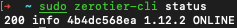
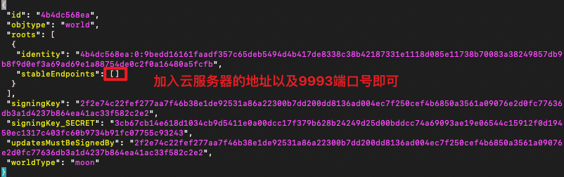
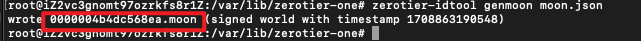

## cli用法

```shell
zerotier-cli info	#查看当前zerotier-one的信息
zerotier-cli listpeers	#列出所有的peers
zerotier-cli listnetworks	#列出加入的所有的网络
zerotier-cli join <network>	#加入某个网络
zerotier-cli leave <network>	#离开某个网络
zerotier-cli listmoons	#列出加入的Moon节点
zerotier-cli orbit <world ID> <seed> #加入某个Moon节点
zerotier-cli deorbit <world ID> #离开某个Moon节点
```


## 配置zerotier moon服务器

要求服务器是有公网ip的。这里我使用我的国内阿里云服务器。

开放云服务器的防火墙规则。具体端口是9993，udp。

首先在服务器上安装zerotier：

```bash
curl -s https://install.zerotier.com | sudo bash
```

如果你是root用户，就不用加sudo了。

安装好之后，会显示地址。

如果没有看到，可以用以下命令来查看：

```shell
sudo zerotier-cli status 
```



接下来，进入zerotier的配置文件夹。

```bash
cd /var/lib/zerotier-one
```

然后导出moon的配置文件：

```shell
zerotier-idtool initmoon identity.public >> moon.json
```

然后用vim（或其他编辑器）编辑moon文件。



```json
{
 "id": "4b4dc568ea",
 "objtype": "world",
 "roots": [
  {
   "identity": "4b4dc568ea:0:9bedd16161faadf357c65deb5494d4b417de8338c38b42187331e1118d085e11738b70083a38249857db9b8f9d0ef3a69ad69e1a88754de0c2f0a16480a5fcfb",
   "stableEndpoints": ["1.1.1.1/9993"] //注意修改为你的云服务器的ip地址
  }
 ],
 "signingKey": "2f2e74c22fef277aa7f46b38e1de92531a86a22300b7dd200dd8136ad004ec7f250cef4b6850a3561a09076e2d0fc77636db3a1d4237b864ea41ac33f582c2e2",
 "signingKey_SECRET": "3cb67cb14e618d1034cb9d5411e0a00dcc17f379b628b24249d25d00bddcc74a69093ae19e06544c15912f0d19450ec1317c403fc60b9734b91fc07755c93243",
 "updatesMustBeSignedBy": "2f2e74c22fef277aa7f46b38e1de92531a86a22300b7dd200dd8136ad004ec7f250cef4b6850a3561a09076e2d0fc77636db3a1d4237b864ea41ac33f582c2e2",
 "worldType": "moon"
}

```

接下来创建moon服务器文件：

```shell
zerotier-idtool genmoon moon.json
```



该命令会生成一个前面是0的moon文件。

创建一个moon文件的文件夹，将moon文件复制到文件夹中。

```shell
mkdir moons.d
cp 0000004b4dc568ea.moon ./moons.d
```

然后重启zerotier：

```shell
systemctl restart zerotier-one
```

这样moon服务器就搭建完成了。